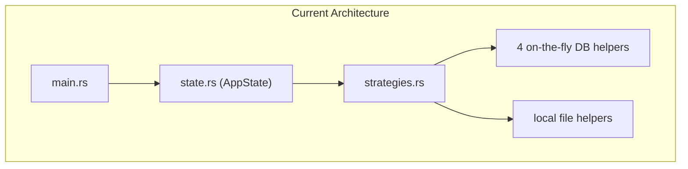
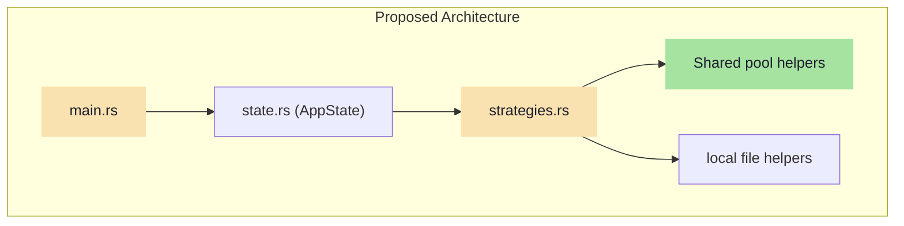

# Codebase Design Skill

This is Stage 2 of the SmartTradeAI task lifecycle. It maps the abstract concept (from Stage 1) onto the actual codebase, identifying every file that will change, every feature that could break, and the exact architectural shape of the solution.

---

## Core Principles (Non-Negotiable)

1. **Search aggressively.** Use `grep_search` to find every import, every call site, every test that references the modules being changed. Do not rely on memory — the codebase is the source of truth.
2. **Show the blast radius visually.** Generate a Mermaid dependency graph showing which modules depend on the code being changed. The user must see at a glance how far the ripple effects could reach.
3. **Score every risk.** Every regression risk must be tagged with a severity level (🔴 High / 🟡 Medium / 🟢 Low). A flat unscored list is not acceptable.
4. **Plan for failure.** Every design must include a rollback strategy — what git commands or code reverts would undo the change if something goes wrong.

---

## Required Document Structure

Save as `task_X_Y_design.md` in the artifact directory.

### Section 1: Current State Snapshot
Before proposing any changes, document the current architecture:
- Which files are involved?
- How do they connect today?
- Render a **"Before" Mermaid diagram** showing the current module relationships.



### Section 2: Proposed State
- What will the architecture look like after the changes?
- Render an **"After" Mermaid diagram** showing the new module relationships.
- Highlight what was added (green), modified (yellow), and deleted (red) using Mermaid styling.



### Section 3: File-Level Impact Analysis
For every file affected, create an entry:

```markdown
#### [MODIFY] [filename](file:///absolute/path)
- **What changes:** (Describe the specific modification)
- **Why:** (Explain the motivation)
- **Lines affected:** (Approximate line range)
- **Downstream dependents:** (What other files import from this one?)

#### [NEW] [filename](file:///absolute/path)
- **Purpose:** (What this new file does)
- **Exports:** (What symbols it makes available)

#### [DELETE] [filename](file:///absolute/path)
- **Reason:** (Why this file/function is being removed)
- **Replaced by:** (What takes its place)
```

### Section 4: Dependency Graph (Blast Radius)
Use `grep_search` to find all `use` statements and call sites that reference the modified modules. Render the results as a Mermaid graph showing the full dependency chain.

This answers the critical question: *"If I change this module, what else could break?"*

### Section 5: Regression Risk Matrix
Score every risk and propose a mitigation:

```markdown
| Risk ID | Risk Description | Severity | Affected Feature | Mitigation Strategy |
|---------|-----------------|----------|-----------------|-------------------|
| R-01 | Unit tests fail without DB | 🔴 High | Test suite | AppState.pool = None preserves fallback |
| R-02 | JSON response shape changes | 🟡 Medium | API clients | Verify struct serialization unchanged |
| R-03 | Unused import warnings | 🟢 Low | Compiler output | Remove orphaned imports |
```

Severity definitions:
- 🔴 **High:** Could cause data loss, crash the server, or break the API contract.
- 🟡 **Medium:** Could cause test failures or degraded functionality, but no data loss.
- 🟢 **Low:** Cosmetic issues like warnings, formatting, or dead code.

### Section 6: API Contract Stability Check
Verify that no public HTTP endpoints change their request/response format:

```markdown
| Endpoint | Method | Request Body | Response Shape | Changed? |
|----------|--------|-------------|---------------|----------|
| /v1/strategies | GET | None | `{ strategies: [...] }` | No |
| /v1/strategies/:id | DELETE | None | `{ success: bool }` | No |
```

If any endpoint's contract changes, flag it as a 🔴 **breaking change** and document the migration path.

### Section 7: Performance Impact Assessment
Predict how the changes will affect runtime behavior:

```markdown
| Metric | Before | After | Impact |
|--------|--------|-------|--------|
| Connection setup latency | ~50ms per query | ~0.1ms (pooled) | ✅ Improvement |
| Memory per request | New PgPool per call | Shared Arc handle | ✅ Improvement |
| Max concurrent DB connections | Unlimited (dangerous) | Capped at 20 | ✅ Safer |
```

### Section 8: Quality Metrics & Rust Patterns
Document which Rust-specific design patterns the changes use or preserve:

- **Ownership:** Does the change introduce any new `.clone()` calls? Are they necessary or can we borrow instead?
- **Lifetimes:** Are any lifetime annotations needed? If so, explain why.
- **Error Handling:** Are we using `Result`/`Option` properly, or are there hidden `unwrap()` calls that could panic?
- **Coupling:** Does the change increase or decrease coupling between modules?
- **Dead Code:** Will any functions become unused after the change? If so, plan to remove or annotate them.

### Section 9: Rollback Plan
If the changes cause unexpected issues after merging:

```markdown
## Rollback Strategy
1. Revert the commit: `git revert <commit-hash>`
2. Rebuild the container: `docker compose up c2-engine --build -d`
3. Verify the server boots with the old code: `Invoke-RestMethod ...`
```

Estimate the rollback time (e.g., "~5 minutes to revert and rebuild").

---

## Workflow Checklist

Before marking the Design Artifact as complete, verify:

- [ ] "Before" architecture diagram rendered
- [ ] "After" architecture diagram rendered with color-coded changes
- [ ] Every affected file listed with clickable links
- [ ] `grep_search` used to discover all import sites and call sites
- [ ] Regression risks scored as 🔴 / 🟡 / 🟢
- [ ] API contract stability verified (no breaking changes)
- [ ] Performance impact predicted
- [ ] Rust ownership/lifetime considerations documented
- [ ] Rollback plan provided with git commands
- [ ] No code written — design only
