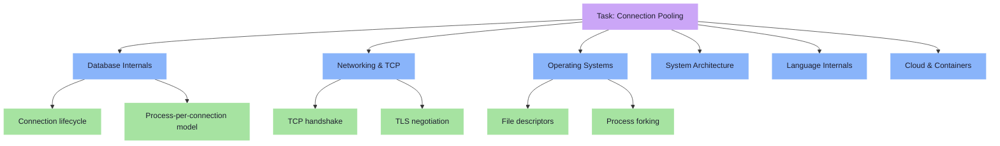

# CS Domain Learning Extraction Skill

This skill transforms every implementation task into a deep learning opportunity. Unlike the Rust Learning Extraction skill (which focuses on language syntax), this skill maps the **entire CS knowledge landscape** that a task touches — from database internals to cloud architecture to operating system primitives.

---

## Core Principles (Non-Negotiable)

1. **Every task touches multiple CS domains.** A simple "add connection pooling" task involves databases, networking, operating systems, concurrency theory, and cloud architecture. Identify ALL of them.
2. **Explain from first principles.** Don't just say "connection pooling is good." Explain WHY at the physics/OS level — what is a TCP socket, what is a file descriptor, why does the OS limit them.
3. **Use the cognitive bridge.** Every concept gets a physical analogy, a constraint model, and a code variable mapping.
4. **Generate visual concept maps.** Use `generate_image` to create a domain relationship diagram showing how the concepts connect.
5. **Reference our codebase.** Every concept must link back to the exact line of SmartTradeAI code where it manifests.

---

## Required Document Structure

Save as `task_X_Y_cs_concepts.md` in the artifact directory.

### Section 1: Domain Discovery Map
First, identify every CS domain the task touches. Generate an image using `generate_image` showing the domains as a visual mind map.

Then render a Mermaid concept map:



### Section 2: Domain Deep Dives
For EACH domain identified, create a comprehensive subsection following this template:

---

#### Domain: [Domain Name]

**What Is It (Plain English):**
A 3-5 sentence explanation that a non-CS person could understand.

**Physical Analogy:**
Map the concept to a real-world scenario. Examples:
- Database connections → Phone lines at a call center
- TCP handshake → Two people agreeing on a language before talking
- File descriptors → Numbered tickets at a deli counter
- Connection pooling → A car rental company (cars are pre-warmed and ready)
- Mutex locks → A single-key bathroom (only one person at a time)
- Load balancing → Multiple checkout lanes at a grocery store

**How It Works at the Hardware/OS Level:**
Explain what ACTUALLY happens in the machine:
- What CPU instructions execute?
- What kernel system calls are involved?
- What data structures does the OS maintain?
- What are the resource limits?

```markdown
| Layer | What Happens | Resource Cost |
|-------|-------------|---------------|
| Application | `PgPool::connect()` called | ~0 CPU |
| Library (sqlx) | Resolves DNS, opens socket | ~1ms |
| Runtime (tokio) | Registers socket with epoll | ~0.01ms |
| OS Kernel | Creates file descriptor, TCP SYN | ~0.1ms |
| Network | 3-way TCP handshake over wire | ~5-50ms |
| Database | PostgreSQL forks new process | ~10ms + 5MB RAM |
```

**Where It Manifests in Our Codebase:**
Link to the exact file and line number:
```markdown
- [main.rs:28](file:///path/to/main.rs#L28) — `PgPoolOptions::new().max_connections(20)`
- [state.rs:15](file:///path/to/state.rs#L15) — `pool: Option<PgPool>`
```

**Common Misconceptions:**
List 3-5 things beginners get wrong about this concept:
1. ❌ "Opening a connection is free" → It costs 10ms + 5MB of server RAM
2. ❌ "Closing a connection releases resources instantly" → TCP has a TIME_WAIT state
3. ❌ "More connections = better performance" → After ~100 connections, PostgreSQL performance degrades due to process scheduling overhead

**The Numbers That Matter:**
Provide concrete, memorable metrics:
```markdown
| Metric | Value | Source |
|--------|-------|--------|
| TCP handshake latency | 5-50ms | Network round-trip |
| TLS negotiation overhead | 20-100ms | Certificate exchange |
| PostgreSQL fork cost | ~10ms + 5MB RAM | Process creation |
| Pool borrow latency | ~0.01ms | In-memory queue lookup |
| Max safe connections (PostgreSQL) | ~100-300 | Depends on server RAM |
```

---

### Section 3: Cross-Domain Connections
Show how concepts from different domains interact with each other:

```markdown
## How These Domains Connect

| Concept A | Concept B | Connection |
|-----------|-----------|------------|
| TCP Socket (Networking) | File Descriptor (OS) | Every TCP socket IS a file descriptor at the kernel level |
| Connection Pool (Architecture) | Arc<T> (Rust) | The pool uses Arc for thread-safe shared ownership |
| Process Fork (OS) | max_connections (DB) | Each PostgreSQL connection forks a process, so the pool ceiling prevents OOM |
| Ephemeral Filesystem (Cloud) | Option<PgPool> (Rust) | The Option type enables fallback to local files in dev, but cloud containers lose those files |
```

### Section 4: Concept Evolution Timeline
Show how understanding evolves as you learn more:

```markdown
## How Your Mental Model Evolves

| Level | What You Think | Reality |
|-------|---------------|---------|
| Beginner | "I call the database and get data back" | You're opening a TCP socket, negotiating TLS, authenticating, sending a query, parsing the response, and closing the socket — every single time |
| Intermediate | "I should reuse connections" | You need a pool manager that handles borrowing, returning, health-checking, and evicting dead sockets |
| Advanced | "The pool is a bounded resource" | The pool ceiling must match the database's max_connections. Setting it too high crashes PostgreSQL. Setting it too low causes request queueing |
| Expert | "The pool is part of a distributed system" | In a Kubernetes cluster with 10 pods, each pod's pool ceiling must be max_connections / 10, or the database will be overwhelmed |
```

### Section 5: Vocabulary Reference
A quick-reference glossary of every technical term used in the document:

```markdown
## Vocabulary Reference

| Term | Definition | Our Codebase Example |
|------|-----------|---------------------|
| **PgPool** | A managed collection of reusable PostgreSQL connections | `state.rs:15` |
| **Arc** | Atomic Reference Counting — thread-safe shared ownership | `PgPool` wraps `Arc<PoolInner>` |
| **File Descriptor** | An integer the OS assigns to every open file, socket, or pipe | Each DB connection consumes one FD |
| **TCP Handshake** | SYN → SYN-ACK → ACK exchange to establish a connection | Happens inside `PgPool::connect()` |
| **Ephemeral** | Temporary; destroyed when the container restarts | Docker container filesystem |
| **Fail-Fast** | Crash immediately on misconfiguration instead of running broken | `main.rs:33` — `std::process::exit(1)` |
```

### Section 6: "What If" Scenarios
Thought experiments that deepen understanding:

```markdown
## "What If" Scenarios

**Q: What if we set max_connections to 1?**
A: Every request would wait in a queue for the single connection. Under load, response times would spike from 5ms to 500ms+. The server wouldn't crash, but users would see timeouts.

**Q: What if we set max_connections to 10,000?**
A: PostgreSQL would try to fork 10,000 OS processes. Each process consumes ~5MB RAM, totaling 50GB. The server would run out of RAM and the OOM killer would terminate PostgreSQL.

**Q: What if the network cable is unplugged for 30 seconds?**
A: Active queries would timeout. The pool would mark those connections as dead. When the cable is reconnected, the pool would automatically establish new connections on the next request.

**Q: What if two servers share the same database?**
A: Each server's pool opens its own set of connections. If both pools have max_connections=20, PostgreSQL sees 40 total connections. You must divide the database's max_connections across all application instances.
```

### Section 7: Further Reading
Link to authoritative resources for deep dives:

```markdown
## Further Reading

| Topic | Resource | Type |
|-------|----------|------|
| Connection Pooling | [sqlx PgPool API Docs](https://docs.rs/sqlx/latest/sqlx/postgres/struct.PgPool.html) | Official Docs |
| TCP Handshake | [RFC 793 - TCP Specification](https://tools.ietf.org/html/rfc793) | RFC Standard |
| PostgreSQL Architecture | [PostgreSQL Internals](https://www.postgresql.org/docs/current/connect-estab.html) | Official Docs |
| Twelve-Factor App | [12factor.net](https://12factor.net) | Methodology |
| Rust Ownership | [The Rust Book Ch. 4](https://doc.rust-lang.org/book/ch04-00-understanding-ownership.html) | Official Book |
| Arc and Shared State | [The Rust Book Ch. 16.3](https://doc.rust-lang.org/book/ch16-03-shared-state.html) | Official Book |
```

---

## Workflow Checklist

Before marking the CS Concepts document as complete, verify:

- [ ] Domain discovery map generated (image + Mermaid)
- [ ] At least 4 domain deep dives completed
- [ ] Each deep dive has: plain English explanation, physical analogy, hardware/OS details, codebase link, misconceptions, and metrics
- [ ] Cross-domain connection table filled in
- [ ] Concept evolution timeline (Beginner → Expert) provided
- [ ] Vocabulary reference with codebase examples
- [ ] At least 4 "What If" scenarios explored
- [ ] Further reading links provided
- [ ] All code references use clickable file links
