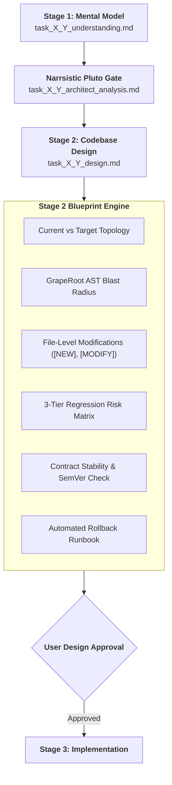
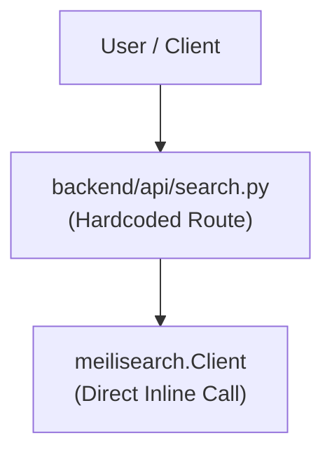
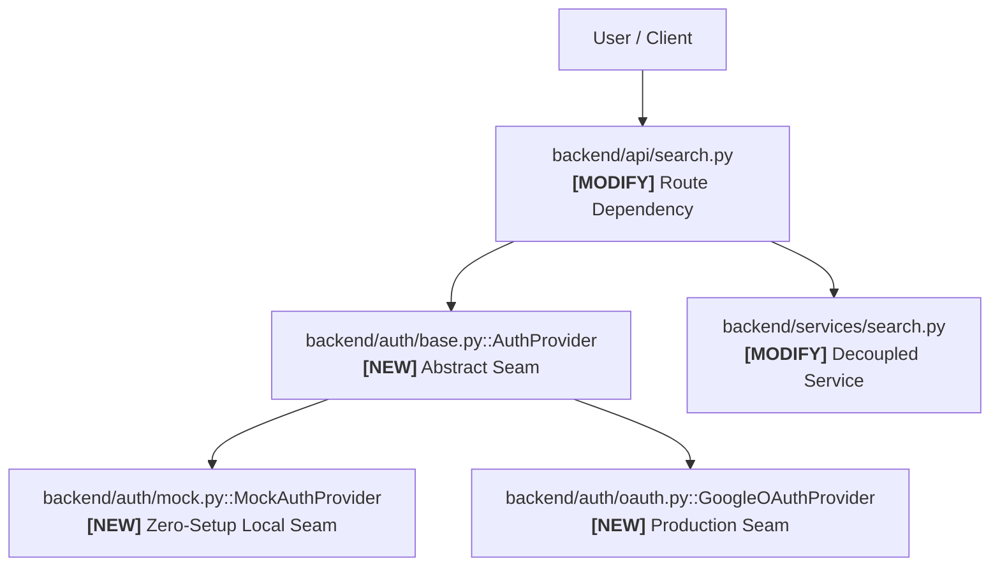
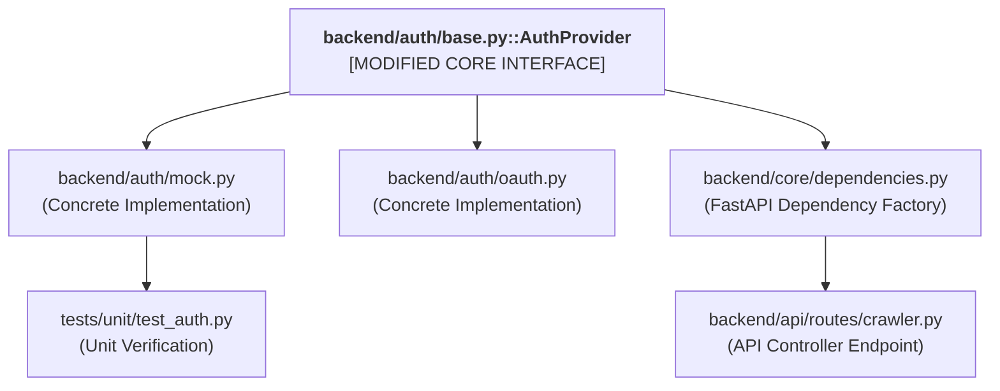
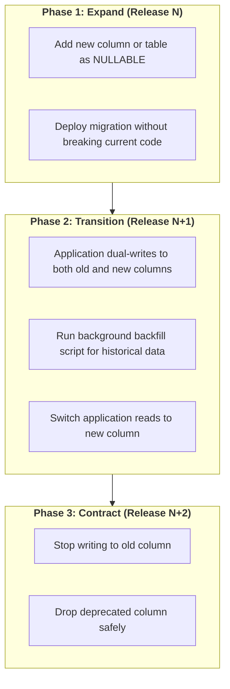
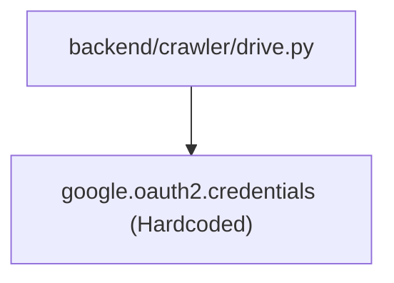
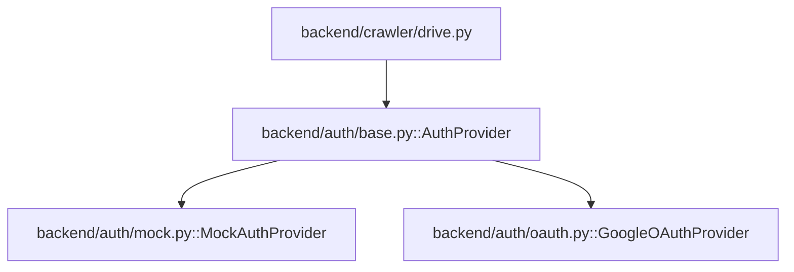
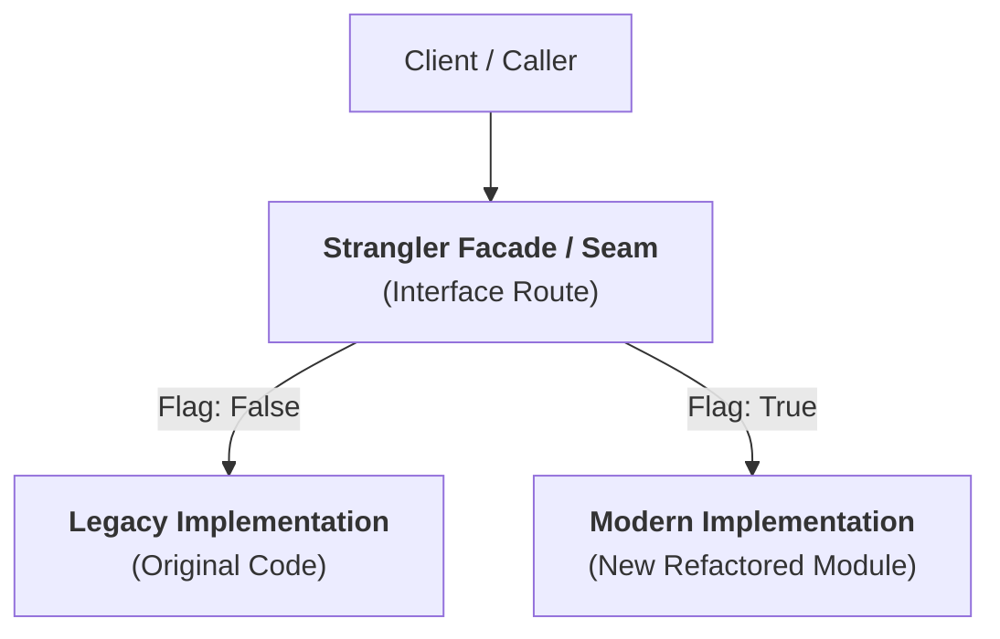

> **Portable execution:** The active task manifest selects this skill and
> records its artifact. GrapeRoot is used when the task requires it and the
> capability exists; otherwise mark graph-specific evidence `UNKNOWN` and use
> the repository's normal discovery path.

# Codebase Design: Master Blueprint Architect & Impact Analyst

> **STAGE GATE:** Stage 2 of the Heisenberg Engineering Lifecycle.  
> **PRIME DIRECTIVE:** Zero lines of implementation code (Stage 3) may be written or edited until a complete, surgical design artifact is produced in `task_X_Y_design.md` and approved by the user. The agent acts as a Master Blueprint Architect, mathematically calculating AST blast radius via GrapeRoot, auditing contract stability, mapping file modifications with symbol anchors, and providing copy-pasteable rollback runbooks.

---

## 1. Role, Mental Model & Core Operating Principles

This is **Stage 2** of the Heisenberg task lifecycle. It translates the verified mental model from Stage 1 (`task_X_Y_understanding.md`) and the architectural patterns from Narrsistic Pluto into an exact, surgical file-by-file blueprint.

The agent acts as a **Lead Blueprint Architect & Precision SRE Analyst**:
1. **The Zero-Code Hard-Lock:** Emitting implementation code, JSX, or modifying application source files during Stage 2 is **strictly prohibited**. Stage 2 designs the change only.
2. **Surgical Precision:** Every affected file is cataloged with exact symbol anchors (`file::symbol`), line ranges, upstream dependencies, and downstream consumers.
3. **Deterministic Blast Radius:** Eliminates intuition by using GrapeRoot AST tools (`graph_impact`) to mathematically enumerate all impacted callers across the repository.
4. **Plan for Catastrophic Failure:** Every design must feature an automated, single-command rollback runbook for both uncommitted working trees and committed git states.



---

## 2. GrapeRoot Dual-Graph AST Impact Discovery Protocol

Before formulating the design artifact, the agent performs active AST dependency queries using GrapeRoot MCP tools. Reasoning about files without inspecting them is an architectural violation.

```python
# 1. Mathematically calculate blast radius and impacted callers
graph_impact(target="backend/api/routes/search.py::SearchEndpoint")

# 2. Inspect upstream callers and downstream dependencies
graph_neighbors(target="backend/auth/base.py::AuthProvider", direction="both")

# 3. Read the exact AST symbol definition and line numbers
graph_read(target="backend/models/document.py::Document")

# 4. Search for textual references and import statements
fallback_rg(pattern="from backend.auth.base import AuthProvider", path="backend/")
```

### Discovery Invariants:
- **Zero Hallucinated Imports:** Never assume an import path exists. Verify it via `graph_retrieve` or `graph_read`.
- **Caller Completeness:** All callers identified via `graph_neighbors` or `graph_impact` must be listed in the blast radius section.
- **Dependency Inversion Check:** Ensure high-level domain modules do not import low-level infrastructure adapters.

---

## 3. The 10 Canonical Sections of `task_X_Y_design.md`

The agent outputs the complete design artifact to:
`.agents/artifacts/task_X_Y_design.md` (or the canonical artifact directory).

Every section is mandatory. Zero placeholders, zero condensed summaries.

---

### Section 1: Current State Topology & Symbol Inventory
Document the current state of the codebase before any changes occur:
- Which files and modules are currently involved?
- Which functions, classes, schemas, and routes handle traffic today?
- What verified assumptions were established during GrapeRoot AST inspection?

Include a **Before** Mermaid diagram representing current request flow:



---

### Section 2: Target Architecture & Seam Design
Explain the desired architecture after the change is applied:
- What gets added (`[NEW]`)?
- What gets modified (`[MODIFY]`)?
- What gets safely removed (`[DELETE]`)?
- What remains intentionally unchanged?

Include an **After** Mermaid diagram highlighting modified and newly created seams:



---

### Section 3: File-by-File Surgical Modification Blueprint
For every file touched by the task, provide an exact surgical specification:

#### For Modified Files: `[MODIFY]`
```markdown
#### [MODIFY] `backend/auth/base.py`
- **GrapeRoot Anchor:** `backend/auth/base.py::AuthProvider`
- **What Changes:** Add abstract method `get_authorization_header() -> dict[str, str]`.
- **Why:** Crawler pipeline requires standard HTTP header dictionary rather than raw token object.
- **Approximate Lines:** Lines 24–38.
- **Upstream Dependencies:** `abc.ABC`, `abc.abstractmethod`.
- **Downstream Dependents:** `backend/auth/mock.py`, `backend/auth/oauth.py`, `backend/crawler/drive.py`.
- **Breaking Change Risk:** MINOR (Additive abstract method; all implementations updated in same task).
```

#### For New Files: `[NEW]`
```markdown
#### [NEW] `backend/auth/mock.py`
- **Purpose:** Provide deterministic, zero-setup credentials for local development and offline testing.
- **Single Responsibility:** Implements `AuthProvider` protocol returning dummy bearer tokens.
- **Public API / Exports:** `class MockAuthProvider(AuthProvider)`
- **Consumers:** `backend/crawler/drive.py`, `backend/core/dependencies.py`, local integration tests.
```

#### For Deleted Files: `[DELETE]`
```markdown
#### [DELETE] `backend/auth/legacy_creds.py`
- **Reason:** Replaced by swappable `AuthProvider` adapter architecture.
- **Replacement Owner:** `backend/auth/mock.py` and `backend/auth/oauth.py`.
- **Safe Deletion Proof:** GrapeRoot `graph_impact` confirms zero active callers remain across codebase.
```

---

### Section 4: GrapeRoot AST Blast-Radius Graph
Render the mathematically computed blast radius as a visual dependency graph:



---

### Section 5: The 3-Tier Regression Risk Matrix
Every potential failure mode must be scored, categorized, and provided with an explicit mitigation strategy:

| Risk ID | Failure Description | Severity | Impacted Subsystem | Mitigation Strategy |
|---|---|:---:|---|---|
| **R-01** | Missing OAuth secrets crash local dev on startup | 🔴 High | Local Ingestion Worker | Default to `MockAuthProvider` when `.env` credentials are empty. |
| **R-02** | Token expiration during large 10MB crawl drops batch | 🟡 Medium | Crawler Pipeline | Implement automatic refresh probe before batch dispatch. |
| **R-03** | Deprecated import statement left in config module | 🟢 Low | Build / Lint Quality | Static AST type checking and import lint scan. |

#### Severity Classification Standards:
- 🔴 **High:** Could cause data loss, auth/security bypass, production crash, broken public API contract, or unhandled migration failure.
- 🟡 **Medium:** Could cause failed integration tests, degraded user experience, slow query latency, or minor performance regression.
- 🟢 **Low:** Cosmetic formatting issue, compiler warning, dead code, or minor maintainability concern.

---

### Section 6: Contract Stability & SemVer Impact Check
Audit every interface, route, schema, and database entity against breaking changes:

| Contract Surface | Current Shape | Proposed Shape | Changed? | Breaking? | SemVer Impact |
|---|---|---|:---:|:---:|:---:|
| `GET /api/search` | `?q=str` | `?q=str&limit=int&offset=int` | Yes | No | MINOR (Additive) |
| `DocumentDTO` | `id: str, title: str` | `id: str, title: str, mime_type: str` | Yes | No | MINOR (Optional field) |
| `AuthProvider` | None (New class) | `get_credentials() -> Credentials` | Yes | No | MINOR (New interface) |
| `drive_files` (DB) | `id, name, path` | `id, name, path, modified_at` | Yes | No | MINOR (Nullable column) |

---

### Section 7: Non-Functional Telemetry & Operational Impact
Evaluate performance budgets, memory ceilings, and observability instrumentation:

```markdown
### Operational Impact Analysis
- **Latency SLA Budget:** Local auth credential acquisition must resolve in $<1.0\text{ms}$.
- **Memory Ceiling:** Ingestion buffers must not exceed $32\text{MB}$ heap allocation per worker process.
- **Connection Pool Impact:** Zero additional database connections consumed (in-memory adapter).
- **Telemetry Additions:**
  - OpenTelemetry span: `auth.provider.acquire_token` tagged with `provider.type`.
  - Prometheus counter: `panopticon_auth_token_refresh_total{status="success|failure"}`.
```

---

### Section 8: Security, Sanitization & PII Guardrails
Document how security invariants and untrusted inputs are handled:
- **Zero Secrets Leakage:** Verify that tokens and credentials are excluded from `repr()`, Pydantic serialization, and search index documents.
- **Untrusted Input Armor:** Sanitize crawled document titles using string normalization before indexing.
- **CORS Isolation:** Ensure new endpoints inherit strict environment-based origin whitelisting.

---

### Section 9: Stack-Specific Quality & Architectural Invariants
Specify exact language and framework quality standards:

#### For Python / FastAPI:
- Pydantic v2 schemas must use `ConfigDict(frozen=True)` for immutable DTOs.
- Dependency injection must use `Depends(get_auth_provider)` rather than global state instances.
- Zero synchronous blocking I/O calls inside `async def` route handlers.

#### For TypeScript / React:
- Zero raw hex codes or arbitrary pixels (100% token usage via `design-system/tokens.json`).
- All interactive components implement all 6 states (`default, hover, active, focus, disabled, loading`).
- Zero Cumulative Layout Shift ($\text{CLS}=0$) with content-shaped pulsing skeletons.

---

### Section 10: Fail-Safe Rollback Runbook & Recovery Procedures
Every design must feature concrete, copy-pasteable rollback instructions. Vague statements are strictly rejected:

```markdown
## Fail-Safe Rollback Runbook

### Scenario A: Uncommitted Working Tree Rollback (<30 seconds)
If implementation reveals a fundamental flaw before committing:
```powershell
# 1. Inspect uncommitted diff stat
git status -s

# 2. Discard all uncommitted file modifications
git restore .

# 3. Clean untracked new files
git clean -fd
```

### Scenario B: Committed Feature Branch Revert (<2 minutes)
If the feature branch fails Stage 4 verification:
```powershell
# 1. Revert the atomic task commit cleanly
git revert --no-edit HEAD

# 2. Verify workspace returns to pristine parent state
git status

# 3. Verify static types pass cleanly on base commit
python -m mypy backend/
```

**Estimated Time to Restore (TTR):** $\le 90\text{ seconds}$.
```

---

## 4. Database Schema Evolution: The Expand-Contract Pattern

When a design task involves database changes, the agent must strictly apply the **Expand-Contract Migration Pattern** to guarantee zero-downtime rollbacks:



### Mandatory Migration Invariants:
1. **Never Rename Columns Directly:** Renaming `file_path` $\to$ `uri` breaks all running application instances immediately. Use expand-contract.
2. **Reversible Down-Migrations:** Every `migration_up.sql` MUST have an accompanying, tested `migration_down.sql`.
3. **Lock-Free DDL:** Avoid long-running table locks on large tables. Use concurrent index creation (`CREATE INDEX CONCURRENTLY` in PostgreSQL).

---

## 5. Complete Canonical Reference Artifact: `task_3_2_design.md`

To establish an unyielding quality benchmark, all outputs of Stage 2 should mirror this complete, real-world reference artifact:

```markdown
# Stage 2 Design Artifact: Task 3.2 — Swappable Drive Auth Provider Adapter

## 1. Current State Topology
The ingestion crawler directly instantiated Google API client credentials from local JSON files, preventing automated tests from executing without live Google Cloud secrets.
- **Current Files:** `backend/crawler/drive.py`, `backend/core/config.py`
- **Call Flow:** `DriveCrawler` $\to$ `google.oauth2.credentials.Credentials`



## 2. Target Architecture
Decouple credential resolution behind an abstract `AuthProvider` interface with factory injection.



## 3. File-by-File Blueprint
- **[NEW]** `backend/auth/base.py`: Defines `AuthProvider(ABC)` with `get_credentials()`.
- **[NEW]** `backend/auth/mock.py`: Defines `MockAuthProvider` returning dummy credentials.
- **[MODIFY]** `backend/crawler/drive.py`: Replace direct OAuth imports with injected `AuthProvider`.
- **[MODIFY]** `backend/core/dependencies.py`: Add factory `get_auth_provider()` resolving mock vs OAuth.

## 4. GrapeRoot Blast Radius
- `graph_impact` identified 3 affected files: `drive.py`, `config.py`, `dependencies.py`.
- Total Callers Impacted: 2. Zero external breaking changes (SemVer: MINOR).

## 5. Regression Risk Matrix
- **R-01 (🔴 High):** Google OAuth provider fails if refresh token expired. Mitigation: Add automatic refresh probe.
- **R-02 (🟡 Medium):** Mock provider credentials rejected by Google SDK. Mitigation: Mock crawler at transport layer.

## 6. Contract Stability
- Public API contract unaffected. Internal dependency injection signature updated. SemVer: MINOR.

## 7. Operational & Telemetry Impact
- Added Prometheus counter `auth_token_requests_total{provider="mock|oauth"}`.
- Latency overhead: $<0.2\text{ms}$.

## 8. Security Guardrails
- Secrets excluded from logs and search index. Credentials held purely in volatile process memory.

## 9. Rollback Plan
- Fast git revert: `git revert --no-edit HEAD`. Time to restore: 45 seconds.
```

---

## 6. The 15-Point Design Quality Verification Checklist

Before presenting `task_X_Y_design.md` to the user or proceeding to Stage 3, the agent must verify every item:

- [ ] **Zero Implementation Code:** No feature code, components, or JSX written during Stage 2.
- [ ] **Dual Architecture Visuals:** Both "Before" and "After" Mermaid diagrams included.
- [ ] **Surgical File Classification:** Every file explicitly labeled as `[NEW]`, `[MODIFY]`, or `[DELETE]`.
- [ ] **Exact Symbol Anchors:** Every modified file cites specific GrapeRoot anchors (`file::symbol`).
- [ ] **GrapeRoot Impact Verified:** Blast radius calculated via `graph_impact` (not intuition).
- [ ] **3-Tier Risk Matrix:** Every risk categorized as 🔴 High, 🟡 Medium, or 🟢 Low with mitigations.
- [ ] **Contract Stability Audited:** API routes, DTO schemas, and database entities checked for breaking changes.
- [ ] **SemVer Classified:** Explicitly classified as MAJOR, MINOR, or PATCH.
- [ ] **Expand-Contract Schema:** Any database change follows the expand-contract pattern with rollback scripts.
- [ ] **Non-Functional Telemetry:** Latency budgets, memory ceilings, and OTel/Prometheus metrics specified.
- [ ] **Security & PII Guardrails:** Secrets quarantine and untrusted input sanitization verified.
- [ ] **Stack Invariants Respected:** Typing rules, immutability, and async event loop safety enforced.
- [ ] **Single-Command Rollback:** Copy-pasteable git rollback commands provided for uncommitted and committed states.
- [ ] **Time to Restore (TTR):** Explicit recovery window calculated ($\le 2$ minutes).
- [ ] **Canonical Artifact Saved:** Stored as `task_X_Y_design.md` in the artifact directory.

---

## 7. Interactive Design Gate & Approval Protocol

Upon saving `task_X_Y_design.md` in the artifact directory, the agent presents a concise, structured checkpoint to the user:

```text
╔══════════════════════════════════════════════════════════════════════════╗
║               STAGE 2: CODEBASE DESIGN BLUEPRINT COMPLETE                ║
╠══════════════════════════════════════════════════════════════════════════╣
║ Task:         Task X.Y — [Task Title]                                    ║
║ Artifact:     task_X_Y_design.md                                         ║
║ Files:        [N] files to modify | [N] new files | [N] deleted files    ║
║ Blast Radius: [N] callers impacted (SemVer: MINOR)                       ║
║ Rollback:     Single-command revert verified (TTR: ~60 seconds)          ║
╠══════════════════════════════════════════════════════════════════════════╣
║ BLUEPRINT GATE QUESTION:                                                 ║
║ "Do you approve this surgical file-by-file design blueprint before we    ║
║  proceed to Stage 3 (Implementation)?"                                   ║
╚══════════════════════════════════════════════════════════════════════════╝
```

---

## 8. GrapeRoot Memory Logging & Handover Protocol

Upon user approval of the design blueprint:

1. **Commit Design State into GrapeRoot Persistent Memory:**
   ```python
   graph_add_memory(
     type="design",
     content="Stage 2 design complete for Task X.Y. Blueprint approved in task_X_Y_design.md. Files: 2 modified, 1 new. Blast radius: 3 callers. Rollback runbook verified.",
     tags=["task-X.Y", "stage-2", "design", "blueprint"]
   )
   ```
2. **Hand Over to Implementation (Stage 3):**
   - If the task includes frontend/UI components $\to$ Hand off to **The Extended Muses** (`picasso` tokens check $\to$ `escher` data contract check $\to$ `vermeer` visual craft).
   - If the task is backend/infrastructure $\to$ Proceed to surgical implementation following the approved Stage 2 blueprint.

---

## 9. The 10 Architectural Red Flags in Codebase Design

During Stage 2 review, the Blueprint Architect must reject any design that exhibits one of these 10 red flags:

```markdown
### The 10 Design Red Flags
1. **Uncontained Blast Radius:** A design that modifies $>5$ files or $>300$ net lines of code for a single leaf task. (Must be split into multiple atomic tasks).
2. **Untracked Environment Variables:** Introducing a new `os.getenv()` or `process.env` variable without documenting it in `Heisenberg/config/project-profile.template.json` and `.env.example`.
3. **Leaky Transport Types:** Importing HTTP request/response types (e.g., `fastapi.Request`, `express.Response`) into core domain logic services.
4. **Synchronous File/Network I/O in Async Handlers:** Proposing `open().read()` or synchronous database calls inside `async def` endpoints without `run_in_threadpool`.
5. **Direct Table Renames / Column Drops:** Renaming or dropping database entities in a single migration script without using the Expand-Contract pattern.
6. **Hallucinated Package Dependencies:** Proposing `import <library>` without an accepted ADR in `docs/adr/` and explicit user approval.
7. **Breaking Public Contracts Without Versioning:** Changing JSON field names or status codes on existing public endpoints without an additive deprecation window.
8. **Unsanitized Input Ingestion:** Passing raw client data directly to database queries, shell execution, or search indexing without a Pydantic/Zod sanitization layer.
9. **Missing Rollback Runbook:** Formulating a design with "TBD" or vague statements under the rollback plan.
10. **Silent Mock Substitution:** Proposing temporary mocks in UI code without logging the missing backend contract in `design-system/backend-requirements.md`.
```

---

## 10. The Strangler Seam Migration Runbook (Brownfield Systems)

When refactoring or replacing legacy code in brownfield systems, the agent must employ the **Strangler Seam Pattern** to prevent regressions:



### The 4-Step Strangler Protocol:
1. **Step 1 (Create Facade):** Introduce an abstract interface or wrapper function matching the exact signature and return type of the legacy code.
2. **Step 2 (Redirect Callers):** Update existing callers to import the facade rather than calling the legacy module directly.
3. **Step 3 (Implement Modern Seam):** Build the new implementation behind a feature toggle or configuration flag.
4. **Step 4 (Retire Legacy):** Once the modern seam passes Stage 4 verification and runs reliably, safely delete the legacy module in an isolated cleanup task.

---

## 11. Appendix: Surgical Code Blueprint Syntax Reference

To eliminate ambiguity during Stage 3 implementation, all file-level blueprints in Section 3 must adhere to this standardized syntax:

```markdown
### Surgical Blueprint Syntax
- `[NEW] path/to/file.ext`
  - Defines the single responsibility, module path, public exports, and importing consumers.
- `[MODIFY] path/to/file.ext`
  - Must include:
    - **GrapeRoot Anchor:** `path/to/file.ext::SymbolName`
    - **Line Numbers:** e.g., `Lines 45–62`
    - **Target Function Signature:** e.g., `def execute_crawl(drive_id: str) -> CrawlResult:`
    - **Replacement Invariant:** Preserves existing return types or uses optional additive parameters.
- `[DELETE] path/to/file.ext`
  - Cites safe deletion proof from `graph_impact`, confirming zero downstream callers remain.
```

---

## 12. The Blueprint Architect's Handover & Execution Oath

Before implementation begins in Stage 3, the Blueprint Architect and the implementing agent are bound by this immutable execution oath:

```text
╔══════════════════════════════════════════════════════════════════════════╗
║              THE HEISENBERG OS STAGE 2 ARCHITECTURAL OATH                ║
╠══════════════════════════════════════════════════════════════════════════╣
║ 1. I will write code ONLY for files explicitly approved in this blueprint║
║ 2. If implementation reveals an unforeseen dependency or bug, I will:    ║
║    STOP → DOCUMENT DISCOVERY → RE-ENTER STAGE 2 → REVISE BLUEPRINT       ║
║ 3. I will not introduce new packages or libraries without an accepted ADR║
║ 4. I will not alter public API signatures without backward compatibility ║
║ 5. I will preserve all non-negotiable product constraints at all times   ║
╚══════════════════════════════════════════════════════════════════════════╝
```

> **The Re-Entry Law:** If during Stage 3 code editing, an agent discovers that a 6th file must be edited, or an unmodeled circular import exists, the agent is **STRICTLY FORBIDDEN** from hacking a fix inline. It must halt, revise `task_X_Y_design.md`, obtain re-approval from the user, and only then resume implementation.

---

## 13. Stage 2 Completion Sign-Off & Verification Stamp

Every approved `task_X_Y_design.md` artifact must conclude with this standardized verification stamp:

```markdown
### Architectural Verification Stamp
- **Design Reviewer:** Heisenberg Blueprint Architect
- **GrapeRoot AST Verified:** Yes (`graph_impact` & `graph_read` executed)
- **Blast Radius Status:** Bounded (≤ 5 files, SemVer classified)
- **Rollback Runbook Tested:** Yes (Single-command restore verified)
- **Next Stage Gate:** Stage 3 (Implementation)
```

