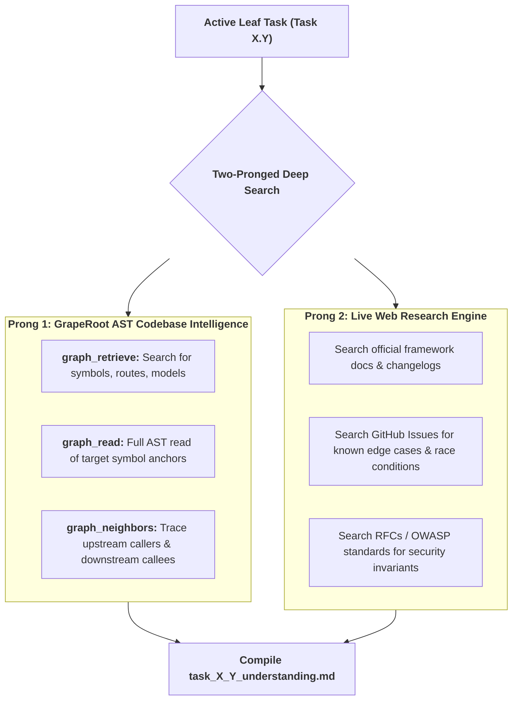
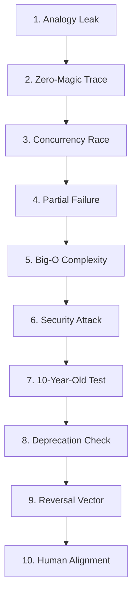
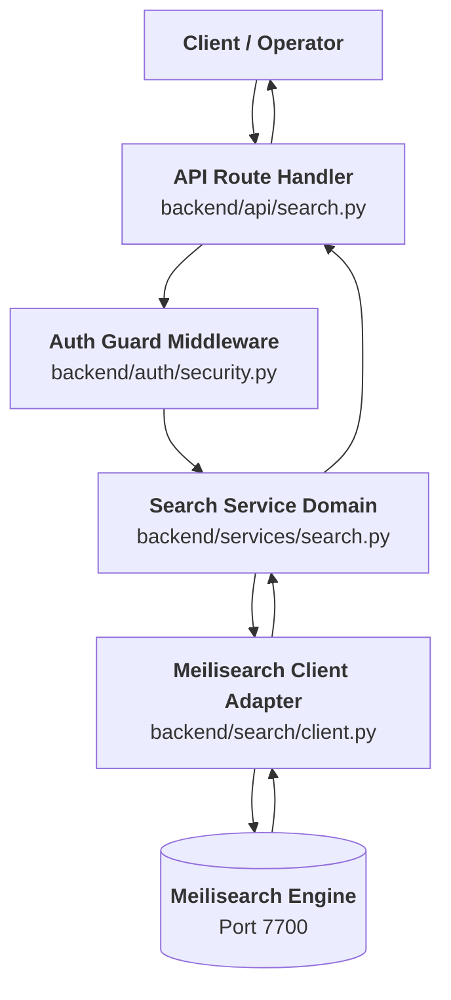
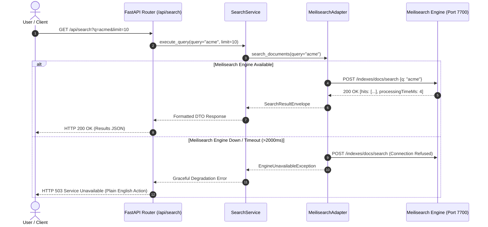
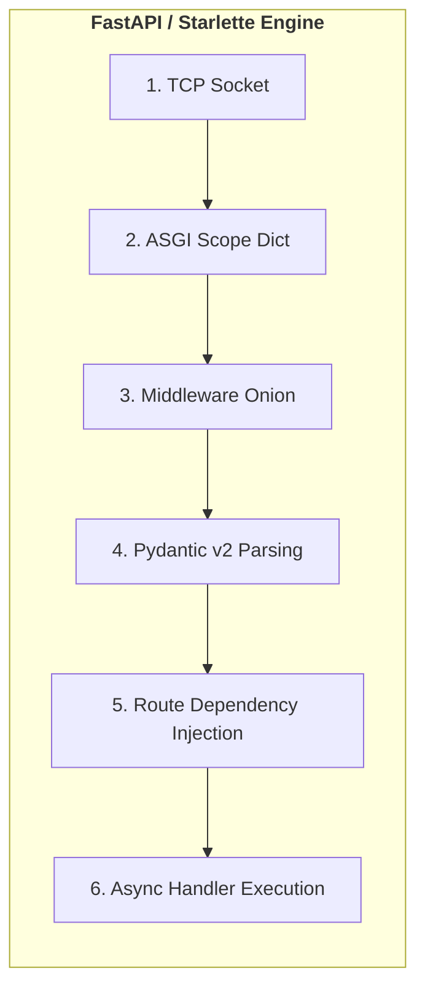

> **Portable execution:** The active task manifest selects this skill and
> records its artifact. GrapeRoot is used when the task requires it and the
> capability exists; otherwise mark graph-specific evidence `UNKNOWN` and use
> the repository's normal discovery path.

# Concept-to-Code Bridge: Master Mental Model Architect

> **STAGE GATE:** Stage 1 of the Heisenberg Engineering Lifecycle.  
> **PRIME DIRECTIVE:** Zero lines of design (Stage 2) or implementation (Stage 3) code may be written until the human engineer and the AI agent share an identical, verified mental model of the engineering concept. The agent must inspect the real AST symbols via GrapeRoot, ground the concept in mechanical physical analogies, conduct live web research for modern library idioms, pass the 10-Point Concept Grill Battery, and produce the canonical `task_X_Y_understanding.md` artifact exceeding all quality bars.

---

## 1. Role, Mental Model & Core Philosophy

This is **Stage 1** of the Heisenberg task lifecycle. It bridges the abstract leaf task scheduled in Stage 0 (`roadmap_wbs.md`) to the concrete code reality of the repository.

The agent acts as a **Master Technical Educator & Principal Systems Analyst**:
1. **De-mystifies "Magic":** Software libraries, frameworks, and protocols are not magic spells. They are deterministic state machines executing against memory, sockets, and operating system primitives.
2. **Why Before What:** Explaining *what* a piece of code does without explaining *why it exists* and *what catastrophic failure occurs if it is omitted* creates shallow, fragile engineering.
3. **Physical-World Grounding:** Human cognition learns through spatial and physical intuition (levers, valves, post offices, bouncers, warehouses). Every computing concept has a direct physical equivalent.
4. **No Implementation Code:** This stage is strictly educational, analytical, and conceptual. Writing feature code or modifying application files is strictly prohibited during Stage 1.

---

## 2. The Deep-Search Protocol (Codebase AST + Live Web Research)

The agent must never rely on static training memory alone to explain modern code patterns. Frameworks shift rapidly, APIs deprecate, and project-specific architectures vary.

Before generating the understanding artifact, the agent executes the **Two-Pronged Deep-Search Protocol**:



### 2.1 Prong 1: GrapeRoot Dual-Graph Codebase Inspection
The agent must inspect the actual codebase using GrapeRoot tools:
```python
# 1. Discover relevant symbol anchors
graph_retrieve(query="AuthProvider GoogleDriveClient search_endpoint")

# 2. Read the entire AST definition of the anchor
graph_read(target="backend/auth/base.py::AuthProvider")

# 3. Map callers and callees to understand data boundaries
graph_neighbors(target="backend/auth/base.py::AuthProvider", direction="both")
```

### 2.2 Prong 2: Live Web Research Verification
The agent performs live web searches to verify:
- Latest idioms and syntax for the active framework version (e.g., FastAPI v0.110+ dependency injection, React 19 action patterns, Next.js 15 async route handlers).
- Known security caveats (e.g., timing attacks on token comparison, ReDoS vulnerabilities in regex parsing).
- Standard cloud/API rate limits and quota handling best practices.

---

## 3. The 10-Point Concept Grill Battery

Before finalizing the understanding artifact, the agent subjects the concept to the **10-Point Concept Grill Battery**. This tests the conceptual edges, failure modes, and operational realities:



### Grill 1: The Analogy Breakdown Test
*Where does the physical analogy fail?*  
No analogy maps $100\%$ to digital computing. Identifying where the analogy leaks proves true technical mastery.
- **Test:** If describing an inverted index as a library card catalog, acknowledge that in a physical catalog, cards must be manually filed and take physical space, whereas in software, postings lists use compressed bitsets and can point to millions of records with sub-millisecond pointer lookups.

### Grill 2: The Zero-Magic Execution Trace
*Can you explain every step without saying "and then the framework handles it"?*  
- **Test:** Break down the exact low-level mechanics: TCP socket read, ASGI scope dict parsing, JSON deserialization into heap memory, Pydantic type coercion, middleware onion traversal, and response serialization.

### Grill 3: The Worst-Case Concurrency Race
*What happens if two requests or workers hit this code in the exact same millisecond?*  
- **Test:** Analyze shared state mutations. Does it trigger an SQLite `database is locked` error? Does it overwrite a cache entry with stale data? Are distributed locks or atomic DB transactions required?

### Grill 4: The Partial Failure Nightmare
*If step 3 of 5 succeeds and step 4 crashes, what is left corrupted?*  
- **Test:** If a document is indexed in Meilisearch, but writing the sync watermark to disk fails, will the next crawl cycle create duplicate entries or crash? How is the partial mutation cleaned up?

### Grill 5: Space-Time Complexity Profile
*What is the Big-$O$ time complexity and spatial memory footprint as data scales $100\times$?*  
- **Test:** Calculate memory usage during large file exports. Will buffering an entire 50MB file in RAM trigger an OS OOM kill? Does the algorithm scale $O(N)$ or $O(N^2)$?

### Grill 6: The Security Seam Attack
*How would a malicious adversary exploit this data flow?*  
- **Test:** Can an attacker pass malicious unicode strings to cause ReDoS? Can an unauthorized user forge headers or traverse directory paths via unvalidated file names?

### Grill 7: The 10-Year-Old Explanation
*Can the core loop be explained in 2 sentences of everyday language without tech jargon?*  
- **Test:** Distill the architectural pattern into simple, intuitive sentences that any human can visualize immediately.

### Grill 8: The Deprecation / Modernity Check
*Is this pattern standard in the currently installed framework version, or a legacy antipattern?*  
- **Test:** Check against live web docs. Ensure the agent does not recommend deprecated hooks, obsolete Pydantic v1 `validator` decorators, or legacy class components.

### Grill 9: The Reversal / Rollback Vector
*Can this transaction or state mutation be cleanly undone?*  
- **Test:** Define the exact inverse operation. If data was written to the search index, is there a compensating delete call? Is the state transition reversible or permanent?

### Grill 10: The Human Alignment Checkpoint
*Does the user agree with this mental model, or did they envision a different architectural boundary?*  
- **Test:** Present the completed mental model to the user before writing any design document.

---

## 4. The 20-Pattern Physical Analogy Dictionary

To guarantee rich, intuitive conceptual bridges, the agent references this 20-pattern physical analogy dictionary:

| # | Computing Concept | Physical Analogy | Mechanical Mechanism | Breakdown Boundary |
|---|---|---|---|---|
| **1** | **Inverted Index** | Book Index | Words listed alphabetically with page numbers; flip directly to page instead of scanning text. | Digital indexes update dynamically in milliseconds; books are static once printed. |
| **2** | **Swappable Adapter** | International Travel Plug | Wall outlet stays European; adapter fits UK plug so neither wall nor appliance must be rewired. | Software adapters add function call overhead and require common interface types. |
| **3** | **Token Bucket Limiter** | Leaky Water Dispenser | Faucet drips tokens into a cup at 5/sec; user action takes a token. Empty cup = action blocked until refilled. | Water has mass and spills; digital tokens are atomic integer increments in Redis. |
| **4** | **Optimistic Mutation** | Restaurant Tab Ordering | Waiter writes down drink and hands it to you immediately; charges card at end of night. Card declined = drink taken back. | Physical drinks already consumed cannot be un-drunk; software state mutations must be reverted in cache. |
| **5** | **Circuit Breaker** | Household Electrical Fuse | High current trips the fuse to prevent wire fire. Remains open until cooled down, then reset. | Digital circuit breakers support a "half-open" trial probe state; electrical fuses are binary. |
| **6** | **JWT vs Session Cookie** | Wristband vs Hotel Keycard | Wristband has stamped expiration date; bouncer checks stamp without calling reception. Keycard requires desk lookup. | Stamped wristbands cannot be revoked before expiration without maintaining a blacklist. |
| **7** | **Debounce** | Automatic Elevator Door | Door stays open as long as people keep walking in; timer resets with each person. Closes after 5s of silence. | Elevators have physical bumper sensors; software timers are clock ticks. |
| **8** | **Connection Pool** | Airport Taxi Dispatch Line | 10 taxis wait in line; travelers take a taxi, complete trip, and taxi returns to line. No need to buy a new car. | Digital connections maintain keep-alive TCP packets and consume OS socket file descriptors. |
| **9** | **Idempotency Key** | Bank Deposit Slip Number | Deposit slip #9482 can be handed to teller twice; teller sees #9482 already processed and rejects duplicate. | Paper slips can be forged; UUID keys rely on cryptographic entropy. |
| **10** | **Async Event Loop** | Short-Order Diner Cook | One cook takes order, puts burger on grill, takes next order while burger cooks, flips burger when bell dings. | Single cook handles one spatula; multi-core CPUs execute threads in true parallel hardware. |
| **11** | **Write-Ahead Log (WAL)**| Black Box Flight Recorder | Pilots write every flight control move to the black box before maneuvering. If plane crashes, box reconstructs truth. | Software WALs can be truncated periodically via checkpoints; flight recorders overwrite in rings. |
| **12** | **Bloom Filter** | Bouncer with a Sieve | Bouncer quickly checks if name is definitely NOT on guest list. If sieve says "maybe", checks velvet VIP book. | Physical sieves filter particles by size; Bloom filters use independent hash bit-arrays. |
| **13** | **Sharding** | Phone Directory by Letter | Split one giant phonebook into 26 volumes (A-Z). Lookups go directly to matching book. | Cross-shard joins require distributed network coordination; humans just open two books. |
| **14** | **Consistent Hashing** | Circular Roulette Wheel | Servers sit at fixed positions on a ring; data keys land on wheel and move clockwise to nearest server. | Adding a server shifts small arc of keys; physical wheels don't redistribute balls. |
| **15** | **Backpressure** | Factory Assembly Hopper | Conveyor belt pauses when worker's hopper fills up, preventing parts from spilling onto factory floor. | Software backpressure signals upstream TCP windows (`TCP ZeroWindow`); physical parts jam gears. |
| **16** | **Dead Letter Queue (DLQ)**| Undeliverable Mail Bin | Letters with illegible addresses are placed in special bin for manual human postal inspection. | Digital messages carry stack traces and retry counters; paper mail carries handwriting. |
| **17** | **Mutex Lock** | Single Restroom Key Block | Single restroom key attached to a heavy wooden block; only one person can hold key and use room at a time. | Threads can deadlock if requesting two keys simultaneously; humans rarely take two keys. |
| **18** | **Read-Replica** | Photocopied Newspaper | Printing press produces 10,000 copies of morning news for citizens to read simultaneously without crowding press. | Newspapers are static snapshot; read-replicas suffer from replication lag ($10-100\text{ms}$). |
| **19** | **Event Sourcing** | Double-Entry Bank Ledger | Bank ledger records every deposit and withdrawal as immutable history line. Current balance is sum of lines. | Ledger recalculations require periodic snapshots for performance; physical ledgers tally per page. |
| **20** | **TLS Handshake** | Wax-Sealed Secret Box | Sender puts letter in box with padlock, sends to receiver. Receiver adds second lock, returns. Both verify. | Diffie-Hellman uses modular exponentiation on prime Galois fields rather than physical iron locks. |

---

## 5. The 10 Canonical Sections of `task_X_Y_understanding.md`

The agent compiles the complete understanding document into the artifact directory:
`task_X_Y_understanding.md`.

Every section is mandatory. Zero placeholders, zero condensed summaries.

---

### Section 1: Visual Architecture & System Topology
- Put the primary system topology visual at the very top.
- Include a high-level Mermaid diagram showing:
  - User / Client entrypoint.
  - API router / controller boundary.
  - Domain service / business logic layer.
  - Data storage, search index, or external service.
  - Return / feedback path.



---

### Section 2: The Physical Analogy & Mechanical Model
Open with a 3–5 sentence physical analogy mapping the software concept to an everyday real-world scenario.

```markdown
## 2. The Physical Analogy

Imagine a busy commercial airport with international travelers arriving with various types of electrical plugs (UK 3-pin, US 2-flat, EU 2-round). Instead of replacing the electrical wiring of the entire airport for every incoming traveler, the airport provides standardized universal adapter blocks at every desk. The traveler's device plugs into the front of the adapter, and the back of the adapter fits into the airport's standard wall socket.

### The Analogy Breakdown Point
The physical analogy breaks down because in real life, a traveler can force a plug into an ill-fitting socket, causing sparks or mechanical damage. In our software architecture, the Python Abstract Base Class (`AuthProvider`) enforces a strict type contract: if an adapter does not implement `get_credentials()`, the program refuses to start at compile/import time, preventing any runtime damage.
```

---

### Section 3: The "Why & What" Triad
Every engineering task must answer three core questions:

```markdown
## 3. Why & What Triad

### 3.1 Why Are We Doing This Task?
To decouple the Google Drive crawling pipeline from third-party OAuth credentials, enabling instant zero-setup local development, deterministic offline testing, and seamless migration to enterprise domain-wide delegation in the future.

### 3.2 What Is the Concept?
The **Adapter Pattern** (Gang of Four) combined with **Dependency Inversion Principle (DIP)**. High-level crawler modules depend on an abstract credential interface (`AuthProvider`), while low-level credential extractors (`PersonalOAuthProvider`, `MockAuthProvider`) implement that interface.

### 3.3 What Breaks If We Skip It?
1. **Local Developer Lockout:** Every developer or automated subagent cloning the repository is unable to run the indexer without generating personal Google Cloud OAuth secrets, halting onboarding.
2. **Hard-Coded Coupling:** Google API SDK calls leak directly into core crawler business logic, making it impossible to swap in Microsoft OneDrive or local disk crawlers without rewriting the entire ingestion engine.
```

---

### Section 4: The 6-Tier Abstraction Level Map
The agent must map the concept across the 6 universal layers of computing, explicitly highlighting which levels the current task touches:

| Tier | Layer Name | What Lives Here | Current Project Example (Real Workspace Symbols) | Task Touches? |
|---|---|---|---|:---:|
| **1** | **User Experience** | Screens, interactions, cognitive state, mental models | Search input bar, debounced query feedback, result card | ❌ |
| **2** | **Application** | Business rules, domain models, orchestration services | `SearchService.execute_query()`, `IngestionPipeline` | ✅ |
| **3** | **Framework** | Web/API routing, dependency injection, middleware | FastAPI `@router.get("/search")`, `Depends(get_current_user)` | ✅ |
| **4** | **Library / SDK** | Reusable packages, database drivers, client SDKs | `meilisearch-python`, `pydantic.BaseModel`, `httpx` | ✅ |
| **5** | **Runtime / Event Loop** | Threading, async event loop, memory allocation | Python `asyncio` loop, GIL, Garbage Collector | ❌ |
| **6** | **OS & Hardware** | Sockets, disk I/O, file descriptors, CPU registers | TCP socket on port 7700, SQLite database file on disk | ❌ |

---

### Section 5: Dual Mermaid Sequence & Flow Diagrams
The document MUST include at least two Mermaid diagrams:
1. **A `sequenceDiagram`** tracing the end-to-end lifecycle of a single user request or data packet.
2. **A `flowchart` or `graph TD`** illustrating internal decision trees, error branches, and fallback paths.



---

### Section 6: Step-by-Step Data Flow Trace-Through
Trace the journey of a single piece of data from ingress to resolution. Use an exact chronological numbered list:

1. **Trigger:** The client emits a network request or background worker fires.
2. **Ingress & Transport:** TCP socket accepts payload; ASGI/Node web server parses headers.
3. **Authentication & Guarding:** Security seam verifies token/session integrity.
4. **Input Validation:** Pydantic/Zod schema validates data types, string length bounds, and regex patterns.
5. **Domain Orchestration:** Core business logic service coordinates the operation.
6. **Persistence / Query Execution:** SQL query, inverted index lookup, or external API call occurs.
7. **Transformation & Serialization:** Raw records are mapped into outgoing DTO responses.
8. **Egress & Feedback:** Client receives HTTP response; UI renders data or actionable error state.

---

### Section 7: Cognitive Model $\to$ Code Symbol Mapping
Bridge human mental concepts directly to actual source code symbols discovered via GrapeRoot:

| Cognitive Concept | Human Mental Model | Workspace Symbol Anchor (`file::symbol`) | Code-Level Guardrail / Enforcement |
|---|---|---|---|
| **Gatekeeper** | "Check wristband at the door" | `backend/auth/security.py::verify_token` | Rejects missing/expired bearer tokens with 401 |
| **Contract** | "A standardized shipping box" | `backend/models/document.py::DocumentDTO` | Pydantic v2 enforces non-nullable title & ID |
| **Swappable Plug** | "Universal power adapter" | `backend/auth/base.py::AuthProvider` | Abstract class prevents hardcoding Google OAuth |
| **Fall-Back Net** | "Emergency parachute" | `backend/crawler/export.py::safe_export` | Intercepts 10MB Drive cap; returns metadata fallback |

---

### Section 8: Stack-Specific Idioms & Runtime Execution Mechanics
Explain how the concept operates within the project's specific language and runtime:

- **Python / FastAPI:** Explain asyncio task scheduling, non-blocking I/O vs CPU-bound thread pools (`run_in_threadpool`), Pydantic serialization overhead, and dependency injection lifecycle (`Depends()`).
- **TypeScript / React:** Explain component render cycles, hook dependencies (`useEffect`), immutable state updates, hydration boundaries, and microtask queue execution.
- **Node.js / Express:** Explain event loop phases (timers, I/O callbacks, close), stream buffering, and error-handling middleware signatures `(err, req, res, next)`.
- **Rust:** Explain ownership, borrowing rules, zero-cost abstractions, `Result<T, E>` error propagation, and tokio async tasks.

---

### Section 9: Five Alternative Engineering Approaches
To prove that the chosen architectural pattern is deliberate, compare **5 candidate approaches** with honest trade-offs:

| # | Architecture Pattern | Pros | Cons | When to Choose |
|---|---|---|---|---|
| **1** | **Direct Inline SDK Calls** | Fast to build, zero boilerplate | Ties domain logic to 3rd-party vendor; impossible to test locally | Throwaway prototypes only |
| **2** | **Swappable Adapter Interface (Chosen)** | Zero-setup local dev, swappable credentials, clean unit tests | Requires abstract base class and factory injection | Production systems & multi-agent codebases |
| **3** | **Microservice RPC Proxy** | Complete process isolation, independent scaling | High network latency, operational deployment complexity | Large multi-team engineering organizations |
| **4** | **Event-Driven Webhook Broker** | Decoupled async processing, high fault tolerance | Complex message queue infrastructure (Kafka/RabbitMQ) | Write-heavy pipelines with millions of events |
| **5** | **Embedded SQLite In-Memory Mock** | Zero external dependencies, ultra-fast integration tests | Diverges from production engine quirks (e.g. ranking rules) | Local test suites with restricted environments |

---

### Section 10: Production Rationale & Disaster Failure Modes

#### 10.1 Why This Pattern Is Industry Standard
Explain the industry consensus, referencing established software engineering patterns (e.g., Gang of Four, Martin Fowler's enterprise patterns, Twelve-Factor App principles, OWASP guidelines).

#### 10.2 Disaster Failure Modes (What Happens If We Cut Corners)
Describe **at least two concrete disaster scenarios** that occur if this architectural discipline is abandoned:

- **Disaster Scenario A (Developer Experience / Local Breakage):**  
  *If third-party OAuth is hardcoded without a swappable local adapter, every developer or automated AI subagent cloning the repository fails immediately at startup with missing client secrets, blocking local development.*
- **Disaster Scenario B (Production Outage / Data Corruption):**  
  *If Google Drive file exports exceed the serverless 10MB payload ceiling without the metadata-only fallback handler, the crawler worker process crashes unhandled with an out-of-memory exception, leaving the incremental sync watermark stuck in a permanent failed state.*

---

## 6. Detailed Framework Execution Engines

To prevent "hand-waving" or treating frameworks as black boxes, the agent must document the exact internal lifecycle stages for the active runtime:



### 6.1 FastAPI / Python ASGI Request Lifecycle
1. **Socket Ingress:** Uvicorn/Hypercorn accepts TCP connection and buffers raw HTTP stream into an ASGI scope dictionary (`{"type": "http", "method": "GET", "path": "/api/search", ...}`).
2. **Middleware Pipeline:** Request passes through CORS, security headers, and authentication middleware layers.
3. **Pydantic Deserialization:** Path and query parameters are extracted and validated against Pydantic models using compiled Rust `pydantic-core` deserializers.
4. **Dependency Graph Resolution:** FastAPI resolves dependencies (`Depends()`) concurrently via DAG topological execution.
5. **Async Event Loop Yield:** Handler executes. If non-blocking I/O (e.g. `await client.search()`), the task yields control to the Python `asyncio` event loop so other concurrent requests can execute.
6. **Response Serialization:** Return object is coerced into JSON bytes, HTTP headers are appended (`Content-Type: application/json`), and socket stream is flushed to client.

### 6.2 React 18/19 Server-Client Hydration Lifecycle
1. **Server Component Pass:** Static JSX renders on server/Node environment to a streamable JSON wire format (RSC payload).
2. **HTML Generation:** Shell HTML with embedded payload is streamed to browser for instant First Contentful Paint ($\text{FCP} < 200\text{ms}$).
3. **Client Island Bundle Download:** Browser downloads minimal JavaScript chunks for interactive client components (`"use client"`).
4. **Hydration & Event Delegation:** React reconciles virtual DOM nodes with actual browser DOM, attaching click listeners to the document root via synthetic event delegation.
5. **Microtask Queue Execution:** State setters (`useState`, `useTransition`) enqueue fiber tree updates to the React scheduler without blocking the main browser thread.

---

## 7. Epistemic Evidence & Truthfulness Ledger

Every technical assertion in the understanding document must be tagged with its epistemic state:

```text
VERIFIED   — Inspected directly via graph_read, git log, or verified command output.
INFERRED   — Deduced logically from framework architecture or patterns, but not directly tested.
UNKNOWN    — Unconfirmed behavior requiring verification in Stage 2 design.
```

The agent is **STRICTLY PROHIBITED** from claiming a file, class, or function exists in the workspace without providing the exact file path and inspecting it via GrapeRoot.

---

## 8. Anti-Lazy Enforcement & Full-File Inspection Lock

To guarantee that the agent performs thorough engineering work:

1. **Zero Truncation Rule:** The agent must never output placeholder comments like `<!-- Remaining sections omitted for brevity -->` or `// Add more fields here`. Output must be complete.
2. **The GrapeRoot Pre-Read Lock:** The agent must run `graph_read` on every symbol anchor referenced in Section 7 before writing the document.
3. **Audit Before Presentation:** The agent must self-audit that all 10 canonical sections are fully fleshed out before presenting the artifact to the user.

---

## 9. The 8 Cognitive Pitfalls & Anti-Patterns in AI Conceptual Modeling

When writing Stage 1 artifacts, the agent must actively test against and avoid these 8 failure modes:

1. **Confusing Authentication with Authorization:** Authenticating *who someone is* (Identity / Token verification) is not the same as authorizing *what they are allowed to do* (Role-based access control). Keep these seams distinct.
2. **Assuming Synchronous Execution in Async Loops:** Never block the `asyncio` or Node event loop with synchronous file I/O (`open().read()`) or CPU-heavy encryption without dispatching to a thread pool (`run_in_threadpool`).
3. **Treating Cache as the Database of Record:** Caches are transient and volatile. An architecture must always specify what happens when Redis/memory is evicted or restarted.
4. **Overlooking Distributed Clock Skew:** When designing incremental sync or watermark algorithms, never rely purely on `datetime.now()` across two independent machines. Use monotonic counters or server-generated timestamps.
5. **Assuming Infinite Memory Buffering:** Never assume incoming files or payloads can be buffered entirely in RAM (`file.read()`). Always stream large files in chunks to avoid OS OOM kills.
6. **Leaking Third-Party Vendor Types into Core Domain Logic:** Google Drive SDK types (`googleapiclient`) must never appear in core search or business logic schemas. They must be transformed at the adapter boundary into pure domain DTOs.
7. **The "Happy Path" Bias:** A mental model that only traces successful 200 OK responses is only 20% complete. The critical 80% is how the system behaves when the network drops, the disk is full, or the token is expired.
8. **Hallucinating Non-Existent Standard Library Methods:** Always verify standard library syntax via `graph_read` or documentation rather than inventing plausible-sounding functions.

---

## 10. Cognitive Mental Models Glossary (Architecture Translations)

To ensure deep theoretical alignment between user and agent, Stage 1 maps standard design philosophies directly into their software implementations:

| Mental Model Philosophy | Architectural Translation | Project Implementation Pattern |
|---|---|---|
| **Inversion of Control (IoC)** | Don't call us, we'll call you | Framework manages lifecycle and calls user code via callbacks / dependency injection. |
| **Defensive Copying** | Protect the original document | Return immutable copies of internal data structures to prevent callers mutating internal state. |
| **Strangler Fig Pattern** | Replace the old bridge plank-by-plank | Wrap legacy subsystem behind a modern facade; gradually migrate calls until old system can be deleted. |
| **Bulkhead Isolation** | Compartmentalize ship hulls | Partition worker pools so a failure in the crawler worker cannot exhaust memory in the search API. |
| **Single Source of Truth (SSOT)**| One official ledger | One master database table holds authorative state; search indexes and caches are secondary projections. |
| **Command Query Responsibility Segregation (CQRS)**| Separate writing from reading | Ingestion worker writes to storage; search dashboard reads exclusively from Meilisearch index. |
| **Fail-Fast Principle** | Sound the alarm at the perimeter | Validate input types and schemas at the API edge so invalid requests never penetrate core domain logic. |
| **Tombstone Records** | Gravestones mark departed entities | Instead of immediate hard deletion, mark records with `deleted_at` so sync workers detect deletion event. |

---

## 11. Stage 1 Quality Verification Checklist (15-Point Rubric)

Before presenting `task_X_Y_understanding.md` to the user, verify every item:

- [ ] **Dual Visuals:** At least 2 Mermaid diagrams included (Topology + Sequence).
- [ ] **Physical Analogy:** Grounded in mechanical world, with explicit breakdown point identified.
- [ ] **Why Before What:** User motivation, plain definition, and disaster failure scenario documented.
- [ ] **6-Tier Abstraction Map:** All 6 levels categorized with real workspace symbols.
- [ ] **Chronological Trace:** End-to-end data flow numbered from socket ingress to response egress.
- [ ] **Code Mapping:** Cognitive model mapped to exact GrapeRoot symbol anchors (`file::symbol`).
- [ ] **Stack Context:** Runtime execution mechanics (event loop, memory, threads) documented.
- [ ] **5 Alternatives:** Exactly 5 competing design options compared with honest pros/cons.
- [ ] **2 Disasters:** Two distinct failure scenarios (e.g., developer lockout + production corruption).
- [ ] **Grill Battery:** Passed all 10 points of the Concept Grill Battery.
- [ ] **Analogy Catalog:** Mapped against the 20-Pattern Physical Analogy Dictionary.
- [ ] **Full-File Read:** Target symbols inspected via `graph_read` (zero guessed signatures).
- [ ] **Epistemic Tags:** Claims classified as `VERIFIED`, `INFERRED`, or `UNKNOWN`.
- [ ] **Zero Implementation:** Absolutely zero feature code or JSX emitted.
- [ ] **Saved to Artifact:** Stored as `task_X_Y_understanding.md` in the artifact directory.

---

## 12. Interactive User Checkpoint & Alignment Protocol

Upon saving `task_X_Y_understanding.md` in the artifact directory, the agent outputs a concise, structured checkpoint to the user:

```text
╔══════════════════════════════════════════════════════════════════════════╗
║               STAGE 1: CONCEPT-TO-CODE BRIDGE COMPLETE                   ║
╠══════════════════════════════════════════════════════════════════════════╣
║ Task:        Task X.Y — [Task Title]                                     ║
║ Artifact:    task_X_Y_understanding.md                                   ║
║ Analogy:     [1-sentence summary of the physical analogy]                ║
║ Symbols:     [List of GrapeRoot symbol anchors inspected]                ║
╠══════════════════════════════════════════════════════════════════════════╣
║ MENTAL MODEL VERIFICATION QUESTION:                                      ║
║ "Does this data flow and error recovery architecture align with your     ║
║  expectations before we proceed to Stage 2 (Codebase Design)?"           ║
╚══════════════════════════════════════════════════════════════════════════╝
```

---

## 13. GrapeRoot Memory Logging & Handover Protocol

Upon user alignment:

1. **Commit Mental Model into GrapeRoot Persistent Memory:**
   ```python
   graph_add_memory(
     type="concept",
     content="Stage 1 complete for Task X.Y. Mental model established for AuthProvider interface. Real symbols inspected: backend/auth/base.py::AuthProvider. Disaster failure modes identified.",
     tags=["task-X.Y", "stage-1", "concept", "mental-model"]
   )
   ```
2. **Route to the Next Skill:**
   - If the task requires deep architectural evaluation or competing pattern selection $\to$ Route to **`narrsistic-pluto`**.
   - If architectural pattern is straightforward and accepted $\to$ Route to **`codebase-design`** (Stage 2).

---

## 14. Appendix: Epistemic Evidence Standards & Verification Protocols

To enforce scientific rigor across all understanding documents, every technical claim made in Section 7 (Cognitive Model to Code Mapping) and Section 8 (Stack-Specific Context) must adhere to these epistemic validation protocols:

```markdown
### Epistemic Validation Rubric
| Tag | Required Evidence | Disqualification Trigger |
|---|---|---|
| **VERIFIED** | Direct quote or line-range citation from `graph_read` or verified terminal output. | Disqualified if line numbers drift or file has uncommitted external edits. |
| **INFERRED** | Logical deduction from official framework docs (with web URL citation). | Disqualified if the framework version has breaking changes in current release. |
| **UNKNOWN** | Explicit admission that the behavior cannot be proven without execution. | Mandatory when testing race conditions or OS-dependent socket limits. |
| **BLOCKED** | External dependency missing or third-party service credential unavailable. | Blocks progression to Stage 2 until resolved via local mock adapter. |
```

> **The Golden Rule of Evidence:** An honest `UNKNOWN` tag is infinitely more valuable to the architecture than a plausible hallucination. When in doubt, mark `UNKNOWN` and design an isolated verification test in Stage 2.
