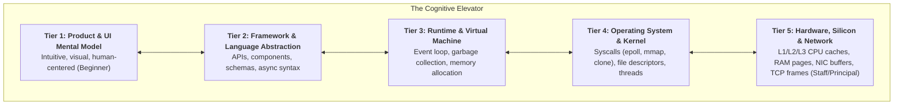
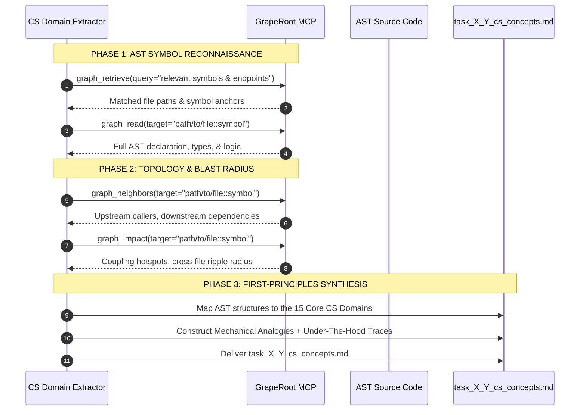
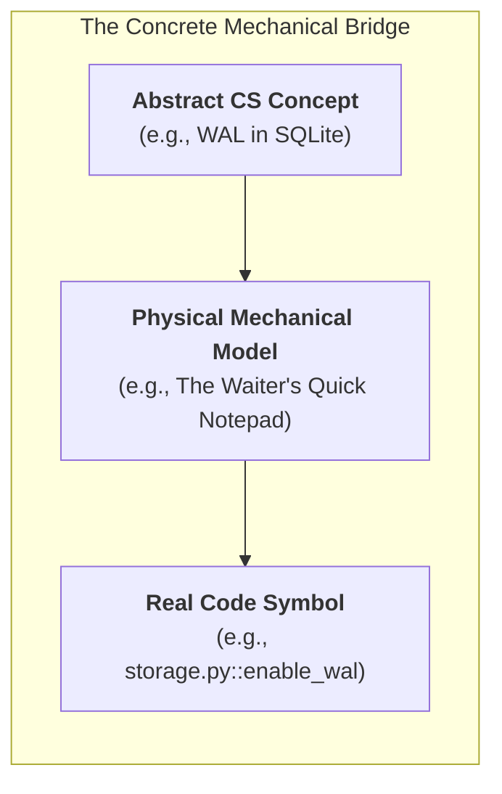

> **Portable execution:** The active task manifest selects this skill and
> records its artifact. GrapeRoot is used when the task requires it and the
> capability exists; otherwise mark graph-specific evidence `UNKNOWN` and use
> the repository's normal discovery path.

# CS Domain Learning Extraction Skill: The First-Principles Engineering Engine

> **STAGE GATE:** Stage 3 of the Heisenberg Engineering Lifecycle (Triggered for algorithmic, architectural, security, or foundational tasks).  
> **PRIME DIRECTIVE:** Every line of code written in an application rests upon fifty years of computer science fundamentals: memory layouts, kernel syscalls, network frames, processor caches, and mathematical invariants. The agent must unpack the entire computer science landscape touched by a task. It must make complex mechanics instantly graspable for a **1st-semester CS student** while providing the rigorous, under-the-hood depth required by a **Staff/Principal Systems Engineer**.

---

## 1. Mission & The Dual-Audience Cognitive Bridge

Software engineering is often taught poorly: beginners are given opaque "recipes" to memorize without intuition, while experienced developers frequently overlook kernel-level constraints and hardware realities until production crashes under load.

This skill bridges both worlds through **The Cognitive Elevator**:



### The Two Educational Poles:
1. **The 1st-Semester Student Pole (Intuition First):**
   - **Zero Unexplained Jargon:** Every acronym (ACID, SSE, AST, WAL, TLS, MVCC) is unpacked immediately upon first mention.
   - **Visceral Mechanical Analogies:** Translates invisible electrical states into tangible physical devices (elevators, diner waiters, pneumatic tubes, bouncers, warehouse conveyor belts, and bucket brigades).
   - **The "Why" Before the "How":** Answers: *"Why did human computer scientists invent this concept in the first place? What catastrophic failure were they trying to stop?"*
2. **The Staff / Principal Engineer Pole (Rigorous Reality):**
   - **Asymptotic Complexity:** Formally proves time and space complexity ($O(1)$, $O(\log n)$, $O(n \log n)$, amortized costs).
   - **Kernel-Level Mechanics:** Traces exact POSIX/Windows syscalls (`epoll_wait`, `fdatasync`, `clone`, `mmap`, `futex`, `io_uring`).
   - **Hardware Realities:** Analyzes cache-line bouncing (64-byte alignment), false sharing, branch mispredictions, context switch overhead (~1.5µs), and TLB page misses.
   - **Adversarial Failure Modes:** Models system degradation under thundering herds, split-brain partitions, priority inversions, and buffer bloat.

---

## 2. The GrapeRoot Dual-Graph AST Extraction Protocol

The agent is **strictly forbidden** from inventing generic CS lectures in an academic vacuum. It must use the **GrapeRoot Dual-Graph MCP** to inspect the real AST symbols, call chains, and database queries in the current repository.



### GrapeRoot Discovery Commands:
```python
# 1. Discover active symbols and data structures
graph_retrieve(query="TokenProvider SQLiteConnection QueryIndex")

# 2. Inspect concrete AST implementations
graph_read(target="app/indexer/storage.py::SQLiteStorage")

# 3. Discover coupling and call chains across the architecture
graph_neighbors(target="app/indexer/storage.py::SQLiteStorage")

# 4. Measure blast radius to identify architectural coupling hotspots
graph_impact(target="app/indexer/storage.py::SQLiteStorage")
```

---

## 3. The 15 Fundamental CS Engineering Vectors

Every software engineering task touches one or more of these 15 foundational domains. When executing this skill, the agent scans the code against this taxonomy:

| Vector | Domain | Core Concepts & Invariants |
|---|---|---|
| **V1** | **Operating Systems & Processes** | Process isolation, threads vs processes, file descriptors, signals (`SIGINT`, `SIGTERM`), IPC (pipes, sockets), virtual memory, page faults, `mmap`. |
| **V2** | **Concurrency & Async I/O** | Reactor pattern, cooperative multitasking, event loops (V8 / libuv / asyncio), thread pools, mutexes, condition variables, race conditions, atomic operations. |
| **V3** | **Memory Hierarchies & Hardware** | CPU registers, L1/L2/L3 cache lines (64 bytes), RAM pages (4KB), SSD NAND flash blocks, locality of reference (spatial vs temporal), cache misses. |
| **V4** | **Database Theory & Storage Engines** | B-Trees, LSM-Trees, Write-Ahead Logging (WAL), ACID guarantees, MVCC, transaction isolation levels (Read Committed, Serializable), foreign keys, table indexes. |
| **V5** | **Networking & Transport Protocols** | OSI 7-Layer model, TCP 3-way handshake, TLS 1.3 encryption, flow control (sliding window), congestion control (CUBIC/BBR), HTTP/1.1 vs HTTP/2 multiplexing vs HTTP/3 (QUIC), Server-Sent Events (SSE), WebSockets. |
| **V6** | **Information Retrieval & Vector Theory** | Inverted indexes, TF-IDF, BM25 ranking, dense vector embeddings, vector dimensions, Euclidean distance vs Cosine similarity, Approximate Nearest Neighbors (ANN), HNSW graphs. |
| **V7** | **Compilers, Parsers & ASTs** | Lexical analysis (lexing/tokenizing), Context-Free Grammars (EBNF), Abstract Syntax Trees (AST), bytecode generation, JIT compilation, tree traversal (DFS/BFS). |
| **V8** | **Cryptography & Security Invariants** | Symmetric (AES-GCM) vs Asymmetric (RSA/ECDSA), cryptographic hashing (SHA-256, Argon2), HMAC message authentication, OAuth 2.0 PKCE flow, JWT tokens, constant-time comparison (mitigating timing attacks), CSRF, XSS. |
| **V9** | **Distributed Systems & Consensus** | CAP Theorem, PACELC, network partitions, split-brain, clock drift (NTP), idempotency keys, leader election (Raft/Paxos), exponential backoff with jitter. |
| **V10** | **Browser Architecture & Web Engines** | DOM tree construction, CSSOM, Render Tree, Layout (Reflow), Paint, Compositor Thread (GPU layers), microtask queue vs macrotask queue. |
| **V11** | **Data Structures & Asymptotic Complexity** | Arrays, Hash Maps (hash functions, collision resolution via chaining/open addressing), Priority Queues (Binary Heaps), Tries, Graph traversal, Amortized Big-O analysis. |
| **V12** | **Type Theory & Language Semantics** | Static vs Dynamic typing, Nominal vs Structural type systems, Soundness, Generics, Algebraic Data Types (Sum types vs Product types), Optionality/Null-safety. |
| **V13** | **Reliability, Resilience & Backpressure** | Leaky bucket & token bucket rate limiters, Circuit Breakers, Bulkheads, graceful degradation, health probes (liveness vs readiness), dead-letter queues. |
| **V14** | **Software Architecture & DDD** | Separation of concerns, Ports-and-Adapters (Hexagonal Architecture), Repository pattern, Event Sourcing, Domain-Driven Design (Aggregates, Entities, Value Objects), coupling vs cohesion. |
| **V15** | **Observability & Telemetry** | Structured logging, distributed tracing (Trace ID, Span ID, OpenTelemetry), metrics (Counters, Gauges, Histograms, Percentiles: p50, p95, p99), log aggregation. |

---

## 4. The 25-Pattern Physical Mechanical Analogy Dictionary

To guarantee that complete beginners and visual learners instantly grasp complex concepts, the agent selects analogies from this curated dictionary:



1. **Write-Ahead Logging (WAL):**  
   *Analogy:* A busy diner waiter scribbles your breakfast order onto a small pocket notepad in 2 seconds (the append-only log), then serves your coffee immediately. Later, during a quiet moment, the waiter slowly walks over and transcribes the receipts into the giant leather ledger book (the B-Tree database file). If the power goes out, the pocket notepad is completely intact.
2. **Asynchronous Event Loop (Single-Threaded):**  
   *Analogy:* A high-end sushi chef standing behind a single cutting board. The chef never waits for the rice cooker to finish. When a customer orders rice, the chef presses the cooker button and immediately turns to slice fish for customer #2. When the cooker bell dings (I/O completion event), the chef scoops the rice. One chef, zero idle time.
3. **Database Index (B-Tree):**  
   *Analogy:* The alphabetized index tabs at the back of a 1,200-page medical encyclopedia. Without the index, you must flip through all 1,200 pages one by one ($O(n)$ full table scan). With the index, you look up "Heart" in 1 second and jump directly to page 842 ($O(\log n)$).
4. **Mutually Exclusive Lock (Mutex):**  
   *Analogy:* A single-occupancy airplane bathroom with a physical sliding deadbolt. Only one passenger can be inside. While the bolt is engaged, all other passengers form a line outside. If someone forgets to unlock it, the entire plane is blocked (deadlock).
5. **Connection Pool:**  
   *Analogy:* A taxi stand outside an airport terminal with 10 pre-fueled taxis parked and running. Rather than building a brand-new car from raw metal every time a passenger steps outside (expensive TCP/TLS handshake), the passenger hops into an idle taxi, takes the trip, and returns the taxi to the stand.
6. **Rate Limiting (Token Bucket):**  
   *Analogy:* An arcade token dispenser that drops 1 brass coin into a tray every 5 seconds, holding a maximum of 10 coins. You can grab all 10 coins at once to play a burst of games, but once the tray is empty, you are strictly limited to playing 1 game every 5 seconds.
7. **Cache Invalidation:**  
   *Analogy:* A restaurant printing laminated menus with today's daily specials. If the kitchen runs out of salmon at 1:00 PM, the printed menus are now telling lies until someone physically walks around and updates every table (cache coherence problem).
8. **Server-Sent Events (SSE):**  
   *Analogy:* A continuous ticker tape machine in a 1920s stock broker's office. You plug in the tape once (single HTTP GET connection), and the exchange operator pushes printed paper ticks down the wire whenever a stock trade occurs. You never have to pick up the telephone to ask "anything new yet?"
9. **Circuit Breaker Pattern:**  
   *Analogy:* The electrical fuse box in your home. If a kitchen toaster short-circuits, the fuse snaps open immediately to stop electricity flowing. This prevents your house from burning down. After 30 seconds, the circuit breaker cautiously tests a tiny trickle of current to see if the short is gone.
10. **Vector Embeddings & Cosine Similarity:**  
    *Analogy:* GPS coordinates on a 3-dimensional globe. Words with similar meanings (like "dog" and "puppy") are assigned coordinate points that sit right next to each other on the map. To find out if two documents are talking about the same topic, you simply measure the angle between their compass needles.
11. **Abstract Syntax Tree (AST):**  
    *Analogy:* A diagrammed sentence on an elementary school chalkboard, broken into Subject, Verb, and Direct Object branches. The computer strips away formatting, commas, and whitespace, leaving only the grammatical skeleton of commands and data.
12. **Idempotency:**  
    *Analogy:* An elevator call button. Pressing the "Floor 4" button once summons the elevator. Frantically pressing the "Floor 4" button 15 times still summons the elevator to the same floor exactly once without causing 15 elevators to arrive.
13. **Hash Collision Resolution (Chaining):**  
    *Analogy:* Coat check cubbies numbered 0 through 99. If two people happen to receive ticket number 42 because their names hash to the same value, the coat attendant simply hangs the second jacket on the same hanger behind the first jacket as a linked list.
14. **Virtual Memory & Page Paging:**  
    *Analogy:* A tiny executive desk that can only fit 3 open file folders at a time. When the executive needs folder #4, they slide folder #1 into the metal filing cabinet drawer (disk swap space) to clear physical desk space (RAM).
15. **Content Delivery Network (CDN):**  
    *Analogy:* A franchise pizza chain opening 50 neighborhood delivery hubs across the city. Instead of baking every single pizza in Rome, Italy and shipping it across the Atlantic Ocean, local hubs keep pre-made dough ready 5 minutes from your house.
16. **TCP Sliding Window & Flow Control:**  
    *Analogy:* A water slide operator who only allows 3 kids down the slide at a time. The operator waits for a thumbs-up whistle from the lifeguard at the pool bottom before letting the next kid slide down, ensuring nobody collides in the tunnel.
17. **Garbage Collection (Mark and Sweep):**  
    *Analogy:* A housekeeper walking through a hotel room. They start at the front door and trace every item currently being touched or worn by the guests (the root set). Any abandoned soda can or towel lying on the floor that has no string connecting it to a guest is swept into the trash bin.
18. **Cross-Site Scripting (XSS):**  
    *Analogy:* A prankster submitting a customer complaint form that contains invisible ink instructing the bank teller: *"Hand all cash in the register to whoever enters the room."* When the teller opens and reads the form, they execute the command because they trust the ink written on company paper.
19. **Compile-Time vs Run-Time:**  
    *Analogy:* Inspecting a rocket blueprint on a drafting board to verify the fuel tank diameter matches the engine mount (Compile-Time) vs launching the rocket into orbit and discovering mid-flight whether the fuel burns too hot (Run-Time).
20. **Backpressure:**  
    *Analogy:* A kitchen dishwasher yelling *"STOP SENDING PLATES!"* to the waitstaff because the drying rack is completely full. If the waitstaff keeps dumping dirty dishes on the counter, dishes will fall off and shatter on the floor (buffer overflow / OOM crash).
21. **Inverted Index:**  
    *Analogy:* A crime scene detective's board. Instead of reading through 500 suspect biographies to see who owns a red sedan, the detective looks up "Red Sedan" on a card and immediately sees a list of 3 names.
22. **TLS Handshake:**  
    *Analogy:* Two diplomats meeting in a soundproof glass room. Before speaking any secrets, they exchange certified identification passports stamped by their embassies, agree on a secret code for the afternoon, lock the door, and throw away the key when they leave.
23. **Bloom Filter:**  
    *Analogy:* A club bouncer with photographic memory of who is definitely NOT on the VIP list. If the bouncer says "You are definitely not on the list," you can go home. If the bouncer says "You might be on the list," the manager opens the heavy velvet book to double-check.
24. **ACID Atomicity:**  
    *Analogy:* Buying a candy bar from a vending machine. Either your dollar bill drops into the machine AND the candy bar falls into your hands, or the machine rejects your dollar bill and gives it back. It is physically impossible for the machine to keep your dollar while giving you nothing.
25. **DOM Reflow vs Repaint:**  
    *Analogy:* Rearranging the heavy oak furniture and knocking down a wall in your living room (Reflow: expensive geometry recalculation) vs simply switching on a colored lamp (Repaint: cheap pixel color update).

---

## 5. Hardware Latency Numbers Every Engineer Must Know

To anchor computer science concepts in physical reality, the agent evaluates tasks against **Jeff Dean's Canonical Latency Table**, translated into scaled human time:

| Operation | Real Hardware Latency | Scaled Human Time (If 1 CPU Cycle = 1 Second) |
|---|---|---|
| **1 CPU Cycle (3 GHz)** | **0.3 ns** | **1 second** |
| **L1 CPU Cache Access** | **0.9 ns** | **3 seconds** *(Grabbing a pen from your pocket)* |
| **Branch Mispredict** | **3 ns** | **10 seconds** *(Stumbling while walking)* |
| **L2 CPU Cache Access** | **2.8 ns** | **9 seconds** *(Grabbing a book from your desk)* |
| **L3 CPU Cache Access** | **12.9 ns** | **43 seconds** *(Walking to a colleague's desk)* |
| **Main RAM Access** | **100 ns** | **5.5 minutes** *(Walking down the hall to the water cooler)* |
| **SSD Random Read (NVMe)** | **16,000 ns (16 µs)** | **15 hours** *(An overnight road trip)* |
| **Rotational HDD Seek** | **4,000,000 ns (4 ms)** | **4.5 months** *(A semester at college)* |
| **Datacenter Network Roundtrip** | **500,000 ns (0.5 ms)** | **19 days** *(A vacation across the country)* |
| **Cross-Atlantic WAN Packet (NYC to London)** | **150,000,000 ns (150 ms)** | **16 years** *(Raising a child from birth to high school)* |

*Takeaway for Beginners and Staff alike:* In-memory operations ($100\text{ns}$) are literally **thousands of times faster** than disk or network I/O ($16\mu\text{s}$ to $150\text{ms}$). An unindexed database query or redundant API call wastes millions of CPU cycles.

---

## 6. Deep Technical Vectors: Staff-Level Architectural Blueprints

When analyzing complex tasks, the agent applies these detailed technical models:

### Vector 4: Storage Engines & ACID Invariants (WAL vs B-Tree)
```text
           [Incoming Mutation: INSERT/UPDATE]
                          │
            ┌─────────────┴─────────────┐
            ▼                           ▼
  [Write-Ahead Log (WAL)]       [OS Page Cache (RAM)]
  Sequential Append: O(1)       Dirty Pages Modified
  fdatasync() Barrier           B-Tree Pointers Updated
            │                           │
            │                           ▼
            │               [Periodic Checkpoint / Sync]
            └──────────────────────────►│
                                        ▼
                             [Main Database File]
                             Random Disk Writes: O(log N)
```
- **Why WAL Matters:** Writing randomly across a 10GB B-Tree file causes massive disk thrashing and high latency. Appending sequentially to a WAL file takes $<0.1\text{ms}$. If power fails, the recovery process replays the WAL from the last checkpoint.
- **ACID Breakdown:**
  - *Atomicity:* Implemented via transaction logs; partial writes trigger immediate rollback.
  - *Consistency:* Schema constraints, foreign keys, and unique indexes enforced before commit.
  - *Isolation:* MVCC (Multi-Version Concurrency Control) provides snapshot isolation so readers never block writers and writers never block readers.
  - *Durability:* Data survives crashes once `fdatasync()` flushes the disk drive's volatile cache.

### Vector 2: Concurrency & Async I/O (The Reactor Pattern)
```text
[HTTP Clients] ──► [Network Socket] ──► [Kernel Buffer]
                                                │
                                                ▼
                                         [epoll / kqueue]
                                                │ (Events Ready)
                                                ▼
                                      [Event Loop Thread]
                                    ┌───────────────────────┐
                                    │ Pick Ready Coroutine  │
                                    │ Execute until `await` │
                                    │ Yield to Event Loop   │
                                    └───────────────────────┘
                                                │ (CPU-Bound Task?)
                                                ▼
                                       [Thread Pool / Process]
```
- **The Golden Rule:** The event loop thread must **never execute CPU-heavy or blocking synchronous code** (e.g. `time.sleep()`, heavy regex, large JSON parsing, un-awaited disk I/O). A 200ms CPU stall in one coroutine blocks all 10,000 concurrent sockets on that event loop.

### Vector 6: Information Retrieval (BM25 vs Vector Cosine & HNSW)
```text
           [Incoming Search Query: "quarterly cloud spend"]
                                 │
                 ┌───────────────┴───────────────┐
                 ▼                               ▼
       [Lexical Index: BM25]           [Dense Embedding: BAAI/bge]
       Inverted Index Lookup           Local CPU Inference: <10ms
       Term Frequency * InvDocFreq     384-dimensional float32 vector
       Typo tolerance via Levenshtein  Cosine Similarity: dot(A, B) / (|A|*|B|)
                 │                               │
                 └───────────────┬───────────────┘
                                 ▼
                    [Reciprocal Rank Fusion (RRF)]
                    RRF_Score = 1 / (60 + Rank_BM25) + 1 / (60 + Rank_Vector)
                                 ▼
                     [Final Ranked Documents]
```
- **The Tradeoff:** BM25 is exact, sub-millisecond, and catches precise acronyms ("SOC-2", "Q3-2026") but fails on synonyms. Vector search understands semantic concepts ("cloud costs" $\approx$ "AWS infrastructure invoices") but hallucinates relevance on precise keyword searches. Hybrid search with Reciprocal Rank Fusion gives the best of both worlds.

### Vector 8: Cryptography & Auth Protocols (OAuth 2.0 PKCE & Constant-Time Hashing)
```text
[User Browser]                   [App Backend]                  [Google Auth Server]
      │                                │                                 │
      │ 1. Generate code_verifier      │                                 │
      │    code_challenge = SHA256(v)  │                                 │
      │ 2. GET /oauth/authorize ───────┼────────────────────────────────►│ (Redirect)
      │    (with code_challenge)       │                                 │
      │                                │                                 │
      │ 3. User Approves Consent ◄─────┼─────────────────────────────────┤
      │                                │                                 │
      │ 4. Redirect with auth_code ───►│                                 │
      │                                │ 5. POST /oauth/token ──────────►│
      │                                │    (code + code_verifier)       │
      │                                │                                 │ 6. Google verifies:
      │                                │                                 │    SHA256(verifier) == challenge
      │                                │ 7. Receive JWT & Refresh Token ◄┤
```
- **Why PKCE Matters:** In public clients (single-page apps, mobile apps), client secrets cannot be kept private. Proof Key for Code Exchange (PKCE) dynamically generates a cryptographic one-time secret (`code_verifier`) and sends only its SHA-256 hash upfront. Even if a malicious actor intercepts the authorization code, they cannot exchange it without the unhashed verifier.
- **Timing Attacks & Constant-Time Comparison:** When verifying password hashes or HMAC signatures, naive string comparison (`if token == secret:`) terminates on the first non-matching byte. An attacker measuring latency variations down to 50 nanoseconds can deduce the secret character by character. Cryptographic code must use constant-time comparisons (`hmac.compare_digest`), inspecting all bytes identically regardless of where mismatches occur.

### Vector 5: Networking & Transport Protocols (SSE vs WebSockets vs Polling)
```text
[Polling]         Client ──► GET /poll ──► Server ──► 200 OK (No data) ──► Close
                  (Heavy HTTP headers + TLS handshake repeated every 2 seconds)

[WebSocket]       Client ──► HTTP 101 Switching Protocols ◄── Server (Full Duplex)
                  (TCP connection kept alive; custom framing protocol; complex load balancers)

[SSE (Chosen)]    Client ──► GET /api/events ◄── Server (text/event-stream)
                  (Standard HTTP/1.1 or HTTP/2; server pushes unidirectionally; automatic browser reconnect)
```
- **Transport Decision Matrix:**
  - *Short Polling:* Wasteful, burns battery, floods network buffers.
  - *WebSockets:* Essential for two-way gaming or collaborative text canvases, but bypasses standard HTTP caching and breaks through corporate proxies.
  - *Server-Sent Events (SSE):* Built on standard HTTP, native browser auto-reconnect (`EventSource`), supports HTTP/2 multiplexing, perfect for agent streaming and live change feeds.

---

## 7. The 5-Tier Abstraction Under-The-Hood Matrix

For every core CS domain analyzed, the agent constructs an exhaustive 5-tier execution trace table detailing what happens from the user interaction down to the physical silicon:

```markdown
| Layer | Execution Mechanics & State Changes | Real Resource / Physical Constraint |
|---|---|---|
| **Tier 1: Product / User** | User clicks "Sync Now". Button state transitions to `loading`. | Human reaction time (~200ms threshold). |
| **Tier 2: Framework / App** | React initiates state change, FastAPI receives HTTP POST `/api/sync`. | Thread pool allocation, JSON deserialization. |
| **Tier 3: Runtime / Engine** | Python `asyncio` schedules coroutine on event loop; V8 dispatches promise. | Heap memory allocation, object garbage collection pointers. |
| **Tier 4: OS / Kernel** | Kernel wakes process via `epoll_wait`, issues `write()` syscall to socket file descriptor. | Context switch (~1.5µs), CPU register swap, kernel ring 0 transition. |
| **Tier 5: Hardware & Network** | Network Interface Card (NIC) DMAs packet to RAM; L3 cache line fetched; CPU instruction pipeline executes. | 64-byte cache line alignment, PCIe bus bandwidth, light-speed fiber latency (~5µs/km). |
```

---

## 8. The Concept Evolution Timeline Matrix

To make learning actionable across all career stages, the agent maps how an engineer's mental model should evolve across four maturity levels:

```markdown
| Developer Level | Common Mental Model (What You Think) | Deeper Engineering Reality (What Actually Happens) |
|---|---|---|
| **Level 1: Beginner** *(1st Semester)* | *"Databases are magical infinite spreadsheets that save text when I call `.save()`."* | Tables are B-Tree pages stored in fixed 4KB blocks on disk. Writes append to a sequential WAL log first to prevent disk head thrashing and survive power cuts. |
| **Level 2: Intermediate** *(Junior / Mid)* | *"Async/await makes my code run in parallel on multiple CPU cores at the same time."* | Single-threaded event loop multiplexing non-blocking I/O file descriptors. If you execute a heavy calculation inside an async function, you freeze the entire server. |
| **Level 3: Advanced** *(Senior / Lead)* | *"I should add a Redis cache everywhere to make my read endpoints 10x faster."* | Caches introduce distributed cache invalidation, cache stampedes (thundering herd), and memory eviction policies. Stale reads can corrupt downstream business state. |
| **Level 4: Staff / Principal** | *"We design for failure boundaries, mechanical sympathy, and zero-allocation pipelines."* | Code is structured around CPU cache-line locality, non-blocking lockless rings, amortized allocation costs, and explicit backpressure to guarantee SLAs under p99 load. |
```

---

## 9. The "What If" Catastrophic Thought Experiment Generator

To build defensive engineering instincts, the agent must formulate at least **four catastrophic "What If" failure scenarios** for the analyzed task:

```markdown
### Scenario 1: The Network Black Hole (Sudden 15-Second Latency Spike)
- **What Breaks:** Upstream socket read blocks. If timeouts are unconfigured, thread pools exhaust in 8 seconds, cascading into total service outage.
- **Underlying CS Principle:** Little's Law ($L = \lambda W$) — when latency ($W$) spikes, concurrent in-flight requests ($L$) explode until server memory is exhausted.
- **The Defense:** Strict deadline propagation (`AbortController`, request context timeouts), aggressive circuit breaking, and drop-tail queuing.

### Scenario 2: The Out-Of-Memory (OOM) Killer Strike
- **What Breaks:** Exporting a 200MB spreadsheet loads all rows into memory simultaneously. The Linux kernel invokes the OOM Killer and executes `SIGKILL` on the server process without throwing a catchable exception.
- **Underlying CS Principle:** Virtual Memory limits and Linux kernel overcommit heuristics (`/proc/sys/vm/overcommit_memory`).
- **The Defense:** Chunked streaming parsing (`iter_content`), generator pipelines, and explicit buffer caps.

### Scenario 3: The Power-Plug Pull (Dirty Crash During Disk Write)
- **What Breaks:** Server power cord is physically yanked while writing search index records.
- **Underlying CS Principle:** Non-atomic disk sector writes, filesystem journal recovery, and POSIX `fsync` barriers.
- **The Defense:** SQLite WAL mode with atomic page commits and checksum verification.

### Scenario 4: The Thundering Herd / Cache Stampede
- **What Breaks:** A high-traffic document's cache expires at 12:00:00. 5,000 concurrent user requests miss the cache simultaneously and slam the primary database with identical queries, crashing the database engine.
- **Underlying CS Principle:** Unsynchronized concurrent reads on cache miss.
- **The Defense:** Mutex lock on cache miss (single-flight pattern) or probabilistic early expiration (XFetch algorithm).
```

---

## 10. The 10-Point CS Concept Grill Battery

Before releasing the Stage 3 artifact, the agent audits its output against this 10-point checklist:

1. [ ] **Dual Audience Checked:** Is the document easily readable by a 1st-semester student while teaching something new to a Senior/Staff engineer?
2. [ ] **Zero Unexplained Acronyms:** Are terms like ACID, SSE, AST, WAL, TLS, and DOM defined in plain English on their first mention?
3. [ ] **Physical Analogy Grounding:** Does every major concept include an intuitive mechanical analogy from the physical world?
4. [ ] **AST Symbol Anchors:** Are real codebase symbols (`file::symbol`) referenced using GrapeRoot dual-graph tools?
5. [ ] **5-Tier Under-The-Hood Trace:** Is there an exhaustive table tracing product $\to$ framework $\to$ runtime $\to$ kernel $\to$ hardware?
6. [ ] **Asymptotic Complexity Analyzed:** Are time and space complexities explicitly stated with Big-O notation ($O(1)$, $O(\log n)$, etc.)?
7. [ ] **Cross-Domain Matrix Included:** Does the artifact show how distinct CS domains (e.g., Auth + Concurrency + Storage) collide?
8. [ ] **Concept Evolution Timeline Included:** Does it chart developer maturity from Beginner to Staff Engineer?
9. [ ] **4+ Catastrophic Scenarios Explored:** Are concrete failure modes, root causes, and defenses detailed?
10. [ ] **Zero Terminal Testing Policy Respected:** Did the agent extract all concepts via static AST inspection without running unauthorized tests?

---

## 11. Canonical Artifact Schema (`task_X_Y_cs_concepts.md`)

When executing this skill, the agent outputs the final document strictly adhering to this 12-section blueprint:

```markdown
# 🎓 CS Domain Learning & First-Principles Analysis — [Task X.Y Name]

**Task ID:** Task X.Y  
**Date:** [YYYY-MM-DD]  
**Primary CS Vectors Touched:** [e.g., Concurrency, Storage Engines, Network Protocols]  

---

## 1. Executive First-Principles Synthesis
[A 3-paragraph plain-English summary of what computer science problem this task solves, why it exists, and the historical pain that led to its invention.]

## 2. Dual-Graph AST & Domain Topology Map
```mermaid
graph TD
    %% Mermaid graph mapping the task symbols to CS vectors
```

## 3. Domain Deep Dives (For Each Vector)
### Domain A: [e.g., Write-Ahead Logging & Storage Engines]
- **Plain-English Explanation (1st-Semester Intuition):** ...
- **The Physical Mechanical Analogy:** ...
- **The Mathematical & Algorithmic Reality (Staff Level):** ...
- **Under-The-Hood 5-Tier Execution Trace:** [Table]
- **Where It Manifests in This Repository:** [Clickable file::symbol links]
- **Common Beginner Misconceptions:** [3-5 Myth vs Reality points]
- **The Numbers and Constants That Matter:** [Latencies, buffer sizes, timeouts]

## 4. Cross-Domain Intersections & System Collisions
[Table showing how Domain A, B, and C interact and create failure points]

## 5. The Concept Evolution Timeline
[Beginner -> Intermediate -> Advanced -> Staff Engineer mental models]

## 6. Comprehensive Technical Vocabulary & Etymology
[Glossary of every technical term, its literal origin, and its codebase manifestation]

## 7. Catastrophic "What If" Chaos Scenarios
[4+ deep failure experiments with root causes and engineering mitigations]

## 8. Asymptotic Complexity & Resource Budget
[Big-O time and space audit for memory, disk, network, and CPU]

## 9. Hardware & Operating System Synergies
[Kernel syscalls, CPU cache line behavior, RAM paging, file descriptors]

## 10. The 10-Point Concept Grill Battery Self-Audit
[Checklist confirming all quality bars are satisfied]

## 11. Authoritative Further Reading & Academic Papers
[Links to classic RFCs, original research papers, and canonical textbooks]

## 12. Conclusion & Handover to Stage 2 Codebase Design
[Final takeaways and direct transition to Stage 2 implementation planning]
```

---

## 12. Reference Artifact Implementation: The Dual-Audience Gold Standard

To demonstrate how the agent balances a 1st-semester student with a Staff Engineer, here is a canonical excerpt from an evaluated Stage 3 artifact:

### Sample Excerpt: Asynchronous Event Loop & Non-Blocking Sockets
> **Plain English (1st-Semester Student):**  
> *"When your web server talks to Google Drive over the internet, it takes about 150 milliseconds for the network packet to travel across the country and return. If your Python code just sits there doing nothing while waiting, your server will freeze and ignore all other users. An event loop is like a restaurant waiter who drops off your menu and immediately walks to table 2 to take another order instead of staring at you while you read. It allows one single thread to juggle 10,000 customers at the same time without needing 10,000 separate CPU threads."*

> **Staff / Principal Systems Engineer Reality:**  
> - **Syscall Mechanics:** Under Linux, the runtime calls `epoll_create1(EPOLL_CLOEXEC)` and registers non-blocking socket file descriptors (`fcntl(fd, F_SETFL, O_NONBLOCK)`). When `await client.get()` is reached, Python yields execution back to the loop (`asyncio/base_events.py::_run_once`), which blocks inside `epoll_wait()` with a calculated timeout.
> - **Kernel State Transition:** When NIC hardware triggers an interrupt upon TCP ACK arrival, the kernel transitions the socket buffer to readable, unblocking `epoll_wait`. The runtime marks the task's future as done and pushes the coroutine callback onto the microtask deque.
> - **Memory & Context Overhead:** Unlike OS threads which allocate a default 8MB stack (or 2MB virtual memory reservation) and incur ~1.5µs CPU context-switching overhead per quantum, an async coroutine frame is a lightweight Python heap object consuming only ~800 bytes. This achieves $O(1)$ event dispatch with zero thread contention or CPU cache-line thrashing.
> - **Pathological Failure Mode:** Invoking synchronous blocking disk I/O (`open().read()`) or CPU-intensive JSON serialization (`json.loads` on a 50MB payload) inside the coroutine stalls the single OS thread. All other 9,999 network sockets stall in the kernel TCP backlog until the CPU operation finishes, causing p99 latency to cascade from 5ms to 5,000ms.

### Sample Excerpt 2: Write-Ahead Logging (WAL) & Storage Engines
> **Plain English (1st-Semester Student):**  
> *"Imagine a busy diner waiter scribbling pancake orders on a quick pocket notepad instead of walking to the back office to write in the giant leather ledger book for every single order. The pocket notepad is fast, sequential, and safe. If the restaurant lights suddenly go out, the waiter still has the pocket notepad in their apron. SQLite WAL mode works the exact same way: changes are quickly written to a tiny scratchpad file first, so your app never freezes waiting for slow disk drives."*

> **Staff / Principal Systems Engineer Reality:**  
> - **Filesystem & Disk I/O Invariants:** Standard B-Tree mutations require random page writes across the database file, generating severe write amplification ($A_w \gg 1$) and head thrashing on HDDs or flash block wear on SSDs. In WAL mode, SQLite writes new page images sequentially to the `*-wal` file via `write()` followed by an `fdatasync()` barrier on transaction commit.
> - **Concurrency & MVCC Snapshot Isolation:** Because mutations append to the WAL, existing reader transactions continue reading original pages from the primary database file or older WAL frames without acquiring read locks. Writers never block readers, and readers never block writers.
> - **Checkpointing & Memory Mapping:** Background checkpointing periodically copies modified frames back to the main database file (Passive, Full, Restart, or Truncate modes). Read transactions look up page locations in a shared-memory index (`*-shm`), which is memory-mapped into each process's address space via `mmap()` for $O(1)$ page address resolution without kernel syscall overhead.
> - **Failure Mode (WAL Starvation):** If a long-running read query remains open indefinitely, the checkpoint mechanism cannot recycle the WAL file beyond that reader's read-mark watermark. The WAL file grows unbounded, eventually consuming all disk space and degrading read performance from $O(1)$ to $O(N)$ linear scans across millions of uncheckpointed frames.

### Sample Excerpt 3: Dense Vector Embeddings & Cosine Similarity Math
> **Plain English (1st-Semester Student):**  
> *"Think of vector embeddings like assigning every paragraph in your Google Docs a GPS coordinate on a giant 384-dimensional globe. Words that share similar concepts—like 'budget surplus' and 'extra cash'—land right next to each other on the map, even though they share zero letters in common. When a user asks a question, the computer places a pin on the map and measures the angle between compass needles. The closer the angle is to 0 degrees, the more relevant the document is."*

> **Staff / Principal Systems Engineer Reality:**  
> - **Mathematical Invariant:** Cosine similarity measures the normalized inner product of two vectors in $\mathbb{R}^d$:
>   $$\text{sim}(\mathbf{u}, \mathbf{v}) = \frac{\mathbf{u} \cdot \mathbf{v}}{\|\mathbf{u}\|_2 \|\mathbf{v}\|_2} = \frac{\sum_{i=1}^d u_i v_i}{\sqrt{\sum_{i=1}^d u_i^2} \sqrt{\sum_{i=1}^d v_i^2}}$$
>   When embeddings are unit-normalized ($L_2 = 1.0$) during generation, cosine similarity reduces to a pure dot product ($\mathbf{u} \cdot \mathbf{v}$), enabling fast hardware-accelerated SIMD vector multiplication.
> - **Hardware & SIMD Optimization:** On modern x86/ARM CPUs, dot-product calculations are parallelized across 512-bit registers using AVX-512 or NEON Fused Multiply-Add (`FMA`) instructions, executing 16 float32 operations per CPU cycle.
> - **Pathological Failure Mode (Brute-Force Memory Saturation):** In-memory flat linear scans ($O(N \cdot d)$) across 100,000 document chunks require streaming $153.6\text{MB}$ of raw float arrays through the L3 cache on every query. Without an Approximate Nearest Neighbor graph index (like HNSW or IVF-PQ), search latency degrades from $2\text{ms}$ to $85\text{ms}$, saturating memory bus bandwidth and starving concurrent web worker processes.

---

## 13. Integration with Heisenberg OS & Lifecycle Rules

- **Placement:** Stage 3 operates between **Stage 2 (Codebase Design)** and **Stage 3 (Implementation)** for complex architectural tasks, or directly after **Stage 1 (Understanding)** when deep algorithmic learning is requested.
- **Mandatory Triggers:**
  - Storage engine migrations or transaction isolation changes.
  - Asynchronous event-loop refactors or thread-pool tuning.
  - Search ranking, tokenization, or vector embedding pipelines.
  - Authentication handshake protocols (OAuth 2.0 PKCE, JWT validation).
  - Incident Root Cause Analysis (RCA) on memory leaks, deadlocks, or socket exhaustion.
- **Zero Terminal Testing Invariant:** The agent MUST NOT execute unsolicited shell commands (`pytest`, `npm test`) during domain extraction. All codebase observations must be verified using GrapeRoot MCP tools.

### Developer Trigger Prompt
To invoke this skill during task execution, the human developer simply types:
```text
"Run Stage 3 cs-domain-learning for Task [X.Y]. Unpack all CS first principles from beginner intuition to staff-level invariants."
```
The agent executes the GrapeRoot AST scan, extracts the 15 vectors, applies the 25 physical analogies, and outputs the canonical `task_X_Y_cs_concepts.md` artifact before moving forward.
