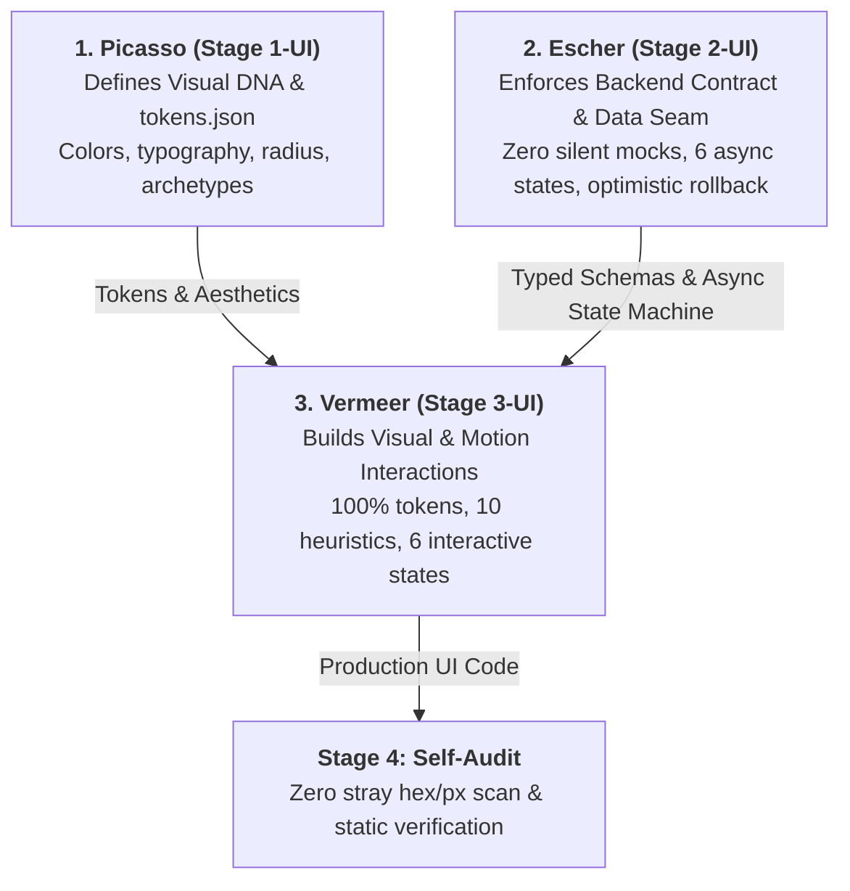
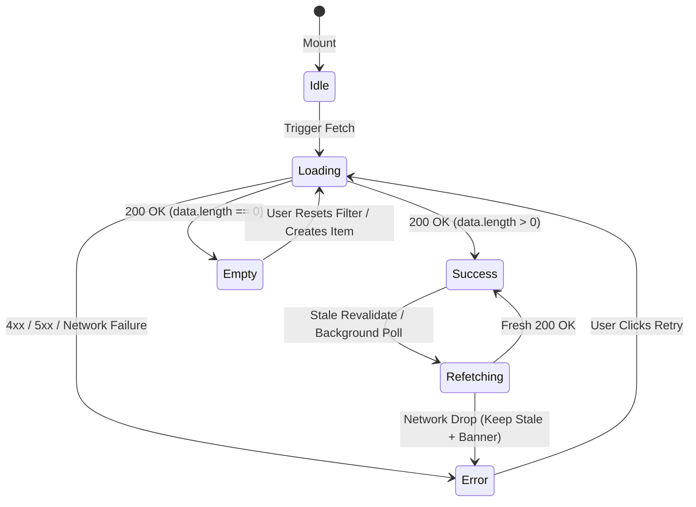

> **Portable execution:** The active task manifest selects this skill and
> records its artifact. GrapeRoot is used when the task requires it and the
> capability exists; otherwise mark graph-specific evidence `UNKNOWN` and use
> the repository's normal discovery path.

# Escher: Master Data Seam Architect & Backend Contract Inspector

> **STAGE GATE:** Stage 2-UI of The Extended Muses Studio.  
> **PRIME DIRECTIVE:** Zero UI code may consume or render fabricated mock data without an explicit, recorded gap in `design-system/backend-requirements.md`. Escher inspects the real backend source of truth, mirrors API constraints in the UI, governs the 6-state async lifecycle, and builds optimistic mutations with automatic rollback.

---

## 1. Core Philosophy: The Zero-Tolerance Seam

M.C. Escher's lithographs are renowned for their impossible precision — tessellations where every interlocking tile's edge is simultaneously the boundary of its neighbor, leaving zero gaps, zero overlaps, and zero approximations.

In software engineering, the boundary between the **frontend UI** and the **backend API** is where the majority of system failures, silent regressions, and AI hallucinations occur. Left unconstrained, an AI coding assistant asked to "build a dashboard" will hallucinate plausible-looking mock objects (`user.avatar_url`, `project.health_score`, `invoice.due_date`), wire them into JSX, and ship. The seam remains invisibly broken until a real user triggers a real request and the client crashes with `TypeError: Cannot read properties of undefined`.

### The Extended Muses Division of Labor


- **Picasso** determines **how the brand looks** (tokens, typography, colors, archetypes).
- **Escher** (this skill) determines **what data actually exists** and **how network state behaves**.
- **Vermeer** takes Escher's typed data models and Picasso's tokens to craft the **tactile, animated, accessible interface**.

---

## 2. The 30 HCI & Modern Frontend Dimensions: Escher's Domain

Escher directly implements and enforces the foundational data, state, and cognitive feedback dimensions from the 30-dimension master engineering framework:

| Dimension | Category | Core Mandate |
|---|---|---|
| **#5 Doherty Threshold** | HCI / Perception | $<100\text{ms}$ immediate visual acknowledgment; $<400\text{ms}$ complete async response loop. |
| **#13 Zero-Silent-Mock Law** | Data Integrity | Absolute ban on hallucinated fields. Missing data must be logged in `backend-requirements.md`. |
| **#14 AST Schema Introspection** | Data Architecture | Inspect real OpenAPI/Pydantic/Zod schemas using GrapeRoot before writing UI. |
| **#15 6-State Async Matrix** | UX State Machine | UI must handle: `idle`, `loading`, `success`, `empty`, `error`, and `refetching`. |
| **#16 Optimistic Mutations** | Performance / UX | Immediate client state mutation with memory snapshot and auto-rollback on error. |
| **#17 Contract-Mirroring Forms** | Error Prevention | Mirror backend validators (regex, min/max, enums) client-side before submission. |
| **#18 Idempotency & Deduplication**| Network Safety | Auto-inject `X-Idempotency-Key` for mutations; debounce queries with `AbortController`. |
| **#19 Server/Client Isolation** | Performance | Separate static Server Components from interactive Client Islands. |
| **#20 Normalized Client Caching** | Architecture | Cache-first query fetching with SWR / TanStack Query; automatic invalidation. |
| **#23 Offline Resilience** | Reliability | Local draft persistence; auto-retry queues on network restoration. |

---

## 3. Step 1: Backend Contract Discovery via GrapeRoot AST

Before generating a single line of component data-fetching code, Escher locates and inspects the real source of truth across the codebase.

### Discovery Priority Order
1. **OpenAPI / Swagger Specs:** `openapi.json`, `swagger.yaml`, or generated API client definitions.
2. **Backend Route Controllers & DTOs:**
   - Python / FastAPI: Pydantic models (`BaseModel`), route response models (`response_model=...`).
   - Node / Express / Nest: Zod schemas, TypeScript interfaces, DTO classes.
   - Go: Struct tags (`json:"..."`).
   - Rust: Serde structs (`#[derive(Serialize, Deserialize)]`).
3. **Database Schemas & Migrations:** Prisma (`schema.prisma`), Drizzle, SQLAlchemy, Alembic, or raw SQL migrations.
4. **Existing Frontend API Clients:** TanStack Query hooks, Axios/Fetch wrappers already calling real endpoints.

### GrapeRoot Dual-Graph Discovery Protocol
Escher MUST NOT guess paths or use blind CLI tools. It executes:
```python
# 1. Search for endpoint routes and response schemas
graph_retrieve(query="API route response models schemas DTO")

# 2. Inspect the exact symbol definition
graph_read(target="backend/api/routes/search.py::SearchResponse")

# 3. Trace callers and data dependencies
graph_neighbors(target="backend/api/routes/search.py::SearchResponse", direction="both")
```

If no backend contract can be located (e.g., the backend is a distinct remote microservice not in the current repo), Escher **HALTS** and asks the user for the endpoint payload sample rather than inventing fields.

---

## 4. Step 2: The Zero-Silent-Mock Law & Gap Governance

When building a UI feature, if the interface requires a field, computed value, filter, or action that the backend does not currently supply:

### The 4 Non-Negotiable Rules:
1. **NEVER SILENTLY FABRICATE IT:** Never write `{ user.department || "Engineering" }` or `{ item.rating || 4.8 }` without an explicit contract.
2. **HALT & ALERT THE USER:** State clearly:
   > *"The UI mock requires `project.riskScore`, but the backend `ProjectResponse` model only provides `id`, `name`, `status`, and `updated_at`. I have logged this requirement in `design-system/backend-requirements.md`."*
3. **LOG THE GAP TO `design-system/backend-requirements.md`:** Create the file if missing, using the canonical gap schema below.
4. **ISOLATE TEMPORARY STUBS:** If the user approves proceeding with a placeholder, isolate it behind an explicit helper tagged with the requirement ID:
   ```typescript
   // STUB: Wired to temporary mock pending backend implementation
   // REFERENCE: design-system/backend-requirements.md -> REQ-004
   export function getTemporaryRiskScore(projectId: string): number {
     return 75; // TODO: Replace once REQ-004 is resolved in backend/routes/projects.py
   }
   ```

### Canonical `design-system/backend-requirements.md` Specification
```markdown
# Backend API Gap Register
Managed by: Escher (Stage 2-UI)

## [OPEN] REQ-001: Document Word Count & Reading Time
- **Component:** `src/components/DocumentCard.tsx`
- **Missing Fields:** `word_count: number`, `reading_time_minutes: number`
- **Current Backend Source:** `backend/api/schemas/document.py::DocumentResponse`
- **Proposed Endpoint Change:** Add fields to `DocumentResponse` calculated during ingestion.
- **Frontend Impact:** Document card currently displays flagged mock badge.
- **Created Date:** 2026-09-11
- **Status:** OPEN

---

## [RESOLVED] REQ-002: Project Archival Soft-Delete Endpoint
- **Component:** `src/components/ProjectActionsMenu.tsx`
- **Resolved By:** Added `DELETE /api/projects/{id}` soft-delete route in commit `abc1234`.
- **Status:** RESOLVED
```

---

## 5. Step 3: The 6-State Async Lifecycle Matrix

Escher enforces that every component interacting with asynchronous data explicitly accounts for all 6 network states. Collapsing these into a binary `loading ? <Spinner /> : <Data />` is an absolute violation of HCI standards.



### State-by-State Implementation Requirements

| State | Trigger | Required UX Pattern | HCI Grounding |
|---|---|---|---|
| **1. `idle`** | Component mounted, awaiting user input or trigger. | Neutral placeholder, clear instructional prompt. | Reduces cognitive noise. |
| **2. `loading`** | Network request in flight ($>100\text{ms}$). | **Content-shaped pulsing skeleton** matching exact typography line-heights and card geometry. Generic centered spinners are banned. | Prevents Cumulative Layout Shift ($\text{CLS}=0$); sets spatial expectation. |
| **3. `success`** | Request returned $200\text{ OK}$ with valid records. | Full interactive data rendering adhering to Picasso tokens. | Immediate task completion. |
| **4. `empty`** | Request returned $200\text{ OK}$ with $0$ records. | Contextual illustration/icon, friendly explanation, and an actionable primary CTA (e.g., *"Clear filters"* or *"Create first document"*). | Heuristic #10 (Help & documentation); prevents "dead ends". |
| **5. `error`** | Request returned $4xx/5xx$ or timed out. | Human-readable explanation (translating technical errors via `voice.error_style`), accompanied by a single-click **Retry** button. Raw stack traces or HTTP status codes are banned. | Heuristic #9 (Help users recognize and recover from errors). |
| **6. `refetching`** | Background sync / revalidation while stale data is visible. | Keep existing data visible; show subtle non-blocking status indicator (e.g., subtle top-right pulse dot). Never unmount the UI to show a full-page loader. | Doherty Threshold; prevents screen flashing. |

---

## 6. Step 4: Optimistic Mutations with Automatic Rollback

For interactive actions (toggling favorites, archiving items, inline editing, drag-and-drop ordering), waiting for server confirmation creates unacceptable UI lag ($>500\text{ms}$), violating the Doherty Threshold.

Escher enforces **Optimistic UI Updates with Inverted Rollback Protection**:

### The 4-Step Optimistic Transaction Protocol
1. **Snapshot Current State:** Capture an immutable copy of the current cache/store before applying the change.
2. **Immediate Optimistic Render:** Mutate the client cache immediately ($<50\text{ms}$). The user sees instant gratification.
3. **Execute Network Mutation:** Send the request to the server, passing an `X-Idempotency-Key` UUID.
4. **Confirm or Rollback:**
   - **On Success ($200\text{ OK}$):** Silently commit the mutation and sync any server-computed fields.
   - **On Failure ($4xx/5xx$):** Immediately revert client state to the snapshot, trigger a high-visibility toast alert (`"Could not update status. Restored."`), and provide a retry button.

### Standardized Optimistic Implementation Blueprint (TanStack Query / SWR Pattern)
```typescript
import { useMutation, useQueryClient } from '@tanstack/react-query';
import { toast } from '@/components/ui/toast';

interface ToggleStarContext {
  previousProjects?: Project[];
}

export function useOptimisticToggleStar() {
  const queryClient = useQueryClient();

  return useMutation<Project, Error, { projectId: string; isStarred: boolean }, ToggleStarContext>({
    mutationFn: async ({ projectId, isStarred }) => {
      const res = await fetch(`/api/projects/${projectId}/star`, {
        method: 'POST',
        headers: {
          'Content-Type': 'application/json',
          'X-Idempotency-Key': crypto.randomUUID(),
        },
        body: JSON.stringify({ starred: isStarred }),
      });
      if (!res.ok) throw new Error('Failed to update star status');
      return res.json();
    },

    // Step 1 & 2: Snapshot and Immediate Optimistic Render
    onMutate: async ({ projectId, isStarred }) => {
      await queryClient.cancelQueries({ queryKey: ['projects'] });
      const previousProjects = queryClient.getQueryData<Project[]>(['projects']);

      queryClient.setQueryData<Project[]>(['projects'], (old) =>
        old?.map((p) => (p.id === projectId ? { ...p, is_starred: isStarred } : p))
      );

      return { previousProjects };
    },

    // Step 4a: Rollback on Error
    onError: (err, variables, context) => {
      if (context?.previousProjects) {
        queryClient.setQueryData(['projects'], context.previousProjects);
      }
      toast.error('Action failed. Changes reverted.', { action: { label: 'Retry', onClick: () => {} } });
    },

    // Step 4b: Re-sync on Settle
    onSettled: () => {
      queryClient.invalidateQueries({ queryKey: ['projects'] });
    },
  });
}
```

---

## 7. Step 5: Client-Side Contract Mirroring & Pre-Flight Error Prevention

In accordance with **HCI Heuristic #5 (Error Prevention)**, users must be guided away from invalid inputs *before* spending network round-trips.

Escher requires client-side forms and mutations to strictly mirror backend validation rules:
- **String Boundaries:** If backend defines `min_length=3, max_length=50`, input fields MUST enforce `minlength={3}` and `maxlength={50}` with live character counters.
- **Pattern Matching:** Email, URLs, and slug patterns must execute identical regex tests client-side on blur.
- **Non-Nullable Fields:** Inputs must have clear visual required indicators (`*`) and disable submit buttons until valid.
- **Search Debounce & Cancellation:** Live search inputs must debounce at $300\text{ms}$ and attach an `AbortController.signal` to cancel superseded pending requests:
  ```typescript
  useEffect(() => {
    const controller = new AbortController();
    const timeoutId = setTimeout(() => {
      fetchSearchResults(query, controller.signal);
    }, 300);

    return () => {
      clearTimeout(timeoutId);
      controller.abort(); // Cancel pending network request
    };
  }, [query]);
  ```

---

## 8. GrapeRoot Memory Recording & Vermeer Handover Protocol

Upon completing the data contract inspection and state machine wiring:

1. **Verify No Silent Mocks Exist:** Run a workspace scan to ensure all missing fields are documented in `design-system/backend-requirements.md`.
2. **Log Data Seam into GrapeRoot Memory:**
   ```python
   graph_add_memory(
     type="architecture",
     content="Completed Escher backend contract wiring for SearchResults. Verified schema against backend/api/routes/search.py::SearchResponse. Logged 1 gap (REQ-001) in design-system/backend-requirements.md.",
     tags=["escher", "muses", "data-contract", "zero-mocks"]
   )
   ```
3. **Hand Over to Vermeer (Stage 3-UI):** Pass the typed schemas, async state machine, and error boundaries to Vermeer for visual construction and token enforcement.
