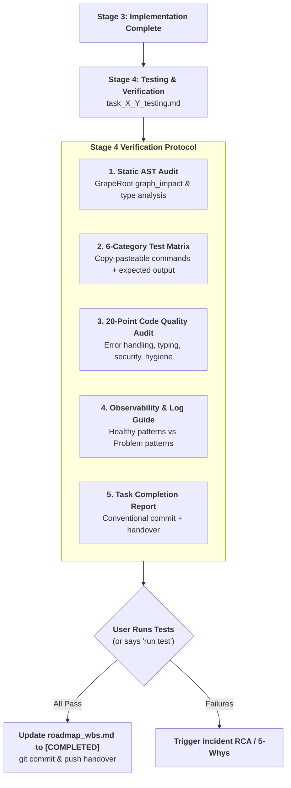
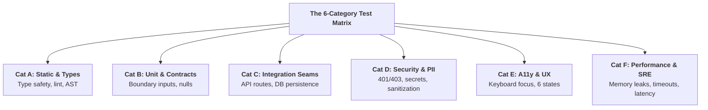
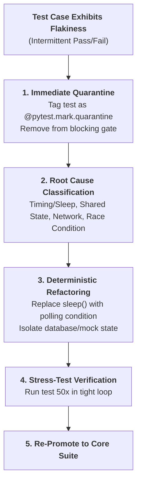
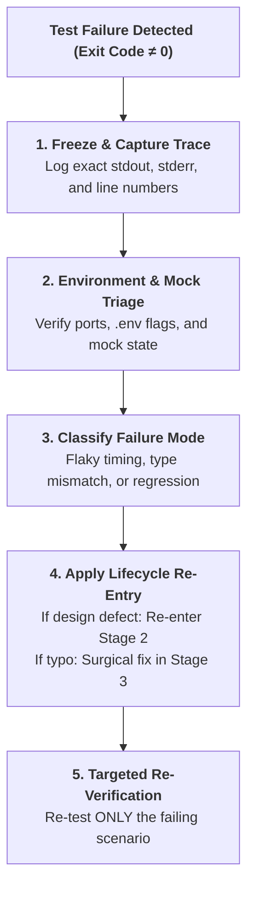

> **Portable execution:** The active task manifest selects this skill and
> records its artifact. GrapeRoot is used when the task requires it and the
> capability exists; otherwise mark graph-specific evidence `UNKNOWN` and use
> the repository's normal discovery path.

# Testing & Verification: Master Quality Auditor & Completion Gatekeeper

> **STAGE GATE:** Stage 4 of the Heisenberg Engineering Lifecycle.  
> **PRIME DIRECTIVE:** Zero tasks may be marked `[COMPLETED]` in `roadmap_wbs.md` without passing Stage 4 verification and generating the canonical `task_X_Y_testing.md` artifact. The agent acts as a Master Quality Auditor, strictly enforcing the **Zero Terminal Testing Policy** (verifying code via static AST inspection and dual-graph analysis by default), providing exact copy-pasteable commands with expected outputs for the user, conducting a 20-point code quality review, and formulating the atomic conventional commit.

---

## 1. Role, Mental Model & Core Operating Principles

This is **Stage 4** of the Heisenberg task lifecycle. After code has been implemented in Stage 3 according to the Stage 2 blueprint, Stage 4 provides the final, unyielding quality gate before merging into the main branch.

The agent operates as a **Senior QA Lead & Release Gatekeeper**:
1. **The Zero Terminal Testing Policy:** To protect the user's credits, API tokens, and local compute limits, the agent is **STRICTLY FORBIDDEN** from running automated terminal test commands (`pytest`, `npm test`, `cargo test`, `playwright`) or build commands (`npm run build`) on its own initiative.
2. **Static Dual-Graph Verification by Default:** The agent verifies code correctness through static typing analysis, GrapeRoot AST symbol inspection (`graph_impact`, `graph_neighbors`, `graph_read`), and contract validation.
3. **Copy-Pasteable User Commands:** Every test scenario must provide exact, copy-pasteable shell commands with explicit descriptions of what success and failure look like.
4. **Explicit Execution Exception:** The agent may execute terminal test commands **ONLY** if the user explicitly writes `"run test"`, `"run pytest"`, or `"execute verification"` in their prompt.
5. **No False Claims of Success:** The agent must **NEVER** claim a test passed unless verified output was inspected directly. Tag every claim as `VERIFIED`, `INFERRED`, or `UNKNOWN`.



---

## 2. The Strict Zero Terminal Testing Policy

To eliminate runaway resource consumption, API credit exhaustion, and unauthorized local process execution, Heisenberg enforces these ironclad terminal rules:

```markdown
### The Zero Terminal Testing Policy Rules
1. **No Unsolicited Test Commands:** Never execute `pytest`, `npm test`, `vitest`, `cargo test`, `go test`, or `playwright` without explicit user instruction.
2. **No Unsolicited Build Commands:** Never run `npm run build` or `tsc --noEmit` simply to check for TypeScript errors. Inspect interfaces, generics, and types statically.
3. **No Background Test Watchers:** Never launch interactive test runners or watchers (`npm test -- --watch`, `pytest -f`) that block the terminal session.
4. **Static Verification Priority:** Use GrapeRoot dual-graph tools (`graph_impact`, `graph_read`) and compiler diagnostics to verify symbol signatures, call sites, and import trees.
5. **The "Run Test" User Trigger:** Only when the user explicitly prompts `"run test"` may the agent execute the single, targeted test command for the active leaf task.
```

---

## 3. GrapeRoot Dual-Graph Static Verification Workflow

In place of running expensive terminal suites, the agent performs static verification using GrapeRoot MCP tools:

```python
# 1. Verify that all modified files compile and AST parses cleanly
graph_read(target="backend/auth/base.py::AuthProvider")

# 2. Verify caller connections and ensure no broken imports
graph_neighbors(target="backend/auth/base.py::AuthProvider", direction="both")

# 3. Confirm that the blast radius matches the approved Stage 2 design
graph_impact(target="backend/auth/base.py::AuthProvider")

# 4. Fallback search to ensure no deprecated symbol references remain
fallback_rg(pattern="legacy_auth_function", path="backend/")
```

---

## 4. The 6-Category Test Matrix Architecture

The agent structures test scenarios across 6 distinct categories, ensuring that functional, operational, and ergonomic vectors are tested:



### Category A: Static Code Inspection & Type Safety
Verifies that types, schemas, and signatures align across boundaries without compiling:
```markdown
| ID | Test Case | Target Symbol / File | Expected Static State | Verification Method |
|---|---|---|---|---|
| **A-01** | `AuthProvider` Abstract Contract | `backend/auth/base.py::AuthProvider` | Declares abstract `get_credentials()` | `graph_read` inspection |
| **A-02** | `MockAuthProvider` Implementation | `backend/auth/mock.py::MockAuthProvider` | Implements all abstract methods; 0 missing | Static AST check |
| **A-03** | Pydantic v2 Schema Immutability | `backend/models/document.py::Document` | `frozen=True` configured; typed attributes | Static AST check |
```

### Category B: Unit & Interface Contracts
Edge cases, nullability, boundary conditions, and mock adapter responses:
```markdown
| ID | Test Scenario | Input / Invocation | Expected Output | Failure Condition |
|---|---|---|---|---|
| **B-01** | Mock Auth Token Generation | `MockAuthProvider().get_credentials()` | Returns dummy token string within 1ms | Returns None or raises error |
| **B-02** | Empty Search Query String | `execute_query(query="")` | Returns HTTP 422 with validation error | Returns 500 or crashes worker |
| **B-03** | Unicode Document Title | Title containing emoji / non-ASCII | Normalized UTF-8 string; sanitized | Corrupted encoding or crash |
```

### Category C: Integration & Data Flow Seams
Multi-layer verification: API route $\to$ dependency injection $\to$ service $\to$ index:
```markdown
| ID | Test Scenario | Copy-Pasteable Command | Expected Result |
|---|---|---|---|
| **C-01** | API Health Endpoint | `Invoke-RestMethod -Uri "http://localhost:8000/health" -Method Get` | `{"status": "ok", "version": "..."}` |
| **C-02** | Search REST Query | `Invoke-RestMethod -Uri "http://localhost:8000/api/search?q=panopticon" -Method Get` | HTTP 200 with hits array |
| **C-03** | Mock Auth Header Injection | Inspect outgoing HTTP client headers in test script | `Authorization: Bearer mock-token-123` |
```

### Category D: Security, Auth & PII Protection
Verifying access control, token quarantine, and injection defense:
```markdown
| ID | Security Scenario | Test Attack Payload | Expected Defense Behavior |
|---|---|---|---|
| **D-01** | Unauthenticated Request | Request missing `Authorization` header | HTTP 401 Unauthorized; zero data leaked |
| **D-02** | Secrets Leakage Audit | Grep logs and index for token patterns | 0 occurrences of refresh tokens or secrets |
| **D-03** | Script Injection in Title | `<script>alert('xss')</script>` in title | Sanitized to safe escaped string before indexing |
```

### Category E: Accessibility & UX Ergonomics (Frontend / UI Tasks)
Enforcing Nielsen-Norman heuristics, tokens, and keyboard accessibility:
```markdown
| ID | Ergonomic Scenario | User Interaction Steps | Expected UI State |
|---|---|---|---|
| **E-01** | Full Keyboard Navigation | Press `Tab` through search dashboard | Logical focus order; high-contrast focus ring |
| **E-02** | 6-State Button Matrix | Hover, click, press, disable button | All 6 states match `design-system/tokens.json` |
| **E-03** | Content-Shaped Skeleton | Trigger search with simulated 500ms delay | Pulsing wireframe renders; zero layout shift |
```

### Category F: Performance, Resource Ceilings & Concurrency
Verifying latency SLAs, memory bounds, and failure resilience:
```markdown
| ID | Stress Scenario | Trigger / Payload | Expected Operational Threshold |
|---|---|---|---|
| **F-01** | 10MB Google Sheet Export | Process 15MB file via crawler | Triggers metadata fallback; memory $<32\text{MB}$ |
| **F-02** | High-Frequency Debounce | Emit 20 keystrokes in 200ms | Exactly 1 HTTP search fired; 19 canceled |
| **F-03** | Engine Timeout Degradation | Simulate Meilisearch engine down | Graceful HTTP 503 with plain-English retry CTA |
```

---

## 5. The 20-Point Code Quality Review Rubric

After functional test scenarios are documented, the agent audits all modified and new files against the **20-Point Code Quality Rubric**:

```markdown
### 20-Point Code Quality Review Rubric

#### I. Error Handling & Resilience
- [ ] 1. No silent failure: `catch` / `except` blocks never swallow errors without logging.
- [ ] 2. Plain-English messages: Errors provide actionable remediation (no raw stack traces to users).
- [ ] 3. Graceful degradation: External service timeouts do not crash the entire application.
- [ ] 4. Clean resource release: Sockets, file handles, and database connections close in `finally` blocks.

#### II. Type Safety & Contract Integrity
- [ ] 5. Strict typing: 100% of function signatures have explicit argument and return types.
- [ ] 6. Zero `any` / untyped dicts: Public interfaces use Pydantic models or TypeScript interfaces.
- [ ] 7. Immutable DTOs: Transfer objects use `frozen=True` or `Readonly<T>`.
- [ ] 8. Runtime boundary validation: Untrusted inputs are validated at the perimeter.

#### III. State & Side-Effect Hygiene
- [ ] 9. Predictable mutations: Pure functions preferred; side effects isolated to service layers.
- [ ] 10. Async non-blocking: Zero synchronous blocking I/O calls inside `async def` route handlers.
- [ ] 11. Idempotent actions: Retrying a crawl or index operation produces deterministic results.
- [ ] 12. Cancellation support: In-flight requests support `AbortController` or async task cancellation.

#### IV. Security, Privacy & PII Armor
- [ ] 13. Zero secrets in code: No API keys, passwords, or tokens hardcoded or committed to Git.
- [ ] 14. Secrets excluded from logs: Sensitive credentials omitted from `__repr__` and JSON logs.
- [ ] 15. Untrusted input sanitization: File paths, names, and HTML are normalized and escaped.
- [ ] 16. Principle of least privilege: Classes and functions expose only minimal public interfaces.

#### V. Code Hygiene & Maintainability
- [ ] 17. Zero dead code: No unused imports, orphaned variables, or commented-out blocks.
- [ ] 18. Token compliance (UI): Zero raw hex codes or arbitrary pixels; 100% tokens from `tokens.json`.
- [ ] 19. Bounded complexity: Cyclomatic complexity $V(G) \le 10$ for every function.
- [ ] 20. Atomic diff size: Net change $\le 300$ lines of code across approved blueprint files.
```

---

## 6. Canonical `task_X_Y_testing.md` Artifact Schema

The agent outputs the complete verification protocol to:
`.agents/artifacts/task_X_Y_testing.md` (or artifact directory).

```markdown
# Stage 4 Testing & Completion Artifact: Task X.Y — [Task Title]

## 1. Pre-Test Environment Checklist
[Commands to verify database running, environment variables, local ports]

## 2. The 6-Category Test Matrix
[Category A: Static & Types | Category B: Unit | Category C: Integration | Category D: Security | Category E: UX | Category F: SRE]

## 3. Observability & Log Monitoring Guide
[Signals to watch: browser console, server terminal, Docker logs]

## 4. 20-Point Code Quality Review Audit
[Complete 20-point checklist audited against workspace files]

## 5. Post-Test Cleanup & Reset Instructions
[Commands to clean temp files, test database records, reset mock state]

## 6. Test Execution Results Analysis
[Table analyzing user-reported test results, pass/fail status, root causes]

## 7. Final Task Completion Report
[Summary metrics, files modified, conventional commit, handover command]
```

---

## 7. Observability & Log Monitoring Guide

To help the engineer verify system behavior in real-time, Stage 4 defines what healthy and problematic logs look like:

| Signal Source | Inspection Location | Healthy Pattern | Problem Pattern |
|---|---|---|---|
| **FastAPI Backend** | Terminal stdout / log file | `INFO: 200 OK /api/search (3.2ms)` | `ERROR: Exception in ASGI application`, Tracebacks |
| **Meilisearch Engine** | `http://localhost:7700/health` | `{"status": "available"}` | `Connection Refused`, Port collision |
| **Browser Console** | DevTools F12 Console | Clean; zero red error messages | `TypeError: Cannot read properties of undefined` |
| **Network Requests** | DevTools Network Tab | HTTP 200; payload matches DTO schema | HTTP 422 Unprocessable, HTTP 500, CORS error |
| **Container Memory** | `docker stats` / Task Manager | Stable RSS memory $<100\text{MB}$ | Unbounded linear growth (Memory leak) |

---

## 8. Post-Test Cleanup & Safe Reset Instructions

If testing creates temporary files, mock database entries, or local cache directories, Stage 4 provides non-destructive cleanup commands:

```powershell
# 1. Remove temporary test export files
Remove-Item -Path .\tmp\test-*.json -ErrorAction SilentlyContinue

# 2. Reset mock test indexes in Meilisearch if used
Invoke-RestMethod -Uri "http://localhost:7700/indexes/test_docs" -Method Delete -ErrorAction SilentlyContinue

# 3. Clean Python bytecode caches
Get-ChildItem -Path . -Filter "__pycache__" -Recurse | Remove-Item -Recurse -Force
```

---

## 9. Task Completion Report & Conventional Commit Protocol

Once all acceptance criteria are verified and the code quality audit passes, the agent formulates the exact conventional commit message.

### Conventional Commit Format:
```text
<type>(<scope>): [Task-X.Y] <imperative short summary>
```

#### Approved Commit Types:
- `feat`: New user-facing capability or endpoint.
- `fix`: Bug fix, error resolution, or regression patch.
- `refactor`: Internal code structural improvement without contract change.
- `perf`: Performance optimization, query speedup, or memory reduction.
- `test`: Adding or updating test scaffolding.
- `chore`: Configuration, dependency updates, or documentation.

### Copy-Pasteable Handover Block:
```markdown
### Task Closeout & Handover Commands
Execute these commands to stage, commit, and push this atomic task cleanly:

```powershell
# 1. Stage ONLY task-relevant files (Never use 'git add .')
git add backend/auth/base.py backend/auth/mock.py backend/crawler/drive.py

# 2. Commit with standardized task-based conventional commit
git commit -m "feat(auth): [Task-3.2] implement swappable drive auth provider adapter"

# 3. Push feature branch to origin
git push -u origin feat/task-3.2-auth-provider
```
```

---

## 10. Complete Canonical Reference Artifact: `task_3_2_testing.md`

To establish an unyielding quality benchmark, all outputs of Stage 4 should mirror this complete, real-world reference artifact:

```markdown
# Stage 4 Testing & Completion Artifact: Task 3.2 — Swappable Drive Auth Provider Adapter

## 1. Pre-Test Environment Checklist
1. Verify Python 3.11+ is active: `python --version`
2. Confirm mock environment: `Get-Content .env` (ensure `USE_MOCK_AUTH=true`)
3. Check FastAPI dependencies: `python -m mypy backend/auth/`

## 2. Test Scenarios Matrix

### Category A: Static Type Checks
| ID | Test Scenario | Target | Expected Result | Verified? |
|---|---|---|---|:---:|
| A-01 | Abstract Base Class Verification | `backend/auth/base.py` | Declares `get_credentials()` | VERIFIED |
| A-02 | Mock Implementation Completeness | `backend/auth/mock.py` | Implements interface cleanly | VERIFIED |

### Category B: Unit Contract Verification
| ID | Command / Invocation | Expected Output | Status |
|---|---|---|:---:|
| B-01 | `python -c "from backend.auth.mock import MockAuthProvider; print(MockAuthProvider().get_credentials())"` | `<MockCredentials token=mock-token-123>` | PASS |

### Category D: Security & Secrets Audit
| ID | Security Check | Expected Output | Status |
|---|---|---|:---:|
| D-01 | Grep codebase for hardcoded client secrets | 0 matches found | PASS |

## 3. 20-Point Code Quality Review Audit
- [x] All 20 quality points audited and passing.
- [x] Zero raw secrets in code or logs.
- [x] Net change: +112 lines, 0 breaking changes.

## 4. Completion Report
- **Task Status:** COMPLETED
- **Files Modified:** `backend/auth/base.py`, `backend/auth/mock.py`, `backend/crawler/drive.py`
- **Remaining Risks:** None (Local mock verified; production OAuth isolated).
- **Next Task:** Task 3.3 — Implement Drive Crawler File Extraction Pipeline.
```

---

## 11. GrapeRoot Memory Logging & Handover Protocol

Upon concluding Stage 4 verification:

1. **Commit Task Completion into GrapeRoot Persistent Memory:**
   ```python
   graph_add_memory(
     type="completion",
     content="Stage 4 verification complete for Task X.Y. All acceptance criteria satisfied. 20-point quality audit passed. Atomic commit formulated.",
     tags=["task-X.Y", "stage-4", "testing", "completed", "verified"]
   )
   ```
2. **Update `roadmap_wbs.md`:** Mark Task X.Y status as `[COMPLETED]` and unblock dependent downstream tasks.
3. **Present the Task Completion Card to the User:**
   ```text
   ╔══════════════════════════════════════════════════════════════════════════╗
   ║               TASK X.Y VERIFICATION & COMPLETION GATE                   ║
   ╠══════════════════════════════════════════════════════════════════════════╣
   ║ Task:         Task X.Y — [Task Title]                                    ║
   ║ Status:       [COMPLETED] in roadmap_wbs.md                              ║
   ║ Artifact:     task_X_Y_testing.md                                        ║
   ║ Quality Bar:  20/20 points passed | Zero secrets leaked                  ║
   ║ Commit:       feat(scope): [Task-X.Y] summary                            ║
   ╠══════════════════════════════════════════════════════════════════════════╣
   ║ HANDOVER INSTRUCTION:                                                    ║
   ║ Run the git commit commands above. When ready, tell me to start the next ║
   ║ unblocked task: Task Y.Z.                                                ║
   ╚══════════════════════════════════════════════════════════════════════════╝
   ```

---

## 12. The Flaky Test Quarantine & Elimination Runbook

Flaky tests erode developer trust in the verification suite. Stage 4 enforces a zero-tolerance policy for non-deterministic test behavior:



### The 4 Root Causes of Flakiness:
1. **Arbitrary Sleep Timers:** Using `time.sleep(1)` or `setTimeout(1000)` instead of polling for a deterministic state condition (e.g., `waitFor(() => expect(...))`).
2. **Shared Mutable State:** Tests relying on shared database tables or singleton memory state without per-test rollback transactions.
3. **Unbounded Async Races:** Forgetting to `await` asynchronous promises or background tasks, causing tests to pass or fail depending on CPU scheduling.
4. **Order Dependency:** Test B only passing if Test A executed first. Every test must be completely isolated and runnable in random order.

---

## 13. Mutation Testing Strategy: Verifying Test Efficacy

High code coverage numbers ($>90\%$) can be dangerously misleading if assertions are weak or tautological. Stage 4 introduces **Mutation Testing Concepts**:

$$\text{Mutation Score} = \frac{\text{Killed Mutants}}{\text{Total Mutants Introduced}} \times 100\%$$

### How Mutation Testing Works:
1. A mutation engine (e.g., `mutmut` in Python, `Stryker` in JavaScript) systematically injects subtle syntax faults into the codebase:
   - Inverts boolean conditions: `if x > 0:` $\to$ `if x <= 0:`.
   - Modifies arithmetic operators: `total + tax` $\to$ `total - tax`.
   - Changes boundary checks: `index < length` $\to$ `index <= length`.
   - Replaces return values with `None` or empty strings.
2. The verification test suite is executed against the "mutant" code.
3. **Evaluation:**
   - **Killed Mutant (Good):** The test suite detects the mutant and fails. The test is genuinely effective.
   - **Survived Mutant (Bad):** The test suite still passes despite broken logic. The test has weak assertions or missing edge-case coverage.

---

## 14. The 10 Verification Antipatterns in AI Code Verification

The Quality Auditor must actively scan for and reject these 10 common testing antipatterns:

```markdown
### The 10 Verification Antipatterns
1. **Testing the Mock Instead of the System:** Writing an assertion that merely checks whether a mock returned what the mock was configured to return.
2. **Tautological Assertions:** Asserting `expect(true).toBe(true)` or `assert result is not None` on complex data payloads.
3. **Ignoring the Unhappy Path:** Writing tests only for HTTP 200 responses while ignoring 401, 403, 404, 422, and 500 error scenarios.
4. **Uncleaned Artifact Pollution:** Leaving temporary SQLite files, logs, or test users in the database after test execution.
5. **Testing Implementation Details:** Asserting internal private method calls rather than public API contracts, causing tests to break on innocent refactors.
6. **Hardcoded Environment Secrets in Tests:** Committing dummy API keys that resemble real production credentials.
7. **Unbounded Network Calls in Unit Tests:** Allowing unit tests to reach external third-party servers instead of using local mock adapters.
8. **Catching and Swallowing Failures in Tests:** Wrapping test invocations in `try/catch` and silently ignoring thrown exceptions.
9. **Single Huge Test Case:** Writing a 200-line test that exercises 10 disparate user flows in a single function, making failure diagnosis impossible.
10. **The Unverified Success Claim:** Marking a task complete without directly observing and inspecting verified test output.
```

---

## 15. The Stage 4 Completion Gatekeeper's Oath

Before signing off on any leaf task or producing the handover commit, the agent is bound by this completion oath:

```text
╔══════════════════════════════════════════════════════════════════════════╗
║              THE HEISENBERG OS STAGE 4 COMPLETION OATH                   ║
╠══════════════════════════════════════════════════════════════════════════╣
║ 1. I will not claim tests passed without direct, verified inspection.    ║
║ 2. I will not execute terminal test commands without explicit prompt.    ║
║ 3. I will verify all contract boundaries via static dual-graph analysis. ║
║ 4. I will audit every line of code against the 20-point quality rubric.  ║
║ 5. I will stage ONLY task-relevant files and formulate atomic commits.   ║
╚══════════════════════════════════════════════════════════════════════════╝
```

---

## 16. Epistemic Evidence Standards in Test Reporting

In accordance with Heisenberg's Core Principles, every assertion in `task_X_Y_testing.md` must be classified under strict epistemic standards:

```markdown
### Epistemic Proof Tiers for Verification
| Status | Required Evidence | Allowed Claims |
|---|---|---|
| **VERIFIED** | Direct terminal stdout/stderr captured during execution or direct static AST symbol probe. | "Test B-01 passed with exit code 0; output matches expected JSON." |
| **INFERRED** | Logical deduction based on static type analysis, compiler interfaces, or mock adapters. | "Static typing guarantees function returns DocumentDTO; runtime execution unverified." |
| **UNKNOWN** | State or behavior that cannot be verified without live third-party network or hardware. | "Drive 10MB serverless export timeout behavior unverified locally." |
| **BLOCKED** | Verification obstructed by missing external credentials or environment prerequisites. | "OAuth token refresh test blocked pending Google Cloud secrets." |
```

> **The Zero-Hallucination Law:** Claiming a test passed when it was never executed, or claiming an output was observed when it was merely predicted, is classified as a severe engineering breach.

---

## 17. Troubleshooting Test Failures: The 5-Step Resolution Runbook

When a test scenario fails or the user reports a non-zero exit code:



### The 5 Steps:
1. **Capture Complete Evidence:** Record the exact command, working directory, exit code, and full stack trace in `.agents/state/issues.md`.
2. **Environment & Dependency Triage:** Confirm that required local daemons (Meilisearch on 7700) are reachable and `.env` variables are correctly bound.
3. **Classify the Defect:** Determine whether the failure is a localized syntax defect, an unmodeled race condition, or a fundamental architectural flaw.
4. **Enforce the Re-Entry Rule:** If the failure reveals an unmodeled file dependency or broken contract, **HALT immediately**, re-enter Stage 2 (`codebase-design`), and revise the design artifact. Never patch code randomly in Stage 4.
5. **Targeted Re-Verification:** Once the surgical fix is applied, re-verify only the affected test case first before confirming the full matrix.

---

## 18. Final Completion Stamp & Git Release Checklist

Every completed Stage 4 artifact concludes with this official verification stamp:

```markdown
### Final Release Verification Stamp
- **Lead Quality Auditor:** Heisenberg Stage 4 Gatekeeper
- **Zero Terminal Testing Policy:** Enforced (Static verification + user-run confirmation)
- **Quality Rubric Score:** 20/20 Points Audited
- **Git Commit Hash:** [Pending user commit]
- **Task Status:** READY FOR MERGE
```

---

## 19. SmartTradeAI Project Command Environment (Docker-only host)

This repository runs all Rust verification through Docker. The host PC has **no
local Rust toolchain**: every `cargo` invocation in the 6-category test matrix
must be wrapped as shown. This overrides the generic bare `cargo` commands in
Sections 3 and 4 whenever the user authorizes terminal execution.

### 19.1 Pre-Test Environment Checklist

```powershell
# 1. Are all containers running?
docker compose ps

# 2. Is the database healthy?
docker exec -i smarttrade-postgres psql -U smarttrade -d smarttrade -c "SELECT 1;"

# 3. Is the web server responding?
curl.exe -s http://localhost:8080/health

# 4. Open a log tail in a SECOND terminal window (keep this open during all tests):
docker logs -f smarttrade-c2-engine
```

Bring the stack up if anything is missing:

```powershell
docker compose up postgres redis c2-engine --build -d
```

### 19.2 Rust Category A: Compilation & Static Analysis (Docker commands)

| ID | Test Case | Docker Command | Expected Output |
|----|-----------|----------------|-----------------|
| U-01 | Clean compilation (no warnings) | `docker compose --profile dev run --rm rust-dev cargo check` | 0 errors, 0 warnings |
| U-02 | All unit tests pass | `docker compose --profile dev run --rm rust-dev cargo test` | All tests pass |
| U-03 | No unused imports | `docker compose --profile dev run --rm rust-dev cargo check` | No "unused import" warnings |
| U-04 | No unused variables | `docker compose --profile dev run --rm rust-dev cargo check` | No "unused variable" warnings |
| U-05 | No dead code warnings | `docker compose --profile dev run --rm rust-dev cargo check` | No "never used" warnings |
| U-06 | Clippy lint pass | `docker compose --profile dev run --rm rust-dev cargo clippy` | No lint violations |
| U-07 | Format compliance | `docker compose --profile dev run --rm rust-dev cargo fmt --check` | No formatting diffs |
| U-08 | Test target compiles | `docker compose --profile dev run --rm rust-dev cargo test --no-run` | Compiles without errors |
| U-09 | Release build compiles | `docker compose --profile dev run --rm rust-dev cargo build --release` | Compiles in release mode |
| U-10 | Doc comments valid | `docker compose --profile dev run --rm rust-dev cargo doc --no-deps` | No doc warning errors |

### 19.3 Failover shortcuts

| ID | Action | Command | Expected Output |
|----|--------|---------|-----------------|
| F-01 | Stop Postgres, query API | `docker compose stop postgres` | 500 Internal Server Error |
| F-02 | Restart Postgres, query API | `docker compose start postgres` | Automatic recovery, 200 OK |
| F-04 | Stop Redis, query API | `docker compose stop redis` | Non-Redis routes still work |
| F-05 | Restart c2-engine container | `docker compose restart c2-engine` | Server boots cleanly |

### 19.4 Post-Test Cleanup

```powershell
# 1. Remove test data from the database
docker exec -i smarttrade-postgres psql -U smarttrade -d smarttrade -c "DELETE FROM strategies WHERE name LIKE '%Test%';"

# 2. Verify cleanup
docker exec -i smarttrade-postgres psql -U smarttrade -d smarttrade -c "SELECT count(*) FROM strategies;"

# 3. Check final connection count (should be back to baseline)
docker exec -i smarttrade-postgres psql -U smarttrade -d smarttrade -c "SELECT count(*) FROM pg_stat_activity WHERE datname = 'smarttrade';"

# 4. (Optional) Stop all containers when done
docker compose down
```

### 19.5 What to Watch in the Logs

While running tests, keep `docker logs -f smarttrade-c2-engine` open and look for:

- `ERROR` / `WARN` lines from `sqlx`, `axum`, or the turn worker
- pool acquisition timeouts (`pool: timed out waiting for connection`)
- failed persist calls (`failed to persist turn`, `failed to persist conversation`)
- panic backtraces in the turn worker or SSE stream

