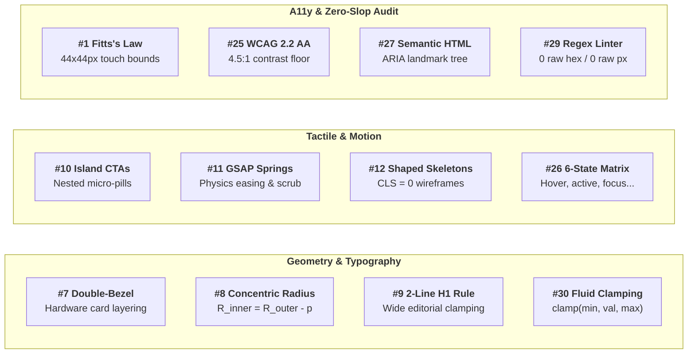
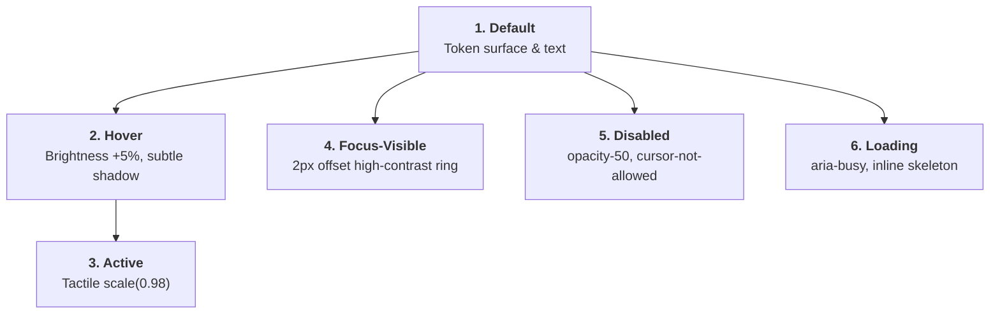

> **Portable execution:** The active task manifest selects this skill and
> records its artifact. GrapeRoot is used when the task requires it and the
> capability exists; otherwise mark graph-specific evidence `UNKNOWN` and use
> the repository's normal discovery path.

# Vermeer: Master UI & Motion Craftsman

> **STAGE GATE:** Stage 3-UI of The Extended Muses Studio.  
> **PRIME DIRECTIVE:** 100% of visual styling, spacing, typography, and motion MUST derive strictly from `design-system/tokens.json`. Zero raw hex codes, zero arbitrary pixel brackets (`p-[13px]`), and zero freehanded styling. Vermeer synthesizes Picasso's visual DNA with Escher's typed data contracts into production-grade, tactile, accessible components.

---

## 1. Core Philosophy: Optical Precision & Anti-Slop

Johannes Vermeer utilized the camera obscura and a strictly disciplined palette of lapis lazuli, lead-tin yellow, and bone black to achieve unmatched optical balance and lighting precision. Nothing was guessed; every shadow and highlight was mathematically true to the geometry of the room.

In frontend engineering, "AI Slop" is characterized by:
- Inconsistent color drift (six different shades of almost-identical slate or indigo).
- Clashing corner radii where inner content bulges awkwardly out of outer cards.
- Centered bouncing loading spinners in giant blank viewports.
- 4-line H1 hero headings that wrap awkwardly on laptops.
- Generic hover states with zero tactile depression or keyboard accessibility.

Vermeer eliminates AI slop permanently by enforcing **rigorous mathematical constraints**, **tactile micro-interactions**, and **100% design token compliance**.

---

## 2. The 30 HCI & Modern Frontend Dimensions: Vermeer's Domain

Vermeer directly implements the visual, structural, and ergonomic dimensions from the 30-dimension master engineering framework:



---

## 3. Step 1: Pre-Flight Token & Contract Ingestion

Before emitting a single line of component JSX, CSS, or TSX:

1. **Verify `design-system/tokens.json`:**
   - If missing, **STOP IMMEDIATELY** and trigger **Picasso** (Stage 1-UI). Do not invent colors or styles.
   - Read typography scale, brand colors, radius scales, and spacing units.
2. **Verify Backend Contract & Async States (Escher):**
   - Confirm TypeScript interfaces or Zod schemas exist.
   - Ensure the component receives the full 6-state async lifecycle (`idle, loading, success, empty, error, refetching`).

---

## 4. Step 2: Advanced Visual Geometry & Layout Standards

Vermeer implements elite visual craftsmanship drawn from modern high-end agencies and developer tool design systems (Linear, Apple, Vercel):

### 4.1 Double-Bezel Hardware Containers (#7)
Cards and interactive containers must not be plain flat borders. They must use the **Double-Bezel Architecture**:
- **Outer Shell:** 1px hairline border (`var(--border-hairline)`), subtle ambient shadow (`var(--shadow-ambient)`), outer corner radius ($R_{\text{outer}}$).
- **Internal Padding:** Strict token spacing (`var(--space-md)` or `var(--space-lg)`).
- **Inner Core:** Recessed background (`var(--surface-card-inner)`), inner corner radius ($R_{\text{inner}}$), and high-contrast content layer.

```css
/* Double-Bezel Hardware Card */
.card-hardware {
  border: 1px solid var(--border-hairline);
  background: var(--surface-card-outer);
  box-shadow: var(--shadow-ambient-card);
  border-radius: var(--radius-outer-bezel); /* e.g., 2rem / 32px */
  padding: var(--space-md);                 /* e.g., 0.75rem / 12px */
}

.card-hardware-inner {
  border: 1px solid var(--border-subtle);
  background: var(--surface-card-inner);
  border-radius: var(--radius-inner-core);  /* e.g., calc(2rem - 0.75rem) = 1.25rem / 20px */
  padding: var(--space-xl);
}
```

### 4.2 Concentric Corner Radius Mathematics (#8)
Inner elements nested inside rounded containers MUST obey the concentric radius formula:
$$R_{\text{inner}} = \max\left(0,\, R_{\text{outer}} - \text{padding}\right)$$

> **CRITICAL RULE:** If an outer card has `rounded-2xl` ($16\text{px}$) and `p-4` ($16\text{px}$), the inner child's corner radius MUST be $0\text{px}$ (sharp), NOT `rounded-xl` or `rounded-lg` which causes visual collision and ugly pill bulging.

### 4.3 The 2-Line H1 Iron Rule (#9)
Hero headings must never look like an essay wrapping over 4 or 5 lines on desktop:
- Max line length clamped to `max-w-4xl` or `max-w-5xl`.
- CSS `text-wrap: balance` applied to distribute words evenly.
- Maximum of **2 lines** on desktop viewports ($\ge 1024\text{px}$).

### 4.4 Island Button-in-Button CTAs (#10)
Primary conversion actions use floating island pills with an embedded micro-accent badge:
```tsx
<button className="group inline-flex items-center gap-3 px-6 py-3 rounded-full bg-brand-primary text-text-primary shadow-brand-glow hover:bg-brand-primary-hover active:scale-[0.98] transition-all">
  <span className="text-sm font-semibold tracking-wide">Launch Panopticon</span>
  <span className="flex items-center justify-center w-6 h-6 rounded-full bg-white/10 group-hover:translate-x-0.5 transition-transform">
    <ArrowRightIcon className="w-3.5 h-3.5" />
  </span>
</button>
```

### 4.5 Content-Shaped Pulsing Skeletons (#12)
- Banned: Centered spinning circles in empty rectangles.
- Required: Exact geometric wireframes mirroring avatar dimensions, heading heights, and badge counts with a subtle $1.5\text{s}$ shimmer pulse (`animate-pulse`).

---

## 5. Step 3: The 10 Nielsen-Norman HCI Heuristics Enforcement

Every UI element built or reviewed by Vermeer is audited against the 10 HCI heuristics:

| Heuristic | Code-Level Implementation Requirement |
|---|---|
| **#1 Visibility of System Status** | Every button/action triggers instant visual feedback ($<100\text{ms}$). Asynchronous operations render content-shaped skeletons or inline micro-spinners; background refetches show non-intrusive status dots. |
| **#2 Match Between System & Real World** | Plain-language terminology. Iconography uses universally established metaphors (magnifying glass = search, trash = delete, gear = settings). |
| **#3 User Control & Freedom** | Destructive actions (deletion, archival, batch mutations) MUST feature an explicit 2-step confirmation modal or a 5-second **Undo Toast** banner. |
| **#4 Consistency & Standards** | Zero ad-hoc styling. All buttons, inputs, dialogs, and tables share identical state colors, radii, and focus rings defined in `tokens.json`. |
| **#5 Error Prevention** | Form submission buttons are disabled until all required fields pass validation. Live validation triggers on `blur` with clear helper text. |
| **#6 Recognition Rather Than Recall** | Search bars display recent query history and active filter tags. Dropdowns provide typeahead search. No hidden gesture-only actions. |
| **#7 Flexibility & Efficiency of Use** | Standard point-and-click defaults for casual users; keyboard navigation accelerators (e.g., `Cmd+K` command palette, `/` to focus search) for power users. |
| **#8 Aesthetic & Minimalist Design** | Progressive disclosure. High signal-to-noise ratio. Secondary metadata is dimmed or placed in expandable accordions. Zero decorative fluff. |
| **#9 Help Users Recognize & Recover from Errors** | Technical stack traces and raw HTTP status codes (e.g., `422`, `500`) are banned. Errors must state **what went wrong** and provide an actionable **Retry** button. |
| **#10 Help & Documentation** | Empty states feature an illustrated empty state, clear guidance on why it is empty, and a primary CTA to create the first entity. |

---

## 6. Step 4: The 6-State Interactive Matrix

Every interactive element (buttons, inputs, selectable cards, dropdown triggers) must implement the complete 6-state matrix. Skipping any state is a defect.



### Complete 6-State Tailwind Blueprint
```tsx
<button
  type="button"
  disabled={isDisabled || isLoading}
  aria-disabled={isDisabled}
  aria-busy={isLoading}
  className={clsx(
    // 1. DEFAULT
    "relative inline-flex items-center justify-center font-medium transition-all duration-150 rounded-lg select-none",
    "bg-[var(--color-brand-primary)] text-[var(--color-text-primary)] px-4 py-2 text-sm",
    
    // 2. HOVER
    "hover:bg-[var(--color-brand-primary-hover)] hover:shadow-md",
    
    // 3. ACTIVE (Tactile Depression)
    "active:scale-[0.98] active:bg-[var(--color-brand-primary-active)]",
    
    // 4. FOCUS-VISIBLE (Keyboard Only - No mouse click rings)
    "focus:outline-none focus-visible:ring-2 focus-visible:ring-[var(--color-brand-focus-ring)] focus-visible:ring-offset-2 focus-visible:ring-offset-[var(--color-surface-canvas)]",
    
    // 5. DISABLED
    "disabled:opacity-50 disabled:cursor-not-allowed disabled:active:scale-100 disabled:hover:bg-[var(--color-brand-primary)]",
    
    // 6. LOADING
    isLoading && "cursor-wait"
  )}
>
  {isLoading ? (
    <span className="inline-flex items-center gap-2">
      <SpinnerIcon className="w-4 h-4 animate-spin text-current" />
      <span>Processing...</span>
    </span>
  ) : (
    children
  )}
</button>
```

---

## 7. Step 5: Motion, Physics & Accessibility Standards

### 7.1 Physics-Based Spring Transitions
CSS transitions should avoid linear easing. Vermeer enforces natural spring cubic-beziers:
- **Fast Micro-interactions:** `transition: all 150ms cubic-bezier(0.16, 1, 0.3, 1)`
- **Dynamic Expansions / Drawers:** `transition: transform 350ms cubic-bezier(0.34, 1.56, 0.64, 1)`

### 7.2 Strict Reduced Motion Compliance
All motion and animation rules MUST respect users with vestibular disorders:
```css
@media (prefers-reduced-motion: reduce) {
  *,
  *::before,
  *::after {
    animation-duration: 0.01ms !important;
    animation-iteration-count: 1 !important;
    transition-duration: 0.01ms !important;
    scroll-behavior: auto !important;
  }
}
```

### 7.3 Fitts's Law Touch Boundaries
- Minimum clickable target area for buttons and icons is **$44 \times 44\text{px}$** on mobile viewports and **$36 \times 36\text{px}$** on desktop.
- For compact $16\text{px}$ icons, expand the click boundary using negative margins or padding (`p-2 -m-2`).

---

## 8. Step 6: Automated Pre-Flight Self-Audit Regex Scanner

Before presenting any UI file to the user or declaring a task complete, Vermeer executes an automated scan for token violations:

### The 3 Zero-Tolerance Regex Scans:
1. **Raw Hex Codes:**  
   `/#([0-9a-fA-F]{3,8})\b/`  
   *Violation:* Using `#1e293b` instead of `var(--surface-subtle)`.
2. **Arbitrary Bracket Pixels:**  
   `/-\[\d+(px|rem|em|vw|vh)\]/`  
   *Violation:* Using `p-[13px]` or `rounded-[11px]` instead of token scales.
3. **Generic Centered Loading Spinners:**  
   `/<div[^>]*class="[^"]*h-screen[^"]*flex[^"]*items-center[^"]*justify-center[^"]*"[^>]*><(?:svg|div)[^>]*animate-spin/`  
   *Violation:* Full-viewport spinner instead of content-shaped skeleton.

If any regex returns a hit, Vermeer MUST refactor the code to use the corresponding design token before concluding.

---

## 9. GrapeRoot Memory Recording & Verification Handover

Upon passing the self-audit:

1. **Record Vermeer Craftsmanship into GrapeRoot Memory:**
   ```python
   graph_add_memory(
     type="architecture",
     content="Completed Vermeer UI component implementation for SearchDashboard. Enforced 100% token compliance, Double-Bezel card geometry, 6-state interactive matrix, and zero-stray-hex audit.",
     tags=["vermeer", "muses", "ui-craft", "tokens", "hci"]
   )
   ```
2. **Route to Stage 4 (Testing & Verification):** Hand off the verified UI components for static type checking and acceptance criteria review.
