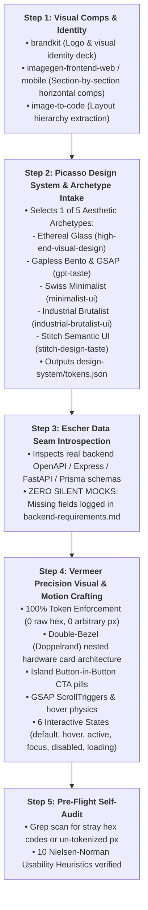

# Rule 02: The Stage-Gated Orbital Engineering Lifecycle

> **STATUS: NON-NEGOTIABLE OPERATIONAL LAW — ZERO UNPLANNED CODE**  
> Spontaneous coding, un-gated file editing, or drifting from active WBS tasks is strictly prohibited. Every code mutation in the Heisenberg OS is treated like an aerospace flight maneuver: calculated, verified, and recorded.

---

## 1. The Core Philosophy: Why Stage Gates Defeat the "Viral Loop" Trap

The internet is full of viral demos showcasing "autonomous agent loops" that run wild. In production, these unconstrained loops cause **catastrophic token death spirals**, infinite debugging loops, and silent codebase rot.

Heisenberg rejects chaotic trial-and-error. Heisenberg implements the **Orbital Stage-Gate Engine**:

```mermaid
flowchart TD
    subgraph "PHASE 0: FLIGHT PLANNING"
        Init["Workspace Boot"] --> PathCheck{"Codebase Status?"}
        PathCheck -- "Empty / New" --> GF["<b>Stage 0A: Greenfield Genesis Mode</b><br/>Interactive Discovery → Scaffold Epics 1-5"]
        PathCheck -- "Existing / Legacy" --> BF["<b>Stage 0B: Brownfield AST Audit Mode</b><br/>graph_scan → Map Topology → Isolate Hotspots"]
        GF --> WBS["Active Leaf Task Locked in roadmap_wbs.md"]
        BF --> WBS
    end

    subgraph "PHASE 1: TOPOLOGY & MENTAL MODEL"
        WBS --> S1["<b>Stage 1: Concept-to-Code Bridge</b><br/>AST mapping via graph_retrieve & graph_neighbors"]
    end

    subgraph "PHASE 2: ARCHITECTURE & BLUEPRINT"
        S1 --> PlutoCheck{"Complex / Competing Patterns?"}
        PlutoCheck -- Yes --> Pluto["<b>Narrsistic Pluto Gate</b><br/>3-5 Researched Solutions, Trade-offs, Rollback Plan"]
        PlutoCheck -- No --> S2["<b>Stage 2: Codebase Design Artifact</b><br/>Exact [NEW], [MODIFY], [DELETE] Manifest + graph_impact"]
        Pluto --> S2
        S2 --> MusesCheck{"Touches Frontend / UI?"}
        MusesCheck -- Yes --> MusesTrack["<b>THE EXTENDED MUSES FRONTEND STUDIO</b><br/>(Picasso Archetypes → Escher Data Seam → Vermeer Craft)"]
        MusesCheck -- No --> S3Check{"Deep CS / Algorithmic Core?"}
        MusesTrack --> S3Check
        S3Check -- Yes --> CS["<b>Stage 3: First-Principles CS Extraction</b><br/>Math models, watermarks, ranking algorithms"]
        S3Check -- No --> GateApproval["<b>HUMAN DESIGN APPROVAL LOCK</b>"]
        CS --> GateApproval
    end

    subgraph "PHASE 3: SURGICAL EXECUTION"
        GateApproval --> IMPL["<b>Implementation Phase</b><br/>Strict execution of approved design"]
        IMPL --> Sync["<b>Immediate AST Graph Sync</b><br/>graph_register_edit in same turn"]
    end

    subgraph "PHASE 4: STATIC RADAR VERIFICATION"
        Sync --> S4["<b>Stage 4: Dual-Graph Static Verification</b><br/>Verify caller integrity via graph_impact & graph_neighbors"]
        S4 --> Done["<b>Task Completion & Memory Compounding</b><br/>graph_add_memory + Commit feat/task-X.Y"]
    end

    %% Self-Healing Anti-Drift Fallbacks
    IMPL -. "Design Defect Discovered" .-> S2
    S4 -. "Static Interface Mismatch" .-> IMPL
```



---

## 2. Greenfield vs. Brownfield Ingestion Engine

### Protocol A: Greenfield Genesis Mode (Brand-New Repository)
When Heisenberg boots in an empty directory or newly initialized repository with no existing code or roadmap:
1. **The 4-Vector Genesis Interview:** The agent conducts a crisp interactive interview to lock down:
   - **Vector 1: Core Problem & Target User Archetype.**
   - **Vector 2: The Critical User Journey (The MVP Core Loop).**
   - **Vector 3: Technology Selection** (formalized via `docs/adr/ADR-0001-tech-stack.md`).
   - **Vector 4: Hard Constraints & Non-Negotiables** (logged into `project-profile.json`).
2. **Automated 5-Epic WBS Generation:** The agent scaffolds `roadmap_wbs.md` with:
   - **Epic 1:** Foundation, Tooling, Environment & Configuration Seams.
   - **Epic 2:** Core Domain Engine, Models & Business Logic.
   - **Epic 3:** Persistence, Database Migrations & API Endpoints.
   - **Epic 4:** The Muses Frontend Studio (Tokens, Data Seams, Views).
   - **Epic 5:** Security Hardening, Static Verification & Production Packaging.
3. **Task-1.1 Initialization:** Sets `.agents/state/current_task.md` to `Task-1.1`, checks out `feat/task-1.1-init`, and begins Stage 1.

---

### Protocol B: Brownfield AST Ingestion Mode (Legacy Codebase)
When Heisenberg is deployed into an existing codebase (5,000 to 500,000+ lines of code):
1. **The "Do No Harm" Prime Directive:** The agent is **STRICTLY PROHIBITED** from rewriting existing code, altering directory structures, or proposing mass refactors before full structural mapping.
2. **AST Radar Scan (`graph_scan`):** The agent runs `graph_scan` to index all existing classes, methods, routes, and call chains into `.dual-graph/info_graph.json`.
3. **Architectural Hotspot Discovery:** The agent uses `graph_neighbors` and `graph_impact` to identify:
   - Highly coupled "god objects" or circular dependency chains.
   - Existing database ORM / migration tools in use.
   - Active testing harnesses and API schemas.
4. **Legacy UI Retrofitting:** If existing frontend code suffers from generic AI slop, execute the `redesign-existing-projects` skill to audit and fix spacing, hierarchy, and tokens without breaking React hooks or backend wiring.
5. **Brownfield WBS Generation:** The agent generates a brownfield-specific roadmap categorized into:
   - **Phase 1: Ingestion & Baseline Audit** (mapping existing flows).
   - **Phase 2: Surgical Seam Encapsulation** (wrapping legacy logic in clean interfaces without breaking legacy callers).
   - **Phase 3: Incremental Feature Delivery** (building new capabilities through clean seams).

---

## 3. The Extended Muses Frontend Studio Lifecycle

Whenever a WBS task involves UI components, pages, styling, or dashboards, the agent is **STRICTLY FORBIDDEN** from jumping straight into JSX or Tailwind. It must execute the **5-Step Extended Muses Sequence**:



### The 10 Specialized Design Engines Integrated into The Muses:
1. **`brandkit`:** Establishes logo systems, color palettes, and brand guidelines.
2. **`imagegen-frontend-web` & `imagegen-frontend-mobile`:** Generates clean visual references for every page section before code generation.
3. **`image-to-code`:** Translates visual mockups into clean, responsive Tailwind code.
4. **`high-end-visual-design`:** Enforces the Double-Bezel hardware architecture, island CTAs, and banned fonts (no Inter/Roboto; use Geist, Clash Display, or Cabinet Grotesk).
5. **`gpt-taste`:** Enforces the 2-Line H1 Iron Rule (`max-w-6xl`), gapless bento grid math (`grid-flow-dense`), and GSAP motion (`ScrollTrigger` pinning, stacking, scrubbing).
6. **`minimalist-ui`:** Swiss editorial typography, warm monochrome palettes, and subtle paper noise overlays.
7. **`industrial-brutalist-ui`:** Utilitarian monospace terminals, declassified blueprint styling, and stark contrast.
8. **`stitch-design-taste`:** Dynamic modern UI with asymmetric layouts and perpetual micro-motion.
9. **`redesign-existing-projects`:** Audits legacy AI slop code and upgrades visual hierarchy without breaking logic.
10. **`design-taste-frontend` / `v1`:** Automated anti-slop audit engine enforcing pre-flight quality checklists.

---

## 4. The 20 Non-Negotiable Laws of the Lifecycle

### LAW 1: The Active Leaf Task Mandate
No agent may design, edit, or test code without stating the exact active leaf task ID (e.g., `Task-10.6`). Root epics or vague tasks (`Task-1.0`) are not actionable.

### LAW 2: The Anti-Scope-Creep Halt
If a user prompt, discovered bug, or architectural requirement expands beyond the active leaf task scope:
```text
STOP IMMEDIATELY → Document Scope Delta → Update roadmap_wbs.md → Select New Leaf Task → Resume Lifecycle
```
Silent scope expansion is a direct contract violation.

### LAW 3: Stage 1 Cognitive-to-Code Mapping
Before designing changes, the agent must produce `task_X_Y_understanding.md` mapping:
- Real-world mental model & physical analogy.
- Actual execution flow traced through the AST via `graph_retrieve` and `graph_neighbors`.
- Verified facts vs. inferred assumptions.

### LAW 4: The Narrsistic Pluto Architectural Gate
Mandatory whenever choosing between competing patterns, refactoring core engines, or investigating difficult bugs. The agent must web-research current production idioms and produce `task_X_Y_architect_analysis.md` with **3–5 viable solutions**, honest rejection reasons, blast-radius matrices, and rollback triggers.

### LAW 5: Deterministic Blast Radius Gate (Stage 2)
In `task_X_Y_design.md`, the agent is **STRICTLY FORBIDDEN** from guessing caller impact. It must run `graph_impact(changed_files=[...])` and paste the exact downstream caller graph into the design artifact.

### LAW 6: Explicit File Mutation Manifest
The Stage 2 design must classify every affected file with strict tags:
- `[NEW] path/to/file` — brand-new file.
- `[MODIFY] path/to/file` — targeted surgical edit.
- `[DELETE] path/to/file` — deprecated or removed file.

### LAW 7: The Implementation Code Lock
The agent is **HARD-BLOCKED** from using code-writing tools (`replace_file_content`, `write_to_file`) until the Stage 2 Design Artifact has been presented to and accepted by the user.

### LAW 8: Zero Silent Redesign (Design Defect Re-entry Protocol)
If implementation reveals that an approved design is flawed, impossible, or incomplete:
**DO NOT IMPROVISE IN CODE.**
```text
HALT CODING → Re-enter Stage 2 → Update Design Artifact → Obtain User Sign-off → Resume Implementation
```

### LAW 9: The Muses Data Seam Gate (Stage 2.5 for Frontend)
Before writing UI that touches backend data:
- **Escher** must inspect real OpenAPI schemas, FastAPI/Express routes, or database interfaces.
- If the UI needs a field the backend does not provide: **ZERO SILENT MOCKS**. The agent must log the missing field in `design-system/backend-requirements.md` and alert the user.

### LAW 10: The Muses 100% Token Enforcement (Vermeer Gate)
All UI code must use design tokens from `design-system/tokens.json`. Zero raw hex codes (`#1a2b3c`), zero arbitrary pixel values (`p-[13px]`). Every interactive element must implement all 6 states: `default, hover, active, focus-visible, disabled, loading`.

### LAW 11: First-Principles CS Domain Extraction (Stage 3)
Triggered whenever tasks involve search relevance tuning, OAuth PKCE math, incremental watermark algorithms, or encryption models. Must analyze: First Principles $\to$ Mathematics $\to$ Generic Mechanism $\to$ Implementation $\to$ Failure Modes.

### LAW 12: Architectural Boundary Preservation
Core domain logic must have zero external SDK dependencies. Database drivers, Google APIs, Stripe SDKs, and third-party tools must live exclusively behind swappable interface adapters.

### LAW 13: Immediate Same-Turn Graph Synchronization
In the **exact same turn** that a file is modified, the agent must call:
`graph_register_edit(files=[...], summary="...")`.

### LAW 14: Dual-Graph Static Verification Gate (Stage 4)
Under the Zero Terminal Testing Policy, verification is conducted statically:
- Interface type verification and return-type checks via `graph_read`.
- Downstream caller traversal via `graph_neighbors`.
- Zero-drift confirmation via `graph_impact`.

### LAW 15: User-Authorized Test Exemption
Terminal test commands (`npm test`, `pytest`, `cargo test`) are executed **ONLY IF** the user explicitly types the words `"run test"` in their prompt.

### LAW 16: Terminal Command Error Lock
Any terminal failure halts all other work immediately. No blind retries. The agent must log the incident in `issues.md` and execute a 5-Whys RCA.

### LAW 17: Living Decision Registry Synchronization (ADR Gate)
No library, database, or architectural pattern may be introduced without an accepted ADR in `docs/adr/`. If pending, halt and generate the ADR first.

### LAW 18: Task-Isolated Conventional Git Protocol
Every task must execute on an isolated branch: `feat/task-X.Y-<slug>`. Commits must strictly follow: `<type>(<scope>): [Task-X.Y] <imperative summary>`.

### LAW 19: Full-File Inspection Before Closing
Before declaring a task complete, the agent must inspect the entirety of every modified file to guarantee zero residual placeholders, debug statements, or broken syntax.

### LAW 20: Compounding Action Memory Persistence
Upon completing Stage 4 verification, the agent must log the task completion into GrapeRoot action memory:
`graph_add_memory(type="task", content="Task X.Y completed and verified statically", files=[...])`.

---

## 5. Stage Transition Verification Matrix

| Transition | Prerequisite Artifact / Condition | Blocking Failure Condition |
|---|---|---|
| **Boot $\to$ Stage 0** | Workspace scanned via `graph_scan` | No AST index present |
| **Stage 0 $\to$ Stage 1** | Approved WBS Leaf Task ID in `roadmap_wbs.md` | Ambiguous or multi-feature scope |
| **Stage 1 $\to$ Stage 2** | `task_X_Y_understanding.md` produced | Missing call flows or assumptions unstated |
| **Stage 2 $\to$ The Muses** | If UI: Picasso archetype + tokens.json selected | Missing design tokens |
| **The Muses $\to$ Escher** | Real backend schemas inspected | Mock data silently created without logging in backend-requirements.md |
| **Stage 2 $\to$ Impl** | `task_X_Y_design.md` with `graph_impact` table approved | Missing blast radius or un-demarcated files |
| **Impl $\to$ Stage 4** | All code written + `graph_register_edit` executed | Stale AST graph or uncommitted edits |
| **Stage 4 $\to$ Complete** | `task_X_Y_testing.md` static verification confirmed | Broken callers detected by `graph_impact` |
