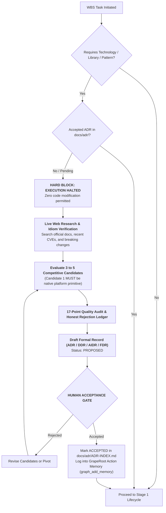

# Rule 03: Architectural Decision Record (ADR) Governance

> **STATUS: NON-NEGOTIABLE OPERATIONAL LAW — ZERO SILENT DEPENDENCIES**  
> Spontaneous library installation, inline architectural choices, or silent technological shifts are strictly prohibited. Every tool, database, SDK, or framework introduced into a Heisenberg OS repository must trace back to a formally accepted decision record.

---

## 1. Core Philosophy: Why ADR Governance is the Anchor of System Health

In amateur AI development, agents introduce libraries on an emotional whim:
- Turn 3: The agent uses `axios`.
- Turn 8: Another agent uses `fetch`.
- Turn 14: A subagent introduces `got`.
- Turn 22: An agent alters the database schema using raw SQL instead of the migration tool.

This creates an unmaintainable Frankenstein codebase.

Heisenberg OS enforces **Decision-First Architecture**:
Before code is written, architectural decisions are researched, evaluated against 3 to 5 alternatives, scored across 17 quality vectors, verified via live web research, and formally accepted by a human.



---

## 2. The 20 Non-Negotiable Laws of ADR Governance

### LAW 1: The Open Technology Hard-Lock
The following technical pillars **CANNOT** be chosen inline:
- Primary Language Runtime & Package Manager
- Web / API Framework
- Database & ORM / Query Builder
- Search Engine & Indexing Strategy
- Authentication & Session Strategy
- State Management Architecture
- CSS Framework & Design System Primitives
- Background Worker & Queue Engine
- AI Model, Embedding Dimensions, & Vector Store
If any task touches these pillars without an accepted record, **THE AGENT MUST HALT CODING IMMEDIATELY**.

### LAW 2: The Zero-Inline-Decision Law
The agent is **STRICTLY PROHIBITED** from executing `pnpm add`, `npm install`, `pip install`, `cargo add`, or `go get` without citing the accepted ADR ID in its command explanation:
`pnpm add prisma # Governed by [ADR-0003: Database ORM Selection]`

### LAW 3: The 3-to-5 Competitive Solutions Mandate
Every proposed record must formally evaluate **3 to 5 distinct approaches**. Single-option justifications or lazy token comparisons are rejected.
- *Example for ORM:* 1) Native `pg` queries, 2) Prisma ORM, 3) Drizzle ORM, 4) Kysely query builder.

### LAW 4: The Honest Rejection Ledger
For every candidate not selected, the record must document the **unvarnished technical reason for rejection**:
- Banned: *"Option B was rejected because Option A is better."*
- Required: *"Drizzle was rejected because our team requires automated multi-file migration rollback tooling and Prisma Studio for non-technical database triage."*

### LAW 5: Live Web Research & Idiom Verification
Before finalizing any record, the agent **MUST** search the web to verify:
- Latest stable LTS version (avoiding abandoned libraries).
- Recent breaking changes (e.g. v4 to v5 migration traps).
- Open critical GitHub issues or severe CVE vulnerability reports.

### LAW 6: Platform Primitives First (The Anti-NPM Rule)
Candidate Option #1 **MUST ALWAYS BE THE NATIVE PLATFORM PRIMITIVE**:
- Native `fetch` before `axios`.
- Native `crypto.randomUUID()` before `uuid`.
- CSS Grid / Flexbox before an external layout library.
- Native `node:fs` / `pathlib` before third-party file utilities.

### LAW 7: Blast Radius & Semver Shock Assessment
The record must evaluate the ripple effect on the existing codebase:
- Does this introduce a breaking schema change?
- Does it force peer-dependency conflicts with existing packages?
- What is the semver upgrade risk over a 12-month horizon?

### LAW 8: The 17-Point Quality Audit Matrix
Every candidate must be scored against 17 enterprise vectors:
1. *Security & Vulnerability History*
2. *Runtime Execution Performance*
3. *TypeScript Type Inference Quality*
4. *Observability & Logging Seams*
5. *Reversibility / Decoupling Ease*
6. *Local / Offline Dev Viability*
7. *Cold-Start Latency (Serverless Impact)*
8. *Bundle Size / Tree-Shaking Efficiency*
9. *Official Documentation Quality*
10. *Community Activity & Maintainer Health*
11. *Package License Compatibility (MIT/Apache vs AGPL)*
12. *Error Handling & Recovery Seams*
13. *Testability & Mocking Friction*
14. *Memory Consumption Profile*
15. *Transitive Dependency Count*
16. *Vendor Lock-In Risk*
17. *AI Cognitive Friendliness (API simplicity)*

### LAW 9: The 4-Archetype Record Family
Heisenberg classifies decisions into 4 distinct formal documents:
- **`ADR` (Architecture Decision Record):** Topology, hosting, routing, frameworks.
- **`DDR` (Data Decision Record):** Database schemas, normalization, indexes, partitioning.
- **`AIDR` (AI Decision Record):** LLM models, context chunking, vector embedding dimensions, prompt caching.
- **`FDR` (Frontend Decision Record):** Design tokens, component primitives, micro-motion, state stores.

### LAW 10: The Human Sign-Off Barrier
The agent has the authority to draft, research, and evaluate decisions (`status: PROPOSED`), but **CANNOT ACCEPT THEM AUTONOMOUSLY**. Acceptance requires explicit human sign-off (`status: ACCEPTED`).

### LAW 11: The Living Index Ledger (`docs/adr/ADR-INDEX.md`)
All decisions must be recorded in the master ledger:
```markdown
| ID | Title | Archetype | Status | Date | Decision Summary | Superseded By |
|---|---|---|---|---|---|---|
| ADR-0001 | Tech Stack Selection | ADR | ACCEPTED | 2026-09-10 | Next.js 14 + FastAPI | - |
| ADR-0002 | Search Index Engine | ADR | ACCEPTED | 2026-09-10 | Meilisearch on Port 7700 | - |
```

### LAW 12: Standardized Markdown Chassis
Every record must strictly follow the canonical chassis:
- **Status & Date**
- **Context & Problem Statement**
- **Decision Drivers**
- **Considered Options (with Pros/Cons)**
- **Decision Outcome & Rationale**
- **Pros and Cons of the Selected Option**
- **6-Month Reversibility Strategy**

### LAW 13: The 6-Month Exit Strategy (Reversibility)
Every accepted record must answer:
> *"If this technology fails, gets acquired, or becomes unmaintained in 6 months, how do we rip it out without rewriting the whole application?"*

### LAW 14: The Strangler Seam Adapter Law
Chosen external SDKs (Stripe, Meilisearch, AWS, Resend) must **NEVER** be called directly in core domain logic or UI views. They **MUST** be wrapped in an interface adapter:
`class MeilisearchAdapter implements ISearchEngine`

### LAW 15: Dependency Tree & License Audit
Packages with viral copyleft licenses (e.g. GPL-3.0 in proprietary SaaS) or packages with $> 50$ transitive dependencies are blocked unless explicitly waived in the ADR.

### LAW 16: Context & Token Footprint Audit
Libraries with convoluted, deeply nested generics that cause LLMs to burn 3,000 tokens per type inspection are heavily penalized during scoring.

### LAW 17: Compounding Action Memory Sync
The moment an ADR is accepted, the agent must log it into GrapeRoot:
`graph_add_memory(type="decision", content="ADR-0003: Prisma accepted for PostgreSQL persistence", tags=["database", "orm"])`

### LAW 18: The Superseding Protocol
When an existing decision is replaced:
1. The new record (e.g. `ADR-0012`) is created.
2. The old record (`ADR-0002`) status is updated to `SUPERSEDED by ADR-0012`.
3. `ADR-INDEX.md` is updated to maintain a pristine historical audit trail.

### LAW 19: Automated `doctor.py` ADR Linter Hook
The `doctor.py` health tool verifies that all dependencies listed in `package.json` or `requirements.txt` map to an accepted record in `docs/adr/`.

### LAW 20: Greenfield vs. Brownfield ADR Hooks
- **Greenfield:** Auto-triggers `ADR-0001` during the Stage 0 Genesis interview.
- **Brownfield:** Auto-generates `ADR-0000-baseline-architecture.md` during initial AST reconnaissance to document the pre-existing system before proposing changes.

---

## 3. Canonical Decision Record Template

All decision records in `docs/adr/` must use this exact structure:

```markdown
# [ID]: [Short Title of Decision]

- **Status:** [PROPOSED | ACCEPTED | REJECTED | SUPERSEDED by ADR-XXXX]
- **Archetype:** [ADR | DDR | AIDR | FDR]
- **Date:** YYYY-MM-DD
- **Decision Owner:** [Name / Role]

## 1. Context and Problem Statement
What is the specific architectural problem we are solving? What constraints exist?

## 2. Decision Drivers
- Driver 1 (e.g. Zero runtime crashes on 10MB Google Drive files)
- Driver 2 (e.g. Sub-50ms fuzzy search latency)
- Driver 3 (e.g. Strong TypeScript inference)

## 3. Considered Options
1. **Option 1 (Platform Primitive):** [Description]
2. **Option 2:** [Description]
3. **Option 3:** [Description]
4. **Option 4:** [Description]

## 4. Decision Outcome & Rationale
Chosen Option: **[Option Name]**
Why this option won over the others based on the Decision Drivers.

### Honest Rejection Ledger
- **Option 1 Rejected Because:** [Exact technical reason]
- **Option 3 Rejected Because:** [Exact technical reason]

## 5. Pros and Cons of Selected Option
### Positive Consequences
- [Benefit 1]
- [Benefit 2]

### Negative Consequences / Trade-offs
- [Trade-off 1]
- [Mitigation strategy]

## 6. The 6-Month Exit Strategy (Reversibility)
How this technology is wrapped in an interface adapter and the exact steps to replace it if needed.
```
