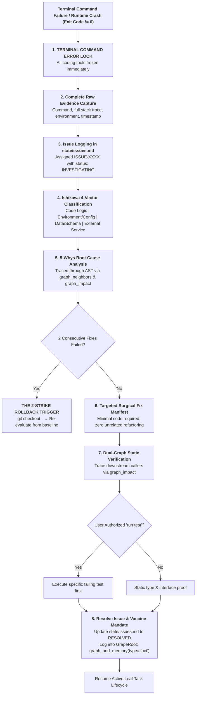

# Rule 04: Terminal Command Error Lock & Incident RCA Protocol

> **STATUS: HARD OPERATIONAL LAW — ZERO PANIC PATCHING**  
> Any terminal failure, runtime crash, broken test, or unhandled exception immediately triggers a **HARD SYSTEM LOCK**. The agent is strictly forbidden from attempting quick random patches or trying alternative commands blindly.

---

## 1. Core Philosophy: Why the Terminal Error Lock Defeats Cascading Outages

In standard AI coding, when an agent encounters an error:
1. It panics and guesses a quick fix.
2. The fix modifies code it doesn't fully understand.
3. A new error appears in an adjacent file.
4. The agent applies another hasty patch.
5. Within 5 turns, the entire codebase is broken, credits are burned, and the original failure is obscured.

Heisenberg OS enforces **The Terminal Command Error Lock**:
Errors are treated as first-class engineering events. When an error occurs, execution freezes, full evidence is captured, causality is traced through 5 layers of "Why", the blast radius is verified via the AST dual-graph, and only a surgical, verified fix is applied.



---

## 2. Upstream System Alignment

This rule directly coordinates with:
- **`workflow.json`:** Governed by `"terminal_error_lock": true` and `"auto_5_whys_on_failure": true`.
- **`01-graperoot-mandate.md` (Law 8):** Prohibits raw terminal grepping during failure diagnosis; mandates using `graph_retrieve` and `graph_neighbors`.
- **`02-wbs-lifecycle.md` (Law 8 & 16):** If the RCA reveals a fundamental design flaw, it triggers the **Design Defect Re-entry Protocol** back to Stage 2.
- **`03-adr-governance.md`:** If an external library causes persistent, irrecoverable failures, it triggers the **6-Month Exit Strategy** defined in the library's ADR.
- **`doctor.py`:** Upon resolving an incident, the agent runs `python Heisenberg/bin/doctor.py --json` to verify workspace health.

---

## 3. The 20 Non-Negotiable Laws of Incident RCA

### LAW 1: The Immediate Execution Freeze (Hard Error Lock)
The moment ANY terminal command returns exit code $\ne 0$ or an unhandled exception occurs, the agent is **HARD-BLOCKED** from executing further code changes. It cannot "try another command" or "see if this works".

### LAW 2: The "Disappearing Error $\ne$ Resolved Error" Law
An error that vanishes because code was commented out, silenced with `@ts-ignore` / `except: pass`, or bypassed with a dummy mock is classified as an **Unverified Hack**, not a resolution. The underlying causality must be addressed.

### LAW 3: The 5-Whys Depth Mandate
The agent must trace the failure backwards through at least 5 layers of causality:
1. *Why 1 (Symptom):* Why did the test/build fail?
2. *Why 2 (Immediate Cause):* Why was that specific value undefined or function missing?
3. *Why 3 (Mechanism):* Why was that state not passed or parsed correctly?
4. *Why 4 (Upstream Seam):* Why did the caller assume a different data contract?
5. *Why 5 (Root Cause):* What architectural assumption or configuration gap allowed this state to exist?

### LAW 4: The Ishikawa Fishbone Classification
Every incident must be categorized into one of 4 vectors:
- **Code Logic:** Algorithm error, type mismatch, null pointer.
- **Environment & Config:** Missing `.env`, port collision, PATH resolution.
- **Data & Schema:** Database column missing, unmigrated state, stale cache.
- **Dependency & External Service:** Rate limit (429), timeout, upstream API breaking change.

### LAW 5: Centralized Issue Register (`state/issues.md`)
Every non-trivial failure must be formally recorded in `state/issues.md` (or `.agents/state/issues.md`) with a sequential identifier (`ISSUE-0001`, `ISSUE-0002`...) tracking its full lifecycle: `OPEN | INVESTIGATING | MITIGATED | RESOLVED`.

### LAW 6: Complete Raw Evidence Capture
The issue record must capture the **exact executed command**, the **untruncated terminal output**, stack traces, exit codes, and timestamps. Truncating or guessing error traces is prohibited.

### LAW 7: AST Impact & Blast Radius Audit
Before touching any file to fix an error, the agent must run:
`graph_impact(changed_files=["path/to/target.ts"])`
It must verify which downstream callers import the modified functions to ensure the fix does not trigger secondary regressions.

### LAW 8: Targeted Fix Manifest (Zero Unrelated Refactoring)
The fix must contain **ONLY** the minimal code required to resolve the root cause. Spontaneous reformatting, renaming variables, or modifying adjacent functions during a bug fix is strictly forbidden.

### LAW 9: Dual-Graph Regression Verification
After applying the fix, the agent must statically inspect all direct callers identified by `graph_neighbors` to confirm that interface contracts and return types remain 100% synchronized.

### LAW 10: User-Authorized Test Verification
If the user explicitly authorizes running tests (`"run test"` in prompt):
1. Run the specific failing test file first to confirm it passes.
2. Run the immediate regression test suite.
Zero unsolicited test runs are permitted on the agent's own initiative.

### LAW 11: Silent Swallow & Catch-All Ban
Production code must **NEVER** contain empty catch blocks (`catch (e) {}`), bare `except:`, or unhandled promise rejections designed to mask runtime failures. Errors must be logged and handled via typed domain envelopes.

### LAW 12: The 2-Strike Rollback Trigger
If two consecutive fix attempts fail to resolve the issue:
**THE AGENT MUST HALT IMMEDIATELY.**
It must execute `git checkout .` to revert the branch back to the clean, last-known-good commit, pause, and re-evaluate the root cause from scratch.

### LAW 13: Compounding Action Memory Logging
The moment an issue is resolved, the agent must log the key lesson into GrapeRoot memory:
`graph_add_memory(type="fact", content="Resolved ISSUE-0010: Restored PKCE code verifier in OAuth state record", files=["app/api/auth.py"])`

### LAW 14: Monitored Dependency Seam Check
If an error is caused by an external API (e.g. Google Drive 10MB limit, Stripe rate limit), the fix must verify that the service is behind an adapter with exponential backoff and graceful degradation.

### LAW 15: The "Flaky Error" Isolation Protocol
Non-deterministic errors (race conditions, async timing glitches) must be explicitly flagged as `FLAKY` in `issues.md` and subjected to concurrency analysis rather than dismissed as "it works now".

### LAW 16: Evidence Grounding Enforcement
Every diagnostic statement must be tagged with explicit evidence markers:
- `[VERIFIED]` — Proven by direct terminal output, log inspection, or AST code read.
- `[INFERRED]` — Logical deduction based on verified facts.
- `[ASSUMED]` — Unverified hypothesis (must be confirmed before editing code).

### LAW 17: Security Vulnerability Escalation
If an error involves plaintext credentials in logs, hardcoded tokens, or SQL injection risks, the issue must be escalated to `SEVERITY: CRITICAL` and resolved before any feature work continues.

### LAW 18: The Scope Delta Check
If fixing an error requires altering database schemas, introducing a new library, or rewriting an interface, the agent must halt and update `roadmap_wbs.md` to reflect the scope expansion.

### LAW 19: The "Vaccine" Mandate (Post-Mortem Prevention)
Every resolved issue record must state the **Vaccine Rule**:
> *"What architectural constraint, typing check, or lint rule do we add so that this class of bug can NEVER physically happen again?"*

### LAW 20: Lifecycle Re-entry Handover
Once the issue is closed in `state/issues.md` and verified statically, the agent cleanly resumes the active leaf task lifecycle at Stage 4 Verification.

---

## 4. Canonical Issue Record Template (`state/issues.md`)

Every incident logged in `state/issues.md` must adhere to this exact structure:

```markdown
## ISSUE-[XXXX]: [Short Imperative Title of Failure]

- **Status:** [OPEN | INVESTIGATING | MITIGATED | RESOLVED]
- **Severity:** [CRITICAL | HIGH | MEDIUM | LOW]
- **Date:** YYYY-MM-DD HH:MM:SS UTC
- **Active Task:** Task-X.Y
- **Host Component:** [Frontend | Backend | Database | Auth | Indexer]

### 1. Raw Execution Evidence
- **Command Executed:** `[Exact command]`
- **Exit Code:** `[Code]`
- **Full Stack Trace:**
```text
[Paste complete, untruncated error output here]
```

### 2. Ishikawa Fishbone Classification
- **Category:** [Code Logic | Environment & Config | Data & Schema | External Dependency]
- **Primary Failure Seam:** [Description of where the breakdown occurred]

### 3. The 5-Whys Root Cause Analysis
1. **Why 1 (Symptom):** [Explanation]
2. **Why 2 (Immediate Cause):** [Explanation]
3. **Why 3 (Mechanism):** [Explanation]
4. **Why 4 (Upstream Seam):** [Explanation]
5. **Why 5 (Root Cause):** [Fundamental architectural reason]

### 4. Blast Radius & Caller Impact
- **Files Modified:** `[path/to/file.ts]`
- **Downstream Callers Checked via graph_impact:**
  - `caller_a.ts` [VERIFIED COMPATIBLE]
  - `caller_b.ts` [VERIFIED COMPATIBLE]

### 5. Surgical Fix Implemented
- [Summary of minimal, targeted changes made]

### 6. The Vaccine Mandate (Post-Mortem Prevention)
- [Exact typing rule, schema check, or architectural constraint added to prevent recurrence]

### 7. Resolution Verification
- **Verified via:** [Dual-graph static traversal / User-authorized test run]
- **GrapeRoot Memory Logged:** `graph_add_memory(type="fact", ...)`
- **Resolution Date:** YYYY-MM-DD HH:MM:SS UTC
```
