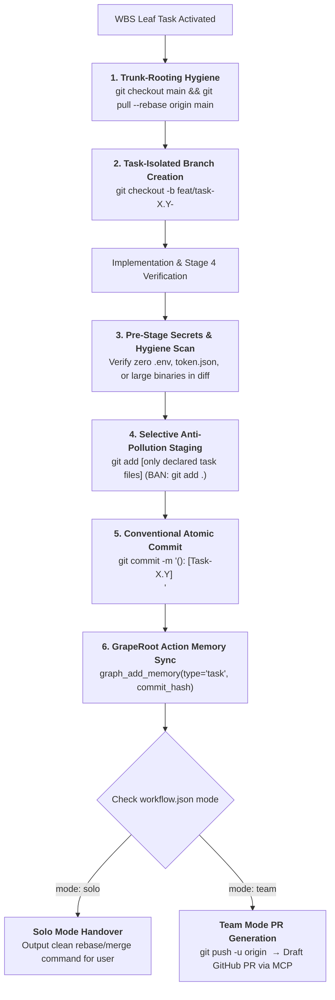

# Rule 05: Git Branching & Multi-Developer Team Protocol

> **STATUS: NON-NEGOTIABLE OPERATIONAL LAW — ZERO REPO POLLUTION**  
> Blind `git add .`, committing directly to `main`, unverified merge conflict resolutions, and un-tracked dirty state are strictly prohibited. Every commit in Heisenberg OS must be atomic, conventional, and task-isolated.

---

## 1. Core Philosophy: Why Git Hygiene Protects Velocity

AI agents write code at 10x human speed. If unconstrained, they create catastrophic Git messes:
- Running `git add .` and accidentally committing `.env` files containing live API keys.
- Working on long-lived branches that diverge from teammates, causing nightmare merge conflicts.
- Writing meaningless commit messages like *"update code"* or *"fix stuff"*.
- Committing 20 micro-changes for one task or bundling 5 unrelated features into a giant blob.

Heisenberg OS enforces **Aerospace-Grade Version Control**:
Every task is isolated in a short-lived branch, staged selectively file-by-file, committed using strict conventional commits, and governed by the **Solo vs. Team** mode configured in `workflow.json`.



---

## 2. Upstream System Alignment

- **`workflow.json`:** Reads `"mode": "solo" | "team"`, `"target_branch": "main"`, and `"branch_prefix": "feat/task-"`.
- **`01-graperoot-mandate.md`:** Immediately logs the task commit hash into GrapeRoot action memory.
- **`02-wbs-lifecycle.md` (Law 18):** Enforces that the branch name maps 1-to-1 to the active WBS task ID.
- **`04-error-protocol.md`:** If two consecutive fixes fail, executes `git checkout .` to revert to the clean commit baseline.

---

## 3. The 20 Non-Negotiable Laws of Git Operations

### LAW 1: The Trunk-Rooting Hygiene Mandate
Before creating a feature branch or starting a new task, the agent **MUST** ensure the local repository is clean and rebased onto the latest upstream target branch:
```bash
git checkout main && git pull --rebase origin main
```
Building on top of stale, un-synced code is strictly forbidden.

### LAW 2: The Task-Isolated Branch Schema
Work is **STRICTLY FORBIDDEN** directly on `main` or `master`. Every task must execute in its own isolated branch:
- Features: `feat/task-X.Y-<kebab-slug>` (e.g. `feat/task-10.6-oauth-pkce`)
- Bug Fixes: `fix/task-X.Y-<kebab-slug>` (e.g. `fix/task-10.6-missing-code-verifier`)
- Hotfixes: `hotfix/issue-XXXX-<slug>`

### LAW 3: The Absolute Ban on Blind `git add .` (Anti-Pollution Law)
Running `git add .`, `git add -A`, or staging whole directories blindly is a **DIRECT FAILURE**. The agent must explicitly stage only the files declared in the Stage 2 Design manifest:
```bash
git add src/routes/auth.ts src/services/auth.ts
```

### LAW 4: The Pre-Stage Secrets & Hygiene Scan
Before executing any commit, the agent must check `git status` against this absolute blacklist:
- `.env`, `.env.*` (except `.env.example`)
- `token.json`, `credentials.json`, `*.pem`, `*.key`
- `*.log`, `npm-debug.log`, `yarn-error.log`
- `.dual-graph/` cache or internal stores
- Node / Python virtual environments (`node_modules/`, `venv/`, `__pycache__/`)
If any blacklisted file is untracked, it must be added to `.gitignore` before staging.

### LAW 5: The Conventional Commit Standard
Every commit message must strictly follow:
```text
<type>(<scope>): [Task-X.Y] <imperative short summary>
```
**Allowed Types:**
- `feat`: New feature or user-facing capability.
- `fix`: Bug fix or defect resolution.
- `docs`: Documentation only changes.
- `refactor`: Code change that neither fixes a bug nor adds a feature.
- `perf`: Performance optimization.
- `chore`: Tooling, build config, or dependency updates.
- `test`: Adding or modifying tests.

### LAW 6: Multi-Line Commit Body Architecture
For any task touching more than 2 files or modifying architectural seams, the commit must include a structured body:
```text
feat(auth): [Task-10.6] Implement 1-click Google Sign-In with PKCE flow

- Created GoogleSignInCard.tsx component wired to auth endpoint
- Added OAuthStateRecord to persist code_verifier across redirect
- Automated background sync trigger upon successful login
- Verified statically via Dual-Graph (0 caller breakages)
```

### LAW 7: Solo Developer Mode Protocol (`mode: "solo"`)
When `workflow.json` is set to `"mode": "solo"`:
- The agent optimizes for speed and developer velocity.
- It commits to the local task branch.
- It does **NOT** create remote PR bureaucracy.
- It outputs a clean copy-pasteable command for the developer:
  `git checkout main && git merge feat/task-X.Y --ff-only`

### LAW 8: Engineering Team Mode Protocol (`mode: "team"`)
When `workflow.json` is set to `"mode": "team"`:
- Direct merges to `main` are **STRICTLY FORBIDDEN**.
- The agent pushes the branch to remote: `git push -u origin <branch>`.
- The agent drafts a formal Pull Request using the GitHub MCP tool (`create_pull_request`) using the Standardized PR Chassis (Section 4).

### LAW 9: Zero Auto-Merge & Force-Push Ban
The agent is **STRICTLY PROHIBITED** from:
- Auto-merging pull requests autonomously.
- Executing `git push --force` or `git push -f` to any protected branch (`main`, `master`, `develop`).
Merge approval remains a 100% human privilege.

### LAW 10: Multi-Agent Git Worktree Isolation
When parallel subagents are spawned (e.g. one writing backend, one writing frontend):
- Each subagent **MUST** run in an isolated Git worktree:
  ```bash
  git worktree add ../subagent-frontend -b feat/task-10.7-frontend main
  ```
- Subagents are strictly forbidden from working in the same working tree simultaneously to prevent uncommitted collisions.

### LAW 11: The Atomic Leaf-Task Commit Rule
Exactly **ONE logical commit per WBS leaf task**. Never bundle 3 separate tasks into a single commit; never create 10 fragmented micro-commits for one task.

### LAW 12: State Machine Sync in Commits
The agent state files (`current_task.md`, `current_stage.md`) must be staged and committed **alongside** the code changes so that time-traveling through Git history restores the exact agent state.

### LAW 13: Clean Working Tree Pre-Flight Gate
If dirty, uncommitted changes exist in the workspace, the agent **CANNOT** switch branches or start a new task. It must commit the active work or stash it:
```bash
git stash push -m "Stash before switching to Task-X.Y"
```

### LAW 14: AST-Aware Merge Conflict Resolution
If a merge conflict occurs:
- Using `git checkout --ours` or `git checkout --theirs` blindly is **PROHIBITED**.
- The agent must use `graph_neighbors` to inspect both incoming sides and preserve architectural contracts.

### LAW 15: Rebase-Over-Merge Clean History
Feature branches must be rebased on `main` (`git rebase origin/main`) rather than creating messy, circular `Merge branch 'main' of ...` spaghetti commits.

### LAW 16: The Copy-Paste Handover Command Card
Upon finishing Stage 4 verification and committing, the agent **MUST** render a clean terminal handover card:
```text
┌── Git Handover Command ──────────────────────────────────────────┐
│ git push -u origin feat/task-10.6-google-signin                  │
└──────────────────────────────────────────────────────────────────┘
```

### LAW 17: Standardized PR Chassis
All pull requests must follow the Canonical PR Template in Section 4, detailing what was built, blast radius checked, and static verification proof.

### LAW 18: Hotfix Emergency Fast-Track
Critical production bugs bypass the regular feature queue, branching directly from the production release tag:
`hotfix/issue-XXXX-<slug>`.

### LAW 19: 10MB Large File & Git LFS Guardrail
The agent is **FORBIDDEN** from committing files $> 10\text{MB}$ or datasets directly to the git index; it must ensure they are ignored or tracked via Git LFS.

### LAW 20: Compounding Action Memory on Commit
The instant `git commit` succeeds, the agent must log the milestone into GrapeRoot:
`graph_add_memory(type="task", content="Committed Task-10.6: 1-click Google Sign-In with PKCE flow", tags=["git", "auth"])`.

---

## 4. Canonical Pull Request Template (For Team Mode)

```markdown
## [Task-X.Y]: [Short Imperative Title]

### 1. Summary of Changes
- [High-level explanation of what was built or fixed]
- [Context or motivation]

### 2. File Manifest
- `[NEW]` `path/to/new_file.ts`
- `[MODIFY]` `path/to/modified_file.ts`
- `[DELETE]` `path/to/deleted_file.ts`

### 3. Blast Radius & Caller Impact (via GrapeRoot Dual-Graph)
- **Downstream Callers Inspected:** `[List of files verified via graph_impact]`
- **Regression Risk:** [NONE | LOW | MEDIUM]

### 4. Verification Evidence
- [x] Dual-Graph static type & interface verification passed.
- [x] Zero stray hex codes or un-tokenized px (The Muses audit passed).
- [x] Pre-stage secrets scan: Clean (0 credentials in diff).

### 5. Visual Proof (For UI Tasks)
[Attach screenshots or recordings demonstrating the 6 interactive states]
```
