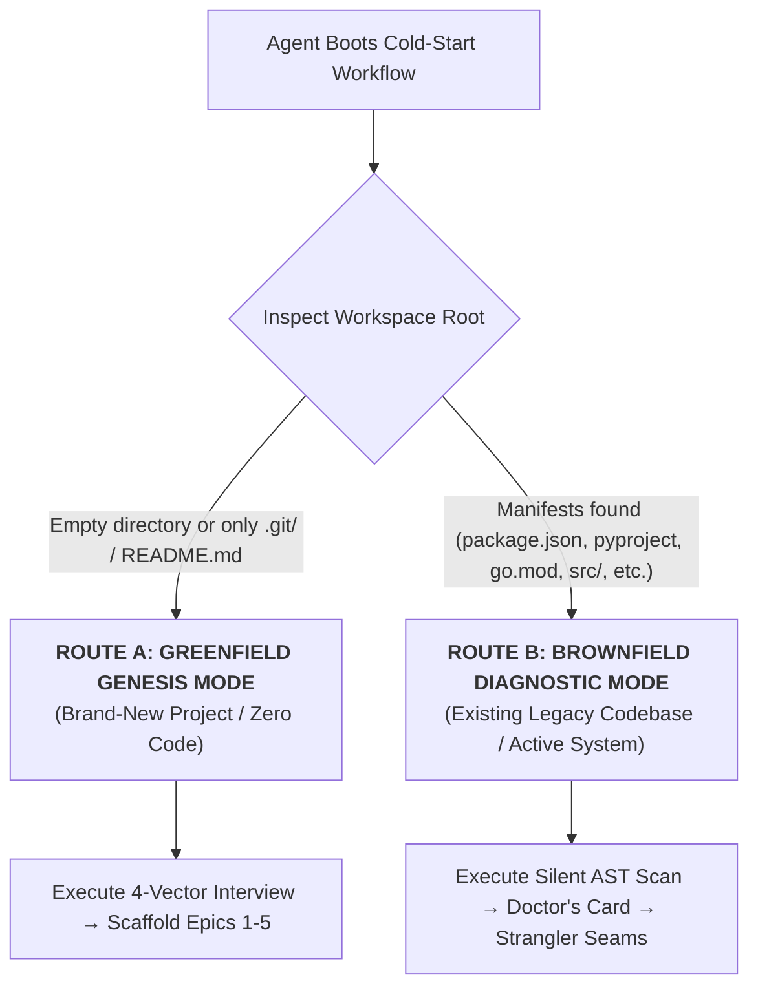
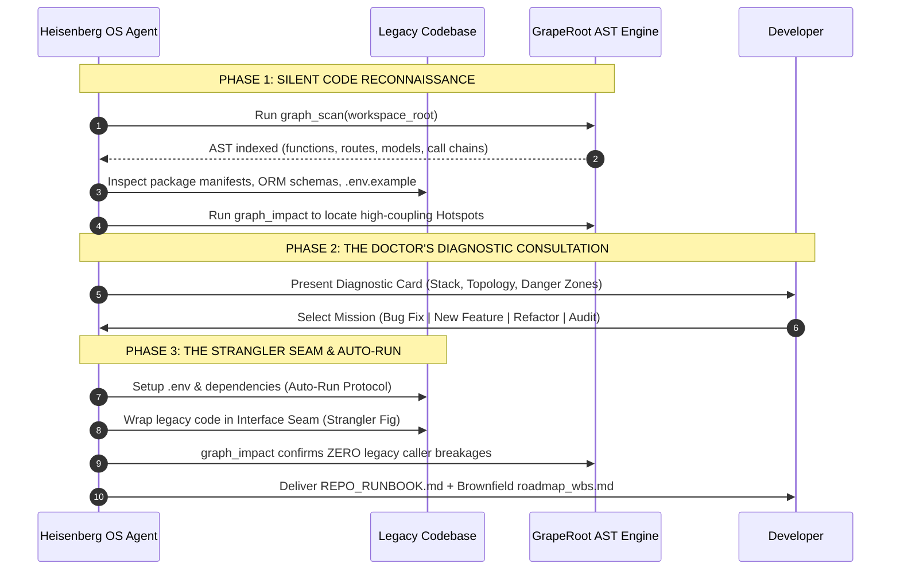

# Master Cold-Start Workflow: Greenfield Genesis & Brownfield Reconnaissance

> **EXECUTION TRIGGER:**  
> Trigger this workflow whenever Heisenberg OS is initialized in a repository where no active WBS exists, or when the user says: *"let's start a new project"*, *"onboard this repo"*, *"get this codebase running on my PC"*, or *"what should we build?"*.

---

## 1. Automated Repository State Detection

Before asking the human any questions, the agent **MUST** inspect the file tree to determine the repository state:



---

## 2. ROUTE A: Greenfield Genesis Protocol (Brand-New Projects)

When the workspace contains no existing code:

### Step 1: The 4-Vector Genesis Interview
The agent conducts a focused, 4-vector interview with the user. It is **forbidden** from asking generic, rambling questions. It must ask:

1. **Vector 1 (The Pain & User Archetype):**
   - *"Who is the specific target user?"*
   - *"What acute pain or inefficiency are we eliminating for them?"*
   - *"Why can't they solve this with an off-the-shelf tool?"*
2. **Vector 2 (The MVP Core Loop):**
   - *"What is the single 3-step action loop the user takes every day? (Input $\to$ Processing $\to$ Desired Output)"*
   - *"What is the core 'Aha!' moment that proves the product works?"*
3. **Vector 3 (Technology Selection & Seams):**
   - *"What is your preferred stack? (e.g., Next.js 14 + TypeScript, FastAPI + Python, Go + React)"*
   - *"What database do you prefer? (PostgreSQL, SQLite, MongoDB)"*
   - *"What third-party services are needed? (Auth, Storage, Stripe, LLMs)"*
4. **Vector 4 (Hard Constraints & Non-Negotiables):**
   - *"Are there budget, latency, privacy (PII), or local-first boundaries?"*
   - *"What must this project NOT do in Phase 1?"*

### Step 2: Genesis Artifact Generation
From the user's answers, the agent produces:
1. **`docs/adr/ADR-0001-tech-stack.md`:** Formally records the chosen technologies with trade-offs.
2. **`Heisenberg/config/project-profile.json`:** Populated with the 20 architectural dimensions.
3. **`roadmap_wbs.md`:** The complete Work Breakdown Structure scaffolded into:
   - **Epic 1:** Workspace Scaffolding, Tooling, & Configuration Seams.
   - **Epic 2:** Core Domain Models & Business Logic.
   - **Epic 3:** Persistence, Database Migrations, & API Routes.
   - **Epic 4:** The Extended Muses Frontend Studio (Tokens, Data Seams, Views).
   - **Epic 5:** Hardening, Dual-Graph Static Verification, & Release.
4. **Task-1.1 Initialization:**
   - Creates branch `feat/task-1.1-init`.
   - Writes `Task-1.1` into `.agents/state/current_task.md` and begins Stage 1.

---

## 3. ROUTE B: Brownfield Diagnostic & Strangler Seam Protocol (Legacy Codebases)

When Heisenberg OS is initialized in an existing codebase (5,000 to 500,000+ lines of code):

### The Prime Directive: "The Code Speaks First"
The agent is **STRICTLY PROHIBITED** from asking startup interview questions. The app is already built. The agent must inspect the existing reality first.



### Step 1: Silent AST Reconnaissance
Before posting a single response to the user, the agent silently executes:
1. **`graph_scan`:** Builds `.dual-graph/info_graph.json` mapping every function, class, and route.
2. **Stack Fingerprinting:** Identifies framework versions, database ORM (Prisma, Sequelize, Alembic, Drizzle), and package managers.
3. **Hotspot Discovery:** Identifies the "fragile danger zones":
   - Runs `graph_impact` to find god-objects with $> 15$ incoming caller dependencies.
   - Checks if automated tests exist in `tests/` or `__tests__/`.

### Step 2: The Doctor's Diagnostic Card
The agent presents a crisp Staff-Architect diagnostic summary to the user:

```text
╔══════════════════════════════════════════════════════════════════════════╗
║            HEISENBERG OS BROWNFIELD RECONNAISSANCE REPORT                ║
╠══════════════════════════════════════════════════════════════════════════╣
║ • Topology: Next.js 13 (Pages Router) + Express 4 + PostgreSQL          ║
║ • Database: 18 Prisma Models | 24 Active Migrations                      ║
║ • API Surface: 42 Endpoints indexed in Dual-Graph                        ║
║ • Danger Zone Hotspot: src/services/billing.ts (16 incoming callers)     ║
║ • Test Coverage: Partial (Jest unit tests found, zero E2E tests)        ║
╚══════════════════════════════════════════════════════════════════════════╝

What is our objective on this codebase today?
[1] URGENT DEFECT: Diagnose and fix a specific bug or runtime crash.
[2] SURGICAL FEATURE: Add a new endpoint, UI view, or service without touching legacy internals.
[3] MODERNIZATION: Safely refactor technical debt (e.g. migrate to App Router or upgrade ORM).
[4] SYSTEM AUDIT & RUN: Get this repository running locally and document its architecture.
```

### Step 3: The Auto-Run & Environment Setup Protocol
If the user wants to get the repo running locally:
1. **The `.env` Detective:**
   - Reads `.env.example` or `.env.sample`.
   - Auto-creates `.env` with safe local defaults (`PORT=3000`, `DATABASE_URL=...`).
   - If proprietary API keys are required (Stripe, OpenAI), outputs a **Developer Action Card** requesting only those specific keys.
2. **Dependency Resolution:**
   - Checks lockfiles (`pnpm-lock.yaml` $\to$ `pnpm install`, `yarn.lock` $\to$ `yarn install`, etc.).
   - Executes install safely in the user's terminal.
3. **Database & Infrastructure Bootstrapping:**
   - If `docker-compose.yml` exists: checks if local Postgres/Redis containers are needed.
   - Runs schema sync: `npx prisma db push` or `alembic upgrade head`.
   - Runs seed script if present (`npm run seed`).
4. **Port Probe & Health Check:**
   - Probes local ports (3000, 8000, 5173).
   - Verifies servers return HTTP 200 OK.
5. **Generates `docs/REPO_RUNBOOK.md`:**
   - Creates a 1-page cheatsheet showing what the repo does, where code lives, and commands to start and test.

### Step 4: The Strangler Seam Protocol (Do No Harm)
When modifying or adding code to a legacy system:
1. **Zero Mass Rewrites:** The agent is **FORBIDDEN** from rewriting legacy spaghetti files directly.
2. **Interface Seam Wrapping:**
   - Create an interface adapter (e.g., `interface IPaymentService`).
   - Wrap the legacy implementation behind the interface.
   - Build the new capability or fix through the clean adapter.
3. **Downstream Safety Proof:**
   - Run `graph_impact(changed_files=[...])` before and after.
   - Prove mathematically that existing legacy callers are preserved and uninterrupted.

### Step 5: Brownfield WBS Generation
Generates `roadmap_wbs.md` tailored to the legacy mission:
- **Epic 1: Baseline Architecture & Seam Isolation** (Validating local run & isolating the target module).
- **Epic 2: Core Surgery** (Implementing the requested fix or feature through the seam).
- **Epic 3: Dual-Graph Regression Audit** (Traversing `graph_neighbors` to prove zero legacy breakages).
- **Epic 4: Delivery & Runbook Update** (Documenting changes in `docs/runbooks/`).

---

## 4. Cold-Start Completion Gate

To exit the Cold-Start workflow and begin Stage 1:
- [ ] Repository mode explicitly identified (Greenfield vs Brownfield).
- [ ] Project profile configured in `Heisenberg/config/project-profile.json`.
- [ ] Active WBS generated in `roadmap_wbs.md`.
- [ ] Active leaf task set in `.agents/state/current_task.md` (e.g., `Task-1.1`).
- [ ] Feature branch checked out: `feat/task-X.Y-<slug>`.
- [ ] GrapeRoot dual-graph synced with `graph_scan`.
