# Master Development Cycle Workflow: The 30-Step Flight Runbook

> **OPERATIONAL CONTRACT:**  
> This workflow is the definitive step-by-step execution runbook for every active WBS leaf task under Heisenberg OS. Agents must execute all 30 steps sequentially without improvising or skipping gates.

---

## The 30-Step Master Flight Plan

```mermaid
flowchart TD
    subgraph "PHASE 0: PRE-FLIGHT BOOT (Steps 1-5)"
        S1["1. doctor.py --json health probe"] --> S2["2. Clean working tree gate"]
        S2 --> S3["3. Trunk-rooting rebase (git pull --rebase)"]
        S3 --> S4["4. Task branch checkout (feat/task-X.Y)"]
        S4 --> S5["5. WBS leaf-task scope lock (current_task.md)"]
    end

    subgraph "PHASE 1: DUAL-GRAPH HYDRATION (Steps 6-10)"
        S5 --> S6["6. graph_continue action memory load"]
        S6 --> S7["7. graph_retrieve AST semantic ranking"]
        S7 --> S8["8. graph_neighbors caller topology"]
        S8 --> S9["9. graph_read(file::symbol) precision reads"]
        S9 --> S10["10. Produce task_X_Y_understanding.md"]
    end

    subgraph "PHASE 2: BLUEPRINT & GATES (Steps 11-15)"
        S10 --> S11["11. ADR-INDEX.md Living Registry check"]
        S11 --> S12["12. Narrsistic Pluto 3-5 pattern review"]
        S12 --> S13["13. graph_impact deterministic blast radius"]
        S13 --> S14["14. [NEW]/[MODIFY] manifest in task_X_Y_design.md"]
        S14 --> S15["15. HUMAN DESIGN ACCEPTANCE LOCK"]
    end

    subgraph "PHASE 2.5: THE EXTENDED MUSES (Steps 16-20, If UI)"
        S15 -- "UI Task" --> S16["16. Section visual comps (imagegen + image-to-code)"]
        S16 --> S17["17. Picasso Archetype intake (tokens.json)"]
        S17 --> S18["18. Escher data seam (0 mock data)"]
        S18 --> S19["19. Vermeer Double-Bezel & 6 interactive states"]
        S19 --> S20["20. GSAP motion & gapless bento grid math"]
        S20 --> S21
    end

    subgraph "PHASE 3: SURGICAL IMPLEMENTATION (Steps 21-25)"
        S15 -- "Non-UI Task" --> S21["21. Pre-edit symbol signature verification"]
        S21 --> S22["22. Zero-drift minimal code mutation"]
        S22 --> S23["23. Same-turn graph_register_edit sync"]
        S23 --> S24["24. Terminal Error Lock & 5-Whys guard"]
        S24 --> S25["25. 2-Strike rollback trigger enforcement"]
    end

    subgraph "PHASE 4: STATIC PROOF & COMMIT (Steps 26-30)"
        S25 --> S26["26. Dual-graph static verification (graph_impact)"]
        S26 --> S27["27. The Muses anti-slop regex audit (0 hex/px)"]
        S27 --> S28["28. Pre-stage secrets & hygiene scan"]
        S28 --> S29["29. Selective staging & conventional commit"]
        S29 --> S30["30. graph_add_memory + Handover Command Card"]
    end
```



---

## Phase 0: Pre-Flight Boot & Environment Verification (Steps 1–5)

### Step 1: Pre-Flight Health Probe (`doctor.py`)
- Run `python Heisenberg/bin/doctor.py --json`.
- Verify `"healthy": true`. Confirm port 8080 is listening and the AST graph is mounted.
- If unhealthy, halt and run auto-repair (`--fix`) or resolve blocking issues before touching code.

### Step 2: Clean Working Tree Gate
- Inspect `git status`.
- If dirty, uncommitted changes exist, **HALT**. The user must commit or stash them (`git stash push -m "Pre-task stash"`). Cross-task contamination is prohibited.

### Step 3: Trunk-Rooting & Upstream Rebase
- Sync local repository with latest target branch:
  ```bash
  git checkout main && git pull --rebase origin main
  ```

### Step 4: Task-Isolated Feature Branch Creation
- Create and switch to the task-isolated feature branch:
  ```bash
  git checkout -b feat/task-X.Y-<kebab-slug>
  ```

### Step 5: WBS Leaf-Task Scope Lock
- Read `roadmap_wbs.md` and set `.agents/state/current_task.md` to the active task ID.
- Restate the active scope: **In-Scope vs. Out-of-Scope**. Prohibit silent expansion.

---

## Phase 1: Dual-Graph Hydration & Mental Model (Steps 6–10)

### Step 6: Action Memory Hydration (`graph_continue`)
- Call `graph_continue(query="<task objective>")` to load in-progress memory and context hints in a single turn without dumping chat history.

### Step 7: AST Subgraph Retrieval (`graph_retrieve`)
- Retrieve ranked files and structural AST edges:
  ```json
  graph_retrieve(query="<symbol or architectural concept>", top_files=5, top_edges=12)
  ```
- Blind terminal `grep` or `find` commands are strictly forbidden.

### Step 8: Caller Graph & Topology Mapping (`graph_neighbors`)
- Inspect connected edges touching the primary target files:
  ```json
  graph_neighbors(file="path/to/target.ts", limit=30)
  ```

### Step 9: Surgical Symbol Anchor Reading (`graph_read`)
- Inspect target classes and methods using precision symbol anchors:
  ```json
  graph_read(file="path/to/target.ts", anchor="path/to/target.ts::TargetSymbol")
  ```
- Ingesting whole files (>100 lines) is strictly prohibited.

### Step 10: Produce Stage 1 Understanding Artifact
- Generate `task_X_Y_understanding.md` containing:
  - Real-world physical analogy and mental model.
  - Execution path traced through AST caller edges.
  - Grounded claims tagged as `[VERIFIED]`, `[INFERRED]`, or `[ASSUMED]`.

---

## Phase 2: Architectural Gates & Blueprint Design (Steps 11–15)

### Step 11: Living Decision Registry Check (`ADR-INDEX.md`)
- Inspect `docs/adr/ADR-INDEX.md`.
- If this task depends on any decision marked `PENDING` or introduces a new library, **HALT** and execute `03-adr-governance.md` to draft the formal ADR first.

### Step 12: Narrsistic Pluto Principal Architect Gate
- Triggered for complex tasks, multi-pattern choices, or incident RCAs.
- Web-research current production idioms and produce `task_X_Y_architect_analysis.md` with **3–5 viable solutions**, trade-offs, and rollback matrices.

### Step 13: Deterministic Blast Radius Calculation (`graph_impact`)
- Calculate the exact downstream caller impact:
  ```json
  graph_impact(changed_files=["path/to/file_a.ts", "path/to/file_b.ts"])
  ```
- Embed the resulting downstream caller table directly into the design artifact.

### Step 14: CS Domain First Principles & File Mutation Manifest
- **MANDATORY CS DOMAIN LEARNING:** Every task must generate `cs-concepts.md` (via `cs-domain-learning`) documenting algorithmic complexity, data structure choices, concurrency guarantees, and system invariants.
- In `task_X_Y_design.md`, classify every affected file explicitly:
  - `[NEW] path/to/file`
  - `[MODIFY] path/to/file`
  - `[DELETE] path/to/file`

### Step 15: Human Design Sign-Off Barrier
- **HARD STOP.** Present the Stage 2 Design Artifact to the human. Code writing tools are locked until explicit human acceptance is received.

---

## Phase 2.5: The Extended Muses & HCI UI Track (Steps 16–20, If UI Task)

*(If the task does not involve UI, proceed directly to Step 21).*

### Step 16: Section Visual Comps & Identity
- Generate section-by-section horizontal comps via `imagegen-frontend-web / mobile`.
- Extract spatial rhythm and typography hierarchy via `image-to-code`.

### Step 17: Picasso Design System & HCI Foundation Intake
- Ingest brand tokens into `design-system/tokens.json`.
- Enforce HCI foundations (`hci-usability-principles`): minimum touch target sizes ($\ge 48\text{px} \times 48\text{px}$), WCAG AA/AAA contrast ratios ($\ge 4.5:1$ / $\ge 7:1$), focus-ring signifiers, and `prefers-reduced-motion` fallbacks.
- Select 1 of 5 Aesthetic Archetypes: Ethereal Glass (`high-end-visual-design`), Gapless Bento (`gpt-taste`), Swiss Minimalist (`minimalist-ui`), Industrial Brutalist (`industrial-brutalist-ui`), or Stitch Modern (`stitch-design-taste`).

### Step 18: Escher Real Backend Data Seam & PACT Constraints
- Inspect real OpenAPI / Express / FastAPI / Prisma schemas.
- Incorporate PACT technical and context constraints (`pact-context-analysis`): offline caching, optimistic updates, and KLM latency budgets ($R(t)$ from `task-modeling-goms-klm`).
- **ZERO SILENT MOCKS:** Log any missing backend fields in `design-system/backend-requirements.md` and alert the user.

### Step 19: Vermeer Hardware Micro-Aesthetics & Usability Build
- Build UI strictly from design tokens (zero raw hex/px).
- Enforce the **Double-Bezel nested hardware architecture** and **Island Button-in-Button CTA pills**.
- Implement all 6 interactive states: `default, hover, active, focus-visible, disabled, loading`.
- Enforce 4-stage feedback state machines (`idle, loading, success, error`) and Wharton's 4 Cognitive Walkthrough learnability criteria (`cognitive-walkthrough-evaluator`).

### Step 20: GSAP Micro-Motion & Layout Randomizer
- Apply `gpt-taste`: 2-line H1 limit (`max-w-6xl`), gapless bento grid math (`grid-flow-dense`), and GSAP `ScrollTrigger` pinning/stacking.

---

## Phase 3: Surgical Implementation & Atomic Graph Sync (Steps 21–25)

### Step 21: Pre-Edit Signature Re-Verification
- Call `graph_read(file::symbol)` one last time immediately before editing to guarantee line numbers and method signatures have not drifted.

### Step 22: Minimal Surgical Code Mutation
- Execute code edits strictly inside the approved Stage 2 manifest using `replace_file_content` or `write_to_file`. Unrelated refactoring is strictly forbidden.

### Step 23: Same-Turn Graph Synchronization (`graph_register_edit`)
- In the **EXACT SAME TURN** that a file is modified, execute:
  ```json
  graph_register_edit(files=["path/to/modified_file.ts"], summary="Imperative summary of changes")
  ```

### Step 24: Terminal Command Error Lock Guard
- If ANY terminal command fails or returns exit code $\ne 0$, **HALT IMMEDIATELY**.
- Log the incident in `state/issues.md` and trigger 5-Whys RCA (Rule 04). Blind retries are banned.

### Step 25: The 2-Strike Rollback Trigger
- If 2 consecutive fix attempts fail, halt and execute `git checkout .` to revert to baseline. Re-evaluate root cause from scratch.

---

## Phase 4: Static Verification, Commit & Compounding Handover (Steps 26–30)

### Step 26: Dual-Graph Static Verification (Stage 4)
- Traverses downstream callers via `graph_impact` and `graph_neighbors` to prove interface and type contract integrity under the Zero Terminal Testing Policy.
- Terminal tests (`npm test`, `pytest`) are executed **ONLY IF** user explicitly types `"run test"`.

### Step 27: The Muses Anti-Slop & Usability Audit
- For UI tasks: Regex scan modified files for stray `#` hex codes or arbitrary `px`.
- Audit code against Nielsen's 10 Usability Heuristics via `heuristic-evaluation-audit`, verifying zero Severity 3 (Major) or Severity 4 (Catastrophe) usability defects remain.

### Step 28: Pre-Stage Secrets & Hygiene Scan
- Inspect `git status` to guarantee zero `.env`, credentials, tokens, logs, or node_modules are present in the staging queue.

### Step 29: Selective Staging & Conventional Commit
- Explicitly stage ONLY task-declared files (banning `git add .`):
  ```bash
  git add src/routes/auth.ts src/models/user.ts
  ```
- Commit using strict conventional commits:
  ```bash
  git commit -m "<type>(<scope>): [Task-X.Y] <imperative summary>"
  ```

### Step 30: Compounding Action Memory & Handover Telemetry
- Log the milestone into GrapeRoot action memory:
  ```json
  graph_add_memory(type="task", content="Completed Task-X.Y: [summary]", tags=["task", "verified"])
  ```
- Update `.agents/state/current_stage.md` to `DONE`.
- **Handover:**
  - *Solo Mode:* Output clean copy-pasteable handover card (`git checkout main && git merge feat/task-X.Y --ff-only`).
  - *Team Mode:* Push branch (`git push -u origin <branch>`) and draft PR via GitHub MCP tool.
