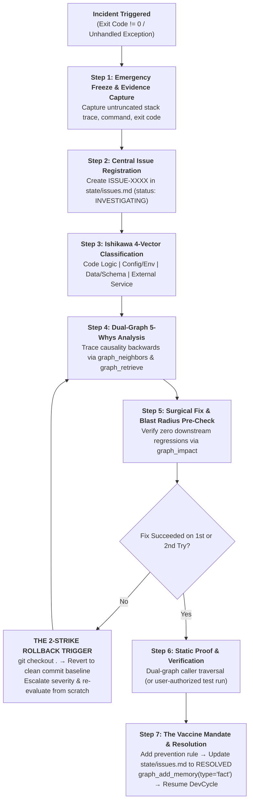

# Master Incident RCA & Rollback Runbook

> **OPERATIONAL CONTRACT:**  
> This runbook is triggered automatically whenever an error occurs, a terminal command exits with code $\ne 0$, or the user invokes `/incident-rca`. All feature development is frozen until the incident is fully resolved and verified.

---

## The 7-Step Incident Response Sequence



---

## Step 1: Emergency Freeze & Evidence Capture

1. **Freeze Execution:** The agent is **HARD-BLOCKED** from modifying any file or trying alternative commands.
2. **Capture Raw Telemetry:** Record the exact state into memory:
   - Command executed.
   - Exact exit code.
   - Complete, untruncated terminal output / stack trace.
   - Active Git branch and active WBS task ID.
   - Timestamp in UTC.

---

## Step 2: Central Issue Registration (`state/issues.md`)

Create a formal entry in `state/issues.md` (or `.agents/state/issues.md`) using the next sequential ID:

```markdown
## ISSUE-[XXXX]: [Short Imperative Failure Title]

- **Status:** INVESTIGATING
- **Severity:** [CRITICAL | HIGH | MEDIUM | LOW]
- **Date:** YYYY-MM-DD HH:MM:SS UTC
- **Active Task:** Task-X.Y
- **Host Component:** [Frontend | Backend | Database | Auth | Indexer]

### 1. Raw Execution Evidence
- **Command Executed:** `[Exact command]`
- **Exit Code:** `[Code]`
- **Full Stack Trace:**
```text
[Paste complete untruncated output here]
```
```

---

## Step 3: Ishikawa Fishbone 4-Vector Classification

Classify the primary failure seam into one of the 4 enterprise categories:

| Category | Typical Failure Symptoms | Primary Diagnostic Tool |
|---|---|---|
| **1. Code Logic** | Null pointer, type error, broken syntax, off-by-one | `graph_read(file::symbol)` |
| **2. Environment & Config** | Missing `.env`, port collision, PATH resolution, wrong Node/Python | `doctor.py --json` |
| **3. Data & Schema** | Missing DB column, unmigrated table, stale cache, JSON parse error | Database schema inspection |
| **4. External Service** | Rate limit (429), timeout, token expired, upstream API breaking change | Adapter seam inspection |

---

## Step 4: Dual-Graph 5-Whys Root Cause Analysis

Do not guess. Trace the causality backwards through at least 5 layers using GrapeRoot dual-graph tools:

```markdown
### 3. The 5-Whys Root Cause Analysis
1. **Why 1 (Symptom):** Why did the process crash or test fail?
   → [Answer grounded in log trace]
2. **Why 2 (Immediate Cause):** Why was that variable undefined or endpoint unresponsive?
   → [Answer verified by graph_read]
3. **Why 3 (Mechanism):** Why was that state or payload not delivered?
   → [Answer verified by caller inspection via graph_neighbors]
4. **Why 4 (Upstream Seam):** Why did the caller assume a conflicting contract?
   → [Answer verified by interface inspection]
5. **Why 5 (Root Cause):** What architectural gap, missing validation, or configuration assumption allowed this flaw to exist?
   → [Fundamental architectural root cause]
```

---

## Step 5: Surgical Fix & Blast Radius Pre-Check

1. **Calculate Blast Radius:** Before modifying any file to apply the fix, execute:
   ```json
   graph_impact(changed_files=["path/to/target.ts"])
   ```
   Verify that modifying the target function will not break adjacent callers.
2. **Apply Minimal Surgical Patch:**
   - Modify **ONLY** the minimal code required to resolve Root Cause (Why 5).
   - Spontaneous reformatting, variable renaming, or unrelated cleanups are **STRICTLY PROHIBITED**.
3. **Immediate Graph Sync:**
   - Execute `graph_register_edit(files=[...], summary="Fixed ISSUE-XXXX: ...")` in the same turn.

---

## Step 6: The 2-Strike Rollback Trigger

To prevent the agent from digging an inescapable hole of broken patches:
- **Attempt 1:** Apply the surgical fix and verify statically.
- **Attempt 2:** If Attempt 1 fails, re-inspect causality and apply a revised fix.
- **The Strike 2 Hard Halt:** If Attempt 2 fails:
  ```bash
  git checkout .
  ```
  The agent **MUST REVERT ALL EDITS** back to the clean commit baseline. It must halt, mark the issue `SEVERITY: CRITICAL`, and present the blocker to the human developer.

---

## Step 7: The Vaccine Mandate & Resolution Sign-Off

An issue cannot be marked `RESOLVED` without a **Post-Mortem Prevention Rule (The Vaccine)**:

1. **Define the Vaccine:**
   > *"What specific TypeScript typing constraint, runtime schema check, or architectural invariant do we add to ensure this bug can NEVER physically happen again?"*
2. **Update `state/issues.md`:**
   - Change status to `RESOLVED`.
   - Record the surgical fix summary, verification proof, and the vaccine rule.
3. **Compounding Memory Sync:**
   ```json
   graph_add_memory(
     type="fact",
     content="Resolved ISSUE-XXXX: [Root cause fixed with vaccine constraint]",
     tags=["incident", "rca", "resolved"]
   )
   ```
4. **Resume Active Lifecycle:**
   - Return cleanly to the active leaf task in `devcycle.md` at Phase 4 Verification.
