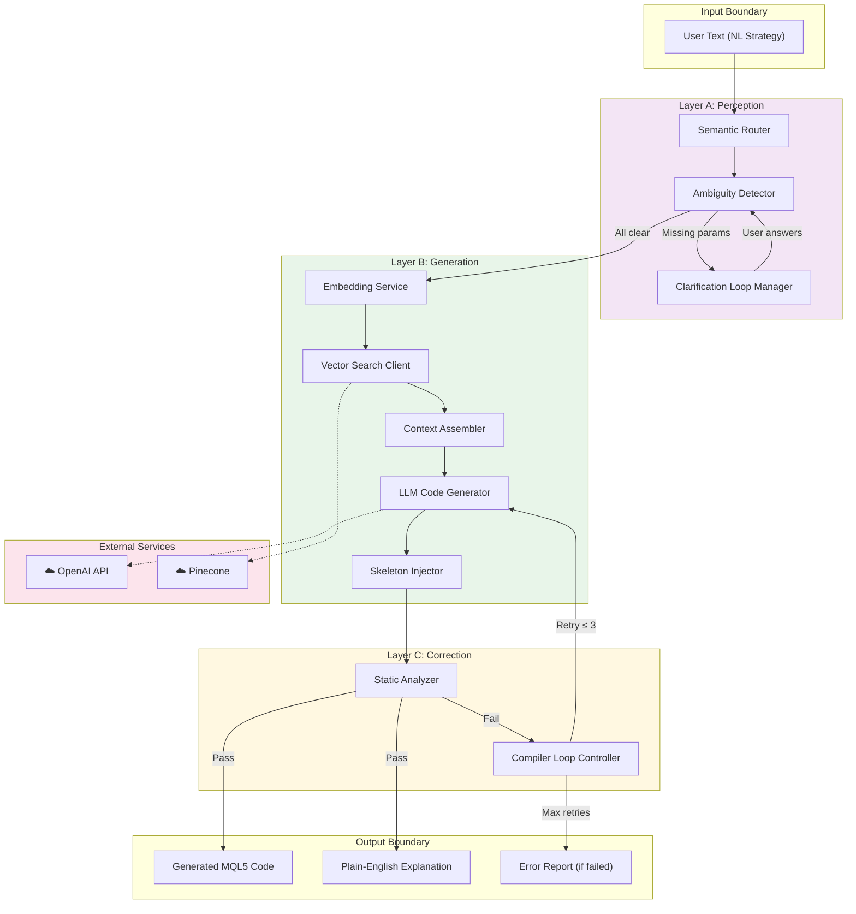
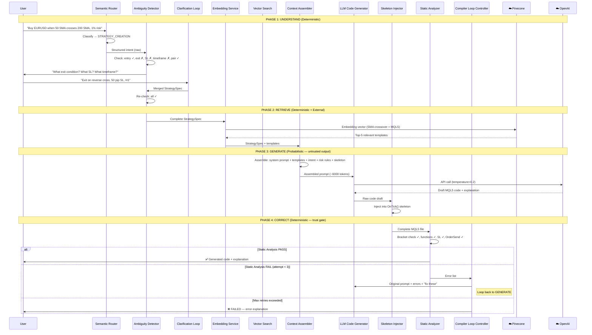
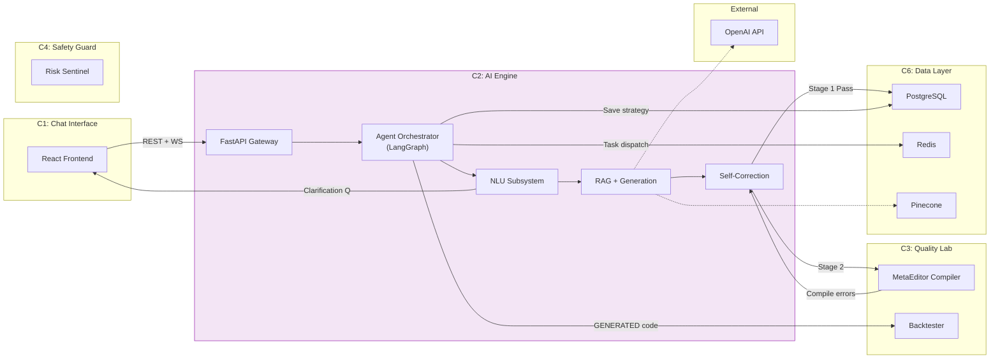

# SmartTradeAI — AI Engine (C2) Architecture Design

> **Prepared by:** AI / Inference Systems Architect  
> **Date:** 2026-03-14  
> **Scope:** AI Engine (C2) — Internal architecture, inference pipeline, integration, and safety boundaries  
> **Documents Reviewed:** FYP Proposal, Technical Review, Component Overviews, System Architecture Diagrams, Chapter 4 System Design, System Design Framework, Project Blueprint, C2 Build Prompt

---

## 1. AI Engine Overview

### 1.1 Role Within the Platform

The AI Engine (C2) is the **cognitive core** of the SmartTradeAI platform. It is the only subsystem that transforms unstructured human language into structured, compilable, platform-specific trading code. Every other component either feeds into it (C1 sends user text), consumes its output (C3 validates, C5 executes), or supports it (C6 stores data).

### 1.2 Core Responsibility

> **Single sentence:** Take a trader's natural-language strategy description and produce compilable MQL5 code, along with a plain-English explanation, through a pipeline of intent understanding, knowledge retrieval, LLM-based generation, and iterative self-correction.

### 1.3 What the AI Engine IS and IS NOT

| AI Engine IS | AI Engine IS NOT |
|---|---|
| An NLP-to-code translation system | A backtesting engine (that's C3) |
| An agentic orchestrator with clarification loops | A trade execution system (that's C4+C5) |
| A RAG-grounded inference pipeline | A general-purpose chatbot |
| A self-correcting code generator | A fine-tuned code LLM (it uses prompt engineering + RAG, not fine-tuning) |

### 1.4 Capabilities Extracted from Documentation

| # | Capability | Source Requirement | Description |
|---|---|---|---|
| CAP-1 | **Intent Classification** | FR-02 | Classify user input as STRATEGY_CREATION, STRATEGY_REFINEMENT, CLARIFICATION_RESPONSE, or EXPLANATION_REQUEST |
| CAP-2 | **Ambiguity Detection** | FR-02 | Detect missing parameters (entry, exit, SL, timeframe, instrument) and generate targeted clarification questions |
| CAP-3 | **Clarification Loop** | FR-02 | Manage multi-turn Q&A state, track resolved variables, resume workflow when complete |
| CAP-4 | **RAG-Grounded Retrieval** | FR-04 | Query Pinecone for authoritative MQL5 documentation and pre-validated code templates |
| CAP-5 | **Prompt Assembly** | FR-04 | Construct a structured LLM prompt: user intent + retrieved templates + system rules + mandatory risk blocks + code skeleton |
| CAP-6 | **LLM Code Generation** | FR-03 | Call OpenAI API with assembled prompt, receive raw MQL5 code draft |
| CAP-7 | **Skeleton Injection** | FR-04 | Inject LLM-generated logic into pre-validated MQL5 code skeletons (imports, class structure, event loop) |
| CAP-8 | **Self-Correction Loop** | FR-06 | Stage 1: Python static analysis (fast, ~2s) → Stage 2: error feedback to LLM → retry (max 3 iterations) and here we will also add another that is related to the compilation of the mql generated code in wine metaeditor contianer and then we will again feed the error to the llm and then retry } |
| CAP-9 | **Plain-English Explanation** | FR-05 | Generate a human-readable mapping from user intent to generated code blocks |
| CAP-10 | **Task Queuing** | FR-03 | Queue code generation as async Celery tasks with unique IDs and real-time status updates |

---

## 2. AI Engine Architecture

### 2.1 Architectural Style

The AI Engine follows a **pipeline-with-feedback-loops** architecture, orchestrated as an **agentic directed graph** via LangGraph. Unlike a linear pipeline where each stage runs once, stages can:

- **Loop back** — self-correction feeds errors back to the generator
- **Branch** — ambiguity detection branches to clarification or generation
- **Pause and resume** — clarification loop suspends the pipeline, awaits user input, then resumes

### 2.2 Layered Internal Structure

The AI Engine has **three internal layers**, each with a distinct trust level:

```
┌─────────────────────────────────────────────────────┐
│  LAYER A: PERCEPTION (Understanding)                │
│  ┌─────────────┐  ┌──────────────┐  ┌────────────┐  │
│  │  Semantic   │→ │  Ambiguity   │→ │Clarification│ │
│  │  Router     │  │  Detector    │  │Loop Manager │ │
│  └─────────────┘  └──────────────┘  └────────────┘  │
├─────────────────────────────────────────────────────┤
│  LAYER B: GENERATION (Producing)                    │
│  ┌─────────────┐  ┌──────────────┐  ┌────────────┐  │
│  │  RAG        │→ │  Context     │→ │ LLM Code   │  │
│  │  Pipeline   │  │  Assembler   │  │ Generator  │  │
│  └─────────────┘  └──────────────┘  └────────────┘  │
│                                      ┌────────────┐ │
│                                      │ Skeleton   │ │
│                                      │ Injector   │ │
│                                      └────────────┘ │
├─────────────────────────────────────────────────────┤
│  LAYER C: CORRECTION (Validating & Looping)         │
│  ┌─────────────┐  ┌──────────────┐                  │
│  │  Static     │← │  Compiler    │  (feedback loop) │
│  │  Analyzer   │→ │  Loop        │                  │
│  └─────────────┘  └──────────────┘                  │
└─────────────────────────────────────────────────────┘
```

| Layer | Trust Level | Principle |
|---|---|---|
| **A: Perception** | Trusted (deterministic) | Rule-based classification and parameter checking — no LLM involved |
| **B: Generation** | Untrusted (probabilistic) | LLM output is treated as an untrusted draft; never passed directly to the user or downstream |
| **C: Correction** | Trusted (deterministic) | Static analysis gates enforce structural validity before output leaves the engine |

### 2.3 Top-Level Architecture Diagram



---

## 3. AI Engine Subsystems

The AI Engine decomposes into **three subsystems**, mapping directly to the three internal layers:

| Subsystem | Internal ID | Purpose | Technology |
|---|---|---|---|
| **NLU Subsystem** (Perception) | SS3.1 + SS3.2 | Understand what the user wants, identify gaps, manage clarification | LangChain, custom classifiers |
| **RAG + Generation Subsystem** (Generation) | SS3.3 + SS3.4 | Retrieve relevant knowledge, build prompts, call LLM, inject skeletons | Pinecone, OpenAI API, LangChain |
| **Self-Correction Subsystem** (Correction) | SS3.4 (loop) | Validate generated code via static analysis, feed errors back, manage retries | Python AST/regex, retry logic |

### 3.1 Subsystem Boundary Rules

1. **NLU Subsystem** has **no access** to the LLM. It uses deterministic rules (parameter checklists, regex classifiers, or a lightweight intent classifier).
2. **Generation Subsystem** is the **only** subsystem that calls external APIs (OpenAI, Pinecone).
3. **Correction Subsystem** operates **only** on the generated code string. It does not make LLM calls itself — it delegates re-generation back to the Generation Subsystem via the Compiler Loop Controller.

---

## 4. Internal Components of Each Subsystem

### 4.1 NLU Subsystem (Perception)

#### 4.1.1 Semantic Router

| Aspect | Detail |
|---|---|
| **Input** | Raw user text (string) |
| **Output** | Intent classification enum: `STRATEGY_CREATION`, `STRATEGY_REFINEMENT`, `CLARIFICATION_RESPONSE`, `EXPLANATION_REQUEST` |
| **Logic** | Classify user input using keyword matching + LLM-based classification (lightweight, single-call). Route to the appropriate downstream handler. |
| **Depends On** | Input Sanitizer (upstream, in C1) |
| **Passes To** | Ambiguity Detector (if CREATE/REFINE), Clarification Loop Manager (if CLARIFICATION_RESPONSE), Explanation Generator (if EXPLANATION_REQUEST) |
| **Error Handling** | If classification confidence is below threshold → default to STRATEGY_CREATION and let Ambiguity Detector handle extraction |

#### 4.1.2 Ambiguity Detector

| Aspect | Detail |
|---|---|
| **Input** | Structured intent from Semantic Router |
| **Output** | Either `AllClear` signal with complete structured spec, or a `ClarificationQuestion` object |
| **Logic** | Check a mandatory parameter checklist: entry condition ✓/✗, exit condition ✓/✗, stop-loss ✓/✗, timeframe ✓/✗, instrument ✓/✗. Generate a targeted question for the **first** missing parameter. |
| **Data Structure** | `StrategySpec { action, pair, entry_condition, exit_condition, stop_loss, take_profit, timeframe, risk_percent, [optional] additional_rules }` |
| **Key Rule** | Does **not** guess or infer missing values. If SL is missing, it asks — it does not assume "50 pips." This prevents silent safety gaps. |

#### 4.1.3 Clarification Loop Manager

| Aspect | Detail |
|---|---|
| **Input** | User's clarification response + current partial `StrategySpec` |
| **Output** | Updated `StrategySpec` → routes back to Ambiguity Detector for re-check |
| **Logic** | Maintain Q&A state per session. Track which variables are resolved. Merge each user answer into the spec. Re-submit to Ambiguity Detector until all required fields are populated. |
| **Timeout** | 5-minute inactivity timeout → save strategy as DRAFT, notify user |
| **Max Rounds** | 5 clarification rounds maximum. If still incomplete → save as DRAFT with partial spec |

---

### 4.2 RAG + Generation Subsystem

#### 4.2.1 Embedding Service

| Aspect | Detail |
|---|---|
| **Input** | Text string (user intent or code chunk) |
| **Output** | Vector embedding (float array) |
| **Technology** | OpenAI `text-embedding-ada-002` (or equivalent) |
| **Usage** | Converts the structured intent into a vector for Pinecone similarity search. Also used during knowledge base ingestion (offline). |

#### 4.2.2 Vector Search Client

| Aspect | Detail |
|---|---|
| **Input** | Embedding vector + namespace identifier |
| **Output** | Top-K relevant code snippets and documentation chunks |
| **Logic** | Queries Pinecone with namespace isolation: `mql5_docs` (MQL5 documentation), `pine_docs` (Pine Script, future), `risk_templates` (risk management patterns). Returns ranked results by cosine similarity. |
| **Parameters** | `top_k=5`, `min_score=0.75` (configurable) |
| **Fallback** | If Pinecone is unavailable → degrade to template-only generation using locally cached "Golden Templates" |

#### 4.2.3 Context Assembler

| Aspect | Detail |
|---|---|
| **Input** | Structured intent (`StrategySpec`) + retrieved RAG results + system configuration |
| **Output** | Assembled LLM prompt (string) |
| **Prompt Structure** | See Section 5.3 for detailed prompt template |
| **Components Assembled** | 1. System instructions (role, constraints, output format) → 2. Retrieved code templates → 3. User's structured intent → 4. Mandatory risk injection rules → 5. Code skeleton template → 6. Output format requirements |
| **Key Rule** | **Mandatory risk injection** — every assembled prompt includes instructions to inject stop-loss logic, position sizing, and error handling into the generated code, regardless of whether the user mentioned them. |

#### 4.2.4 LLM Code Generator

| Aspect | Detail |
|---|---|
| **Input** | Assembled prompt from Context Assembler |
| **Output** | Raw MQL5 code draft (string) + plain-English explanation |
| **Technology** | OpenAI API (`gpt-4` or `gpt-4o`) |
| **Parameters** | `temperature=0.2` (low for code generation), `max_tokens=4096`, `top_p=0.95` |
| **Error Handling** | API timeout → retry with exponential backoff (3 attempts). Rate limit → queue with delay. API unavailable → task marked FAILED, user notified. |
| **Cost Control** | Token budget per generation: ~6000 input + ~4000 output. Logged per request for cost tracking. |

#### 4.2.5 Skeleton Injector

| Aspect | Detail |
|---|---|
| **Input** | Raw LLM-generated code |
| **Output** | Complete MQL5 file with proper structure |
| **Logic** | Maintains a library of pre-validated MQL5 code skeletons. Injects the LLM-generated logic (indicator calculations, entry/exit rules, risk management) into the appropriate placeholders within the skeleton. The skeleton guarantees: correct `#include` statements, `OnInit()` / `OnDeinit()` / `OnTick()` event handlers, proper input parameter declarations, compilation-safe structure. |
| **Key Principle** | The LLM fills **logic within functions**. The skeleton provides **structural scaffolding**. This reduces the hallucination surface from "entire program" to "logic within a function." |

---

### 4.3 Self-Correction Subsystem

#### 4.3.1 Static Analyzer

| Aspect | Detail |
|---|---|
| **Input** | Complete MQL5 code file (string) |
| **Output** | `PASS` or `FAIL` with structured error list |
| **Checks Performed** | 1. Bracket balancing (all `{` have matching `}`) → 2. Required function presence (`OnInit`, `OnDeinit`, `OnTick`) → 3. Required input parameter declarations → 4. Stop-loss variable assignment check → 5. `OrderSend()` call parameter count validation → 6. Known-bad pattern detection (deprecated functions, infinite loops) |
| **Technology** | Python regex + custom parser (not a full MQL5 compiler — that's in C3 via MetaEditor) |
| **Speed** | ~2 seconds per analysis (fast enough for synchronous use in the loop) |

#### 4.3.2 Compiler Loop Controller

| Aspect | Detail |
|---|---|
| **Input** | Static analysis result (PASS/FAIL + errors) |
| **Output** | Either the validated code (on PASS) or a re-generation request to LLM Code Generator (on FAIL) |
| **Logic** | Maintains a retry counter. On FAIL: formats the error list into a structured feedback prompt, appends it to the original prompt context, calls LLM Code Generator again. On PASS: emits the code to the output boundary. On max retries (3): marks the task FAILED, returns error report to user. |
| **Retry Context** | Each retry includes: the original prompt, the previous draft, the specific errors found, and the instruction "Fix ONLY the following errors without changing working logic." |
| **Escalation** | After Stage 1 (static analysis) passes, the code proceeds to C3 (Quality Lab) for Stage 2 — real MetaEditor compilation via Docker+Wine. If Stage 2 fails, compiler errors are fed back through the same loop for up to 2 additional retries (total budget: 5 attempts across both stages, as documented in the C2 overview). |

---

## 5. Inference Flow Through the System

### 5.1 End-to-End Inference Pipeline



### 5.2 Data Transformations at Each Stage

| Stage | Input Form | Output Form | Transformation |
|---|---|---|---|
| 1. Classification | Raw text string | Intent enum + raw text | NLP classification |
| 2. Ambiguity Check | Raw text + intent | `StrategySpec` (structured JSON) | Parameter extraction & validation |
| 3. Clarification | Partial spec + user answer | Complete `StrategySpec` | Merge & re-validate |
| 4. Embedding | `StrategySpec` text representation | Float vector (1536-dim) | Neural embedding |
| 5. Retrieval | Embedding vector | List of code snippets + docs | Cosine similarity search |
| 6. Prompt Assembly | Spec + snippets + rules + skeleton | Prompt string (~6000 tokens) | Template composition |
| 7. LLM Generation | Prompt string | Raw code string + explanation | LLM inference |
| 8. Skeleton Injection | Raw code block | Complete MQL5 file | Template injection |
| 9. Static Analysis | MQL5 file string | PASS/FAIL + error list | Deterministic parsing |
| 10. Correction Loop | Errors + original prompt | Revised prompt | Error-to-prompt formatting |

### 5.3 Prompt Template Structure

```
┌──────────────────────────────────────────────────┐
│ SYSTEM INSTRUCTIONS                              │
│ "You are an expert MQL5 developer..."            │
│ "Always include stop-loss logic..."              │
│ "Never use deprecated functions..."              │
│ "Output format: code block + explanation"        │
├──────────────────────────────────────────────────┤
│ RETRIEVED CONTEXT (from Pinecone)                │
│ Template 1: SMA crossover indicator example      │
│ Template 2: OrderSend() best practices           │
│ Template 3: Risk management module               │
│ Docs: OnTick() event handler reference           │
├──────────────────────────────────────────────────┤
│ USER INTENT (structured)                         │
│ { action: BUY, pair: EURUSD,                     │
│   entry: SMA(50) > SMA(200),                     │
│   exit: SMA(50) < SMA(200),                      │
│   stop_loss: 50 pips, risk: 1%,                  │
│   timeframe: H1 }                                │
├──────────────────────────────────────────────────┤
│ MANDATORY RISK INJECTION RULES                   │
│ "All strategies MUST include:"                   │
│ - Position sizing: lots = (equity × risk%) / SL  │
│ - Stop-loss assignment before OrderSend()        │
│ - Error handling for OrderSend() return codes     │
├──────────────────────────────────────────────────┤
│ CODE SKELETON                                    │
│ #include <Trade/Trade.mqh>                       │
│ input double RiskPercent = 1.0;                  │
│ int OnInit() { /* your init code */ }            │
│ void OnTick() { /* YOUR LOGIC HERE */ }          │
│ void OnDeinit(const int reason) { }              │
└──────────────────────────────────────────────────┘
```

---

## 6. Integration with the Overall Platform

### 6.1 Integration Map



### 6.2 Integration Points Detail

| # | Integration Point | Direction | Protocol | Data Exchanged | Failure Behavior |
|---|---|---|---|---|---|
| **IP-1** | C1 → C2 | Inbound | REST `POST /api/v1/intent` | `{ text: string, session_id: string }` | 400 if text empty; 401 if JWT invalid |
| **IP-2** | C2 → C1 | Outbound | WebSocket | Clarification questions, status updates, generated code, explanations | If WS disconnects, queue events in Redis for re-delivery |
| **IP-3** | C2 → Pinecone | Outbound | HTTPS API | Embedding vectors → Top-K results | Degrade to template-only generation (cached golden templates) |
| **IP-4** | C2 → OpenAI | Outbound | HTTPS API | Assembled prompt → generated code | Retry 3× with backoff. If unavailable → FAIL task, notify user |
| **IP-5** | C2 → C3 | Outbound | Internal (Celery task) | MQL5 code file → compilation result | Compile errors routed back through Compiler Loop |
| **IP-6** | C2 → C6 (PostgreSQL) | Outbound | SQL (via SQLAlchemy) | Strategy CRUD, status transitions, audit logs | Transaction rollback on failure; system enters read-only |
| **IP-7** | C2 → C6 (Redis) | Bidirectional | Redis protocol | Task queuing (Celery), session state, rate-limiter counters | If Redis down → task dispatch blocked; system partially unavailable |
| **IP-8** | C1 → C2 (Clarification) | Inbound | REST `POST /api/v1/clarify` | `{ answer: string, session_id: string }` | Timeout after 5 min → save as DRAFT |

### 6.3 Async Task Architecture

```
┌──────────┐     ┌─────────┐     ┌──────────────────┐
│ FastAPI   │────→│  Redis   │────→│  Celery Worker   │
│ (producer)│     │  Queue   │     │  (consumer)      │
└──────────┘     └─────────┘     │                  │
                                  │  GenAI Worker    │ ← handles code generation tasks
                                  │  Quant Worker    │ ← handles backtesting tasks
                                  └──────────────────┘
```

**Why Async?** Code generation (3-10s) and backtesting (30-120s) are too slow for synchronous HTTP. The API immediately returns a `task_id`, and the frontend polls status via WebSocket.

**Task Contract:**

```json
// Task dispatch
{
  "task_type": "generate_strategy",
  "task_id": "uuid",
  "payload": {
    "strategy_spec": { ... },
    "session_id": "uuid",
    "user_id": "uuid"
  }
}

// Task result (via WebSocket)
{
  "task_id": "uuid",
  "status": "completed",
  "result": {
    "code_mql5": "...",
    "explanation": "...",
    "retry_count": 1
  }
}
```

---

## 7. Key Architectural Considerations

### 7.1 Safety Boundaries

> [!CAUTION]
> The AI Engine generates code that, if executed, interacts with real financial markets. Every safety consideration below is a **hard requirement**, not a "nice to have."

| # | Safety Concern | Mitigation | Enforcement Point |
|---|---|---|---|
| S-1 | **LLM hallucination** | RAG grounding + skeleton injection reduces hallucination surface to "logic within a function" | Context Assembler + Skeleton Injector |
| S-2 | **Missing stop-loss in generated code** | Mandatory risk injection in every prompt + static analyzer checks for SL assignment | Context Assembler (prompt) + Static Analyzer (check) |
| S-3 | **Infinite self-correction loop** | Hard cap: 3 retries in Stage 1, 5 total across both stages | Compiler Loop Controller |
| S-4 | **Prompt injection from user input** | Client-side regex sanitization (C1) + server-side input validation | Input Sanitizer (C1) + API Gateway (C2) |
| S-5 | **LLM API cost explosion** | Token budget per request (~10K total), rate limiter (5 generations/min), cost logging | Rate Limiter + Token counter |
| S-6 | **Code passes static analysis but is logically wrong** | This is explicitly handled by C3 (backtesting + stress testing), not by C2. C2 guarantees structural validity, not logical correctness. | Boundary: C2 guarantees syntax. C3 guarantees behavior. |

### 7.2 Trust Boundaries

```
┌─────────────────────────────────────────────────────────┐
│                    TRUSTED ZONE                         │
│  (Deterministic, rule-based, auditable)                 │
│                                                         │
│  ┌────────────┐  ┌──────────────┐  ┌────────────────┐  │
│  │ Semantic   │  │  Ambiguity   │  │   Static       │  │
│  │ Router     │  │  Detector    │  │   Analyzer     │  │
│  └────────────┘  └──────────────┘  └────────────────┘  │
│                                                         │
├────────────── TRUST BOUNDARY ───────────────────────────┤
│                                                         │
│                    UNTRUSTED ZONE                        │
│  (Probabilistic, non-deterministic, must be validated)  │
│                                                         │
│  ┌────────────┐  ┌──────────────┐                       │
│  │ LLM Code   │  │  OpenAI API  │                       │
│  │ Generator  │  │  (external)  │                       │
│  └────────────┘  └──────────────┘                       │
│                                                         │
│  OUTPUT FROM THIS ZONE NEVER REACHES THE USER           │
│  OR DOWNSTREAM SYSTEMS WITHOUT PASSING THROUGH          │
│  THE STATIC ANALYZER (TRUSTED ZONE)                     │
└─────────────────────────────────────────────────────────┘
```

### 7.3 Validation Chain — No Bypass Rule

The system enforces a **4-gate validation chain** that no code path can bypass:

```
LLM Output → Gate 1: Static Analysis (C2)
           → Gate 2: MetaEditor Compilation (C3)
           → Gate 3: Backtest + Stress Test (C3)
           → Gate 4: Risk Sentinel Pre-Trade Check (C4)
           → Execution (C5)
```

**Only Gate 1 is inside the AI Engine.** Gates 2-4 are external to C2, ensuring that the AI Engine cannot self-approve its own output for execution.

### 7.4 State Management

The AI Engine must manage two types of state:

| State Type | Storage | Lifetime | Examples |
|---|---|---|---|
| **Conversation state** | Redis | Session-scoped (TTL: 30 min) | Current `StrategySpec`, clarification history, retry counter |
| **Strategy state** | PostgreSQL | Persistent | Strategy record with status enum, generated code, robustness score |

**State transition rules enforced by the AI Engine:**

| Transition | Guard Condition | Triggered By |
|---|---|---|
| `DRAFT → GENERATING` | User submits text | API endpoint |
| `GENERATING → CLARIFYING` | Ambiguity Detector finds missing params | Ambiguity Detector |
| `CLARIFYING → GENERATING` | User provides clarification | Clarification Loop Manager |
| `GENERATING → GENERATED` | Static analysis passes | Compiler Loop Controller |
| `GENERATING → FAILED` | 3 retries exhausted | Compiler Loop Controller |

> Transitions beyond `GENERATED` (→ VALIDATING → VALIDATED → APPROVED → ACTIVE) are managed by C3, C4, and the Strategy Lifecycle Manager, **not** by the AI Engine.

### 7.5 Observability Requirements

| What to Log | Why | Where |
|---|---|---|
| Every LLM API call (prompt hash, token count, latency, cost) | Cost tracking, debugging, performance monitoring | `audit_logs` table + structured logging |
| Every retry in self-correction loop (attempt #, error type) | Identify systematic generation failures | `audit_logs` table |
| Every Pinecone query (namespace, top-K scores, latency) | RAG quality monitoring, knowledge base coverage gaps | Structured logging |
| Every intent classification result | Accuracy tracking, classifier improvement | Structured logging |
| Clarification questions asked (type, count per session) | UX quality, spec completeness analysis | `audit_logs` table |

### 7.6 Scalability Considerations

| Concern | Current Design | Scale Strategy |
|---|---|---|
| **LLM call latency** (3-10s) | Async via Celery workers, immediate `task_id` return | Add more Celery workers to parallelize |
| **Pinecone query volume** | Single namespace, Top-5 queries | Pinecone scales horizontally (managed service) |
| **Concurrent generation requests** | Redis-backed rate limiter (5/min per user) | Increase worker pool, add per-user queueing |
| **Knowledge base growth** | ~30 templates initially | Pinecone supports millions of vectors; chunk management is the real cost |

### 7.7 Known Limitations (Honest Assessment)

| # | Limitation | Impact | Mitigation |
|---|---|---|---|
| L-1 | **LLM code quality depends on knowledge base coverage.** If the user requests an indicator not in Pinecone, the LLM falls back to its training data, which may hallucinate MQL5 syntax. | Generation may fail more often for niche strategies | Prioritize the 20 most common indicators/patterns in the knowledge base. Accept that edge cases may require manual intervention. |
| L-2 | **Static analysis is not a real compiler.** Stage 1 catches structural issues but not semantic bugs (e.g., using wrong indicator buffer index). | Some code may pass Stage 1 but fail Stage 2 (MetaEditor compilation). | This is by design — Stage 1 is a fast pre-filter. Stage 2 (C3) is the authoritative compiler. |
| L-3 | **Single LLM provider (OpenAI).** No fallback, no circuit breaker to alternative providers. | If OpenAI is down, all generation tasks fail. | Log as a known risk. Future: add provider abstraction layer with fallback to secondary model. |
| L-4 | **Clarification loop is text-only.** Cannot ask "show me on a chart" or handle image-based strategy descriptions. | Users must describe strategies entirely in text. | Acceptable for MVP. Future: add image/chart understanding. |

---

## Appendix A: Component-to-File Mapping (Recommended)

> This is a suggested project structure for when implementation begins.

```
backend/
├── app/
│   ├── api/
│   │   ├── routes/
│   │   │   ├── intent.py          # POST /api/v1/intent
│   │   │   ├── clarify.py         # POST /api/v1/clarify
│   │   │   └── strategy.py        # Strategy CRUD endpoints
│   │   └── middleware/
│   │       ├── auth.py            # JWT Auth Guard
│   │       └── rate_limiter.py    # Redis-backed rate limiter
│   │
│   ├── ai_engine/                 # ← All C2 components live here
│   │   ├── __init__.py
│   │   ├── perception/            # Layer A: NLU Subsystem
│   │   │   ├── semantic_router.py
│   │   │   ├── ambiguity_detector.py
│   │   │   └── clarification_manager.py
│   │   ├── generation/            # Layer B: RAG + Generation
│   │   │   ├── embedding_service.py
│   │   │   ├── vector_search.py
│   │   │   ├── context_assembler.py
│   │   │   ├── llm_code_generator.py
│   │   │   └── skeleton_injector.py
│   │   ├── correction/            # Layer C: Self-Correction
│   │   │   ├── static_analyzer.py
│   │   │   └── compiler_loop.py
│   │   ├── schemas/               # Data structures
│   │   │   ├── strategy_spec.py   # StrategySpec dataclass
│   │   │   ├── generation_request.py
│   │   │   └── analysis_result.py
│   │   └── orchestrator.py        # LangGraph workflow definition
│   │
│   ├── tasks/
│   │   ├── generation_task.py     # Celery task: generate_strategy
│   │   └── backtest_task.py       # Celery task: run_backtest
│   │
│   └── core/
│       ├── config.py              # Environment variables, API keys
│       └── database.py            # SQLAlchemy session management
│
├── skeletons/                     # Pre-validated code templates
│   ├── mql5_base.mqh
│   ├── mql5_sma_crossover.mqh
│   └── mql5_risk_module.mqh
│
└── tests/
    └── ai_engine/
        ├── test_semantic_router.py
        ├── test_ambiguity_detector.py
        ├── test_context_assembler.py
        └── test_static_analyzer.py
```

---

## Appendix B: Key Data Structures

```python
# StrategySpec — the central data structure flowing through the AI Engine
@dataclass
class StrategySpec:
    action: Literal["BUY", "SELL", "BOTH"]
    pair: str                          # e.g., "EURUSD"
    entry_condition: Optional[str]     # e.g., "SMA(50) crosses above SMA(200)"
    exit_condition: Optional[str]      # e.g., "SMA(50) crosses below SMA(200)"
    stop_loss: Optional[str]           # e.g., "50 pips" or "2x ATR"
    take_profit: Optional[str]         # e.g., "100 pips"
    timeframe: Optional[str]           # e.g., "H1", "M15"
    risk_percent: Optional[float]      # e.g., 1.0
    additional_rules: List[str]        # e.g., ["Only trade London session"]

# GenerationResult — output of the AI Engine
@dataclass
class GenerationResult:
    status: Literal["SUCCESS", "FAILED"]
    code_mql5: Optional[str]
    explanation: Optional[str]
    retry_count: int
    errors: Optional[List[str]]        # populated if FAILED
    token_usage: TokenUsage            # for cost tracking
    generation_time_ms: int

# AnalysisResult — output of Static Analyzer
@dataclass
class AnalysisResult:
    passed: bool
    errors: List[AnalysisError]

@dataclass
class AnalysisError:
    line: Optional[int]
    error_type: str                    # e.g., "MISSING_FUNCTION", "BRACKET_MISMATCH"
    message: str
    severity: Literal["ERROR", "WARNING"]
```
