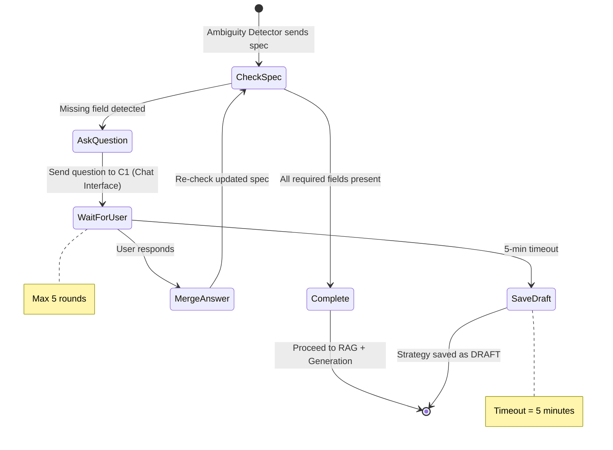

# SmartTradeAI — C2 AI Engine: Clarification Document

> **Prepared by:** AI / Inference Systems Architect  
> **Date:** 2026-03-14  
> **Purpose:** Deep-dive answers to all clarification questions raised during the C2 Architecture Review  
> **Reference Document:** C2_AI_Engine_Architecture.md

---

## Table of Contents

1. [Semantic Router](#1-semantic-router)
2. [Ambiguity Detection](#2-ambiguity-detection)
3. [Clarification Loop](#3-clarification-loop)
4. [Pinecone, Vector Search & Pre-Validated Templates](#4-pinecone-vector-search--pre-validated-templates)
5. [Prompt Assembly](#5-prompt-assembly)
6. [Skeleton Injection](#6-skeleton-injection)
7. [Plain-English Explanation Generation](#7-plain-english-explanation-generation)
8. [Architectural Style — Stages & Feedback Loops (Section 2.1)](#8-architectural-style--stages--feedback-loops)
9. [Context Assembler vs Prompt Assembler (Section 2.2)](#9-context-assembler-vs-prompt-assembler)
10. [Compiler Loop — Why in C2?](#10-compiler-loop--why-in-c2)
11. [Static Analyzer — Why, How, and Best Options](#11-static-analyzer--why-how-and-best-options)

---

## 1. Semantic Router

### 1.1 What Is It?

A **Semantic Router** is a decision-making layer that sits at the front door of an AI system. Before any LLM call happens, the Semantic Router looks at the user's input and decides:

> "What **type** of request is this? Where should I send it?"

Think of it like a **hospital reception desk**. When you walk in, the receptionist doesn't treat you — they figure out whether you need the emergency room, a general checkup, or a specialist. The Semantic Router does the same thing for user messages.

In our system, it classifies every incoming message into one of four intents:

| Intent | What It Means | Example User Input |
|---|---|---|
| `STRATEGY_CREATION` | User wants to build a new trading strategy | "Buy EURUSD when RSI drops below 30" |
| `STRATEGY_REFINEMENT` | User wants to modify an existing strategy | "Change my SMA strategy to use EMA instead" |
| `CLARIFICATION_RESPONSE` | User is answering a question we asked them | "50 pips SL, H1 timeframe" |
| `EXPLANATION_REQUEST` | User wants to understand something | "How does my generated strategy work?" |

### 1.2 Why Do We Need It?

Without a Semantic Router, every user message would go through the **entire pipeline** — embedding, RAG retrieval, LLM call, code generation. That's wasteful and expensive because:

1. **Cost** — If a user says "50 pips SL" (answering our clarification question), we don't need to call the LLM or Pinecone. We just need to merge that answer into the existing `StrategySpec`. Without a router, we'd waste an LLM call (~$0.03-0.10) on something that needs zero AI.
2. **Speed** — Routing takes ~50ms. An unnecessary LLM call takes 3-10 seconds. For `CLARIFICATION_RESPONSE`, routing saves 3-10 seconds.
3. **Correctness** — Different intents require different processing. A `STRATEGY_CREATION` needs parameter extraction and RAG retrieval. An `EXPLANATION_REQUEST` just needs the LLM to explain existing code. Mixing them up produces wrong results.

### 1.3 Best 3 Ways to Implement It

#### Approach 1: Embedding-Based Semantic Router (Recommended for Our System)

**How it works:** You pre-define a set of "example utterances" for each intent. At runtime, the user's input is embedded into a vector, and you compare it to the pre-defined examples using cosine similarity. The closest match wins.

```python
# Pseudo-code using the semantic-router library
from semantic_router import Route, SemanticRouter

strategy_route = Route(
    name="STRATEGY_CREATION",
    utterances=[
        "Buy EURUSD when RSI is below 30",
        "Create a scalping strategy for GBPUSD",
        "I want to trade gold using moving averages",
        "Build me an EA that sells when MACD crosses below signal",
    ]
)

clarification_route = Route(
    name="CLARIFICATION_RESPONSE",
    utterances=[
        "50 pips",
        "H1 timeframe",
        "Use EURUSD",
        "Yes, add a trailing stop",
    ]
)

router = SemanticRouter(routes=[strategy_route, clarification_route, ...])
result = router("Buy EURUSD when 50 SMA crosses 200")  
# → "STRATEGY_CREATION"
```

- **Speed:** ~50ms (vector comparison, no LLM call)
- **Accuracy:** 90-95% for well-defined intent categories
- **Cost:** $0 per classification (no API call)
- **Library:** [aurelio-labs/semantic-router](https://github.com/aurelio-labs/semantic-router) (open source)

#### Approach 2: Keyword + Rule-Based Classification

**How it works:** Use regex patterns and keyword matching to classify intents. Simple, deterministic, zero external dependencies.

```python
import re

def classify_intent(text: str, has_pending_clarification: bool) -> str:
    if has_pending_clarification:
        return "CLARIFICATION_RESPONSE"
    
    explain_patterns = [r"\bhow does\b", r"\bexplain\b", r"\bwhat does\b"]
    if any(re.search(p, text, re.I) for p in explain_patterns):
        return "EXPLANATION_REQUEST"
    
    refine_patterns = [r"\bchange\b", r"\bmodify\b", r"\bupdate\b", r"\badjust\b"]
    if any(re.search(p, text, re.I) for p in refine_patterns):
        return "STRATEGY_REFINEMENT"
    
    return "STRATEGY_CREATION"  # default
```

- **Speed:** ~1ms
- **Accuracy:** 70-80% (fragile, misses nuance)
- **Cost:** $0
- **Best for:** MVP, prototyping

#### Approach 3: LLM-Based Classification (Single Lightweight Call)

**How it works:** Send the user's text to an LLM with a classification prompt. Most accurate but slowest and most expensive.

```python
response = openai.chat.completions.create(
    model="gpt-4o-mini",  # cheap, fast model
    messages=[{
        "role": "system",
        "content": "Classify the user message into exactly one of: STRATEGY_CREATION, STRATEGY_REFINEMENT, CLARIFICATION_RESPONSE, EXPLANATION_REQUEST. Respond with ONLY the label."
    }, {
        "role": "user",
        "content": user_text
    }],
    temperature=0,
    max_tokens=20
)
```

- **Speed:** 500ms-2s
- **Accuracy:** 95-99%
- **Cost:** ~$0.001 per classification (gpt-4o-mini)
- **Best for:** When you have budget and need maximum accuracy

### 1.4 How Production AI Agents Handle This

#### Cursor AI
Cursor uses **LLM-based routing** internally. When you type in the chat, the underlying LLM (Claude or GPT-4) interprets your intent as part of its system prompt. There's no separate "router" — the LLM itself decides if you're asking for code generation, code explanation, debugging, or refactoring. This works because Cursor's LLM calls are already happening anyway (every interaction is an LLM call), so adding classification to the same call is free.

> **Why we can't copy this:** Cursor uses the LLM for everything. We have deterministic stages (ambiguity detection, parameter extraction) that should NOT use the LLM. We need to route BEFORE any LLM call, which is why a separate Semantic Router exists.

#### OpenAI Codex (ChatGPT's coding agent)
Codex uses an **agent loop** architecture. The LLM itself decides after each turn: "Do I need to write code? Run a command? Ask a question? Search the codebase?" This is essentially LLM-as-router — the model's system prompt contains instructions about when to use which tool.

#### V0 (by Vercel)
V0 uses a **single-purpose design** — it primarily generates UI code. Since it has one main intent (generate React/HTML code from natural language), routing is trivial. The LLM handles all requests as "generate UI" by default.

### 1.5 Our Recommendation for SmartTradeAI

**Use Approach 1 (Embedding-Based Semantic Router)** with a **fallback to Approach 2 (Rule-Based)** for session-context-aware decisions:

```
Step 1: Check session context (rule-based)
   → If session has pending clarification question → CLARIFICATION_RESPONSE

Step 2: Run embedding-based semantic router
   → Compare user text against pre-defined utterance sets
   → Return highest-similarity intent

Step 3: Confidence check
   → If similarity score < 0.6 → default to STRATEGY_CREATION
```

This gives us speed (~50ms), zero LLM cost, and good accuracy.

---

## 2. Ambiguity Detection

### 2.1 What Is It?

**Ambiguity Detection** is the component that checks whether the user has provided enough information to generate a trading strategy. It answers one question:

> "Does the user's input contain ALL the mandatory parameters needed to build an EA (Expert Advisor)?"

In our system, a complete strategy requires:

| Parameter | Required? | Example |
|---|---|---|
| Action (BUY/SELL/BOTH) | ✅ Yes | "Buy" |
| Currency pair | ✅ Yes | "EURUSD" |
| Entry condition | ✅ Yes | "When 50 SMA crosses above 200 SMA" |
| Exit condition | ✅ Yes | "When 50 SMA crosses below 200 SMA" |
| Stop-loss | ✅ Yes | "50 pips" |
| Timeframe | ✅ Yes | "H1" |
| Take profit | ⬜ Optional | "100 pips" |
| Risk percent | ⬜ Optional | "1%" |

If ANY required parameter is missing, the Ambiguity Detector flags it and generates a targeted question for the **first** missing one.

### 2.2 Why Do We Need It?

**Users never give complete instructions.** This is not a guess — it's an industry-proven fact. Studies show that in AI coding agents, **74% of user inputs are underspecified** (ArXiv research on LLM clarification loops).

Real examples from our domain:

| User Says | What's Missing |
|---|---|
| "Build me a moving average strategy" | Pair, entry logic, exit logic, SL, timeframe |
| "Buy EURUSD when RSI < 30" | Exit condition, SL, timeframe |
| "Create an EA for gold scalping on M5" | Entry condition, exit condition, SL |

Without ambiguity detection, the LLM would **guess** the missing values. For a trading system, guessing a stop-loss is **financially dangerous**. If the LLM hallucinates "SL = 500 pips" on a 1% risk account, that's a real money loss when the EA goes live.

> **Core principle:** The Ambiguity Detector NEVER guesses. If stop-loss is missing, it asks. It does NOT assume "50 pips."

### 2.3 Best 3 Ways to Implement It

#### Approach 1: Checklist-Based Extraction (Recommended)

Use the LLM (or a lightweight NER model) to extract parameters into a `StrategySpec`, then check the checklist:

```python
def detect_ambiguity(spec: StrategySpec) -> Optional[ClarificationQuestion]:
    required_fields = {
        "action": "What action? BUY, SELL, or BOTH?",
        "pair": "Which currency pair or instrument?",
        "entry_condition": "What is your entry condition?",
        "exit_condition": "What is your exit condition?",
        "stop_loss": "What stop-loss do you want?",
        "timeframe": "What timeframe? (M1, M5, M15, H1, H4, D1)",
    }
    
    for field, question in required_fields.items():
        if getattr(spec, field) is None:
            return ClarificationQuestion(field=field, question=question)
    
    return None  # All clear
```

- **Deterministic:** Same input always produces the same result
- **Auditable:** You can see exactly which field triggered the question
- **Fast:** ~1ms (no LLM call for the check itself)

#### Approach 2: LLM-Based Gap Analysis

Ask the LLM to analyze the user's input and identify what's missing:

```python
prompt = f"""
Analyze this trading strategy request and identify ALL missing parameters:
User: "{user_text}"

Required: action, pair, entry_condition, exit_condition, stop_loss, timeframe
Optional: take_profit, risk_percent

For each missing required parameter, generate a clear question.
Output JSON: {{"missing": [{{"field": "...", "question": "..."}}]}}
"""
```

- **More natural:** Questions feel conversational
- **More expensive:** Requires an LLM call
- **Less deterministic:** LLM might miss a gap or invent questions

#### Approach 3: Slot-Filling with NER (Named Entity Recognition)

Train (or use) an NER model to extract trading-specific entities:

```
Input: "Buy EURUSD when 50 SMA crosses 200 SMA, 1% risk, H1"
Entities: [BUY=action, EURUSD=pair, SMA_crossover=entry, H1=timeframe, 1%=risk]
Missing: [exit_condition, stop_loss]
```

- **Fast:** NER is typically <100ms
- **Specialized:** Requires training data for trading NER
- **Best for:** High-volume systems with consistent input patterns

### 2.4 How Production AI Agents Handle This

#### Cursor AI
Cursor doesn't have explicit ambiguity detection. It processes every request through its LLM, which may ask follow-up questions if the prompt is vague. But more often, Cursor **makes assumptions** — if you say "build a login page," it picks React, picks a style, picks a layout. In Cursor's domain (code generation), assumptions are low-risk (you can just re-run). In **our domain (trading), assumptions are high-risk** (money loss), so we must be explicit.

#### OpenAI Codex
Codex has a "plan mode" where it breaks down complex tasks and can ask follow-up questions. However, this is **LLM-driven** — the LLM itself decides whether to ask. There's no separate ambiguity detector. The model has instructions like: "If the task is unclear, ask the user before proceeding."

#### V0 (Vercel)
V0 rarely asks for clarification. It takes whatever you give it and generates the best UI it can. This works for UI generation (visual output is easy to iterate on). It would NOT work for trading code (you can't "iterate" on a trade that lost money).

### 2.5 Why Our System Is Different

In Cursor/V0/Codex, the worst case of a bad assumption is **wrong code that doesn't compile** → user sees the error → tries again. Cost: 30 seconds of time.

In SmartTradeAI, the worst case of a bad assumption is **code that compiles and runs but with a wrong stop-loss** → EA trades live → account loses money. Cost: potentially thousands of dollars.

**This is why we have a separate, deterministic Ambiguity Detector** instead of relying on the LLM to "figure it out."

---

## 3. Clarification Loop

### 3.1 What Is It?

The **Clarification Loop** is the multi-turn conversation manager that:
1. Receives the Ambiguity Detector's question (e.g., "What stop-loss do you want?")
2. Sends it to the user via the Chat Interface (C1)
3. Waits for the user's response
4. Merges the response into the `StrategySpec`
5. Sends the updated spec back to the Ambiguity Detector for re-checking
6. Repeats until all required fields are populated (or max rounds hit)

### 3.2 Why Do We Need It?

Because getting a complete strategy specification is rarely a single-shot interaction. Users describe strategies iteratively:

```
Turn 1: User → "Build me a moving average crossover EA"
        System → "Which currency pair?"
Turn 2: User → "EURUSD"
        System → "What entry condition?"
Turn 3: User → "When 50 SMA crosses above 200 SMA"
        System → "What exit condition?"
Turn 4: User → "Reverse cross"
        System → "What stop-loss?"
Turn 5: User → "50 pips, H1 timeframe"
        System → All clear ✅ → Proceed to code generation
```

Without a Clarification Loop, we'd either:
- **Fail** on incomplete input (bad UX)
- **Guess** the missing values (financially dangerous)
- **Force users to fill a form** (defeats the purpose of natural language)

### 3.3 How Does It Actually Work in Our System?



### 3.4 Who Manages It?

The **Clarification Loop Manager** (a component inside the AI Engine's NLU Subsystem) manages it. But it works **collaboratively** with other parts:

| Responsibility | Owner |
|---|---|
| Deciding what to ask | **Ambiguity Detector** (determines which field is missing) |
| Tracking Q&A state per session | **Clarification Loop Manager** (stores partial `StrategySpec` in Redis) |
| Sending questions to the user | **C1 Chat Interface** (via WebSocket event) |
| Receiving user answers | **FastAPI `/api/v1/clarify` endpoint** → routes to Clarification Loop Manager |
| Counting rounds and enforcing limits | **Clarification Loop Manager** (max 5 rounds, 5-min timeout) |
| Orchestrating the overall flow | **LangGraph Orchestrator** (the graph state machine decides when to enter/exit the clarification loop) |

### 3.5 Best 3 Ways to Implement It

#### Approach 1: LangGraph State Machine (Recommended)

LangGraph natively supports **interrupt and resume** — perfect for waiting on user input:

```python
from langgraph.graph import StateGraph

def clarification_node(state):
    question = detect_ambiguity(state["strategy_spec"])
    if question:
        state["pending_question"] = question
        return Command(goto="wait_for_user")  # pause the graph
    return Command(goto="generation")  # proceed

graph = StateGraph(AIEngineState)
graph.add_node("clarification", clarification_node)
graph.add_node("wait_for_user", wait_node)  # suspends execution
graph.add_node("generation", generation_node)
```

#### Approach 2: Session-Based State Machine (Custom)

Store the conversation state in Redis and manage transitions manually:

```python
# Redis key: session:{session_id}:strategy_spec
# Redis key: session:{session_id}:pending_question
# Redis key: session:{session_id}:round_count

async def handle_clarification(session_id: str, user_answer: str):
    spec = redis.get(f"session:{session_id}:strategy_spec")
    field = redis.get(f"session:{session_id}:pending_field")
    
    # Merge answer into spec
    spec[field] = extract_value(user_answer, field)
    
    # Re-check for more missing fields
    next_question = detect_ambiguity(spec)
    if next_question:
        round_count = redis.incr(f"session:{session_id}:round_count")
        if round_count > 5:
            save_as_draft(spec)
            return {"status": "DRAFT", "message": "Too many rounds. Saved as draft."}
        return {"status": "CLARIFYING", "question": next_question}
    
    return {"status": "COMPLETE", "spec": spec}
```

#### Approach 3: Form-Based Fallback

If the user provides very little information, present a structured form instead of a multi-turn conversation. This is less "conversational" but guarantees completeness in one shot.

### 3.6 How Production AI Agents Handle Clarification Loops

#### Cursor AI
Cursor rarely has a formal clarification loop. It uses its LLM to ask questions when needed, but more often it **proceeds with assumptions**. The "loop" is implicit: user sees wrong output → user sends a new message → Cursor adjusts. The conversation history serves as the clarification memory.

#### OpenAI Codex
Codex has an explicit step where it can "ask follow-up questions if clarification is needed" before proceeding. It uses its **agent loop**: the LLM generates a plan, and if the plan includes ambiguities, it outputs a question instead of code. The user's response restarts the loop.

#### ChatGPT (general)
ChatGPT's clarification is entirely LLM-driven. The model decides on its own whether to ask or proceed. There's no formal state machine — it's just conversation. The "state" is the entire chat history.

---

## 4. Pinecone, Vector Search & Pre-Validated Templates

### 4.1 What Is Pinecone?

**Pinecone** is a cloud-hosted **vector database**. It stores data as vectors (arrays of numbers) and lets you search for "similar" items using cosine similarity.

**Normal database analogy:**
- PostgreSQL: "Find all users where name = 'John'" → exact match
- Pinecone: "Find the 5 most similar documents to this text" → meaning-based match

### 4.2 Why Do We Need It?

We need Pinecone (or a vector database) for **RAG — Retrieval-Augmented Generation**. Here's the problem RAG solves:

> **Problem:** GPT-4 was trained on general data. It knows *some* MQL5, but it doesn't know our specific code patterns, our validated templates, or the latest MQL5 documentation updates.
>
> **Solution:** Before asking the LLM to generate code, we **retrieve** relevant MQL5 documentation and pre-validated code templates from our own knowledge base. We inject this retrieved context INTO the prompt, so the LLM has authoritative reference material.

Without RAG:
```
LLM prompt: "Generate MQL5 code for SMA crossover on EURUSD"
LLM response: [uses its training data, may hallucinate MQL5 syntax]
```

With RAG:
```
Step 1: Search Pinecone for "SMA crossover MQL5"
Step 2: Retrieve: validated SMA crossover template + OnTick() documentation
Step 3: LLM prompt: "Generate MQL5 code for SMA crossover. Here are reference templates: [retrieved code]. Here is the API reference: [retrieved docs]."
LLM response: [grounds its output in the real templates, far fewer hallucinations]
```

### 4.3 Who Queries Pinecone?

The **Embedding Service** and **Vector Search Client** (both inside the Generation Subsystem of C2) query Pinecone:

1. **Embedding Service** converts the user's structured intent (e.g., "SMA crossover on EURUSD, H1") into a vector using OpenAI's embedding API (`text-embedding-ada-002`)
2. **Vector Search Client** sends that vector to Pinecone and retrieves the top-5 most similar documents

### 4.4 Where Do We Store Pre-Validated Templates?

Pre-validated templates are stored in **two places**:

| Storage | What's Stored | Purpose |
|---|---|---|
| **Pinecone** (vector DB) | Chunked, embedded versions of templates and docs | For semantic search ("find the most relevant template for this strategy type") |
| **Local filesystem / PostgreSQL** | The actual template files (`mql5_sma_crossover.mqh`, `mql5_risk_module.mqh`) | For skeleton injection (the Skeleton Injector needs the raw template file, not a vector) |

The templates in Pinecone are **indexed copies**. The templates on the filesystem are the **source of truth** used by the Skeleton Injector.

### 4.5 How Would We Implement Pinecone?

```python
# 1. INGESTION (one-time, offline)
import pinecone
from openai import OpenAI

client = OpenAI()
pc = pinecone.Pinecone(api_key="...")
index = pc.Index("smarttrade-knowledge")

# Chunk and embed each template/doc
for doc in mql5_documents:
    chunks = chunk_text(doc.content, chunk_size=500)
    for i, chunk in enumerate(chunks):
        embedding = client.embeddings.create(
            input=chunk, model="text-embedding-ada-002"
        ).data[0].embedding
        
        index.upsert(vectors=[{
            "id": f"{doc.id}_chunk_{i}",
            "values": embedding,
            "metadata": {
                "source": doc.filename,
                "type": doc.type,  # "template" or "documentation"
                "namespace": "mql5_docs"
            }
        }])

# 2. QUERYING (at inference time)
def search_knowledge_base(intent_text: str, top_k: int = 5):
    query_embedding = client.embeddings.create(
        input=intent_text, model="text-embedding-ada-002"
    ).data[0].embedding
    
    results = index.query(
        vector=query_embedding,
        top_k=top_k,
        include_metadata=True,
        filter={"namespace": "mql5_docs"}
    )
    return [match.metadata["source"] for match in results.matches]
```

### 4.6 Alternatives to Pinecone

| Alternative | Type | Best For | Pros | Cons |
|---|---|---|---|---|
| **Qdrant** | Open-source, self-hosted | Cost-conscious teams | Free, fast (Rust-based), rich filtering | Must manage infrastructure |
| **Weaviate** | Open-source, managed option | Hybrid search (text + vector) | Built-in vectorization, GraphQL API | More complex setup |
| **Chroma** | Open-source, lightweight | Prototyping, small datasets | Dead simple Python API, runs locally | Not production-scale |
| **pgvector** (PostgreSQL extension) | Extension to existing DB | Teams already using PostgreSQL | No new infrastructure, SQL familiar | Slower at scale (>1M vectors) |
| **Redis (RediSearch)** | In-memory | Ultra-low latency | We already use Redis in our stack | Limited vector features |

**My recommendation for SmartTradeAI:**

- **MVP:** Use **Chroma** (local, zero setup, perfect for <10K documents)
- **Production:** Use **Pinecone** (managed, scales automatically, no infra burden) or **Qdrant Cloud** (cheaper, open-source backing)

Since our knowledge base starts at ~30 templates and will grow slowly, Chroma is perfectly viable for the MVP and first year.

---

## 5. Prompt Assembly

### 5.1 What Is It?

**Prompt Assembly** is the process of constructing the complete text prompt that gets sent to the LLM. The LLM doesn't receive just the user's text — it receives a carefully structured prompt that combines multiple pieces of information.

Think of it as **building a briefing document** for an expert before they start work. You don't just say "build a strategy." You give them:
1. Their role and rules
2. Reference materials
3. The specific task
4. Safety requirements
5. The output format

### 5.2 How Many Prompts Do We Actually Need?

We need **3-5 distinct prompt templates** across the AI Engine:

| # | Prompt Template | When Used | Approximate Tokens |
|---|---|---|---|
| **P1** | **Code Generation Prompt** | Main workflow — generating MQL5 code | ~6000 input |
| **P2** | **Self-Correction Prompt** | When static analysis fails and we need the LLM to fix errors | ~7000 input (original + errors) |
| **P3** | **Explanation Prompt** | When user asks "explain my strategy" | ~3000 input |
| **P4** | **Intent Classification Prompt** (optional) | Only if we use Approach 3 (LLM-based router) | ~200 input |
| **P5** | **Parameter Extraction Prompt** (optional) | If we use LLM for extracting StrategySpec from raw text | ~500 input |

**P1 (Code Generation)** is the most critical. Its structure is shown in Section 5.3 of the architecture doc:

```
┌────────────────────────────────────────┐
│ SYSTEM INSTRUCTIONS (role, rules)      │  ← Static, rarely changes
├────────────────────────────────────────┤
│ RETRIEVED CONTEXT (from Pinecone)      │  ← Dynamic, changes per query
├────────────────────────────────────────┤
│ USER INTENT (structured StrategySpec)  │  ← Dynamic, per user request
├────────────────────────────────────────┤
│ MANDATORY RISK INJECTION RULES         │  ← Static, always included
├────────────────────────────────────────┤
│ CODE SKELETON                          │  ← Semi-static, based on strategy type
└────────────────────────────────────────┘
```

### 5.3 How Do We Add/Manage Prompts?

Prompts should be **stored as versioned template files**, not hardcoded in Python:

```
backend/
├── prompts/
│   ├── v1/
│   │   ├── code_generation.txt      # P1
│   │   ├── self_correction.txt      # P2
│   │   ├── explanation.txt          # P3
│   │   └── parameter_extraction.txt # P5
│   └── v2/
│       ├── code_generation.txt      # Improved version
│       └── ...
```

The **Context Assembler** loads the appropriate template, fills in the dynamic parts (retrieved context, user intent), and produces the final prompt string.

---

## 6. Skeleton Injection

### 6.1 What Is It?

**Skeleton Injection** is the process of taking the LLM's raw generated code and inserting it into a **pre-validated MQL5 code skeleton** (a template file that we know compiles correctly).

### 6.2 Why Do We Need It? Can't the LLM Generate the Entire File?

**Technically, yes. Practically, it's dangerous.** Here's why:

An MQL5 Expert Advisor file has a specific required structure:

```cpp
// Required includes
#include <Trade/Trade.mqh>

// Required input parameters
input double RiskPercent = 1.0;
input int StopLossPips = 50;

// Required initialization
int OnInit() {
    // setup code
    return INIT_SUCCEEDED;
}

// Required main logic
void OnTick() {
    // ← THIS is where the user's strategy logic goes
}

// Required cleanup
void OnDeinit(const int reason) {
    // cleanup code
}
```

If we ask the LLM to generate the **entire file**, it can:
- Forget `#include <Trade/Trade.mqh>` → compilation error
- Misspell `OnInit` as `onInit` → silent failure (function never called)
- Skip `OnDeinit` → resource leaks
- Use deprecated MQL4 syntax mixed with MQL5 → compilation error
- Generate incorrect `OrderSend()` parameter order → runtime error

**With Skeleton Injection**, the LLM only generates the **logic inside `OnTick()`** (and optionally helper functions). Everything else — the includes, the function signatures, the event handlers — comes from our pre-validated skeleton.

This **reduces the hallucination surface** from:
- ❌ "Generate an entire 200-line MQL5 program" (high risk)
- ✅ "Generate 30 lines of trading logic to fit inside `OnTick()`" (low risk)

### 6.3 Real-World Analogy

It's like a **Mad Libs game**:
- The skeleton is the pre-written story with blanks: "Once upon a time, a trader opened a _____ position when _____ and closed it when _____."
- The LLM fills in the blanks: "BUY", "50 SMA > 200 SMA", "50 SMA < 200 SMA"
- The final story is coherent because the structure was guaranteed by the template.

### 6.4 How Production Systems Handle This

This pattern is used by:

- **GitHub Copilot / Cursor** — When generating code within an existing file, they use the **existing file context as the skeleton**. The LLM generates code to fit within the existing structure. The difference: they don't have pre-built skeletons, they use whatever the user's file already contains.
- **ScaffoldAI** — Generates entire project scaffolds (folder structure, config files, boilerplate) and then lets the AI fill in the logic parts. Same concept: scaffold = skeleton, AI fills logic.
- **AWS CodeWhisperer** — Uses existing code context as a constrained generation space.

Our approach is more **explicit and strict** because MQL5 has rigid structural requirements that must be met exactly.

---

## 7. Plain-English Explanation Generation

### 7.1 What Is It?

After generating MQL5 code, the AI Engine also generates a **human-readable explanation** that maps the user's original intent to specific parts of the generated code. This helps the user (who may not know MQL5) verify that the code does what they asked.

### 7.2 Example Output

```
📋 Strategy Explanation

Your strategy has been generated for EURUSD on the H1 timeframe.

ENTRY LOGIC:
→ The EA opens a BUY position when the 50-period SMA crosses 
  ABOVE the 200-period SMA.
→ This is implemented in OnTick() at lines 34-42.

EXIT LOGIC:
→ The EA closes the position when the 50-period SMA crosses 
  BELOW the 200-period SMA.
→ This is implemented at lines 44-51.

RISK MANAGEMENT:
→ Stop-loss is set at 50 pips from entry.
→ Position size is calculated as: (Account Equity × 1%) ÷ Stop-Loss in points.
→ This limits your maximum loss per trade to 1% of account equity.
→ This is implemented in the CalculateLotSize() function at lines 56-62.
```

### 7.3 How Is It Generated?

The explanation is generated **in the same LLM call as the code**. The prompt instructs the LLM to output both:

```
Output format:
1. The complete MQL5 code inside ```mql5 ``` code fences
2. A plain-English explanation section that maps each user requirement 
   to the specific code that implements it
```

This is cheaper than making two separate LLM calls.

### 7.4 How Existing Products Handle This

| Product | How It Explains Code |
|---|---|
| **Cursor AI** | Chat-based: you select code and ask "explain this." The LLM analyzes the code in context and produces a natural language explanation. |
| **GitHub Copilot** | "Explain this" feature in the chat panel. Uses GPT-4 to generate step-by-step explanations of selected code. |
| **ChatGPT** | When it generates code, it naturally includes explanations before or after. This is part of its conversational training. |
| **V0 (Vercel)** | Shows a preview of the generated UI alongside the code, so the "explanation" is visual rather than textual. |

Our system generates the explanation **automatically alongside the code** — the user doesn't have to ask for it. This is intentional: traders need to verify the logic before backtesting.

---

## 8. Architectural Style — Stages & Feedback Loops

### 8.1 What Does "Stages" Mean?

In Section 2.1, the architecture describes a **pipeline-with-feedback-loops**. "Stages" means the sequential steps that data passes through:

```
Stage 1: Classify intent → Stage 2: Check completeness → Stage 3: Retrieve context 
→ Stage 4: Assemble prompt → Stage 5: Generate code → Stage 6: Validate code
```

But unlike a simple linear pipeline (A → B → C → D), our stages can:

| Behavior | What Happens | Example |
|---|---|---|
| **Loop back** | A later stage sends data back to an earlier stage | Static analyzer finds errors → sends back to code generator |
| **Branch** | A stage chooses between two paths | Ambiguity detector: "all clear" → generation OR "missing params" → clarification |
| **Pause/Resume** | The pipeline stops, waits for external input, then continues | Clarification loop waits for user's answer |

### 8.2 Why Do We Need Stages?

Because each stage has a **different trust level and different technology**:

- Stages 1-2 are **deterministic** (no LLM) → fast, cheap, auditable
- Stages 3-5 are **probabilistic** (LLM + RAG) → slow, expensive, needs validation
- Stage 6 is **deterministic** again (static analysis) → the trust gate

If we tried to do everything in one giant LLM call, we'd lose the ability to **inspect and control each step**. Breaking it into stages lets us:
- Debug each stage independently
- Add observability (logging) at each boundary
- Control costs (if ambiguity detection finds problems, we never reach the expensive LLM stage)

### 8.3 Where Are Staged Pipelines Used in Production?

| System | How It Uses Stages |
|---|---|
| **LangGraph** (by LangChain) | The entire framework is built around this. Nodes = stages, edges = transitions, conditional edges = branches. [langchain-ai.github.io/langgraph](https://langchain-ai.github.io/langgraph/) |
| **OpenAI Codex agent loop** | Plan → Execute → Observe → Decide → Loop. Each is a distinct stage with different behaviors. |
| **AWS Step Functions** | A managed service for building multi-stage workflows with branching, looping, and error handling. Used in production ML pipelines. |
| **Airflow / Prefect** | Data engineering pipelines with stages, retries, and branching. Standard in production ML systems. |

---

## 9. Context Assembler vs Prompt Assembler

### 9.1 Are They the Same Thing?

**Yes, they are the same component.** "Context Assembler" and "Prompt Assembler" refer to the same thing in our architecture. The document uses "Context Assembler" as the formal name because it emphasizes what the component does: it **assembles context** from multiple sources into a single prompt.

### 9.2 What Does It Actually Do?

It takes 5 inputs and combines them into 1 output:

```
INPUT 1: System instructions (static text file)
       +
INPUT 2: Retrieved RAG results (from Pinecone)
       +
INPUT 3: User's StrategySpec (structured JSON)
       +
INPUT 4: Risk injection rules (static text)
       +
INPUT 5: Code skeleton template (selected based on strategy type)
       ↓
OUTPUT: A single prompt string (~6000 tokens) ready for the LLM
```

### 9.3 How Are Context Assemblers Implemented in Market Products?

| Product | How They Assemble Context |
|---|---|
| **Cursor AI** | Cursor's context assembler is sophisticated. It gathers: the current file, nearby files, the project structure, .cursorrules file, @-mentioned docs, and conversation history. All combined into one context window for the LLM. |
| **GitHub Copilot** | Copilot assembles context from: the current file, open tabs, the cursor position, and recently edited code. It prioritizes nearby code and files with similar names. |
| **ChatGPT** | Context is assembled from: system prompt + conversation history + any uploaded files + any tool outputs. Simple concatenation with token truncation. |
| **LangChain** | Uses `PromptTemplate` and `ChatPromptTemplate` classes to assemble context. Supports variable injection, partial prompts, and chain-of-thought formatting. |

Our Context Assembler is closest to LangChain's approach, since we explicitly use structured templates with variable injection.

---

## 10. Compiler Loop — Why in C2?

### 10.1 The Question

> "Is it good to have the compiler loop in the AI Engine (C2) rather than in some other subsystem like C3?"

### 10.2 The Answer: It Belongs in C2, and Here's Why

The Compiler Loop has **two stages**, and they live in different places:

| Stage | What It Does | Where It Lives | Why |
|---|---|---|---|
| **Stage 1: Static Analysis** | Python-based regex/pattern checks (bracket matching, required functions, SL check) | **C2 (AI Engine)** | Because if it fails, we need to call the LLM again — and the LLM is inside C2 |
| **Stage 2: MetaEditor Compilation** | Real MQL5 compiler via Docker+Wine | **C3 (Quality Lab)** | Because it requires MetaEditor infrastructure that C2 shouldn't own |

**Stage 1 MUST be in C2** because:

1. **Tight feedback loop** — When static analysis finds errors, we need to immediately feed those errors back to the LLM Code Generator (also in C2) with the instruction "fix these errors." If Stage 1 were in C3, we'd have a cross-component round-trip for every retry: C2 → C3 → (error) → C2 → C3 → (error) → C2. That adds latency and complexity.

2. **Same responsibility scope** — C2's job is "produce structurally valid code." Stage 1 static analysis is part of ensuring structural validity before code leaves C2.

3. **Cost control** — By catching obvious errors (bracket mismatch, missing functions) in Stage 1 (~2 seconds), we avoid sending broken code to C3's MetaEditor compilation (~30 seconds). Stage 1 is a fast pre-filter.

**What happens after C2?**
```
C2 (AI Engine):
  Generate code → Stage 1 Static Analysis → PASS → Output code
                                           → FAIL → Retry LLM (up to 3×)

Code leaves C2 →

C3 (Quality Lab):
  MetaEditor compile → PASS → Backtest
                     → FAIL → Send compile errors back to C2 for re-generation
```

### 10.3 Is This Pattern Used Elsewhere?

**Yes.** This is standard in production AI systems:

- **GitHub Copilot / Cursor** — The LLM generates code, and the IDE's built-in linter/compiler checks it immediately. If there are syntax errors, the user (or agent) fixes them. The "Stage 1" is the IDE's linter; "Stage 2" is the actual build.
- **OpenAI Codex** — Codex's agent loop generates code, runs it in a sandbox, checks for errors, and fixes them. The sandbox execution is like our Stage 2 (real environment check), while any pre-execution checks are like our Stage 1.

---

## 11. Static Analyzer — Why, How, and Best Options

### 11.1 Why Do We Need a Static Analyzer?

The LLM generates MQL5 code, but LLMs make mistakes. Common mistakes in MQL5 generation:

| Error Type | Example | Frequency |
|---|---|---|
| Bracket mismatch | Missing closing `}` in nested if-else | Very common |
| Missing required function | Forgetting `OnDeinit()` | Common |
| Wrong function signature | `OnInit()` returning void instead of int | Common |
| Missing stop-loss assignment | No SL before `OrderSend()` | Critical (safety issue) |
| Deprecated function usage | Using MQL4's `OrderSend()` syntax in MQL5 | Common |
| Wrong `OrderSend()` params | Missing or extra parameters | Common |

The Static Analyzer catches these **before** we waste 30+ seconds on a MetaEditor compilation (Stage 2).

### 11.2 How Will We Build It?

Since there's no off-the-shelf MQL5 static analyzer for Python, we build a **custom Python-based analyzer** using regex and simple parsing:

```python
class MQL5StaticAnalyzer:
    def analyze(self, code: str) -> AnalysisResult:
        errors = []
        
        # Check 1: Bracket balancing
        if code.count('{') != code.count('}'):
            errors.append(AnalysisError(
                error_type="BRACKET_MISMATCH",
                message=f"Unbalanced brackets: {code.count('{')} open, {code.count('}')} close",
                severity="ERROR"
            ))
        
        # Check 2: Required functions
        for func in ["OnInit", "OnDeinit", "OnTick"]:
            if func not in code:
                errors.append(AnalysisError(
                    error_type="MISSING_FUNCTION",
                    message=f"Required function {func}() not found",
                    severity="ERROR"
                ))
        
        # Check 3: Stop-loss safety check
        if "OrderSend" in code and "StopLoss" not in code and "sl" not in code.lower():
            errors.append(AnalysisError(
                error_type="MISSING_STOPLOSS",
                message="OrderSend() called without stop-loss assignment",
                severity="ERROR"
            ))
        
        # Check 4: Deprecated function detection
        deprecated = ["OrderSend(Symbol()" , "OrderClose(", "OrderModify("]
        for dep in deprecated:
            if dep in code:
                errors.append(AnalysisError(
                    error_type="DEPRECATED_FUNCTION",
                    message=f"Deprecated MQL4 function detected: {dep}",
                    severity="WARNING"
                ))
        
        return AnalysisResult(
            passed=len([e for e in errors if e.severity == "ERROR"]) == 0,
            errors=errors
        )
```

### 11.3 Best Static Analyzers — Comparison

Since we're analyzing MQL5 (not Python), we can't use off-the-shelf Python linters. But here's what the landscape looks like and what we draw inspiration from:

| Tool | Language | How It Works | What We Take From It |
|---|---|---|---|
| **Python `ast` module** | Python | Parses code into an Abstract Syntax Tree, then analyzes structure | Inspiration for our bracket/function checking logic |
| **ESLint** | JavaScript | Rule-based linter with configurable checks | Our static analyzer follows the same pattern: configurable rules applied sequentially |
| **Pylint / Flake8** | Python | Pattern matching + AST analysis for style and error detection | Our regex-based checks are similar to pattern matching rules |
| **MetaEditor (MQL5)** | MQL5 | The actual MQL5 compiler — produces real compile errors | This is our Stage 2 (lives in C3, not C2) |
| **Tree-sitter** | Multi-language | Generates parsers for any language from a grammar file | Future: if we need a real MQL5 AST parser, we'd write a Tree-sitter grammar |

### 11.4 Our Static Analyzer Is NOT a Compiler

This is critical to understand. Our static analyzer is a **fast pre-filter**, not a replacement for real compilation:

| | Our Static Analyzer (Stage 1) | MetaEditor Compiler (Stage 2) |
|---|---|---|
| **Where** | C2 (AI Engine) | C3 (Quality Lab) |
| **Speed** | ~2 seconds | ~30 seconds |
| **What it catches** | Structural issues: brackets, missing functions, missing SL | Everything: type errors, undefined variables, linking errors |
| **What it misses** | Semantic errors, type mismatches, wrong API usage | Nothing (it's the real compiler) |
| **Purpose** | Fast pre-filter to avoid wasting Stage 2 time | Authoritative compilation check |

---

## Summary: What Happens When a User Sends a Message

Putting it all together, here's the complete journey of a user message through all these components:

```
User: "Buy EURUSD when 50 SMA crosses 200 SMA, 1% risk"
         │
    ① SEMANTIC ROUTER
         │ → Classifies as STRATEGY_CREATION
         │
    ② AMBIGUITY DETECTOR
         │ → Checks: entry ✓, exit ✗, SL ✗, timeframe ✗
         │ → Asks: "What's your exit condition?"
         │
    ③ CLARIFICATION LOOP
         │ → User responds: "Reverse cross, 50 pip SL, H1"
         │ → Merges into StrategySpec, re-checks → all ✓
         │
    ④ EMBEDDING SERVICE + VECTOR SEARCH (PINECONE)
         │ → Embeds "SMA crossover EURUSD" into vector
         │ → Retrieves top-5 templates from Pinecone
         │
    ⑤ CONTEXT ASSEMBLER (= PROMPT ASSEMBLER)
         │ → Combines: system prompt + templates + intent + risk rules + skeleton
         │ → Produces ~6000 token prompt
         │
    ⑥ LLM CODE GENERATOR
         │ → Sends prompt to OpenAI GPT-4 (temp=0.2)
         │ → Receives raw MQL5 code + explanation
         │
    ⑦ SKELETON INJECTOR
         │ → Injects LLM logic into pre-validated MQL5 skeleton
         │ → Guarantees: includes, function signatures, structure
         │
    ⑧ STATIC ANALYZER
         │ → Checks: brackets ✓, functions ✓, SL ✓, OrderSend ✓
         │ → PASS → Code + Explanation sent to user
         │ → FAIL → Error feedback sent to ⑥ (max 3 retries)
         │
    ⑨ OUTPUT
         → Generated MQL5 code + plain-English explanation
         → Handed off to C3 (Quality Lab) for MetaEditor compilation + backtest
```

---

> **Next Steps:** After reviewing these clarifications, let me know your remaining questions about Sections 5-7 of the architecture document, and we'll work through those.
