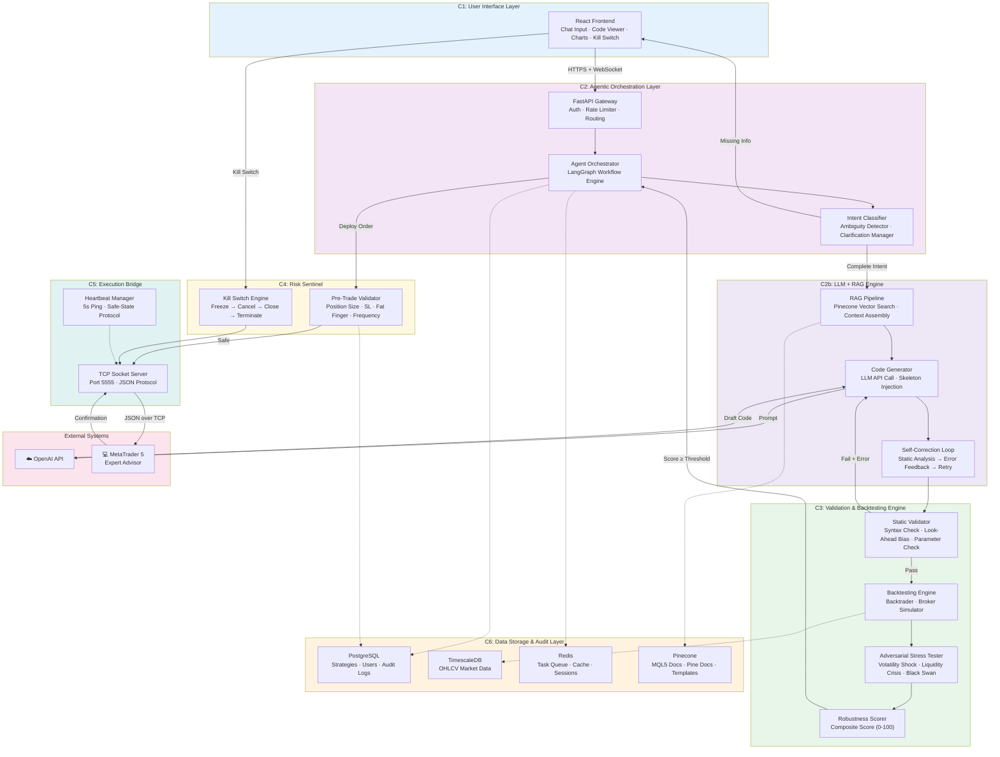
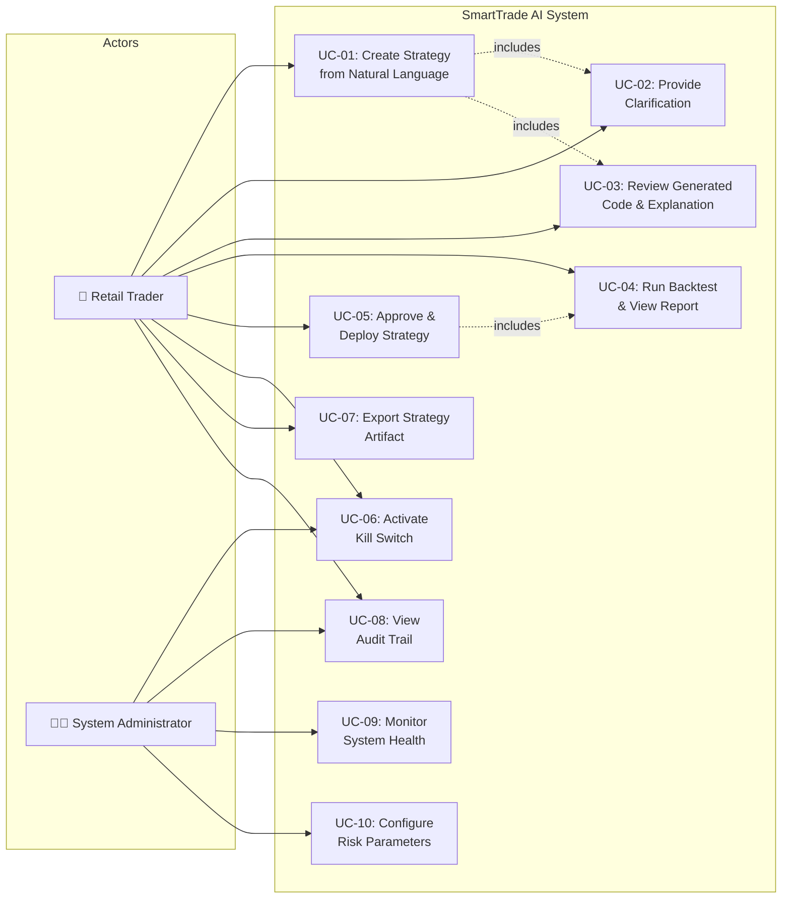
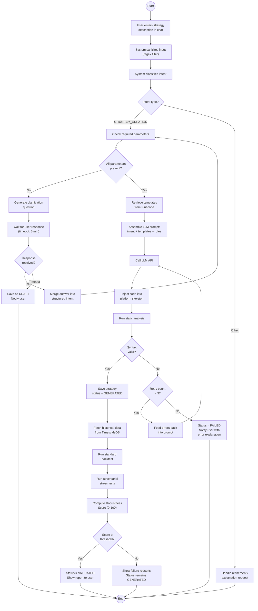
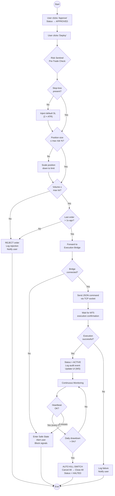
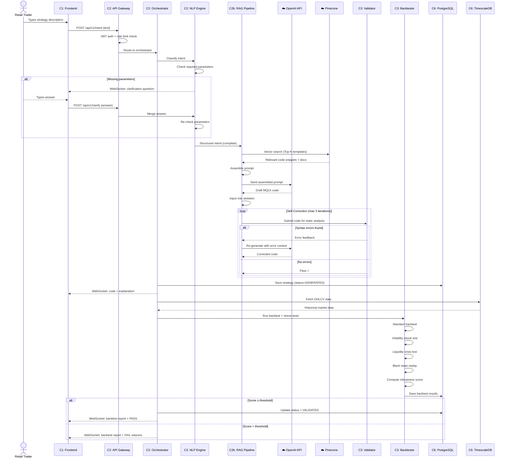
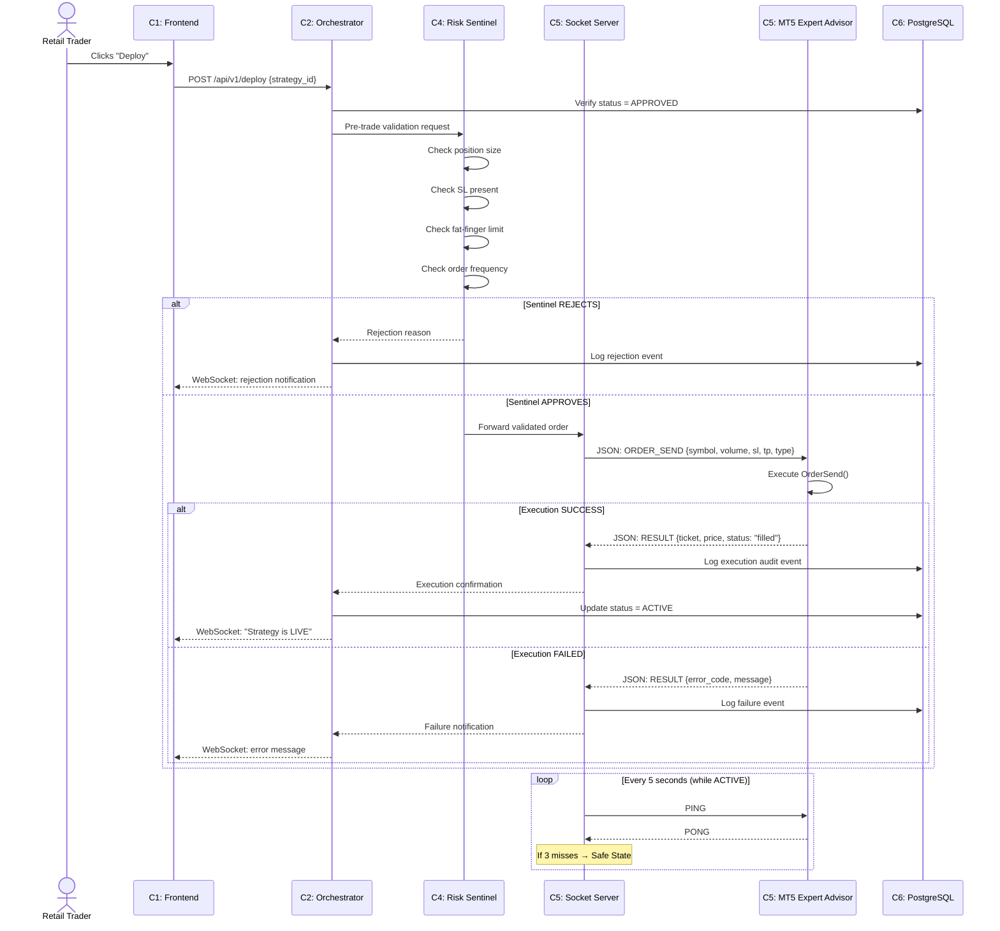
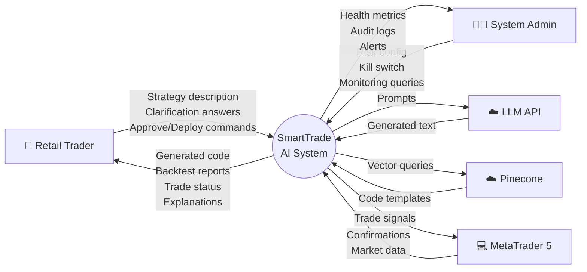
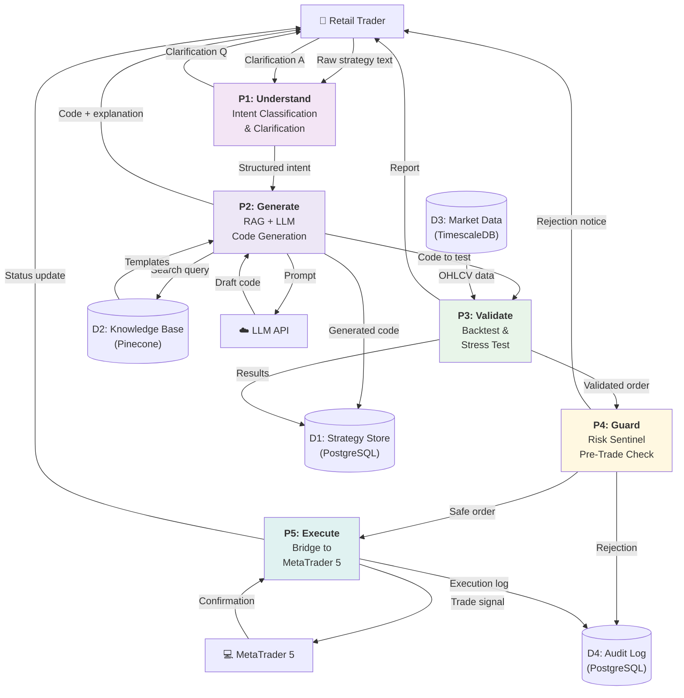

# Chapter 4 — System Design

---

## 4.1 Design Overview

### 4.1.1 Overall Design Philosophy

The SmartTrade Agentic AI System is designed around three core principles that guide every architectural and implementation decision:

**Principle 1 — Modular Architecture.** The system is decomposed into six discrete subsystems, each with a single well-defined responsibility. Subsystems communicate through explicit interfaces (REST, WebSocket, TCP sockets, message queues) rather than shared state. This modularity ensures that any subsystem (e.g., the backtesting engine) can be developed, tested, and replaced independently without cascading changes across the codebase.

**Principle 2 — Safety-First Design.** In any system that interfaces with financial markets, a single unguarded operation can cause irreversible monetary loss. SmartTrade enforces safety structurally, not procedurally. Risk controls are embedded as a mandatory middleware layer (the Risk Sentinel) that intercepts every order before it reaches the execution bridge. No code path exists that bypasses this layer. Additionally, a hardware-style kill switch provides emergency shutdown capability with a deterministic four-step execution sequence.

**Principle 3 — Deterministic Over Probabilistic Behavior.** While the system leverages probabilistic AI models (LLMs) for code generation, every output of those models passes through deterministic validation gates — static syntax analysis, parameter validity checking, look-ahead bias detection, and historical backtesting — before reaching the user or the market. The system treats LLM output as an untrusted draft, not a finished product.

### 4.1.2 Agentic Workflow Concept

SmartTrade employs an agentic AI architecture rather than a traditional request-response pipeline. In a conventional pipeline, each processing step runs once in sequence: input → process → output. In an agentic architecture, autonomous functional agents collaborate iteratively with the ability to:

- **Request clarification** — if the user's input is ambiguous or incomplete, the Perception Agent pauses the workflow and asks targeted questions rather than guessing.
- **Self-correct** — if generated code fails static analysis, the Generation Agent receives the error feedback and regenerates, up to three iterations.
- **Enforce guardrails** — the Validation Agent acts as an adversarial reviewer, applying stress tests that the Generation Agent cannot override.
- **Backtrack** — if validation fails, the workflow can return to an earlier stage rather than terminating.

This agentic loop is orchestrated through LangGraph, which models the workflow as a directed graph of agent nodes with conditional edges.

### 4.1.3 High-Level Separation of Responsibilities

| Concern | Subsystem | Principle |
|---------|-----------|-----------|
| User interaction | Chat Interface (C1) | Perception — capture intent, present results |
| Intelligence | AI Engine (C2) | Cognition — understand, reason, generate |
| Quality assurance | Validation Engine (C3) | Verification — test, score, gatekeep |
| Safety enforcement | Risk Sentinel (C4) | Protection — block unsafe trades |
| Market connectivity | Execution Bridge (C5) | Action — send signals, confirm execution |
| State persistence | Data Layer (C6) | Memory — store, retrieve, audit |

This separation ensures that no single subsystem is responsible for more than one concern. The AI Engine generates code but does not judge its quality. The Validation Engine judges quality but does not generate alternatives. The Risk Sentinel enforces limits but does not know trading strategy logic. Each subsystem does one job well.

---

## 4.2 High-Level System Architecture

### System Architecture Diagram



**Requirement Traceability:** This architecture addresses FR-01 through FR-15. Each functional requirement maps to one or more subsystems as detailed in the following subsections.

---

### 4.2.1 User Interface Layer (C1)

**Purpose:** The perception boundary of the system — captures user intent and renders all system outputs.

**Technology:** React.js, WebSocket API, Chart.js/D3.js

**Key Components:**

| Component | Responsibility | Maps to |
|-----------|---------------|---------|
| Chat Panel | Text input and message history; manages conversational flow | FR-01 |
| Input Sanitizer | Client-side regex filter for prompt-injection patterns | NFR-04 |
| Code Diff Viewer | Syntax-highlighted MQL5/Pine Script display with iteration diffs | FR-05 |
| Metric Renderer | Equity curve, drawdown, and robustness score visualization | FR-07 |
| Strategy Explanation Panel | Plain-English explanation of generated logic | FR-05 |
| Kill Switch Button | Prominent emergency halt control; high-priority WebSocket signal | FR-13 |
| Strategy Control Panel | Activate / Pause / Terminate per strategy | FR-11 |

**Communication:**
- **Outbound:** HTTPS REST (strategy submission, queries) + WebSocket (real-time status, clarification Q&A)
- **Inbound:** WebSocket events (state changes, backtest progress, trade confirmations, alerts)

---

### 4.2.2 Agentic Orchestration Layer (C2)

**Purpose:** The cognitive core — routes user intent through the correct workflow, manages strategy lifecycle, and coordinates all subsystems.

**Technology:** FastAPI, LangChain, LangGraph, Celery, JWT

**Key Components:**

| Component | Responsibility | Maps to |
|-----------|---------------|---------|
| FastAPI Router | REST endpoint definitions, request parsing | FR-01, EIR-01 |
| JWT Auth Guard | Token-based authentication middleware | NFR-04 |
| Rate Limiter | Redis-backed sliding-window request throttle | NFR-04 |
| Agent Orchestrator | LangGraph workflow engine; routes between agents based on state | FR-02, FR-03 |
| Semantic Router | Intent classification: CREATE / REFINE / CLARIFY / EXPLAIN | FR-02 |
| Strategy Lifecycle Manager | State machine enforcement (DRAFT → ACTIVE → TERMINATED) | FR-11 |
| Celery Task Producer | Async dispatch of generation and backtesting tasks to Redis queue | NFR-01 |

**Communication:**
- **Upstream:** Receives user requests from C1 via REST/WebSocket
- **Downstream:** Dispatches to C2b (AI Engine), C3 (Validation), C4 (Sentinel)
- **Data:** Reads/writes strategy records and audit logs to C6 (PostgreSQL)

---

### 4.2.3 LLM + RAG Engine (C2b)

**Purpose:** The intelligence subsystem — translates structured intent into compilable, platform-specific trading code using retrieval-augmented generation.

**Technology:** OpenAI API, Pinecone, LangChain, Python AST

**Key Components:**

| Component | Responsibility | Maps to |
|-----------|---------------|---------|
| Ambiguity Detector | Checks for missing parameters (entry, exit, SL, timeframe, asset) | FR-02 |
| Clarification Loop Manager | Tracks Q&A state, merges answers, resumes workflow | FR-02 |
| Vector Search Client | Queries Pinecone namespaces for relevant code templates and docs | FR-04 |
| Context Assembler | Builds the LLM prompt: intent + templates + system rules + risk blocks | FR-04 |
| Embedding Service | Converts text to vectors for Pinecone queries | FR-04 |
| Skeleton Injector | Provides pre-validated code structures (imports, class, event loop) | FR-04 |
| LLM Code Generator | Calls OpenAI API with assembled prompt; returns raw code | FR-03 |
| Self-Correction Loop | Iterative: Draft → Static Check → Error → Rebuild (max 3 tries) | FR-03 |

**RAG Pipeline Flow:**
1. Receive structured intent from Ambiguity Detector
2. Generate embedding vector from intent + strategy parameters
3. Query Pinecone (namespace: `mql5_docs` or `pine_docs`) for Top-K relevant templates
4. Assemble prompt: user intent + retrieved templates + mandatory risk injection rules + skeleton
5. Call LLM → receive draft code
6. Inject into platform-specific skeleton (MQL5 `OnTick()` or Pine Script `strategy()`)
7. Run through Self-Correction Loop if static analysis fails

---

### 4.2.4 Validation & Backtesting Engine (C3)

**Purpose:** The quality assurance gate — every generated strategy must pass static analysis, historical backtesting, and adversarial stress testing before it can be deployed.

**Technology:** Python AST, Backtrader, Custom stress-test framework

**Key Components:**

| Component | Responsibility | Maps to |
|-----------|---------------|---------|
| Look-Ahead Bias Detector | AST scan for future-data references; prevents cheating | FR-07 |
| Parameter Validity Checker | Verifies SL presence, SL distance vs. broker minimum, position cap ≤2% | FR-09 |
| Data Ingestion Unit | Fetches OHLCV from TimescaleDB; scans for gaps and bad ticks | DR-02 |
| Broker Simulator | Models slippage, variable spread, and commission | FR-07 |
| Simulation Core | Candle-by-candle event-driven backtest execution | FR-07 |
| Volatility Shock Test | Multiplies ATR by 2-3x to test SL resilience | FR-08 |
| Liquidity Crisis Test | Widens spread by 5x during specific windows | FR-08 |
| Black Swan Replay Test | Replays 2008 crisis and 2020 COVID crash data | FR-08 |
| Robustness Scorer | Composite score (0-100) from Win Rate, Risk-Reward, Sharpe, Max DD, Trade Count. Auto-fail if Max DD > 50% or sample < 10 trades. | FR-08 |

**Validation Gate Rule:** A strategy can only transition from VALIDATING → VALIDATED if robustness score ≥ system threshold. There is no manual override.

---

### 4.2.5 Execution Bridge — Python ↔ MT5 (C5)

**Purpose:** The actuator — translates validated trade signals into platform-specific commands and maintains a persistent, monitored connection to MetaTrader 5.

**Technology:** Python `socket` library, MQL5 `SocketCreate()`/`SocketRead()`, MetaTrader5 Python library

**Key Components:**

| Component | Responsibility | Maps to |
|-----------|---------------|---------|
| TCP Socket Server | Python-side server (port 5555); JSON-over-TCP protocol, UTF-8 | FR-10 |
| Command Serializer | Encodes ORDER_SEND, CANCEL_ALL, CLOSE_POSITION to JSON | FR-10 |
| MT5 Expert Advisor | MQL5 socket client in OnTimer(); parses JSON → OrderSend() | FR-10 |
| MT5 Python Connector | Uses official MetaTrader5 library for data fetch and login | EIR-08 |
| Heartbeat Manager | PING every 5s; PONG expected within 2s; 3 misses = failure | FR-12 |
| Safe-State Protocol | On failure: alert user, block signals, enter reconnection loop | FR-12, FR-13 |

**Communication Protocol:**
```
Python Server          MT5 Expert Advisor
     │                        │
     │──── PING ────────────→│  (every 5 seconds)
     │←─── PONG ─────────────│  (within 2 seconds)
     │                        │
     │── ORDER_SEND {json} ──→│  (trade command)
     │←── RESULT {json} ──────│  (execution confirmation)
     │                        │
     │── CANCEL_ALL ─────────→│  (kill switch command)
     │←── ACK ────────────────│  (acknowledgment)
```

**Deployment Topology:** MT5 runs on the Windows host machine. The Python Socket Server runs as a standalone process on the same host (not inside Docker). The FastAPI backend inside Docker communicates with the Socket Server via `host.docker.internal`.

---

### 4.2.6 Data Storage & Audit Layer (C6)

**Purpose:** The persistent memory — stores all structured data, time-series data, cached state, and vector embeddings.

**Technology:** PostgreSQL 16, TimescaleDB extension, Redis 7, Pinecone

| Store | What it holds | Why this technology |
|-------|--------------|---------------------|
| **PostgreSQL** | Users, strategies, backtest results, audit logs | Relational integrity, JSONB for flexible payloads, ENUM for strategy states |
| **TimescaleDB** | OHLCV market data (hypertable, partitioned by time + symbol) | Time-series optimized queries, automatic chunking, compression |
| **Redis** | Celery task queue, rate-limiter counters, session cache, ephemeral state | Sub-millisecond access, pub/sub for WebSocket fan-out, TTL-based expiry |
| **Pinecone** | Embeddings: MQL5 docs, Pine Script docs, risk templates (namespace-isolated) | Managed vector DB, cosine similarity search, no infrastructure to maintain |

**Core Schema:**

```sql
-- Strategy record
CREATE TABLE strategies (
    id              UUID PRIMARY KEY DEFAULT gen_random_uuid(),
    user_id         UUID REFERENCES users(id),
    intent_raw      TEXT NOT NULL,
    spec_json       JSONB,
    code_mql5       TEXT,
    code_pine       TEXT,
    robustness_score FLOAT,
    status          strategy_status_enum NOT NULL DEFAULT 'draft',
    created_at      TIMESTAMPTZ DEFAULT now(),
    updated_at      TIMESTAMPTZ DEFAULT now()
);

-- Audit trail
CREATE TABLE audit_logs (
    id              BIGSERIAL PRIMARY KEY,
    strategy_id     UUID REFERENCES strategies(id),
    event_type      audit_event_enum NOT NULL,
    payload         JSONB,
    created_at      TIMESTAMPTZ DEFAULT now()
);

-- Market data (TimescaleDB hypertable)
CREATE TABLE market_data (
    time        TIMESTAMPTZ NOT NULL,
    symbol      VARCHAR(20) NOT NULL,
    timeframe   VARCHAR(10),
    open        DOUBLE PRECISION,
    high        DOUBLE PRECISION,
    low         DOUBLE PRECISION,
    close       DOUBLE PRECISION,
    volume      DOUBLE PRECISION
);
SELECT create_hypertable('market_data', 'time');
```

**Requirement Traceability:** DR-01 through DR-13 map to this layer. FR-14 (audit logging) is fulfilled by the `audit_logs` table.

---

## 4.3 Use Case Model

### Use Case Diagram



---

### 4.3.1 Retail Trader Use Cases

#### UC-01: Create Strategy from Natural Language

| Field | Description |
|-------|-------------|
| **Actor** | Retail Trader |
| **Precondition** | User is authenticated and on the dashboard |
| **Trigger** | User types a trading strategy description in the chat panel |
| **Main Flow** | 1. User enters strategy description in natural language (e.g., *"Buy EURUSD when 50 SMA crosses above 200 SMA with 1% risk and 50-pip stop loss"*) <br/> 2. System sanitizes input and classifies intent as STRATEGY_CREATION <br/> 3. System checks for required parameters (entry, exit, SL, timeframe, instrument) <br/> 4. If any parameter is missing → system generates a clarification question (→ UC-02) <br/> 5. User provides clarification <br/> 6. System retrieves relevant code templates from Pinecone knowledge base <br/> 7. System assembles prompt and calls LLM to generate MQL5 code <br/> 8. System injects generated logic into pre-validated code skeleton <br/> 9. System runs static analysis on generated code <br/> 10. If syntax errors → system auto-corrects (up to 3 retries) <br/> 11. System displays generated code + plain-English explanation to user <br/> 12. System saves strategy with status = GENERATED |
| **Alternative Flows** | 4a. All parameters present → skip to step 6 <br/> 10a. Code fails after 3 retries → status = FAILED, user notified with error explanation |
| **Postcondition** | Strategy exists in GENERATED status with code and explanation |
| **Maps to** | FR-01, FR-02, FR-03, FR-04, FR-05 |

#### UC-04: Run Backtest & View Report

| Field | Description |
|-------|-------------|
| **Actor** | Retail Trader |
| **Precondition** | Strategy is in GENERATED status |
| **Trigger** | Automatic (after generation) or manual user request |
| **Main Flow** | 1. System fetches historical OHLCV data from TimescaleDB <br/> 2. System validates data completeness (gap detection, bad tick removal) <br/> 3. System runs standard backtest with broker simulation (slippage, spread, commission) <br/> 4. System runs adversarial stress tests (volatility shock, liquidity crisis, black swan replay) <br/> 5. System computes Robustness Score (0-100) from Win Rate, Risk-Reward Ratio, Sharpe Ratio, Max Drawdown, Trade Count <br/> 6. System displays: equity curve, drawdown chart, trade log, metrics table, robustness score <br/> 7. If score ≥ threshold → status = VALIDATED <br/> 8. If score < threshold → status remains GENERATED, user shown failure reasons |
| **Alternative Flows** | 2a. Insufficient data → notify user, suggest different timeframe or instrument |
| **Postcondition** | Strategy has backtest results; status is VALIDATED or remains GENERATED |
| **Maps to** | FR-07, FR-08, FR-09 |

#### UC-05: Approve & Deploy Strategy

| Field | Description |
|-------|-------------|
| **Actor** | Retail Trader |
| **Precondition** | Strategy is in VALIDATED status |
| **Trigger** | User clicks "Approve" then "Deploy" button |
| **Main Flow** | 1. User reviews backtest report and clicks "Approve" → status = APPROVED <br/> 2. User clicks "Deploy" <br/> 3. Risk Sentinel intercepts: validates position size, SL presence, frequency limits <br/> 4. If all checks pass → order forwarded to Execution Bridge <br/> 5. Bridge sends JSON command via TCP socket to MT5 Expert Advisor <br/> 6. MT5 EA executes `OrderSend()` <br/> 7. Confirmation returned via socket → status = ACTIVE <br/> 8. Audit log records deployment event |
| **Alternative Flows** | 3a. Sentinel rejects order (e.g., position too large) → order scaled down automatically, user notified |
| **Postcondition** | Strategy is ACTIVE on MT5 with live monitoring |
| **Maps to** | FR-10, FR-11, FR-12 |

#### UC-06: Activate Kill Switch

| Field | Description |
|-------|-------------|
| **Actor** | Retail Trader or System Administrator |
| **Precondition** | At least one strategy is ACTIVE |
| **Trigger** | User clicks Kill Switch button OR daily drawdown exceeds 5% |
| **Main Flow** | 1. System acquires lock on outgoing command queue <br/> 2. System sends CANCEL_ALL_PENDING with HIGH_PRIORITY flag <br/> 3. System fetches all open positions via `mt5.positions_get()` <br/> 4. System generates market-close orders for each open position <br/> 5. System waits for execution confirmations <br/> 6. All affected strategies → status = HALTED <br/> 7. Audit log records KILL_SWITCH event with full payload <br/> 8. User receives confirmation notification |
| **Postcondition** | All positions closed, all strategies halted, full audit trail |
| **Maps to** | FR-13 |

---

### 4.3.2 System Administrator Use Cases

#### UC-09: Monitor System Health

| Field | Description |
|-------|-------------|
| **Actor** | System Administrator |
| **Precondition** | Admin is authenticated with admin role |
| **Trigger** | Admin navigates to monitoring dashboard |
| **Main Flow** | 1. Admin views: API response times, Celery queue depths, bridge connection status, database connection pool, Redis memory usage <br/> 2. Admin views active strategy count and recent error logs <br/> 3. Admin receives alerts if any metric exceeds threshold |
| **Maps to** | UR-2.1, NFR-02 |

#### UC-10: Configure Risk Parameters

| Field | Description |
|-------|-------------|
| **Actor** | System Administrator |
| **Precondition** | Admin is authenticated with admin role |
| **Trigger** | Admin navigates to risk configuration panel |
| **Main Flow** | 1. Admin sets system-wide parameters: max position size %, max lot size, minimum SL distance, daily drawdown limit, order frequency limit <br/> 2. Changes take effect immediately for all future Sentinel validations <br/> 3. Audit log records configuration change |
| **Maps to** | FR-09, NFR-03 |

---

## 4.4 Activity Diagrams

### 4.4.1 Activity Diagram: Strategy Creation & Validation



**Maps to:** FR-01 (input), FR-02 (clarification), FR-03 (generation), FR-04 (RAG), FR-05 (explanation), FR-07 (backtesting), FR-08 (stress testing), FR-09 (risk validation)

---

### 4.4.2 Activity Diagram: Execution & Monitoring



**Maps to:** FR-09 (risk), FR-10 (execution), FR-11 (lifecycle), FR-12 (bridge), FR-13 (kill switch)

---

## 4.5 Sequence Diagrams

### 4.5.1 Sequence Diagram: NL Input → Code Generation → Backtest



**Maps to:** FR-02 (clarification), FR-05 (explanation), FR-08 (stress testing)

---

### 4.5.2 Sequence Diagram: Trade Signal → MT5 → Confirmation



**Maps to:** FR-10 (execution), FR-12 (bridge protocol)

---

## 4.6 Data Flow Diagram

### DFD Level-0 (Context)



### DFD Level-1 (Internal Processes)



**Maps to:** DR-01 through DR-13 (Data Requirements)

---

## 4.7 Design Decisions and Justifications

### AD-1: Agentic Orchestration over Static Pipeline

| Aspect | Detail |
|--------|--------|
| **Context** | Trading strategy descriptions are inherently ambiguous. Users omit parameters, use vague terms ("decent risk"), and provide incomplete specifications. A static pipeline would either fail silently or produce garbage output. |
| **Decision** | Use an agentic architecture with iterative clarification loops, self-correction, and adversarial validation. Implemented via LangGraph directed workflow graphs. |
| **Alternatives Rejected** | *Static pipeline:* Cannot handle ambiguity — either hard-fails or hallucinates missing values. *Rule-based system:* Cannot understand natural language nuance. |
| **Trade-off** | Higher system complexity. Harder to test deterministically. Requires robust state management. |
| **Justification** | The clarification loop alone prevents an entire class of generation errors. Without it, every strategy with a missing stop-loss would either fail or produce unsafe code. The agentic approach models what a human expert developer would do: ask questions, then build. |

### AD-2: RAG-Grounded Generation over Direct LLM Prompting

| Aspect | Detail |
|--------|--------|
| **Context** | LLMs hallucinate MQL5 syntax, invent non-existent API functions, and produce code that looks correct but uses deprecated or non-functional calls. |
| **Decision** | Every code generation call is preceded by a Pinecone vector search that retrieves authoritative documentation and pre-validated code templates. These are injected into the prompt, grounding the LLM in verified knowledge. |
| **Alternatives Rejected** | *Direct LLM prompting:* ~30-40% hallucination rate on MQL5 syntax in our testing. *Fine-tuned model:* Requires massive labeled dataset of MQL5 code; prohibitively expensive for an FYP. |
| **Trade-off** | Requires upfront effort to build and embed the knowledge base. Template coverage gaps become failure modes. |
| **Justification** | The "Golden Template" approach guarantees structural validity. The LLM fills business logic into a pre-validated skeleton rather than generating the entire file from scratch. This reduces the hallucination surface from "entire program" to "logic within a function." |

### AD-3: Mandatory Adversarial Validation (No Bypass Path)

| Aspect | Detail |
|--------|--------|
| **Context** | Standard backtesting gives false confidence. A strategy optimized for calm markets can fail catastrophically during volatility spikes, liquidity crises, or black swan events. |
| **Decision** | Every strategy must pass three validation layers before deployment eligibility: (1) static analysis, (2) standard historical backtest, (3) adversarial stress testing. No code path exists to skip any layer. |
| **Alternatives Rejected** | *Optional validation:* Users will skip it to save time, then blame the system when losses occur. *Basic backtest only:* Insufficient for financial safety. |
| **Trade-off** | Increases time-to-deployment by 30-60 seconds. Some legitimate strategies may fail stress tests. |
| **Justification** | Financial safety is non-negotiable. The Robustness Score provides a single, understandable metric. The "no bypass" design means the system cannot be used unsafely even by a determined user. |

### AD-4: Custom TCP Socket Bridge over Webhook-Based Integration

| Aspect | Detail |
|--------|--------|
| **Context** | Most MT5 automation tutorials recommend TradingView webhooks → third-party relay → MT5. This introduces uncontrolled latency, third-party dependency, and no guaranteed delivery. |
| **Decision** | Build a custom persistent TCP socket connection between the Python backend and a custom MQL5 Expert Advisor. Implement a 5-second heartbeat protocol with automatic safe-state failover. |
| **Alternatives Rejected** | *Webhooks via third-party:* Adds 200-2000ms latency, introduces a single point of failure outside our control, and offers no delivery guarantee. *MetaTrader5 Python library only:* Cannot send execution commands from within Docker (MT5 must run on Windows). |
| **Trade-off** | Must maintain a custom MQL5 Expert Advisor. Socket programming adds complexity (connection management, JSON serialization, error handling). Requires MT5 on a Windows host. |
| **Justification** | The heartbeat protocol detects connection failures within 15 seconds (3 × 5s). Safe-state protocol prevents "ghost trading" — a catastrophic failure mode where the system sends signals to a dead connection. Sub-100ms latency enables responsive execution. |

### AD-5: Centralized Risk Sentinel (Middleware Pattern) over Distributed Safety Checks

| Aspect | Detail |
|--------|--------|
| **Context** | Safety checks (position sizing, stop-loss enforcement, frequency limiting) could be placed inside individual subsystems — the code generator could enforce stop-loss, the bridge could check position size, etc. |
| **Decision** | Centralize ALL risk enforcement in a single middleware component (the Risk Sentinel) positioned between the Orchestrator and the Execution Bridge. Every order passes through it. No exceptions. |
| **Alternatives Rejected** | *Distributed checks:* Each subsystem implements its own safety logic. Risk: inconsistent enforcement, easy to bypass by adding a new code path, no single audit point. |
| **Trade-off** | Introduces a synchronous bottleneck on the execution path (~5-10ms per check). All risk rules must be maintained in one place. |
| **Justification** | A single chokepoint is auditable, testable, and impossible to bypass by design. This is the same pattern used by financial exchanges (all orders pass through a risk gateway before reaching the matching engine). Adding a new risk rule means modifying one component, not hunting through the codebase. |

---

> **Chapter 4 Summary:** This chapter has presented the complete system design for SmartTrade from six perspectives — structural overview (4.1-4.2), user interaction (4.3), behavioral workflows (4.4-4.5), data movement (4.6), and design rationale (4.7). Together, these artifacts provide a traceable, implementation-ready blueprint that maps every functional requirement to concrete architectural components, validated workflows, and justified engineering decisions.
