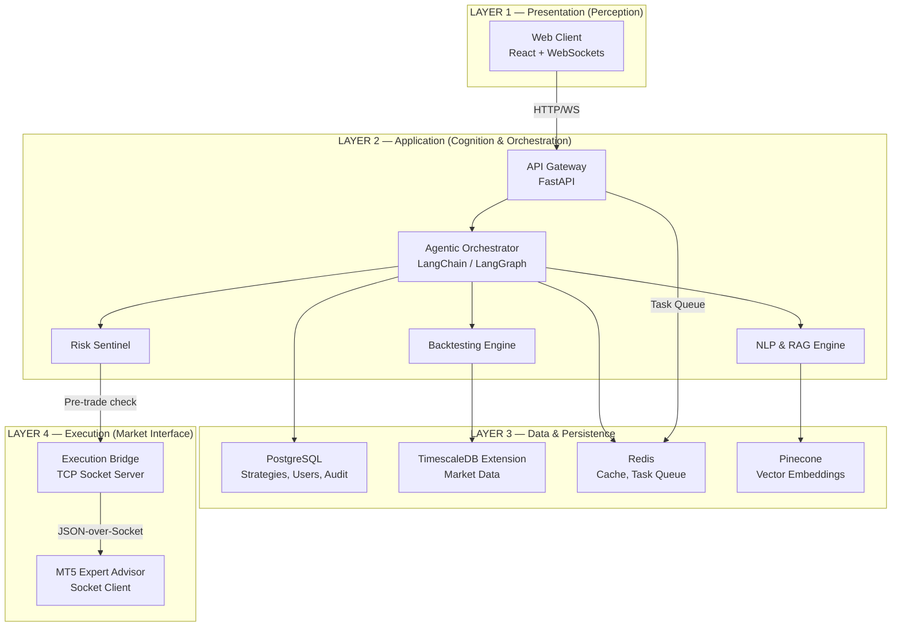
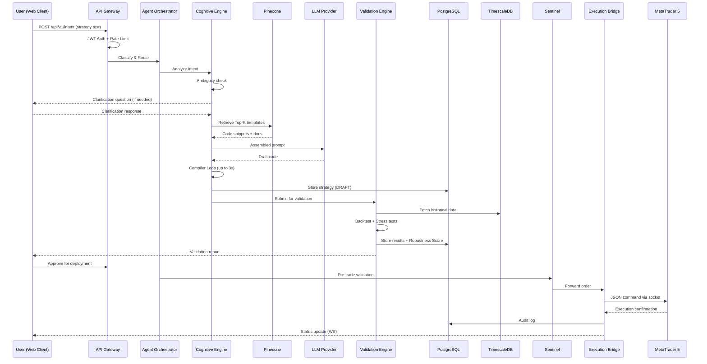

# SmartTrade Agentic AI System — Technical Review & System Design Document

> **Prepared by:** Senior Technical Lead Review  
> **Date:** 2026-02-16  
> **Documents Reviewed:**
> 1. FYP Proposal (12 pages) — SmartTrade AI Automation System
> 2. Comprehensive Technical Architecture Report (15 pages)
> 3. FYP Report / SRS (42 pages) — Requirements Specification

---

## 1. Technical Review Summary

### 1.1 Strengths of the Current Design

| # | Strength | Evidence |
|---|----------|----------|
| S1 | **Clear problem framing** | The "Syntax Cliff" abstraction is precise, well-bounded, and traceable through all three documents. |
| S2 | **Agentic paradigm is well-justified** | The Perception → Reasoning → Validation → Execution agent loop is documented with concrete responsibilities per agent role. |
| S3 | **Safety-first philosophy** | Mandatory stop-loss, position sizing caps, kill-switch, heartbeat protocol, and safe-state behavior are embedded at the architectural level, not bolted on. |
| S4 | **Strong requirements engineering** | 8 BRs, 14 URs, 15 FRs, 9 NFRs, 13 DRs, and 13 EIRs with rationale and acceptance criteria. Out-of-scope is explicitly bounded (11 items). |
| S5 | **RAG-grounded code generation** | Scaffolding injection + namespace-isolated vector DB + self-correction compiler loop mitigates LLM hallucination risk in a measurable way. |
| S6 | **Grey-Box transparency model** | The commitment to explain all generated logic in plain English, with diff views between iterations, is a differentiator. |
| S7 | **Adversarial validation** | Stress-test scenarios (volatility shock, liquidity crisis, black swan replay) go beyond standard backtesting. |
| S8 | **Docker-first deployment** | Containerization is mandated as a constraint, not an afterthought — good for reproducibility and academic evaluation. |

### 1.2 Missing Architectural Pieces

| # | Gap | Impact | Severity |
|---|-----|--------|----------|
| G1 | **No formal state machine for strategy lifecycle** | FR-11 defines states (draft → validated → approved → paused → terminated) but no state transition diagram, guard conditions, or invalid transition handling. | High |
| G2 | **Ambiguous LLM provider strategy** | Proposal lists Claude, OpenAI, DeepSeek, Gemini. The architecture doc assumes a single provider. No fallback, circuit-breaker, or provider-selection logic is defined. | High |
| G3 | **Missing error taxonomy** | Documents describe individual error conditions (syntax errors, bridge failures, rate limit) but lack a unified error classification with severity levels, propagation rules, and user-facing messages. | Medium |
| G4 | **No defined contract between RAG retrieval and prompt assembly** | Section 4.2 describes the pipeline narratively but does not define the data structure (schema) that flows between the retrieval step and prompt construction step. | Medium |
| G5 | **WebSocket protocol not specified** | The architecture mentions WebSocket for real-time updates but defines no message schema, event types, or reconnection policy. | Medium |
| G6 | **MT5 Windows dependency unresolved** | MT5 terminal only runs on Windows. The Docker environment is Linux-based. The bridge architecture partially addresses this via TCP sockets but doesn't specify the deployment topology (e.g., MT5 on Windows host, Python backend in Docker on same host). | High |
| G7 | **No monitoring/observability design** | No logging framework, metrics collection, health-check endpoints, or dashboard for system operators (despite UR-2.1 requiring latency monitoring). | Medium |
| G8 | **Database inconsistency** | Proposal mentions MongoDB + Pinecone. Architecture doc specifies PostgreSQL + TimescaleDB + Redis + Pinecone. No migration path or final decision documented. | High |

### 1.3 Ambiguities and Risks

| # | Ambiguity / Risk | Consequence |
|---|-------------------|-------------|
| R1 | **"Cross-platform equivalence" (FR-06)** is functionally impossible to guarantee between MQL5 and Pine Script due to platform differences in order execution models, available built-in functions, and event loops. | May over-promise to evaluators. Should be re-scoped to "functionally similar" with documented divergence points. |
| R2 | **Backtrader vs. vectorbt** — architecture document mentions both. These have fundamentally different paradigms (event-driven vs. vectorized). | Choosing the wrong one mid-development requires a rewrite of the validation subsystem. |
| R3 | **Concurrent strategy execution** — NFR-07 requires it, but the Execution Bridge states "single persistent connection per strategy instance." | Unclear how multiple live strategies share the MT5 terminal, which is a single-threaded GUI application. |
| R4 | **TimescaleDB appears only in the architecture doc** but is not in the proposal's tech stack or the SRS's dependency list. | Could be an unvetted technology addition. |
| R5 | **Two-person team** building a system with 6+ microservices, agentic AI orchestration, two external platform integrations, a RAG pipeline, and a backtesting engine in 7-8 months. | Schedule risk is the #1 project risk. |

---

## 2. High-Level Architecture

### 2.1 Architectural Style

**Layered Architecture with Agentic Orchestration Core**, containerized as a multi-service Docker Compose application. The system follows a **pipeline-style data flow** from user intent to market execution, with an **adversarial validation gate** as a mandatory checkpoint.

### 2.2 Major System Layers



### 2.3 Layer Responsibilities

| Layer | Responsibility | Core Principle |
|-------|---------------|----------------|
| **Presentation** | Capture user intent, render explanations and metrics, manage conversational UI state, provide kill-switch control. | **Perception** — the system's sensory interface |
| **Application** | Orchestrate the entire strategy lifecycle: intent → clarification → generation → validation → deployment. Houses all business logic. | **Cognition** — the system's reasoning core |
| **Data & Persistence** | Store relational data (users, strategies, audit logs), time-series market data, distributed cache/queues, and vector embeddings for RAG. | **Memory** — the system's state |
| **Execution** | Translate validated signals into platform-specific commands and maintain persistent connectivity with external trading terminals. | **Action** — the system's actuator |

### 2.4 Communication Paths

| From → To | Protocol | Purpose |
|-----------|----------|---------|
| Web Client → API Gateway | HTTPS REST + WebSocket | Intent submission, clarification, real-time status |
| API Gateway → Celery Workers | Redis (message broker) | Async task dispatch (code gen, backtesting) |
| Orchestrator → LLM Provider | HTTPS API | Code generation, intent classification |
| Orchestrator → Pinecone | HTTPS API | Semantic retrieval for RAG |
| Risk Sentinel → Execution Bridge | Internal function call | Pre-trade validation gate |
| Execution Bridge → MT5 EA | TCP/IP Socket (JSON) | Order commands, heartbeat |
| MT5 EA → Execution Bridge | TCP/IP Socket (JSON) | Execution confirmations, market data |

---

## 3. Architecture Design Decisions

### AD-1: Agentic Orchestration over Static Automation Pipeline

| Aspect | Detail |
|--------|--------|
| **Problem** | Traders' natural language input is inherently ambiguous, incomplete, and non-deterministic. A static pipeline cannot handle missing parameters, vague terms, or multi-step reasoning. |
| **Decision** | Use an agentic architecture where autonomous functional agents (Perception, Reasoning, Validation, Execution) collaborate in loops with backtracking capability. |
| **Reasoning** | Agents can request clarification, self-correct, and enforce guardrails iteratively. This closely models how a human expert developer would interpret a trader's request. |
| **Trade-offs** | Higher system complexity. Harder to test deterministically. Requires careful state management to avoid infinite loops. Risk of over-engineering for a 2-person team. |

### AD-2: RAG-Grounded Code Generation over Direct LLM Output

| Aspect | Detail |
|--------|--------|
| **Problem** | LLMs hallucinate syntax, invent non-existent API functions, and produce code that compiles but behaves incorrectly. |
| **Decision** | Enforce Retrieval-Augmented Generation backed by Pinecone with namespace-isolated authoritative documentation. Use scaffolding injection — LLM fills logic into pre-validated skeletons. |
| **Reasoning** | Reduces hallucination surface area. The "Golden Templates" serve as compiled, tested anchors. The skeleton approach guarantees structural validity. |
| **Trade-offs** | Requires significant upfront effort to build and maintain the knowledge base. Limits LLM flexibility (can't invent novel code patterns). Template coverage gaps will surface as failure modes. |

### AD-3: Mandatory Adversarial Validation Gate (No Bypass)

| Aspect | Detail |
|--------|--------|
| **Problem** | Backtesting alone gives false confidence. Strategies that perform well on standard data can fail catastrophically under stress conditions. |
| **Decision** | Every strategy must pass through static analysis + standard backtesting + adversarial stress testing before it is eligible for deployment. No shortcut path exists. |
| **Reasoning** | Combats the "Backtest-Reality Gap." Stress tests (volatility shock, liquidity crisis, black swan replay) expose fragile logic. The composite Robustness Score (0-100) gives a single decision metric. |
| **Trade-offs** | Increases time-to-deployment. Requires curated stress-test datasets. May frustrate users with strategies that fail validation. |

### AD-4: Custom TCP Execution Bridge over Third-Party Webhooks

| Aspect | Detail |
|--------|--------|
| **Problem** | Webhooks introduce uncontrolled latency, single points of failure (third-party relay), and no guaranteed delivery. |
| **Decision** | Build a custom TCP socket bridge with persistent connection between the Python backend and the MT5 Expert Advisor. Implement a 5-second heartbeat protocol with safe-state failover. |
| **Reasoning** | Persistent sockets offer sub-100ms latency and immediate failure detection. The heartbeat/safe-state protocol prevents "ghost trading" where the system sends signals to a dead connection. |
| **Trade-offs** | Requires a Windows host (or Wine in Docker) for MT5. The EA must be custom-built in MQL5. Socket programming adds complexity (connection management, buffering, serialization). |

### AD-5: Safety as a Middleware Layer (Sentinel Pattern)

| Aspect | Detail |
|--------|--------|
| **Problem** | Safety checks scattered across subsystems are easy to bypass or forget. A strategy engine bug could send an order with no stop-loss or an absurd position size. |
| **Decision** | Centralize all risk enforcement in a dedicated "Sentinel" middleware positioned between the Strategy Engine and the Execution Bridge. It intercepts every order. |
| **Reasoning** | Single chokepoint for all safety checks. Cannot be bypassed by design (all orders flow through it). Enables consistent, auditable risk enforcement. |
| **Trade-offs** | Introduces a synchronous bottleneck on the execution path. Rules must be carefully calibrated to avoid blocking legitimate trades. Adding a new risk rule requires touching the Sentinel. |

---

## 4. System Decomposition

### Level 1: Major Subsystems

```
SmartTrade Agentic AI System
├── SS1: Presentation Subsystem
├── SS2: Orchestration & API Subsystem
├── SS3: Cognitive Engine (NLP + RAG)
├── SS4: Validation & Backtesting Subsystem
├── SS5: Risk Management Subsystem (Sentinel)
├── SS6: Execution Subsystem (Bridge)
├── SS7: Data & Persistence Subsystem
└── SS8: Infrastructure & DevOps
```

### Level 2: Sub-Subsystems

```
SS1: Presentation Subsystem
├── SS1.1: Conversational Interface Module
├── SS1.2: Visualization & Reporting Module
└── SS1.3: Execution Control Module

SS2: Orchestration & API Subsystem
├── SS2.1: API Gateway
├── SS2.2: Agentic Workflow Engine
├── SS2.3: Async Task Manager
└── SS2.4: Security Middleware

SS3: Cognitive Engine (NLP + RAG)
├── SS3.1: Intent Classification & Routing
├── SS3.2: Ambiguity Detection & Clarification
├── SS3.3: RAG Pipeline
└── SS3.4: Code Generation & Self-Correction

SS4: Validation & Backtesting Subsystem
├── SS4.1: Static Analysis Validator
├── SS4.2: Backtesting Simulation Engine
└── SS4.3: Adversarial Stress-Test Module

SS5: Risk Management Subsystem (Sentinel)
├── SS5.1: Pre-Trade Validation Engine
└── SS5.2: Emergency Kill-Switch

SS6: Execution Subsystem (Bridge)
├── SS6.1: Socket Communication Layer
├── SS6.2: MT5 Connector
└── SS6.3: Heartbeat & Fail-Safe Manager

SS7: Data & Persistence Subsystem
├── SS7.1: Relational Data Store (PostgreSQL)
├── SS7.2: Time-Series Data Store (TimescaleDB)
├── SS7.3: Cache & Message Broker (Redis)
└── SS7.4: Vector Embedding Store (Pinecone)

SS8: Infrastructure & DevOps
├── SS8.1: Container Orchestration (Docker Compose)
├── SS8.2: Networking (Bridge Network)
└── SS8.3: Volume & Secret Management
```

### Level 3: Concrete Components

#### SS1: Presentation Subsystem

| Component | Parent | Responsibility |
|-----------|--------|---------------|
| `ChatPanel` | SS1.1 | Text input + message history UI. Manages Listening → Processing → Clarification → Error state machine. |
| `InputSanitizer` | SS1.1 | Client-side regex filter to strip prompt-injection patterns before transmission. |
| `StateSynchronizer` | SS1.1 | WebSocket listener that triggers UI transitions on backend state_change events. |
| `CodeDiffViewer` | SS1.2 | Renders generated code with syntax highlighting (Monaco/PrismJS). Shows diffs between iterations. |
| `MetricRenderer` | SS1.2 | Charts equity curves, drawdown plots, and robustness scores using D3.js/Chart.js. |
| `StrategyExplanation` | SS1.2 | Displays plain-English mapping from user intent to generated code blocks. |
| `KillSwitchButton` | SS1.3 | Prominent emergency stop control. Sends high-priority halt signal via WebSocket. |
| `StrategyControlPanel` | SS1.3 | Activate / Pause / Terminate controls per strategy instance. |

#### SS2: Orchestration & API Subsystem

| Component | Parent | Responsibility |
|-----------|--------|---------------|
| `FastAPIRouter` | SS2.1 | Route definitions for /api/v1/intent, /api/v1/clarify, /api/v1/socket. |
| `JWTAuthGuard` | SS2.4 | Intercepts requests, decodes JWT, injects user_id into request scope. |
| `RateLimiter` | SS2.4 | Redis-backed sliding-window limiter (e.g., 5 generations/min). |
| `AgentOrchestrator` | SS2.2 | LangChain/LangGraph-based workflow manager. Routes between clarification, generation, and validation agents. |
| `StrategyLifecycleManager` | SS2.2 | Manages strategy state transitions: DRAFT → VALIDATED → ACTIVE → HALTED → TERMINATED. |
| `CeleryTaskProducer` | SS2.3 | Serializes and queues generate_strategy_task and run_backtest_task to Redis. Returns task_id. |
| `DBSessionManager` | SS2.1 | Provides transactional PostgreSQL sessions with auto-rollback on failure. |

#### SS3: Cognitive Engine

| Component | Parent | Responsibility |
|-----------|--------|---------------|
| `SemanticRouter` | SS3.1 | Classifies input into STRATEGY_CREATION, STRATEGY_REFINEMENT, CLARIFICATION_RESPONSE, or EXPLANATION_REQUEST. |
| `AmbiguityDetector` | SS3.2 | Validates presence of entry/exit conditions, stop-loss, timeframe, asset class. Triggers clarification questions on failure. |
| `ClarificationLoopManager` | SS3.2 | Manages Q&A state, tracks which variables are resolved, and re-submits to generation when complete. |
| `VectorSearchClient` | SS3.3 | Queries Pinecone with namespace isolation (mql5_docs, pine_docs, risk_templates). Returns Top-K chunks. |
| `ContextAssembler` | SS3.3 | Builds the dynamic LLM prompt: user intent + retrieved templates + system instructions + mandatory risk blocks. |
| `EmbeddingService` | SS3.3 | Converts text/code to vectors using embedding model (e.g., text-embedding-ada-002). |
| `SkeletonInjector` | SS3.4 | Provides pre-validated code skeletons (imports, class structure, event loops) for MQL5 and Pine Script. |
| `LLMCodeGenerator` | SS3.4 | Calls LLM API with assembled prompt. Returns raw code draft. |
| `CompilerLoop` | SS3.4 | Recursive self-correction: Draft → Static Analysis → Error Feedback → Regenerate (max 3 iterations). |

#### SS4: Validation & Backtesting Subsystem

| Component | Parent | Responsibility |
|-----------|--------|---------------|
| `LookAheadBiasDetector` | SS4.1 | AST parser scanning for future-data references (index [0] in finalized context, lookahead=on). |
| `ParameterValidityChecker` | SS4.1 | Enforces SL presence, SL distance vs. broker minimum, position sizing cap (≤2% equity). |
| `DataIngestionUnit` | SS4.2 | Fetches OHLCV from TimescaleDB. Scans for data gaps and bad ticks. Cross-references with MT5 data feed. |
| `BrokerSimulator` | SS4.2 | Models slippage (probabilistic), variable spread, and commission per trade. |
| `SimulationCore` | SS4.2 | Candle-by-candle event-driven strategy execution against historical data. |
| `VolatilityShockTest` | SS4.3 | Multiplies ATR by 2x–3x to stress-test stop-loss resilience. |
| `LiquidityCrisisTest` | SS4.3 | Widens spread by 5x during specific windows to test cost sensitivity. |
| `BlackSwanReplayTest` | SS4.3 | Replays historical crash periods (2008, 2020 COVID). |
| `RobustnessScorer` | SS4.3 | Computes composite score (0-100) from Win Rate, RR Ratio, Sharpe, Max DD, Trade Count. Auto-fail if DD > 50%. |

#### SS5: Risk Management (Sentinel)

| Component | Parent | Responsibility |
|-----------|--------|---------------|
| `MaxPositionSizeCheck` | SS5.1 | Volume × ContractSize × Price ≤ Equity × MaxRisk%. Scales down if exceeded. |
| `MandatorySLCheck` | SS5.1 | Verifies sl ≠ null and sl > 0. Injects default SL (2×ATR) if missing. |
| `FatFingerFilter` | SS5.1 | Rejects orders where volume > system max lot limit (e.g., 10.0 lots). |
| `FrequencyLimiter` | SS5.1 | Rejects orders < 1 second apart to prevent runaway algo loops. |
| `KillSwitchEngine` | SS5.2 | Queue Freeze → Cancel All Pending → Close All Open → Terminate Strategy Thread. |
| `DrawdownMonitor` | SS5.2 | Triggers auto kill-switch if daily drawdown > 5%. |

#### SS6: Execution Subsystem

| Component | Parent | Responsibility |
|-----------|--------|---------------|
| `TCPSocketServer` | SS6.1 | Python-side server on port 5555. JSON-over-Socket protocol, UTF-8 encoded. |
| `CommandSerializer` | SS6.1 | Serializes ORDER_SEND, CANCEL_ALL_PENDING, CLOSE_POSITION commands to JSON. |
| `MT5ExpertAdvisor` | SS6.2 | MQL5-side socket client. Runs in OnTick()/OnTimer(). Parses JSON, routes to OrderSend(). |
| `MT5PythonConnector` | SS6.2 | Uses official MetaTrader5 Python library for direct terminal interaction (init, login, data fetch). |
| `HeartbeatManager` | SS6.3 | Sends PING every 5s; expects PONG within 2s. 3 consecutive misses → Bridge Failure. |
| `SafeStateProtocol` | SS6.3 | On Bridge Failure: alert user (WS + email), block signals, attempt reconnection loop. |

#### SS7: Data & Persistence

| Component | Parent | Responsibility |
|-----------|--------|---------------|
| `StrategiesTable` | SS7.1 | UUID PK, user_id FK, intent_raw, spec_json, code_mql5, robustness_score, status enum. |
| `AuditLogsTable` | SS7.1 | BigInt PK, ISO8601 timestamp, event_type enum, payload JSONB, strategy_id FK. |
| `UsersTable` | SS7.1 | Authentication data, preferences, API key storage (encrypted). |
| `MarketDataHypertable` | SS7.2 | OHLCV data partitioned by time + symbol. Cached from MT5. |
| `TaskQueue` | SS7.3 | Redis-backed Celery task queue with priority channels. |
| `SessionCache` | SS7.3 | Redis store for rate-limiter state, active session data, and ephemeral state. |
| `MQL5DocsNamespace` | SS7.4 | Pinecone namespace for MQL5 documentation embeddings (~512 token chunks). |
| `PineDocsNamespace` | SS7.4 | Pinecone namespace for Pine Script documentation embeddings. |
| `RiskTemplatesNamespace` | SS7.4 | Pinecone namespace for risk management code templates. |

### Level 4: Atomic Responsibilities

> This level describes the lowest-level logical responsibilities within key Level-3 components.

**AgentOrchestrator internal responsibilities:**
1. Initialize conversation context from session store
2. Invoke SemanticRouter to classify intent
3. If STRATEGY_CREATION → execute Generation Workflow graph
4. If STRATEGY_REFINEMENT → load existing strategy, apply delta
5. If CLARIFICATION_RESPONSE → merge answer, resume paused workflow
6. If EXPLANATION_REQUEST → generate explanation from strategy spec
7. Emit lifecycle events to audit log at each transition

**CompilerLoop internal responsibilities:**
1. Receive assembled prompt from ContextAssembler
2. Call LLMCodeGenerator → receive Draft_v1
3. Inject into skeleton via SkeletonInjector
4. Submit to ParameterValidityChecker + LookAheadBiasDetector
5. If errors found: format error log, append to prompt, re-call LLM
6. Repeat steps 2-5 up to 3 times
7. If still failing: mark task FAILED, return error to user

**KillSwitchEngine internal responsibilities:**
1. Receive trigger (manual button or auto from DrawdownMonitor)
2. Acquire lock on outgoing command queue
3. Send CANCEL_ALL_PENDING with HIGH_PRIORITY flag
4. Fetch all open positions via mt5.positions_get()
5. Generate market close orders for each position
6. Wait for execution confirmations
7. Terminate strategy execution thread
8. Emit KILL_SWITCH audit event with full payload

---

## 5. Component Relationships & Integration

### 5.1 End-to-End Data Flow



### 5.2 Control Flow Map

| Phase | Controller | Decision Points |
|-------|-----------|-----------------|
| **Input** | API Gateway | Is user authenticated? Is rate limit exceeded? |
| **Classification** | SemanticRouter | Which intent bucket? (4 types) |
| **Clarification** | AmbiguityDetector | Are all required parameters present? |
| **Generation** | CompilerLoop | Did static analysis pass? Retry count < 3? |
| **Validation** | RobustnessScorer | Score ≥ threshold? Max DD ≤ 50%? Sample size ≥ 10? |
| **Deployment** | StrategyLifecycleManager | Is status VALIDATED? Did user click "Deploy"? |
| **Execution** | Sentinel | Position size OK? SL present? Frequency OK? Fat finger OK? |
| **Safety** | HeartbeatManager | 3 consecutive misses? → Safe State |
| **Emergency** | KillSwitchEngine | Manual trigger OR daily DD > 5%? |

### 5.3 Dependency Graph (Critical Path)

```
User Input
  └─→ API Gateway
        └─→ Agent Orchestrator
              ├─→ Semantic Router (depends on: LLM or classifier model)
              ├─→ Ambiguity Detector (depends on: parameter checklist)
              ├─→ RAG Pipeline (depends on: Pinecone, Embedding Model)
              ├─→ Code Generator (depends on: LLM Provider, Skeleton repository)
              └─→ Compiler Loop (depends on: Static Analyzer)
                    └─→ Validation Engine (depends on: TimescaleDB, Backtrader)
                          └─→ Robustness Scorer
                                └─→ Sentinel (depends on: Account state)
                                      └─→ Execution Bridge (depends on: MT5 terminal)
                                            └─→ MT5 EA (depends on: broker connection)
```

> **Critical external dependencies:** LLM API availability, Pinecone availability, MT5 terminal uptime, broker connectivity.

### 5.4 Integration Points Summary

| Integration Point | Type | Protocol | Failure Mode |
|-------------------|------|----------|--------------|
| Frontend ↔ Backend | Internal | HTTPS + WebSocket | UI shows connection lost; retry with backoff |
| Backend ↔ LLM Provider | External API | HTTPS REST | Task fails → user notified per EIR-13 |
| Backend ↔ Pinecone | External API | HTTPS REST | RAG degrades to template-only generation |
| Backend ↔ Redis | Internal | TCP (Redis protocol) | Task queue blocked; system partially down |
| Backend ↔ PostgreSQL | Internal | TCP (pg wire) | All writes fail; system enters read-only |
| Backend ↔ MT5 | Custom Bridge | TCP Socket (JSON) | Heartbeat failure → Safe State protocol |

---

## 6. Modeling Roadmap

This section provides a step-by-step path from abstract idea to complete, implementation-ready system design.

### Step 1: System Context Model (C4 Level 1)

| Aspect | Detail |
|--------|--------|
| **Purpose** | Define what is INSIDE vs. OUTSIDE the system boundary. |
| **What to model** | SmartTrade as a single box. External actors: Retail Trader, System Administrator, LLM Provider, Pinecone, MetaTrader 5 Terminal, TradingView, Broker. All interactions labeled. |
| **Why it matters** | Prevents scope creep. Makes external dependencies explicit. Everyone agrees on boundaries before internal design. |
| **Status** | ⚠️ Partially done narratively in docs. **Needs a formal diagram.** |

### Step 2: High-Level Architecture (C4 Level 2 — Container Diagram)

| Aspect | Detail |
|--------|--------|
| **Purpose** | Show all major containers (services), their technologies, and inter-container communication. |
| **What to model** | Each Docker service as a box: frontend, backend_api, celery_worker, db, redis, pinecone (external), mt5_bridge. Network connections with protocols labeled. |
| **Why it matters** | Maps directly to docker-compose.yml. Makes deployment topology concrete. |
| **Status** | ✅ Defined in architecture doc. **Needs formal diagramming with ports & volumes.** |

### Step 3: Subsystem Decomposition (C4 Level 3 — Component Diagram)

| Aspect | Detail |
|--------|--------|
| **Purpose** | Break each container into its internal components with clear interfaces. |
| **What to model** | Inside backend_api: API Router, Auth Middleware, Agent Orchestrator, Task Producer, etc. Inside celery_worker: GenAI Worker, Quant Worker, etc. |
| **Why it matters** | This is where developers start seeing the code they need to write. Module boundaries become package/folder structure. |
| **Status** | ✅ Defined in this review (Section 4). **Needs formal C4 component diagrams.** |

### Step 4: Use Case Modeling

| Aspect | Detail |
|--------|--------|
| **Purpose** | Capture every user-visible interaction as a discrete use case. |
| **What to model** | UC-1: Create Strategy from Natural Language. UC-2: Review & Approve Strategy. UC-3: Run Backtest. UC-4: Deploy Strategy. UC-5: Emergency Kill Switch. UC-6: Export Strategy Artifact. UC-7: View Audit Trail. UC-8: Admin Monitoring. |
| **Why it matters** | Each use case becomes a testable scenario. Ensures no functional requirement is orphaned. |
| **Status** | ❌ Not yet done. **Must be created before implementation.** |

### Step 5: Activity Diagrams

| Aspect | Detail |
|--------|--------|
| **Purpose** | Model the detailed workflow of each major use case, including decision points, parallel paths, and exception flows. |
| **What to model** | Strategy Creation Workflow (must show clarification loop, generation retries, validation gate). Execution Workflow (must show Sentinel checks, bridge communication, heartbeat). Kill-Switch Activation Flow. |
| **Why it matters** | Activity diagrams expose edge cases. "What happens when clarification times out?" "What if 3rd retry still fails?" Without these, developers will make ad-hoc decisions. |
| **Status** | ❌ Not yet done. **Critical priority.** |

### Step 6: Sequence Diagrams

| Aspect | Detail |
|--------|--------|
| **Purpose** | Show the exact message flow between components for each major scenario. |
| **What to model** | Happy path: Intent → Code → Validate → Deploy → Execute. Error path: LLM failure, bridge disconnect, validation failure. Clarification loop sequence. Kill-switch sequence. |
| **Why it matters** | Sequence diagrams define the API contracts between components. They answer "who calls whom, with what data, and in what order?" |
| **Status** | ⚠️ Partially done narratively (Section 9 of architecture doc). **Needs formal UML.** |

### Step 7: State Machine Diagrams

| Aspect | Detail |
|--------|--------|
| **Purpose** | Formalize every state-dependent entity in the system. |
| **What to model** | **Strategy Lifecycle:** DRAFT → GENERATING → CLARIFICATION_PENDING → GENERATED → VALIDATING → VALIDATED → APPROVED → ACTIVE → PAUSED → HALTED → TERMINATED. **Execution Bridge:** CONNECTING → CONNECTED → DEGRADED → FAILED → RECONNECTING. **Conversation:** LISTENING → PROCESSING → CLARIFICATION → COMPLETE → ERROR. |
| **Why it matters** | State machines make impossible transitions explicit. Prevent bugs where a strategy goes from DRAFT to ACTIVE without validation. |
| **Status** | ❌ Not done. **Must be modeled before coding.** |

### Step 8: Data Flow Model (DFD Level 0 and 1)

| Aspect | Detail |
|--------|--------|
| **Purpose** | Show how data transforms as it flows through the system. |
| **What to model** | Level 0: User intent → SmartTrade → Trading signals / reports. Level 1: Raw text → Structured spec → Prompt assembly → Code draft → Validated code → Execution command. Data stores: where data lands at each step. |
| **Why it matters** | Makes data structures concrete. Helps identify what each component receives and produces. |
| **Status** | ⚠️ Implicitly described. **Needs formal DFDs.** |

### Step 9: Deployment Model

| Aspect | Detail |
|--------|--------|
| **Purpose** | Define exactly how the system runs in its target environment. |
| **What to model** | Docker Compose service topology. Network configuration (smart_trade_net). Volume mounts (pg_data, redis_data). Port mappings. Environment variables. MT5 host topology (Windows host vs. Wine container). |
| **Why it matters** | This is the bridge between architecture and "it actually runs." Deployment topology determines feasibility of the MT5 bridge. |
| **Status** | ⚠️ Partially defined. **MT5 deployment topology is the critical gap.** |

---

## 7. Engineering Readiness Assessment

### 7.1 What Is Already Clear Enough to Build?

| Component | Readiness | Notes |
|-----------|-----------|-------|
| API Gateway (FastAPI + JWT + Rate Limiter) | 🟢 **Ready** | Well-defined endpoints, auth pattern, and rate limiting logic. |
| Database Schema (PostgreSQL) | 🟢 **Ready** | Tables, columns, and relationships specified. |
| Redis Task Queue (Celery setup) | 🟢 **Ready** | Producer-consumer pattern clearly defined. Worker pool segregation specified. |
| Docker Compose structure | 🟢 **Ready** | Services, networks, and volumes specified. Can write docker-compose.yml now. |
| Input Sanitization (regex filters) | 🟢 **Ready** | Straightforward client-side implementation. |
| Risk Sentinel (pre-trade checks) | 🟢 **Ready** | All checks have concrete logic descriptions and actions. |
| Kill-Switch | 🟢 **Ready** | Execution sequence is step-by-step documented. |

### 7.2 What Still Needs Modeling Before Building?

| Item | Priority | Modeling Needed |
|------|----------|-----------------|
| Strategy Lifecycle State Machine | 🔴 **Critical** | Full state diagram with guard conditions and transition rules. |
| Use Case Diagrams | 🔴 **Critical** | All 8+ use cases formalized. |
| Activity Diagrams (especially Clarification Loop) | 🔴 **Critical** | Must define timeouts, max iterations, fallback behavior. |
| Sequence Diagrams for error paths | 🟡 **High** | What happens when LLM call fails mid-generation? When backtest data is missing? |
| WebSocket message protocol | 🟡 **High** | Define all event types, payload schemas, and reconnection policy. |
| LLM Provider selection and fallback policy | 🟡 **High** | Pick one primary, define circuit-breaker, retry, and fallback. |
| RAG pipeline data structures | 🟡 **High** | Schema for RetrievalResult, AssembledPrompt, GenerationRequest. |
| MT5 Deployment Topology | 🔴 **Critical** | How MT5 (Windows-only) coexists with Docker (Linux). This is a blocking question. |

### 7.3 Risks That May Cause Redesign

| Risk | Likelihood | Impact | Mitigation |
|------|-----------|--------|------------|
| **Schedule risk** — 2 people, 7 months, 6+ subsystems | High | Critical | Ruthlessly prioritize. Build vertical slices (one strategy type end-to-end first). Defer stress testing and Pine Script to later sprints. |
| **MT5-Docker incompatibility** | Medium | Critical | Prototype the bridge early (week 1). If Wine-in-Docker doesn't work, pivot to MT5 on host + Docker backend with host network. |
| **LLM quality for code generation** | Medium | High | Start building the golden template library immediately. Test code generation quality before building the full pipeline. |
| **Cross-platform equivalence overcommitment** | Medium | Medium | Redefine FR-06 as "functionally similar" rather than "functionally equivalent." Document known divergences. |
| **RAG knowledge base coverage gaps** | Medium | High | Prioritize the 20 most common trading patterns/indicators. Accept that edge-case strategies may fail validation and require manual intervention. |
| **Backtrader vs. vectorbt decision** | Low | Medium | Pick Backtrader (event-driven, more flexible for custom broker simulation). Document the decision and don't revisit. |

### 7.4 What Should Be Frozen Before Coding?

> [!IMPORTANT]
> The following decisions **must** be finalized and documented before any code is written. Changing these mid-implementation would cause cascading rework.

1. **Database technology stack** — Resolve the MongoDB vs. PostgreSQL discrepancy. Recommendation: PostgreSQL + TimescaleDB + Redis + Pinecone (as in the architecture doc).
2. **Primary LLM provider** — Pick one (recommendation: OpenAI for code generation quality). Define API integration pattern, token budget, and cost model.
3. **Backtesting library** — Freeze on Backtrader or vectorbt. Recommendation: Backtrader.
4. **MT5 deployment topology** — "MT5 on Windows host, Python backend in Docker with host network" or "MT5 in Wine container." Must be prototyped and validated.
5. **Strategy Lifecycle State Machine** — All states, transitions, guards, and invalid transitions.
6. **API contract versions** — Freeze the REST and WebSocket schemas so frontend and backend can develop in parallel.
7. **FR-06 (Cross-platform equivalence)** — Rephrase to "functionally similar" with documented divergence matrix.

---

> [!TIP]
> **Recommended Starting Order:**
> 1. Prototype MT5 bridge (de-risk the hardest integration first)
> 2. Build the RAG pipeline + code generation for ONE strategy type (e.g., SMA crossover in MQL5 only)
> 3. Wire end-to-end: chatbot input → generation → backtest → report
> 4. Layer on safety (Sentinel, kill-switch)
> 5. Add Pine Script support
> 6. Add stress testing and adversarial validation
> 7. Polish UI, explanations, and audit logging
