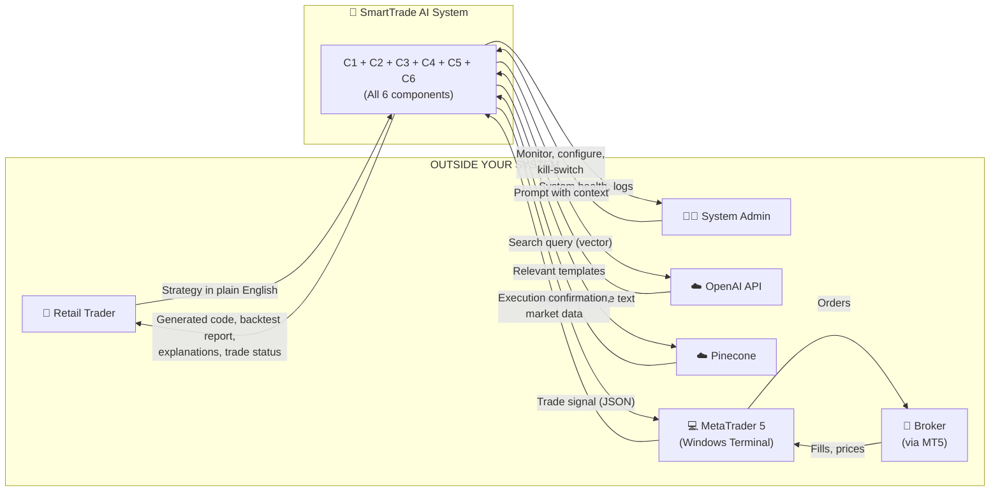
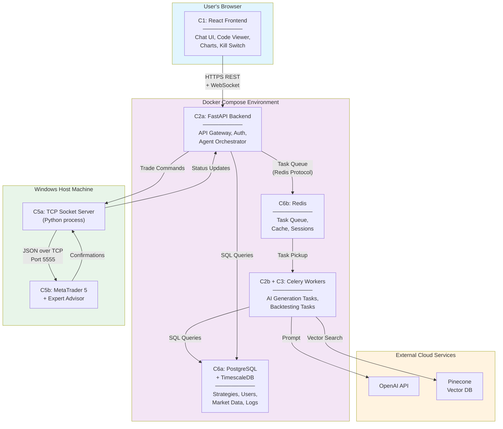
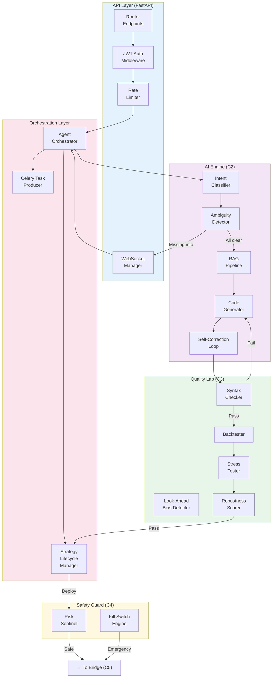
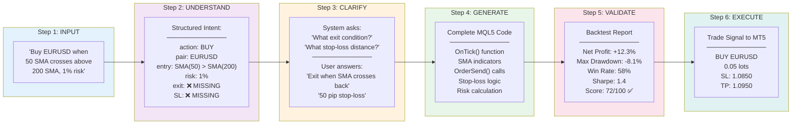
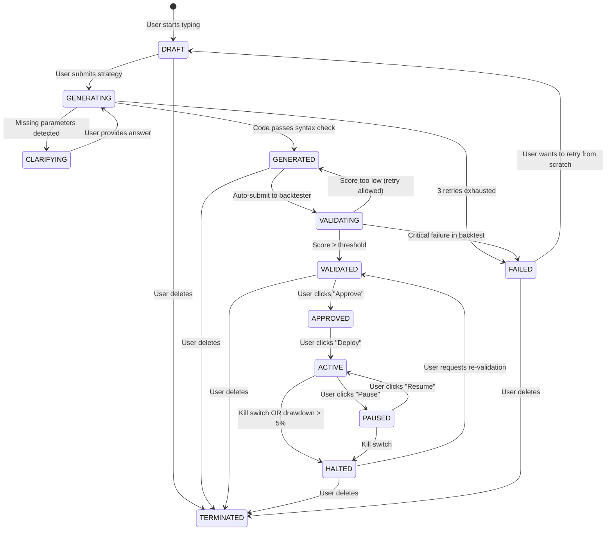

# SmartTradeAI — System Components & Architecture Diagrams

## First: What ARE the Main Components?

Before any diagram, let's answer the fundamental question. Your entire system has **6 main components**. Everything else is a sub-part of these 6.

Think of it like a human body:

| # | Component | What it does (one sentence) | Body analogy |
|---|-----------|---------------------------|--------------|
| **C1** | **Chat Interface** (Frontend) | Takes what the user says and shows what the system produces | 👁️ Eyes & mouth |
| **C2** | **Brain** (AI Engine) | Understands trading strategies, generates code, explains decisions | 🧠 Brain |
| **C3** | **Quality Lab** (Validation) | Tests if generated code actually works and is safe | 🔬 Immune system |
| **C4** | **Safety Guard** (Risk Sentinel) | Blocks dangerous trades before they reach the market | 🛡️ Pain reflex |
| **C5** | **Bridge** (Execution) | Connects to MetaTrader 5 and sends actual trade signals | 🤚 Hands |
| **C6** | **Memory** (Data Layer) | Stores everything — strategies, results, market data, logs | 🗄️ Memory |

**That's it. 6 components.** Everything in your 50+ component list from the technical review fits inside one of these 6 boxes.

### Where Each Sub-Component Lives

```
C1: Chat Interface
    ├── Chat input box
    ├── Code display panel
    ├── Backtest charts
    ├── Strategy controls (pause/stop)
    └── Kill switch button

C2: Brain (AI Engine)
    ├── Intent classifier ("what does the user want?")
    ├── Ambiguity detector ("is anything missing?")
    ├── RAG pipeline ("find relevant templates from knowledge base")
    ├── Code generator ("call LLM to write the code")
    └── Self-correction loop ("fix syntax errors, retry up to 3x")

C3: Quality Lab (Validation)
    ├── Syntax checker ("does the code compile?")
    ├── Look-ahead bias detector ("is it cheating with future data?")
    ├── Backtester ("run strategy on historical data")
    └── Stress tester ("what happens in a crash?")

C4: Safety Guard (Risk Sentinel)
    ├── Position size limiter ("don't bet too much")
    ├── Stop-loss enforcer ("must have a safety net")
    ├── Fat-finger filter ("catch absurd order sizes")
    ├── Frequency limiter ("no rapid-fire orders")
    ├── Drawdown monitor ("auto-stop if losing too much")
    └── Kill switch engine ("emergency shutdown")

C5: Bridge (Execution)
    ├── TCP socket server (Python side)
    ├── MT5 Expert Advisor (MQL5 side, runs inside MetaTrader)
    ├── Heartbeat monitor ("is the connection alive?")
    └── Safe-state protocol ("what to do when connection dies")

C6: Memory (Data Layer)
    ├── PostgreSQL (strategies, users, audit logs)
    ├── TimescaleDB (market price data)
    ├── Redis (task queue, cache, sessions)
    └── Pinecone (code templates & documentation embeddings)
```

---

## Diagram 1: System Context — What's Inside vs. Outside

This is the most fundamental diagram. It shows SmartTradeAI as **one single box** and everything external it connects to.



### What This Tells You

- **You build:** The grey box (SmartTrade AI System)
- **You DON'T build:** OpenAI, Pinecone, MetaTrader 5, or the Broker
- **You CONNECT TO:** 4 external systems (each is a risk if it goes down)
- **Two types of users:** Trader (uses the product) and Admin (monitors the system)

---

## Diagram 2: Container/Service Architecture — What Actually Runs

This shows every **running process** (Docker container or application) and how they communicate.



### What This Tells You

| Service | Technology | Runs Where | Port |
|---------|-----------|-----------|------|
| Frontend | React (Nginx) | Docker | 3000 |
| Backend API | FastAPI | Docker | 8000 |
| Celery Workers | Python + Celery | Docker | — (no port) |
| Database | PostgreSQL + TimescaleDB | Docker | 5432 |
| Redis | Redis | Docker | 6379 |
| Socket Bridge | Python script | Windows host | 5555 |
| MT5 Terminal | MetaTrader 5 + EA | Windows host | — |

**Key insight:** 5 services run in Docker. 2 things run on Windows (MT5 + the bridge script). This is why the MT5 deployment topology is a critical decision.

---

## Diagram 3: Backend Component Architecture — Inside the Brain

This zooms INTO the FastAPI Backend + Celery Workers to show the internal modules.



### The Flow in Plain English

1. **User request enters** through the Router → gets checked by Auth → Rate Limiter
2. **Orchestrator** takes over, classifies what the user wants
3. If info is missing → **Ambiguity Detector** asks clarification via WebSocket
4. When ready → **RAG** retrieves templates → **Code Generator** calls LLM → **Self-Correction** fixes errors
5. Generated code goes to **Syntax Checker** → **Backtester** → **Stress Tester** → gets a **Robustness Score**
6. If approved for deployment → **Risk Sentinel** validates the trade → sends to **Bridge**

---

## Diagram 4: End-to-End Data Flow — How Input Becomes Output

This shows how the user's text **transforms** step by step into executed trades.



### What Each Step Produces

| Step | Input | Process | Output | Component |
|------|-------|---------|--------|-----------|
| 1 | Raw English text | — | Raw text | C1 (Frontend) |
| 2 | Raw text | Intent classification | Structured JSON with gaps | C2 (Classifier) |
| 3 | Gaps in intent | Q&A with user | Complete structured spec | C2 (Clarification) |
| 4 | Complete spec + templates | LLM + RAG + Self-correction | Compiled MQL5 code | C2 (Generator) |
| 5 | MQL5 code + market data | Backtest + stress test | Robustness score | C3 (Lab) |
| 6 | Validated code + user approval | Sentinel check + bridge | Trade on MT5 | C4 + C5 |

---

## Diagram 5: Strategy Lifecycle — The Heart of the System

This is the **most important diagram for your project**. It shows every state a strategy can be in and what moves it between states.



### State Definitions

| State | What it means | What the user sees |
|-------|--------------|-------------------|
| **DRAFT** | User is composing their strategy | Chat interface, typing |
| **GENERATING** | LLM is writing the code | Loading spinner, "Generating..." |
| **CLARIFYING** | System needs more info | Clarification question in chat |
| **GENERATED** | Code is ready, not yet tested | Code viewer with syntax highlighting |
| **VALIDATING** | Backtest + stress test running | Progress bar, "Testing your strategy..." |
| **VALIDATED** | Tests passed, awaiting approval | Backtest report + "Approve" button |
| **APPROVED** | User approved, ready to deploy | "Deploy" button active |
| **ACTIVE** | Live on MT5, executing trades | Green status, live metrics |
| **PAUSED** | Temporarily stopped | Yellow status, "Resume" button |
| **HALTED** | Emergency stopped | Red status, kill-switch was triggered |
| **FAILED** | Could not generate or validate | Error message, "Try Again" button |
| **TERMINATED** | Permanently deleted | Removed from dashboard |

### Rules (CRITICAL — Must Be Enforced in Code)

> **You can NEVER go from DRAFT → ACTIVE.** The validation gate is mandatory.  
> **You can NEVER go from HALTED → ACTIVE.** Must re-validate first.  
> **TERMINATED is permanent.** No resurrection.

---

## Component Relationship Matrix

This table shows exactly HOW each component connects to every other component:

| | C1 Frontend | C2 Brain | C3 Lab | C4 Guard | C5 Bridge | C6 Memory |
|---|:-:|:-:|:-:|:-:|:-:|:-:|
| **C1 Frontend** | — | REST + WS | — | WS (kill switch) | — | — |
| **C2 Brain** | WS (updates) | — | Sends code to test | — | — | Reads/writes strategies |
| **C3 Lab** | WS (results) | Returns score | — | — | — | Reads market data, writes results |
| **C4 Guard** | WS (alerts) | Receives orders | — | — | Forwards safe orders | Writes audit logs |
| **C5 Bridge** | WS (trade status) | — | — | Receives orders | — | Writes execution logs |
| **C6 Memory** | — | Serves data | Serves data | Serves data | Serves data | — |

### Key Relationships Explained

1. **C1 → C2:** Frontend sends user text to Brain via REST API. Brain sends updates back via WebSocket.
2. **C2 → C3:** Brain sends generated code to Lab for testing. Lab returns pass/fail + score.
3. **C2 → C6:** Brain saves strategies to PostgreSQL, retrieves templates from Pinecone.
4. **C3 → C6:** Lab reads historical market data from TimescaleDB for backtesting.
5. **C4 → C5:** Guard validates orders and forwards safe ones to Bridge. This is the ONLY path to MT5.
6. **C5 → MT5:** Bridge maintains persistent TCP socket connection with the Expert Advisor.
7. **C6 serves everyone:** Every component reads from or writes to the data layer.

---

## Summary: The 5 Diagrams and What Each Answers

| # | Diagram | Question It Answers |
|---|---------|-------------------|
| 1 | System Context | What's my system vs. what's external? |
| 2 | Container Architecture | What services run and how do they communicate? |
| 3 | Backend Components | What's inside the backend and in what order? |
| 4 | Data Flow | How does user text become a trade? |
| 5 | Strategy Lifecycle | What states can a strategy be in and what triggers transitions? |
