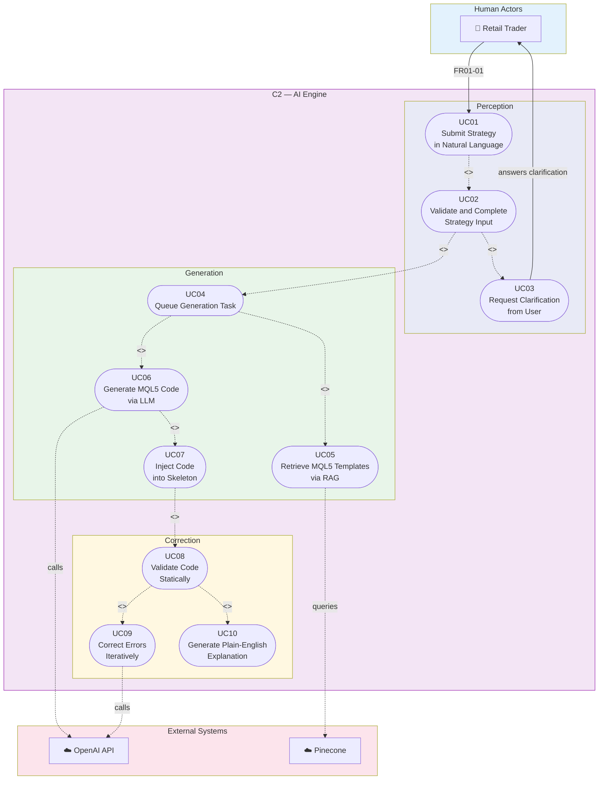

```mermaid
graph TB
    subgraph HUMAN_ACTORS["Human Actors"]
        TRADER["👤 Retail Trader"]
    end

    subgraph EXTERNAL_SYSTEMS["External Systems"]
        OPENAI["☁️ OpenAI API"]
        PINECONE["☁️ Pinecone"]
    end

    subgraph C2["C2 — AI Engine"]
        subgraph PERCEPTION["Perception"]
            UC01(["UC01\nSubmit Strategy\nin Natural Language"])
            UC02(["UC02\nValidate and Complete\nStrategy Input"])
            UC03(["UC03\nRequest Clarification\nfrom User"])
        end

        subgraph GENERATION["Generation"]
            UC04(["UC04\nQueue Generation Task"])
            UC05(["UC05\nRetrieve MQL5 Templates\nvia RAG"])
            UC06(["UC06\nGenerate MQL5 Code\nvia LLM"])
            UC07(["UC07\nInject Code\ninto Skeleton"])
        end

        subgraph CORRECTION["Correction"]
            UC08(["UC08\nValidate Code\nStatically"])
            UC09(["UC09\nCorrect Errors\nIteratively"])
            UC10(["UC10\nGenerate Plain-English\nExplanation"])
        end
    end

    TRADER -->|FR01-01| UC01
    UC01 -.->|<<include>>| UC02
    UC02 -.->|<<extend>>| UC03
    UC03 -->|answers clarification| TRADER
    UC02 -.->|<<include>>| UC04
    UC04 -.->|<<include>>| UC05
    UC04 -.->|<<include>>| UC06
    UC06 -.->|<<include>>| UC07
    UC07 -.->|<<include>>| UC08
    UC08 -.->|<<extend>>| UC09
    UC08 -.->|<<include>>| UC10

    UC05 -.->|queries| PINECONE
    UC06 -.->|calls| OPENAI
    UC09 -.->|calls| OPENAI

    style C2 fill:#f3e5f5,stroke:#9c27b0
    style PERCEPTION fill:#e8eaf6
    style GENERATION fill:#e8f5e9
    style CORRECTION fill:#fff8e1
    style HUMAN_ACTORS fill:#e3f2fd
    style EXTERNAL_SYSTEMS fill:#fce4ec
```
