# SmartTradeAI Current Runtime and Data Flow

Date: 2026-06-13
Status: Current-state architecture note
Scope: Runtime, documents, diagrams, active files, data flow, implemented behavior, and known gaps

## 1. Executive Summary

SmartTradeAI is currently a C2-focused backend workspace. The active product runtime is the Rust service under `services/c2-engine`. It exposes HTTP, SSE, and WebSocket routes for sessions, turns, tasks, and strategies.

The current service can:

- Create in-memory sessions.
- Accept user turns.
- Queue a turn as an in-memory task.
- Process the turn with deterministic Rust strategy functions.
- Detect missing strategy fields.
- Ask clarification questions.
- Generate an MQL5 draft from local skeleton templates when the strategy specification is complete.
- Run static analysis on generated MQL5.
- Stream events through SSE and WebSocket.
- List, read, patch, and soft-delete strategies from Postgres or local files.
- Optionally require a simple JWT on `/v1` routes.

The current service does not yet fully implement the intended closed C2 pipeline. The biggest gap is that the active `POST /v1/sessions/{id}/turn` path does not call the LLM provider layer. It uses deterministic Rust functions for classification, strategy extraction, generation, and static analysis. The repository contains an `api` crate with Groq, Gemini, OpenAI-compatible, xAI, and Anthropic/Claw provider support, but that crate is not wired into the active server turn processor.

This means a valid Gemini or Groq key can exist in the environment while the main C2 strategy route still does not use it.

## 2. Sources Read

Current product and design documents:

- `PROJECT_MAIN.md`
- `docs/PROJECT_BRIEF.md`
- `docs/handoffs/2026-06-13-llm-wiring.md`
- `docs/handoffs/2026-06-13-multi-user-auth.md`
- `.codex/handoffs/2026-06-13-llm-wiring.md`
- `designdocs/SmartTradeAI_SRS.md`
- `services/c2-engine/CLAW.md`
- `services/c2-engine/rust/README.md`

Current runtime and configuration files:

- `services/c2-engine/rust/crates/c2-engine/src/main.rs`
- `services/c2-engine/rust/crates/server/src/lib.rs`
- `services/c2-engine/rust/crates/server/src/auth.rs`
- `services/c2-engine/rust/crates/runtime/src/smarttrade_tools.rs`
- `services/c2-engine/rust/crates/runtime/src/conversation.rs`
- `services/c2-engine/rust/crates/runtime/src/prompt.rs`
- `services/c2-engine/rust/crates/api/src/client.rs`
- `services/c2-engine/rust/crates/api/src/types.rs`
- `services/c2-engine/rust/crates/api/src/providers/mod.rs`
- `services/c2-engine/rust/crates/api/src/providers/openai_compat.rs`
- `services/c2-engine/docker-compose.yml`
- `services/c2-engine/Dockerfile`
- `services/c2-engine/.env.example`
- `services/c2-engine/.claw/settings.json`
- `services/c2-engine/plugins/smarttrade-mql5/db/init.sql`
- `services/c2-engine/skeletons/*.mqh`

Current repo state notes:

- Many older `designdocs/` and diagram files are marked deleted in git status and are not present on disk.
- The only current file under `designdocs/` is `SmartTradeAI_SRS.md`.
- Historical Draw.io activity, sequence, and use-case diagrams are not present on disk.
- The external `plugins/smarttrade-mql5` directory currently contains only `db/init.sql`; the strategy tools live in Rust.

## 3. Current Repository Map

```text
smarttradeAI/
  PROJECT_MAIN.md
  docs/
    PROJECT_BRIEF.md
    CURRENT_RUNTIME_AND_DATA_FLOW.md
    handoffs/
      2026-06-13-llm-wiring.md
      2026-06-13-multi-user-auth.md
  designdocs/
    SmartTradeAI_SRS.md
  services/
    c2-engine/
      CLAW.md
      Dockerfile
      docker-compose.yml
      .env.example
      .claw/
        settings.json
        sessions/
      skeletons/
        basic_ea.mqh
        breakout.mqh
        grid.mqh
        rsi_mean_reversion.mqh
        sma_crossover.mqh
      plugins/
        smarttrade-mql5/
          db/
            init.sql
      rust/
        README.md
        Cargo.toml
        Cargo.lock
        crates/
          c2-engine/
          server/
          runtime/
          api/
```

Support and coordination files:

- `.codex/` contains agent prompts, skills, handoffs, and local workflow configuration.
- `.omx/` contains orchestration state, logs, and local runtime metadata.
- `skills-lock.json` records installed skill state.
- Root `.gitignore` ignores `.omx/`.

## 4. Current Documents and What They Mean

| File | Current role | Reliability note |
|---|---|---|
| `PROJECT_MAIN.md` | High-level product purpose. | Accurate as product intent, no implementation details. |
| `docs/PROJECT_BRIEF.md` | Current source of truth for product scope. | Strongest product-level document. Says it supersedes older academic/designdocs material. |
| `designdocs/SmartTradeAI_SRS.md` | Current SRS draft. | Useful, but partly optimistic compared to runtime. It marks some items implemented that the active path only partially performs. |
| `services/c2-engine/CLAW.md` | C2 system prompt and intended tool order. | Describes intended behavior, not the actual active server flow. |
| `docs/handoffs/2026-06-13-llm-wiring.md` | Backend handoff for wiring the LLM-driven orchestrator. | Future work specification. It explicitly says the current orchestrator is not LLM-driven. |
| `docs/handoffs/2026-06-13-multi-user-auth.md` | Backend handoff for real auth, roles, and audit trail. | Future work specification. Current auth is much simpler. |
| `.codex/handoffs/2026-06-13-llm-wiring.md` | Older handoff variant. | Useful historical context; superseded by the `docs/handoffs` version. |
| `services/c2-engine/rust/README.md` | Short Rust workspace note. | Accurate but minimal. |

## 5. Intended Product Flow From Current Docs

`docs/PROJECT_BRIEF.md` defines the desired product as a strategy-development workspace, not a live trading platform.

The intended flow is:

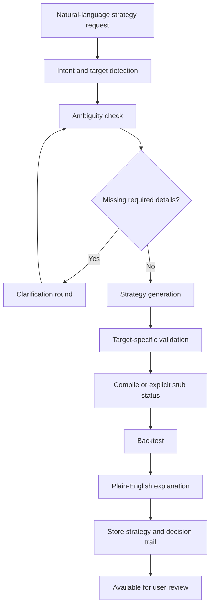

The intended C2 prompt flow in `CLAW.md` is:

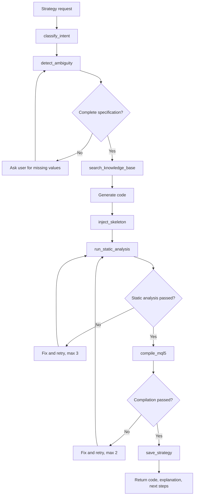

## 6. Actual Active Runtime Architecture

The active runtime is simpler than the intended flow.

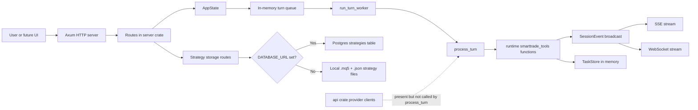

Runtime ownership:

| Layer | Current files | What it owns |
|---|---|---|
| Binary entrypoint | `crates/c2-engine/src/main.rs` | Reads host/port, creates `AppState`, starts worker, serves Axum app. |
| HTTP/API server | `crates/server/src/lib.rs` | Routes, sessions, tasks, event streaming, strategy CRUD, current turn orchestration. |
| Auth middleware | `crates/server/src/auth.rs` | Optional JWT verification for `/v1` routes. |
| Strategy tools | `crates/runtime/src/smarttrade_tools.rs` | Intent classification, spec extraction, ambiguity detection, skeleton generation, static analysis, compile helper, save helper. |
| Conversation loop | `crates/runtime/src/conversation.rs` | Generic model/tool loop, but not used by active `process_turn`. |
| Prompt builder | `crates/runtime/src/prompt.rs` | Builds SmartTrade system prompt for an LLM-driven runtime, but not used by active `process_turn`. |
| Provider clients | `crates/api/src/*` | OpenAI-compatible, Groq, Gemini, xAI, Claw/Anthropic-style client support. Present but not connected to the server flow. |
| Templates | `skeletons/*.mqh` | MQL5 skeletons injected by runtime generation functions. |
| Persistence schema | `plugins/smarttrade-mql5/db/init.sql` | Postgres schema for strategies and strategy status audit. |

## 7. Active Startup Flow

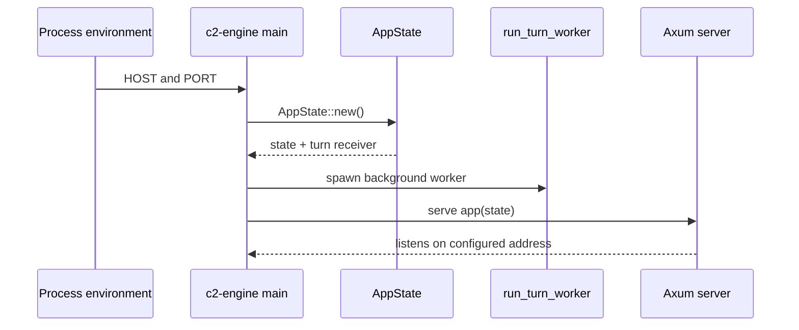

Startup behavior:

- Default host is `0.0.0.0`.
- Default port is `3000`.
- The service creates one shared `AppState`.
- The service starts one background queue receiver.
- Each received turn is processed in its own Tokio task.
- Per-session mutexes serialize turns for the same session.

## 8. Active HTTP Surface

Canonical `/v1` routes:

| Route | Method | Current behavior |
|---|---:|---|
| `/health` | GET | Returns service status and version. |
| `/healthz` | GET | Same health response. |
| `/readyz` | GET | Returns ready when the worker channel is open. |
| `/v1/sessions` | POST | Creates an in-memory session. |
| `/v1/sessions` | GET | Lists in-memory sessions. |
| `/v1/sessions/{id}` | GET | Returns a session and conversation messages. |
| `/v1/sessions/{id}/turn` | POST | Accepts a user turn, queues a task, returns `task_id`. |
| `/v1/sessions/{id}/events` | GET | Streams session events as SSE. |
| `/v1/ws/{id}` | GET | Streams session events as WebSocket JSON. |
| `/v1/tasks/{task_id}` | GET | Returns task status and payload. |
| `/v1/strategies` | GET | Lists strategies for the resolved user. |
| `/v1/strategies/{id}` | GET | Reads one strategy for the resolved user. |
| `/v1/strategies/{id}` | PATCH | Updates strategy metadata or code for the resolved user. |
| `/v1/strategies/{id}` | DELETE | Soft-deletes a strategy for the resolved user. |

Legacy compatibility routes:

| Route | Method | Current behavior |
|---|---:|---|
| `/sessions` | POST/GET | Legacy session create/list. |
| `/sessions/{id}` | GET | Legacy session details. |
| `/sessions/{id}/events` | GET | Legacy SSE event stream. |
| `/sessions/{id}/message` | POST | Legacy message submission. |

Auth behavior:

- JWT middleware wraps the `/v1` router.
- If `C2_JWT_SECRET` or `JWT_SECRET` is unset, the middleware allows requests through.
- If JWT is enabled, requests need `Authorization: Bearer <token>`.
- Claims support `sub`, `user_id`, `exp`, `iat`, `iss`, and `aud`.
- There is no current user table, role model, tenant model, login endpoint, or password flow.

## 9. Active Turn Data Flow

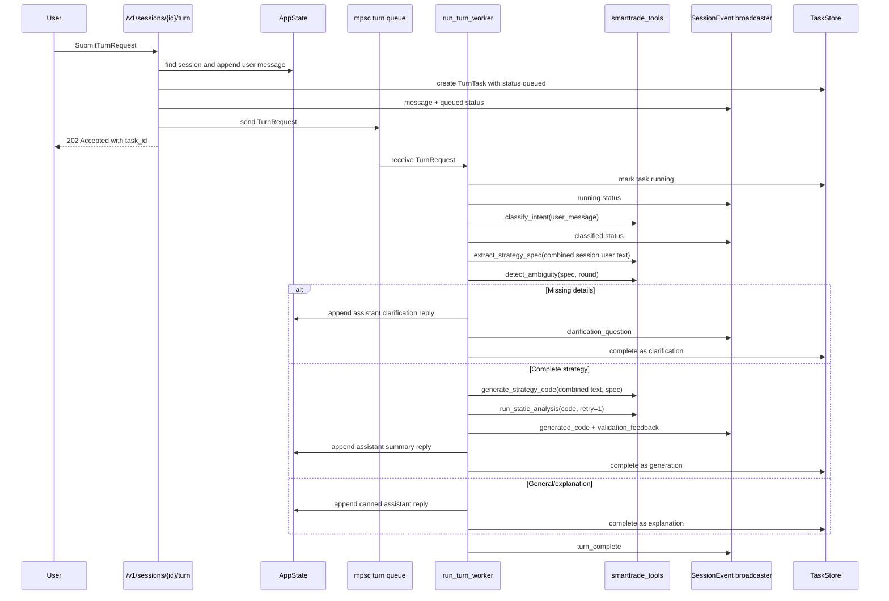

Important behavior:

- The turn payload is accepted before processing finishes.
- The response returns a `task_id`, not the generated output.
- The final result is read through `GET /v1/tasks/{task_id}`.
- Progress is streamed through SSE or WebSocket.
- The worker uses all user messages in the session when extracting the strategy spec.
- The worker serializes processing per session to avoid overlapping turns.
- The active turn flow does not call an LLM provider.

## 10. Actual Strategy Generation Flow

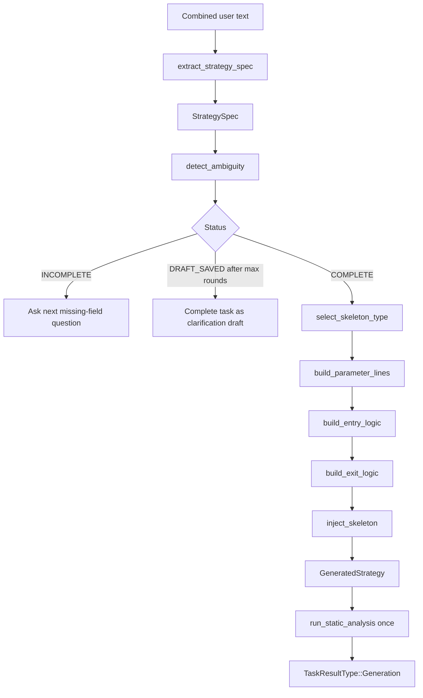

Required fields:

| Field | Meaning |
|---|---|
| `action` | BUY, SELL, long, or short. |
| `pair` | Symbol such as EURUSD, GBPUSD, XAUUSD, BTCUSD. |
| `entry_condition` | Entry trigger, usually captured after `when` or `if`. |
| `exit_condition` | Exit trigger such as reverse cross, close condition, or take profit. |
| `stop_loss` | Stop-loss value such as 50 pips or 1 percent. |
| `timeframe` | M1, M5, M15, M30, H1, H4, D1, W1, or MN. |

Skeleton selection:

| Skeleton | Trigger |
|---|---|
| `sma_crossover` | Text/spec mentions SMA, EMA, moving average, or cross. |
| `rsi_mean_reversion` | Text/spec mentions RSI, overbought, or oversold. |
| `breakout` | Text/spec mentions breakout, support, resistance, high, or low. |
| `grid` | Text/spec mentions grid. |
| `basic_ea` | Fallback. |

Static analysis checks:

- Braces are balanced.
- Parentheses are balanced.
- `OnInit`, `OnDeinit`, and `OnTick` exist.
- `OnInit` returns `int`.
- Trade placement has stop-loss handling.
- Deprecated MQL4 functions are flagged.
- `#property strict` or `#property version` exists.

Current limitation:

- The main worker calls static analysis once with `retry=1`.
- The retry loop described in `CLAW.md` is implemented in constants and tool state, but not used by `process_turn`.
- Compile and save helpers exist, but `process_turn` does not call them after generation.

## 11. Event Data Flow

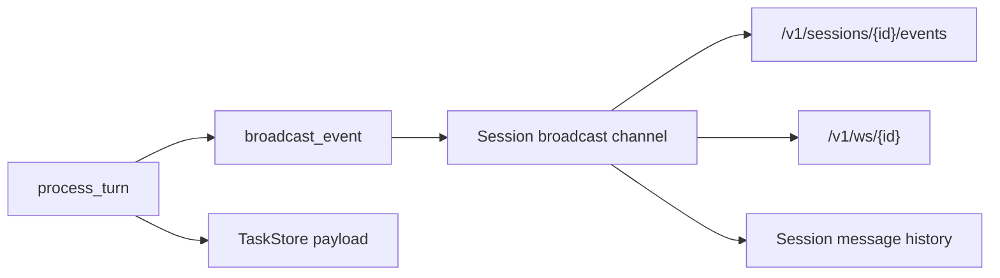

Current event types:

| Event type | Meaning |
|---|---|
| `snapshot` | Initial session snapshot when a stream opens. |
| `message` | User message accepted into the session. |
| `assistant_reply` | Assistant reply added to the session. |
| `status` | Task phase update such as queued, running, classified, generation_complete. |
| `clarification_question` | Missing-field question with target field and round metadata. |
| `validation_feedback` | Static analysis or spec capture details. |
| `generated_code` | Full generated MQL5 draft content. |
| `turn_complete` | Turn finished. |
| `turn_error` | Turn-level failure. |
| `error` | Task-level error with task id. |

Current status phases observed in code:

- `queued`
- `running`
- `classified`
- `waiting_for_clarification`
- `generation_complete`
- `draft_saved`
- `responded`

Planned but not active in `process_turn`:

- `compile_skipped_stub`
- `compile_succeeded`
- `saved`
- `backtest_complete`
- `explained`

## 12. Task Data Flow

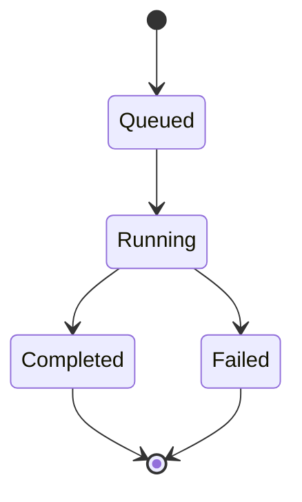

Task payload shapes:

| Result type | Current payload content |
|---|---|
| `clarification` | Ambiguity status, round, missing fields, provided fields, next question, classification, partial spec. |
| `generation` | Classification, captured spec, generated strategy name, skeleton type, code, explanation, line count, static analysis result, `ready_for_compile`. |
| `explanation` | Canned response and classification metadata. |
| `error` | Error message. |

Task storage:

- Tasks are stored in memory only.
- Restarting the service loses all tasks.
- There is no durable task table.

## 13. Strategy Storage Data Flow

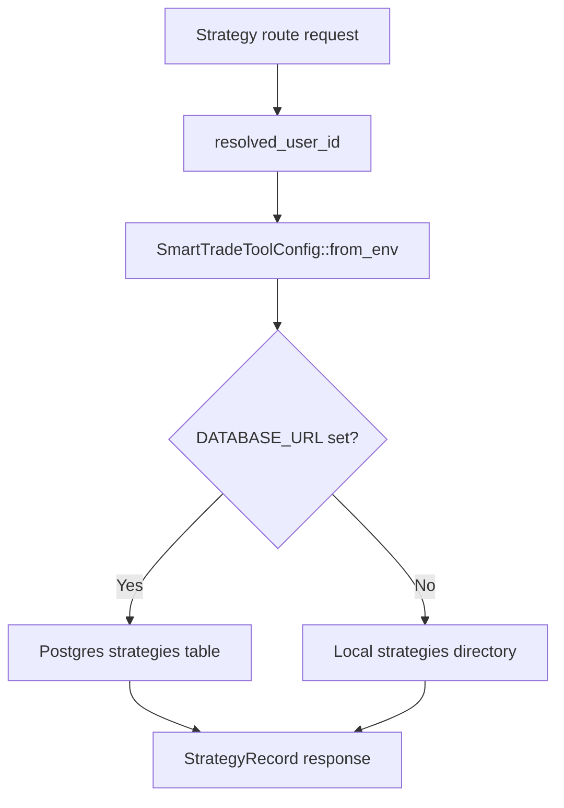

Current strategy schema in Postgres:

| Column | Purpose |
|---|---|
| `id` | Serial primary key. |
| `name` | Strategy name. |
| `code` | MQL5 source text. |
| `explanation` | Plain-English explanation. |
| `status` | DRAFT, GENERATED, DELETED, etc. |
| `session_id` | Related session id. |
| `user_id` | User/principal id string. |
| `pair` | Trading pair. |
| `timeframe` | Chart timeframe. |
| `created_at` | Creation time. |
| `updated_at` | Update time. |

Current audit table:

- `strategy_audit_log` exists only for strategy status transitions.
- There is no full turn/action audit table yet.

Local storage behavior:

- Saves `.mq5` source files.
- Saves adjacent `.json` metadata.
- Reads metadata and source back into `StrategyRecord`.
- Soft delete updates metadata status to `DELETED`.

Current limitation:

- The strategy CRUD routes can read and modify stored strategies.
- The main generation path does not save generated strategies yet.
- A generated strategy appears in task payload and event stream, not automatically in strategy storage.

## 14. LLM Provider Layer

The repo contains an LLM/provider layer in `services/c2-engine/rust/crates/api`.

Supported provider selection behavior:

| Provider intent | Environment/config path |
|---|---|
| Groq | `LLM_PROVIDER=groq`, `GROQ_API_KEY`, `GROQ_BASE_URL` |
| Gemini | `LLM_PROVIDER=gemini`, `GEMINI_API_KEY`, `GEMINI_BASE_URL` |
| OpenAI | `LLM_PROVIDER=openai`, `OPENAI_API_KEY`, `OPENAI_BASE_URL` |
| xAI | `LLM_PROVIDER=xai`, `XAI_API_KEY`, `XAI_BASE_URL` |
| Anthropic/Claw path | `LLM_PROVIDER=anthropic` or Claude-style model names |

Provider request shape:

- Internal `MessageRequest` supports model, max tokens, temperature, messages, system prompt, tools, tool choice, and streaming.
- OpenAI-compatible providers are translated to `/chat/completions` format.
- Tool definitions are translated into OpenAI-compatible `tools` payloads.
- Tool results are translated into `role: tool` messages.
- Streaming chunks are normalized into internal `StreamEvent` values.

Important current architecture fact:

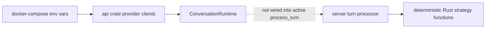

The provider layer is real code, but the active HTTP turn path does not currently use it. The server crate does not depend on the `api` crate. The binary depends on `server`, and `server` depends on `runtime`. So LLM keys can be configured without affecting the current `/v1/sessions/{id}/turn` behavior.

## 15. Runtime Tool Surface

The Rust `SmartTradeToolExecutor` supports these tool names:

| Tool name | Implemented behavior |
|---|---|
| `classify_intent` | Rule-based intent classification from message text. |
| `detect_ambiguity` | Checks required strategy fields and tracks rounds by session id. |
| `search_knowledge_base` | Searches local skeleton templates; Pinecone config is noted but not used for remote search. |
| `inject_skeleton` | Injects logic and parameters into an MQL5 skeleton. |
| `run_static_analysis` | Runs static MQL5 checks and tracks retry count. |
| `compile_mql5` | Calls `C3_COMPILER_URL` if set; otherwise returns a stub success with warning. |
| `save_strategy` | Saves to Postgres if `DATABASE_URL` exists, otherwise saves local `.mq5` and `.json`. |

Current usage:

- `process_turn` directly calls `classify_intent`, `extract_strategy_spec`, `detect_ambiguity`, `generate_strategy_code`, and `run_static_analysis`.
- `process_turn` does not call `search_knowledge_base`, `compile_mql5`, or `save_strategy`.
- `ConversationRuntime` can execute tool calls through `SmartTradeToolExecutor`, but the server does not invoke it in the active path.

## 16. Current Docker Runtime

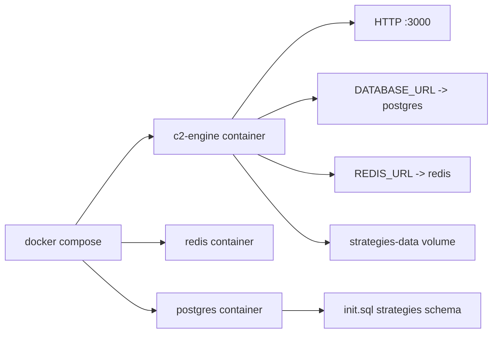

Current Docker services:

| Service | Current role |
|---|---|
| `c2-engine` | Builds and runs the Rust C2 HTTP service on port 3000. |
| `redis` | Provisioned and exposed, but not actively used by the current Rust turn path. |
| `postgres` | Provides strategy storage schema through `init.sql`. |
| `rust-dev` | Optional development profile container. |

Current environment passed to `c2-engine`:

- LLM provider variables are passed.
- Engine variables are passed.
- Redis and Postgres URLs are passed.
- Optional JWT variables are passed.
- Pinecone variables are passed.

Current limitation:

- `REDIS_URL`, `LLM_PROVIDER`, Groq/Gemini/OpenAI keys, and Pinecone variables are available to the container, but the main turn processor does not use Redis, LLM providers, or remote Pinecone RAG.

## 17. Current Skeleton Templates

| File | Purpose |
|---|---|
| `basic_ea.mqh` | General MQL5 EA skeleton. |
| `sma_crossover.mqh` | Moving-average crossover skeleton. |
| `rsi_mean_reversion.mqh` | RSI mean-reversion skeleton. |
| `breakout.mqh` | Breakout strategy skeleton. |
| `grid.mqh` | Grid strategy skeleton. |

The templates are compiled into the Rust runtime with `include_str!`, so the running binary has access to them at compile time.

## 18. Implemented vs Planned

| Capability | Intended by docs | Current implementation |
|---|---|---|
| Product purpose | Strategy-development workspace | Documented in `PROJECT_MAIN.md` and `docs/PROJECT_BRIEF.md`. |
| Session lifecycle | Create/list/read sessions | Implemented in memory. |
| Turn submission | Queue and process turns | Implemented with in-memory queue and task store. |
| Task status | Poll task status | Implemented in memory. |
| SSE/WS updates | Stream turn progress | Implemented. |
| Intent classification | Detect request type | Implemented as regex/rule scoring. |
| Ambiguity detection | Ask for missing fields | Implemented. |
| Clarification rounds | Max 5 rounds | Implemented with in-memory per-session counter. |
| Knowledge search/RAG | Retrieve relevant docs/templates | Local skeleton search exists; main turn path does not call it. |
| LLM-driven generation | Provider creates strategy/code | Provider layer exists; active turn path does not use it. |
| Deterministic code generation | Fallback generator | Implemented and currently primary. |
| Skeleton injection | Use MQL5 templates | Implemented. |
| Static analysis | Validate generated MQL5 | Implemented; active path runs once. |
| Static retry loop | Fix and retry max 3 | Tool state/constants exist; active path does not loop. |
| Compile | C3/MetaEditor or explicit stub | Helper exists; active path does not call it. |
| Save strategy | Persist generated result | Helper and CRUD routes exist; active generation path does not save. |
| Strategy CRUD | List/get/update/delete | Implemented for Postgres or local files. |
| Full audit trail | Record all actions | Not implemented. Only strategy status audit table exists. |
| Real multi-user auth | Users, roles, tenants | Not implemented. Only optional JWT claims middleware exists. |
| Backtesting | Canned/uploaded OHLCV backtest | Not implemented. |
| Pine Script path | Target selection and Pine support | Not implemented in active runtime. |
| Frontend workspace | User-facing web UI | Not present in repo. |
| Live trading | Explicitly out of scope | Not implemented. Correctly absent. |

## 19. Main Gaps Blocking the Intended C2 Design

### Gap 1: LLM provider layer is disconnected from active turn processing

The `api` crate contains provider clients and OpenAI-compatible tool-call translation. The `runtime` crate contains `ConversationRuntime`. But `server::process_turn` does not use either one. It directly calls deterministic functions.

Impact:

- Gemini/Groq/OpenAI keys can be valid and still not affect strategy generation.
- The generated output can be identical or deterministic because it is not coming from the provider.
- Provider-specific debugging does not prove the C2 strategy pipeline is LLM-driven.

### Gap 2: Prompt and runtime disagree

`CLAW.md` tells the assistant to follow a tool pipeline through compile and save. The active server does not load that prompt for `/v1/sessions/{id}/turn`.

Impact:

- The prompt describes intended C2 behavior.
- The server executes a smaller deterministic pipeline.
- Enhancing the prompt alone will not fix the active HTTP workflow.

### Gap 3: Compile and save helpers are not connected to generation

`compile_mql5` and `save_strategy` exist, but `process_turn` completes the task after static analysis.

Impact:

- No `saved_strategy_id` is produced by generation.
- Strategy CRUD can manage existing saved records, but newly generated code is not automatically saved.
- Compile stub/real C3 status is not surfaced in generation tasks.

### Gap 4: Auth is optional JWT, not real user management

The current auth middleware validates claims if a secret is configured. There is no registration/login flow, no roles, no user table, no tenant ownership, and no full audit log.

Impact:

- Good enough for local development.
- Not enough for the four-role v1 model in `docs/PROJECT_BRIEF.md`.

### Gap 5: Documentation inventory is unstable

Many older design docs and diagram files are deleted from the working tree. Current docs are enough to understand direction, but not enough to claim that the complete design package exists.

Impact:

- `docs/PROJECT_BRIEF.md` should be treated as the current product source of truth.
- Deleted Draw.io diagrams should not be referenced as available artifacts.
- `SmartTradeAI_SRS.md` needs reconciliation with current runtime reality.

## 20. What Is Already Reusable

Reusable now:

- Axum server structure.
- In-memory session/task/event model.
- SSE and WebSocket streaming.
- Strategy CRUD route shape.
- Optional JWT middleware.
- MQL5 skeleton templates.
- Rule-based ambiguity detection.
- Static analyzer.
- Postgres/local persistence helpers.
- OpenAI-compatible provider client.
- Gemini/Groq/OpenAI provider configuration logic.
- Generic `ConversationRuntime` model/tool loop.
- SmartTrade tool executor.

Needs wiring, not rewriting:

- LLM provider client into C2 turn path.
- `ConversationRuntime` into `process_turn` or a replacement orchestrator.
- `compile_mql5` into generation completion.
- `save_strategy` into generation completion.
- Tool retry loops into the active flow.

Needs new implementation:

- Real auth registration/login/roles.
- Per-user and role-based strategy access.
- Full audit log.
- Backtest crate or service.
- Pine Script target support or explicit unsupported status.
- Durable task/session persistence if needed beyond local runtime.
- Frontend workspace.

## 21. Lowest-Level Runtime Walkthrough

### Session creation

1. Client calls `POST /v1/sessions`.
2. Server allocates `session-N`.
3. Server creates a `Session` with:
   - id
   - created timestamp
   - runtime conversation session
   - broadcast channel
4. Server inserts it into `AppState.sessions`.
5. Server creates or prepares a per-session turn lock.
6. Server returns `201` with `session_id`.

### Turn submission

1. Client calls `POST /v1/sessions/{id}/turn`.
2. If JWT claims are present and no `context.user_id` was supplied, server copies principal id into turn context.
3. Server allocates `task-N`.
4. Server appends the user message to the session conversation.
5. Server inserts a queued `TurnTask`.
6. Server broadcasts:
   - `message`
   - `status` with `queued`
7. Server sends `TurnRequest` into the mpsc queue.
8. Server returns `202` with task id.

### Worker processing

1. Worker receives `TurnRequest`.
2. Worker spawns an async task.
3. `process_turn` obtains the session mutex.
4. Task status becomes `running`.
5. Worker combines all user text in the session.
6. Worker classifies the latest user message.
7. Worker extracts strategy spec from all user text.
8. Worker increments clarification round.
9. Worker detects ambiguity.
10. Worker chooses one branch:
    - clarification
    - generation
    - draft saved
    - explanation/general reply
11. Worker completes task payload.
12. Worker broadcasts `turn_complete`.

### Generation branch

1. Clear clarification rounds for the session.
2. Select skeleton type from message/spec.
3. Build strategy name.
4. Build parameter lines.
5. Build entry logic.
6. Build exit logic.
7. Inject local skeleton template.
8. Build explanation string.
9. Run static analysis once.
10. Broadcast generated code.
11. Broadcast validation feedback.
12. Append assistant text summary.
13. Complete task with generation payload.

### Strategy CRUD branch

1. Resolve user id from JWT claims or `local-dev-user`.
2. Read `SmartTradeToolConfig`.
3. If `DATABASE_URL` exists, use Postgres queries.
4. Otherwise use local file metadata.
5. Filter by `user_id`.
6. Return strategy records.

## 22. Current Risk Notes

| Risk | Why it matters |
|---|---|
| LLM env vars imply behavior that does not happen | Users may think adding Gemini/Groq makes generation LLM-driven, but the active route does not call the provider. |
| Compile stub helper returns `success: true` | If wired naively, downstream code could mistake skipped compile for real compile. |
| In-memory sessions/tasks | Restart loses live session and task data. |
| Optional auth by default | Good for dev, not enough for v1 user isolation. |
| SRS overstates implementation | Engineers may trust the SRS and miss runtime gaps. |
| Deleted diagrams/docs | Project history exists in git status but not in current files. |
| Static analysis is not compilation | Passing static analysis does not prove MQL5 compiles. |

## 23. Recommended Next Documentation Cleanup

1. Update `designdocs/SmartTradeAI_SRS.md` to split each feature into `implemented`, `partial`, `planned`, and `out of scope`.
2. Add a small `docs/API_SURFACE.md` that documents only current routes and actual payloads.
3. Add a `docs/C2_RUNTIME_GAPS.md` or convert this document into the canonical current-state architecture note.
4. Recreate only the diagrams that matter as Mermaid in Markdown instead of restoring all old Draw.io files.
5. Mark the handoff docs as future-work handoffs, not current implementation evidence.

## 24. Bottom Line

The current repo already has a useful C2 backend foundation: sessions, tasks, streaming events, skeleton-based MQL5 generation, static analysis, strategy storage helpers, Docker runtime, and provider-client code.

The main missing piece is the actual connection between the active C2 turn route and the LLM-driven tool pipeline. Until that is wired, adding a paid or free LLM key can validate provider connectivity but will not make the main strategy workflow fully LLM-driven.
