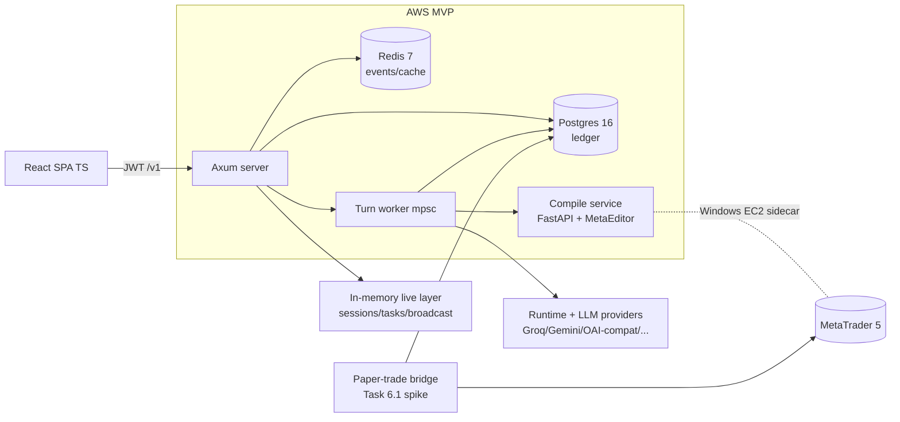
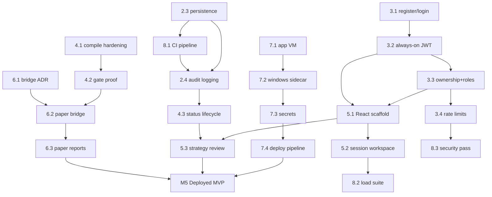

# SmartTradeAI — Roadmap & Work Breakdown Structure

> Stage 0 artifact produced by the `roadmap-wbs-planner` skill (Heisenberg OS).
> Host evidence: repository reads + brownfield diagnostic (2026-09-25).
> GrapeRoot dual-graph: `UNKNOWN` for this workspace (no `.dual-graph/` index);
> snapshot below is built from direct file inspection, not graph queries.

## 1. Planning Context

- **Project:** SmartTradeAI — natural-language trading ideas → verified, reviewable
  MQL5 Expert Advisor drafts, with a guided clarification workflow.
- **Track:** Route B — Brownfield diagnostic (existing Rust workspace, ~June-MVP lineage).
- **Date / author:** 2026-09-25, Heisenberg Stage 0 (agent-assisted, user-directed).
- **Target outcome:** Deployed end-to-end MVP (backend + React UI + AWS with Windows
  MetaEditor sidecar), including supervised paper-trading and a full auth system.
- **Active leaf task at time of writing:** `Task 2.3 — Persistent Session & Task Management`
  *(completed 2026-09-25; next leaf: Task 2.4 — Audit logging pipeline)*.

## 2. User Answers and Assumptions

### Confirmed by User (2026-09-25 intake)

| Vector | Answer |
|---|---|
| MVP target | Deployed end-to-end MVP (backend + UI + AWS EC2 + Windows sidecar) |
| Safety boundary | Draft + review **and** supervised paper trading (MT5 demo account) |
| Frontend timing | Start UI soon — parallel within the next 1–2 tasks after 2.3 |
| Auth posture | Full auth system: registration, argon2 login, roles |
| Secrets & CI | CI pipeline is a roadmap task; secret cleanup handled ad-hoc (not a formal task) |
| LLM strategy | Multi-provider, free-first for development (Groq/Gemini; paid fallback) |
| Learning goal | Rust/CS learning artifacts on-demand only — roadmap is product-focused |
| Deployment | AWS deployment planned now (not deferred) |

### Inferred from Codebase (verified 2026-09-25)

- Frontend does not exist yet: no `package.json`, no JS/TS/CSS anywhere; React is
  stated as intent in `desktop` and `PROJECT_MAIN.md`.
- Compile path is real (`compile-service/` FastAPI + `metaeditor64.exe`) but optional
  at runtime: unset `C3_COMPILER_URL` → stubbed compile result (FR-008 `PARTIAL`).
- Auth middleware exists but is opt-in: JWT enforced only when `C2_JWT_SECRET` is set;
  `users` table + argon2/argon2 deps already present.
- Auth rate-limit middleware is a placeholder; audit tables exist
  (`audit_logs`, `strategy_audit_log`) with no confirmed writer path.
- Multi-provider LLM client is hand-rolled (no vendor SDK): Groq, Gemini,
  OpenAI-compatible, Anthropic, xAI, OpenRouter.
- Testing is developer-local only: Rust tests exist, no CI configuration in repo.

### Assumptions Ledger

| # | Assumption | Tag | If wrong |
|---|---|---|---|
| A1 | An AWS account and paid budget exist for EC2 (+ sidecar, RDS or self-hosted PG) | ASSUMED | Epic 7 re-scoped to single-VM or local prod |
| A2 | MetaEditor on a Windows EC2 sidecar is acceptable for compile (mirrors current local sidecar) | ASSUMED | Alternative: headless Linux MQL5 compiler spike needed |
| A3 | Frontend stack = React + TypeScript (Vite) | INFERRED | Re-decide before Task 5.1 |
| A4 | Paper-trading bridge mechanism is undecided — Task 6.1 spike picks it | ASSUMED | May push Epic 6 later |
| A5 | Secret rotation stays ad-hoc; **must** be folded into Task 7.3 before any deployment | INFERRED | Security risk stays open until 7.3 |
| A6 | Pinecone/knowledge-base enrichment is optional (P2) | INFERRED | — |
| A7 | Single-node deployment (no clustered session store) for MVP | INFERRED | Multi-instance work moves into Epic 7 |
| A8 | Existing task numbering 2.1–2.3 predates this roadmap; Epic 2 keeps it for continuity | CONFIRMED | — |

## 3. Current Codebase Snapshot

- **Workspace:** `services/c2-engine/rust/` — crates: `api` (provider clients + SSE),
  `runtime` (agentic loop, 18 tools/executor, hooks, compaction, usage),
  `server` (axum 0.8, JWT, SSE/WS, routes), `c2-engine` (binary, pool, migrations).
- **API:** `/v1/sessions` CRUD, `POST /v1/sessions/{id}/turn` (202 + task_id),
  `GET /v1/tasks/{id}`, SSE `/events`, WS `/v1/ws/{id}`, `/v1/strategies` CRUD,
  `/health|healthz|readyz`, legacy open routes.
- **Data:** Postgres 16 — `users, sessions, tasks, strategies, strategy_audit_log,
  audit_logs`; UUID v4 PKs (Task 2.2 migration 0002); pool max 20; Redis 7 events.
- **Turn pipeline:** enqueue → persist → mpsc → worker → LLM (SSE) → MQL5 extract →
  compile loop (C3) → save strategy → persist conversation → broadcast → complete_task.
- **Docker:** `docker-compose.yml` — `c2-engine`, `redis`, `postgres` (init.sql),
  `rust-dev` (profile `dev`, cargo container used for all verification).
- **Frontend:** none. **CI:** none. **Docs:** `PROJECT_MAIN.md`, SRS (2026-06-13),
  `designdocs/task_2_*` artifacts.

## 4. Brainstormed Architectural Directions

1. **Strangler persistence (chosen):** keep in-memory live layer (broadcast, locks,
   mpsc) + Postgres as durable ledger — already implemented in Task 2.3; hydrate on
   boot/miss. Lowest risk to the hot path.
2. **Stateless-from-DB:** read every turn from Postgres. Rejected for MVP — latency
   and rewrite risk; revisit only if clustering (A7) changes.
3. **Redis as system-of-record:** rejected — durability semantics weaker than PG for
   conversation/task state; Redis stays transport/cache.
4. **Frontend-first:** rejected ordering-wise — auth + persistence must exist for the
   UI to bind real contracts (Escher, zero silent mocks); but UI starts soon per user.
5. **Paper trading via external bridge service (MetaApi-style) vs in-EA reporting:**
   undecided — Task 6.1 spike decides with an ADR.

## 5. Scope Decision (MoSCoW)

### Must Have (P0) — MVP
- Task 2.3 persistence verified; audit-log writes (2.4)
- Full auth: register/login, always-on JWT, ownership checks, roles, real rate limits
- Strategy status lifecycle + static-analysis/compile gates proven
- Real compile integration (no silent stubs in prod)
- React workspace: login, session/turn chat with SSE, strategy review + export
- CI pipeline (guard validate + docker cargo checks)
- AWS deployment: app VM, Windows compile sidecar, managed secrets, smoke tests
- Supervised paper trading on MT5 demo (read-only telemetry)

### Should Have (P1)
- Design tokens + accessibility pass (Picasso/HCI skills) before UI polish
- Load/failover test suite codified from Stage 4 matrices
- Knowledge-base search enrichment (skeletons + optional Pinecone)
- Deployment pipeline automation (build → deploy on tag)

### Could Have (P2)
- Strategy comparison/analytics views; multi-timeframe backtest reports
- Team/roles beyond admin+user; audit-log UI
- Compaction auto-invocation in `process_turn` (currently manual)

### Won't Have Yet (P3)
- Live-trading execution of EAs (explicit PROJECT_MAIN non-goal)
- Multi-region HA / clustered session store
- Guaranteed-profit anything, hidden-risk anything (product invariants)

## 6. System Architecture Topology

## 7. Milestone Roadmap Overview

| Milestone | Goal | Exit criteria |
|---|---|---|
| **M1 — Durable Core** | 2.3 + 2.4 done, CI live | guard validate in CI; docker cargo checks green; audit writes proven |
| **M2 — Trust Layer** | Epic 3 + Epic 4 gates | register→login→authorized CRUD; unauthenticated denied; gates block unsafe saves |
| **M3 — Usable MVP** | Epic 5 (UI start soon) | user can run idea→draft flow from the browser; Escher contract check passes |
| **M4 — Paper Proof** | Epic 6 | demo-account telemetry visible per strategy; fills/pnl report |
| **M5 — Deployed MVP** | Epic 7 + 8 | AWS URL serving the flow; Windows sidecar compiles; smoke + load suite pass |

## 8. Work Breakdown Structure (atomic leaf tasks)

Status key: `[COMPLETED]` `[ACTIVE]` `[BLOCKED]` `[READY]` `[BACKLOG]`

### Epic 1 — Foundation & Core Engine (baseline, historical)

- **1.1** `[COMPLETED]` Modular monolith → workspace crates — *evidence: commits `ab80975`, `5bedefd`*
- **1.2** `[COMPLETED]` Shared PgPool propagated into executors & routers — *evidence: `d965a78`*
- **1.3** `[COMPLETED]` Production DB enforcement + migration foundation — *evidence: `6b72365`*
- **1.4** `[COMPLETED]` Heisenberg OS agentic workflow adoption — *evidence: `42409d7`*

### Epic 2 — Persistence & Data Integrity

- **2.1** `[COMPLETED]` Schema: users/sessions/tasks/strategies/audit tables (`init.sql`, migration 0001)
- **2.2** `[COMPLETED]` Secure entity identifiers — UUID v4 rotation (migration 0002 + artifacts)
- **2.3** `[COMPLETED]` **Persistent session & task management** — persist on enqueue/update,
  DB fallback reads, boot reconcile, conversation hydration.
  *Stage 4 QA verified 2026-09-25: check/clippy green, live persistence, restart survival,
  reconcile; receipt `.heisenberg/receipts/TASK-2.3.json`.*
- **2.4** `[READY]` Audit logging pipeline — write `audit_logs` + `strategy_audit_log`
  on session/turn/strategy status transitions.
  - AC: every PATCH/DELETE on strategies and every task completion writes an audit row; verified by SQL checks.

### Epic 3 — Auth & Users

- **3.1** `[BACKLOG]` Registration + login endpoints — argon2 hash/verify against `users`.
  - AC: `POST /v1/auth/register`, `POST /v1/auth/login` return JWT; wrong password → 401; duplicate email → 409.
- **3.2** `[BACKLOG]` Always-on JWT enforcement — `C2_JWT_SECRET` mandatory in production profile; open-dev mode removed; `/health*` stays public.
  - AC: unauthenticated `/v1/*` → 401 in prod config; legacy open routes gated or removed.
- **3.3** `[BACKLOG]` Ownership + roles — every session/task/strategy query scoped by `user_id`; admin role can read all.
  - AC: user A cannot read/modify user B's resources (404/403 matrix tested).
- **3.4** `[BACKLOG]` Real rate limiting — replace placeholder middleware (per-IP + per-user token bucket).
  - AC: login brute-force beyond N/min → 429; turn enqueue beyond plan limit → 429.

### Epic 4 — Strategy Quality & Compile

- **4.1** `[BACKLOG]` Compile integration hardening — prod config requires `C3_COMPILER_URL`; stub results marked `compile_status: stub` and never `verified`.
  - AC: without compiler in prod → task fails loudly; with compiler → real MetaEditor log parsed.
- **4.2** `[BACKLOG]` Safety-gate proof — `save_strategy` hook blocked until static analysis + compile pass (exists; needs tests + failure-path verification).
  - AC: tests prove save denied on failed analysis/compile; exit-code hook semantics covered.
- **4.3** `[BACKLOG]` Strategy status lifecycle — DRAFT → GENERATED → COMPILED → VERIFIED → ARCHIVED with `strategy_audit_log` writes (pairs with 2.4).
  - AC: illegal transitions rejected; each transition audited and exposed in API.
- **4.4** `[P2/BACKLOG]` Knowledge-base enrichment — expand skeletons; optional Pinecone RAG ingestion.

### Epic 5 — Frontend (start soon: after M1)

- **5.1** `[BACKLOG]` React + TS workspace scaffold — Vite app, typed `/v1` client, env config, login screen.
  - AC: app boots, authenticates against 3.1/3.2, health check visible.
- **5.2** `[BACKLOG]` Session workspace — create session, stream SSE events, send turns, render clarification/status phases.
  - AC: full idea→draft flow usable from browser; live task status; reconnect safe.
- **5.3** `[BACKLOG]` Strategy review screen — code view, explanation, status timeline, `.mq5` export.
  - AC: export matches stored code byte-for-byte; status timeline from audit log.
- **5.4** `[BACKLOG]` Design system pass — Picasso tokens, HCI accessibility pass (contrast, focus, touch targets), zero raw hex/px.
  - AC: token audit regex clean; a11y checklist pass recorded in artifact.
- **5.5** `[BACKLOG]` Backend contract check — Escher inspection of real routes vs UI needs; missing fields → `backend-requirements.md`.
  - AC: zero silent mocks; every UI field traced to an API response.

### Epic 6 — Paper Trading (supervised, MT5 demo)

- **6.1** `[BACKLOG]` Bridge research spike → ADR — in-EA reporting file/socket vs external Python bridge (MetaApi-style) vs manual export reports.
  - AC: ADR-000X with 3 options, cost/latency/security comparison, chosen path.
- **6.2** `[BACKLOG]` Implement chosen bridge — read-only demo-account feed (equity, positions, fills) for EAs produced by the platform.
  - AC: demo account state visible via API for a saved strategy.
- **6.3** `[BACKLOG]` Paper-run report per strategy — fills/pnl/slippage timeline; clearly labeled SIMULATED/DEMO, never profit-guaranteeing.
  - AC: report generated for a demo run; disclaimer rendered; data matches MT5 history.

### Epic 7 — AWS Deployment

- **7.1** `[BACKLOG]` Deploy topology ADR + app VM — compose prod profile on EC2, Postgres choice (RDS vs containerized), TLS, `/readyz` wired to DB.
  - AC: ADR accepted; staging URL serves `/health` with TLS.
- **7.2** `[BACKLOG]` Windows EC2 compile sidecar — MetaEditor service reachable via `C3_COMPILER_URL`, security-group-scoped, health-checked.
  - AC: prod turn produces real compiled artifact through sidecar.
- **7.3** `[BACKLOG]` Secrets hardening — migrate env secrets to AWS Secrets Manager/SSM, rotate provider keys (folds in SRS ACTION REQUIRED).
  - AC: no secrets in repo/env files; rotation runbook documented.
- **7.4** `[BACKLOG]` Deploy pipeline — image build/push, tagged deploy, smoke test (health + one full turn).
  - AC: tagged release deploys without SSH hand-edits; smoke passes.

### Epic 8 — QA, CI & Security

- **8.1** `[READY]` CI pipeline — GitHub Actions: `heisenberg_guard.py validate` + `docker compose --profile dev run rust-dev cargo {check,clippy,test,fmt --check}`.
  - AC: PR blocked on failing guard or cargo checks; green run on `initial_mvp`.
- **8.2** `[BACKLOG]` Load & failover suite — pool saturation, concurrent turns, postgres/redis restart recovery (codifies Stage 4 categories C/D).
  - AC: scripted suite passes locally; thresholds documented.
- **8.3** `[BACKLOG]` Security pass — authz matrix, dependency audit, `.env`/secret scan, rate-limit verification.
  - AC: no high/critical findings open; checklist archived as artifact.

## 9. Dependency Map (topological DAG)

## 10. Task Readiness Matrix

| Task | Status | Blocked by | Evidence ready |
|---|---|---|---|
| 2.3 | COMPLETED | — | all 5 artifacts ✓, receipt ✓, Stage 4 QA ✓ |
| 2.4 | READY | — (unblocked: 2.3 completed) | schema ✓ |
| 8.1 | READY | — | compose service `rust-dev` ✓ |
| 3.1 | BACKLOG | — (2.3 completed, clean base) | `users` table ✓, argon2 dep ✓ |
| 5.1 | BACKLOG | 3.2 | API contract ✓ |
| 6.1 | BACKLOG | 4.1 | compile-service reference ✓ |
| 7.x | BACKLOG | M2+ (auth/quality gates) | docker-compose prod basis ✓ |

## 11. Recommended First Task

**Task 2.3 — Persistent Session & Task Management** (already assigned by user).

Rationale: it is the only ACTIVE leaf task; artifacts through Stage 3 exist; product
code is written but unverified; every persistence-dependent epic (2.4, auth sessions,
audit, UI resume-after-restart) stacks on it. Resume at Heisenberg Phase 2 sign-off →
drift check → Stage 4.

## 12. Open Questions & Research Backlog

1. RDS vs containerized Postgres on the app VM (decide in ADR 7.1).
2. Paper-trading bridge mechanism (ADR 6.1) — cost/latency of hosted bridge vs in-EA file telemetry.
3. Windows sidecar sizing/cost for MetaEditor (always-on vs compile-on-demand).
4. React scaffold choice: Vite vs Next.js (default Vite SPA; Next only if SSR needed).
5. Secret cleanup timing: folded into 7.3 per user (ad-hoc until then) — flagged risk A5.
6. Pinecone: keep optional or drop entirely (A6).
7. Should legacy open routes (`/sessions`, `/sessions/{id}/message`) be versioned away at 3.2?
8. GrapeRoot workspace indexing: run `graperoot .` to enable graph evidence for future tasks (currently `UNKNOWN`).
